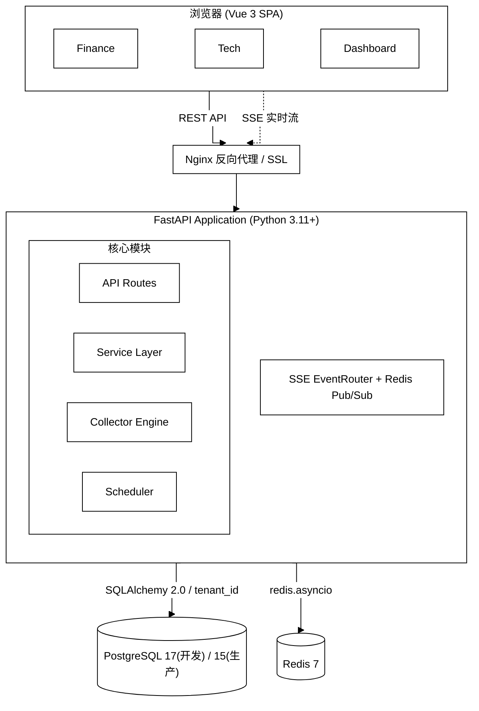
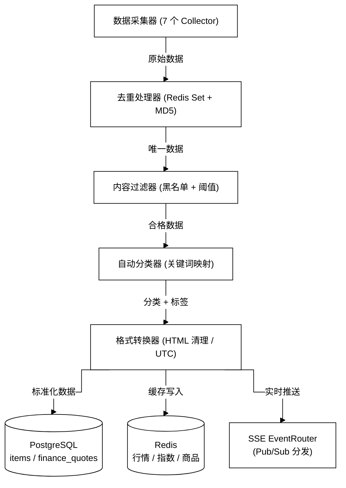

# InstantBoard — 实时信息聚合消息板

> 基于 FastAPI + Vue 3 + SSE 的实时信息聚合平台，汇集全球金融市场数据与前沿科技资讯。

[](LICENSE)
[](https://python.org)
[](https://vuejs.org)
[](https://docker.com)

---

## 目录

- [项目简介](#项目简介)
- [核心功能](#核心功能)
- [技术架构](#技术架构)
- [快速开始](#快速开始)
  - [环境要求](#环境要求)
  - [一键启动（Docker）](#一键启动docker)
  - [本地开发（无 Docker）](#本地开发无-docker)
- [配置说明](#配置说明)
- [项目结构](#项目结构)
- [功能详解](#功能详解)
  - [财经模块 (Finance)](#财经模块-finance)
  - [科技模块 (Tech)](#科技模块-tech)
  - [监控仪表盘 (Dashboard)](#监控仪表盘-dashboard)
  - [SSO 认证](#sso-认证)
  - [本地管理员登录 (/ibadmin)](#本地管理员登录-ibadmin)
  - [实时推送 (SSE)](#实时推送-sse)
- [API 文档](#api-文档)
- [常用命令](#常用命令)
- [测试](#测试)
- [生产部署](#生产部署)
- [CI/CD](#cicd)
- [数据源](#数据源)
- [多租户](#多租户)
- [常见问题](#常见问题)
- [开发指南](#开发指南)
- [许可证](#许可证)

---

## 项目简介

InstantBoard 是一个**实时信息聚合消息板**服务，采用前后端分离架构，通过 SSE (Server-Sent Events) 实时推送数据到浏览器。

**两大核心内容板块**：

| 板块 | 内容 | 数据来源 |
|------|------|---------|
| 📈 **财经 (Finance)** | 股票/基金搜索、自选关注列表、基金 NAV 实时估值、全球市场指数、大宗商品期货 | Yahoo Finance、Alpha Vantage、东方财富 |
| 🔬 **科技 (Tech)** | 机器人、AI、大规模嵌入式、太空科技四大领域资讯聚合 | RSS 20+ 源、HackerNews、ArXiv、SpaceNews |

---

## 核心功能

- 🔄 **SSE 实时推送** — 服务端主动推送行情和新闻更新，浏览器零延迟刷新
- 📊 **自选关注列表** — 自定义股票/基金关注列表，实时涨跌幅追踪
- 💰 **基金 NAV 估值** — 基于跟踪指数的 ETF 实时净值估算（指数跟踪法）
- 🌍 **全球市场指数** — S&P 500、纳斯达克、上证、恒生、日经等 13+ 指数
- 🛢️ **大宗商品** — 黄金、原油、白银、天然气等 7+ 期货品种
- 🏷️ **话题标签过滤** — 三级标签体系（领域→子分类→话题），支持跨领域筛选
- 📡 **20+ 数据源** — RSS/API/网页抓取三种采集方式，自动故障转移
- 🔐 **5 种 SSO 登录** — 默认启用 Google / GitHub，可按需启用 Azure AD / Apple / Facebook
- 🏢 **多租户架构** — 应用层 `tenant_id` 过滤隔离，租户独立配置（详见"多租户"章节）
- 🛡️ **多层安全** — JWT 双 Token + Refresh 轮换黑名单 + CORS（Nginx 限流 / CSP 为规划项，见下方标注）
- 📱 **响应式设计** — 手写 CSS 变量 + 媒体查询适配桌面/平板/手机
- 🌓 **深/浅色主题** — 运行时切换，支持涨跌颜色配置
- 📈 **轻量监控仪表盘** — 系统/CPU/内存、数据源健康、SSE 连接统计

---

## 技术架构

| 层级 | 技术 | 说明 |
|------|------|------|
| **前端** | Vue 3.4 + TypeScript + Vite 8 | Composition API, Pinia 状态管理, 手写 CSS（tailwindcss 仅为未使用的历史 devDependency） |
| **后端** | Python 3.11+ / FastAPI | Async 全链路, SQLAlchemy 2.0 ORM, APScheduler |
| **实时推送** | SSE + Redis Pub/Sub | 单向服务端推送, 30s 心跳, 自动重连 |
| **数据库** | PostgreSQL 17（开发）/ 15（生产·测试） | JSONB 支持, 应用层 `tenant_id` 隔离, 12 张核心表 |
| **缓存** | Redis 7 | 行情缓存 / 会话 / Pub/Sub / 限流 |
| **反向代理** | Nginx 1.25 | SSL, 静态资源, API 代理（limit_req 限流规则已注释，未启用） |
| **容器** | Docker Compose | 开发/生产统一编排 |
| **CI/CD** | GitHub Actions | Lint → Test → Build → Deploy |

### 架构图



API Routes 9 个端点模块、Service Layer 7 个业务服务、Collector Engine 7 个采集器；SSE 侧 7 种业务事件（+heartbeat）、5 个频道、30s 心跳。

---

## 快速开始

### 环境要求

| 工具 | 最低版本 | 说明 |
|------|---------|------|
| Docker Engine | 24+ | 容器运行时 |
| Docker Compose | V2+ | 服务编排 |
| Git | 2.0+ | 代码拉取 |

> 💡 如果不使用 Docker，需要：Python 3.11+、Node.js 24+（vite 8 / eslint 9 要求 Node 20+，CI 与镜像均使用 24）、PostgreSQL 15+（开发环境 compose 使用 17）、Redis 7

### 一键启动（Docker）

```bash
# 1. 克隆仓库
git clone https://github.com/your-org/instantboard.git
cd instantboard

# 2. 运行自动安装脚本
bash scripts/setup-dev.sh
```

安装脚本会自动完成：
- ✅ 检测 Docker/Git 环境
- ✅ 复制 `.env.example` → `.env`
- ✅ 构建 Docker 镜像并启动所有服务

> 💡 安装脚本和 Makefile 自动检测 `docker compose`（V2 插件）或 `docker-compose`（V1 独立版），两者均可使用，无需手动选择。

**启动完成后访问**：

| 服务 | 地址 |
|------|------|
| 前端界面 | http://localhost:3000 |
| 后端 API | http://localhost:8000 |
| API 文档 (Swagger) | http://localhost:8000/docs |
| API 文档 (ReDoc) | http://localhost:8000/redoc |

**Docker Compose 服务清单**（开发环境）：

| 服务 | 镜像 | 端口 | 说明 |
|------|------|------|------|
| `postgres` | postgres:17 | 5432 | 主数据库 |
| `redis` | redis:7-alpine | 6379 | 缓存 + Pub/Sub |
| `api` | 自定义 Python 3.11-slim | 8000 | FastAPI (热重载) |
| `frontend` | 自定义 Node 24-alpine | 3000 | Vite dev server (HMR) |

> MongoDB 6 默认不启动，可通过 `--profile mongodb` 按需启用。

> 💡 上表的宿主机端口发布与热重载挂载全部来自 `docker/docker-compose.override.yml`（开发专用覆盖层，`docker compose up` 自动加载）：基础 `docker-compose.yml` 刻意不发布任何宿主机端口，由 override 发布 5432/6379/27017/8000/3000/3001 并挂载前后端源码目录实现热重载。显式使用 `-f` 合并生产文件时不会加载 override，因此生产不会暴露这些端口。

### 本地开发（无 Docker）

如果不想使用 Docker，也可以直接在本地运行：

```bash
# 1. 后端
cd backend
python -m venv venv && source venv/bin/activate
pip install -r requirements/base.txt -r requirements/dev.txt
uvicorn app.main:app --host 0.0.0.0 --port 8000 --reload

# 2. 前端（另一个终端）
cd frontend
npm install
npm run dev
```

> ⚠️ 本地模式需要预先安装并配置 PostgreSQL 和 Redis。

也可以使用 Makefile 快捷命令：

```bash
make local-dev-backend   # 启动后端
make local-dev-frontend  # 启动前端
make local-dev           # 同时启动前后端
```

---

## 配置说明

### 环境变量

复制 `.env.example` 为 `.env`：

```bash
cp .env.example .env
```

**关键配置分组**：

#### 基础配置

| 变量 | 默认值 | 说明 |
|------|--------|------|
| `ENV` | `development` | 运行环境 (development/production) |
| `LOG_LEVEL` | `INFO` | 日志级别 |
| `API_PORT` | `8000` | 后端 API 端口 |
| `FRONTEND_PORT` | `3000` | 前端开发端口 |
| `SCHEDULER_ENABLED` | `true` | 是否启动内嵌调度器（生产 api 容器由 compose 强制置 `false`，采集由独立 worker 容器承担） |
| `SSL_CERT_FILE` | `/etc/ssl/certs/ca-certificates.crt` | CA 证书路径（后端镜像已内置，供外部 HTTPS 采集使用） |

#### 数据库

| 变量 | 默认值 | 说明 |
|------|--------|------|
| `DATABASE_URL` | `postgresql+asyncpg://...` | PostgreSQL 连接串 |
| `DB_PASSWORD` | `devpass` | 数据库密码 |
| `DATABASE_POOL_SIZE` | `20` | 连接池大小 |
| `REDIS_URL` | `redis://localhost:6379/0` | Redis 连接串 |

#### 认证与 JWT

| 变量 | 默认值 | 说明 |
|------|--------|------|
| `JWT_SECRET` | *(需修改)* | JWT 签名密钥（access + refresh token，生产必须替换！） |
| `JWT_ACCESS_TOKEN_EXPIRE_MINUTES` | `60` | Access Token 有效期 |
| `JWT_REFRESH_TOKEN_EXPIRE_DAYS` | `7` | Refresh Token 有效期 |

#### SSO OAuth（按需配置）

InstantBoard 支持 5 种 SSO 提供商，**默认只启用 Google 和 GitHub**。

| 变量 | 默认值 | 说明 |
|------|--------|------|
| `ENABLED_SSO_PROVIDERS` | `google,github` | 启用的 SSO 提供商（逗号分隔） |

**启用提供商配置示例**：

```bash
# 默认启用 Google 和 GitHub
ENABLED_SSO_PROVIDERS=google,github

# 额外启用 Azure AD
ENABLED_SSO_PROVIDERS=google,github,azure_ad

# 启用所有提供商
ENABLED_SSO_PROVIDERS=google,github,azure_ad,apple,facebook
```

**各提供商凭据配置**：

| 变量组 | 说明 |
|--------|------|
| `GOOGLE_OAUTH_CLIENT_ID/SECRET` | Google OAuth 2.0 |
| `GITHUB_OAUTH_CLIENT_ID/SECRET` | GitHub OAuth *(默认启用)* |
| `AZURE_AD_CLIENT_ID/SECRET/TENANT_ID` | Microsoft Azure AD |
| `APPLE_CLIENT_ID/TEAM_ID/KEY_ID/Private_KEY_PATH` | Apple Sign-In |
| `FACEBOOK_APP_ID/SECRET` | Facebook Login |

> 💡 只有被 `ENABLED_SSO_PROVIDERS` 启用的提供商才会出现在前端登录页面，未配置的提供商会自动隐藏。

#### 财经数据 API

| 变量 | 说明 |
|------|------|
| `ALPHA_VANTAGE_API_KEY` | Alpha Vantage API Key (备用数据源) |
| `FINNHUB_API_KEY` | Finnhub API Key (可选) |
| `FINNHUB_API_KEYS` | Finnhub 多 Key 列表（逗号分隔，采集器轮换使用以规避限流） |

> yfinance (Yahoo Finance) 为主数据源，无需 API Key。

#### SSE & 限流

| 变量 | 默认值 | 说明 |
|------|--------|------|
| `SSE_HEARTBEAT_INTERVAL` | `30` | SSE 心跳间隔（秒） |
| `RATE_LIMIT_PER_MINUTE` | `60` | 每分钟请求限制 |
| `RATE_LIMIT_BURST` | `10` | 突发请求量 |

---

## 项目结构

```
instantboard/
├── .env.example              # 环境变量模板
├── Makefile                  # 30+ 开发命令
├── LICENSE                   # GNU GPLv3
│
├── backend/                  # Python/FastAPI 后端
│   ├── app/
│   │   ├── main.py           # FastAPI 入口
│   │   ├── config.py         # Pydantic Settings
│   │   ├── dependencies.py   # FastAPI 依赖注入
│   │   ├── api/v1/           # 9 个 API 路由模块
│   │   │   ├── auth.py       # 认证 (SSO)
│   │   │   ├── finance.py    # 财经数据
│   │   │   ├── tech.py       # 科技资讯
│   │   │   ├── dashboard.py  # 监控仪表盘
│   │   │   ├── categories.py # 分类管理
│   │   │   ├── sources.py    # 数据源管理
│   │   │   ├── sse.py        # SSE 推送
│   │   │   ├── health.py     # 健康检查
│   │   │   └── admin.py      # 管理端点
│   │   ├── models/           # 12 个 SQLAlchemy 模型
│   │   ├── schemas/          # Pydantic 请求/响应 schema
│   │   ├── services/         # 7 个业务逻辑服务
│   │   ├── collectors/       # 7 个数据采集器 (4财经 + 3科技)
│   │   ├── processors/       # 4 个数据处理管道
│   │   ├── scheduler/        # APScheduler 任务编排
│   │   ├── core/             # 安全/Redis/中间件/SSE路由
│   │   ├── db/               # 数据库会话 + 种子数据
│   │   └── alembic/          # 数据库迁移
│   ├── requirements/         # base.txt / dev.txt / prod.txt
│   ├── Dockerfile            # 多阶段构建
│   └── entrypoint.sh         # 容器入口
│
├── frontend/                 # Vue.js 3 前端
│   ├── src/
│   │   ├── views/            # 7 个页面视图 (含 AdminLoginView、SSOCallbackView)
│   │   ├── components/       # 31 个 UI 组件
│   │   │   ├── layout/       # AppLayout, Header, Sidebar
│   │   │   ├── finance/      # 9 个财经组件
│   │   │   ├── tech/         # 6 个科技组件
│   │   │   ├── dashboard/    # 6 个监控组件
│   │   │   ├── settings/     # 3 个设置组件
│   │   │   └── common/       # 4 个通用组件
│   │   ├── stores/           # 6 个 Pinia 状态仓库
│   │   ├── composables/      # 5 个组合式函数
│   │   ├── api/              # API 客户端层
│   │   ├── types/            # TypeScript 类型定义
│   │   ├── utils/            # 工具函数
│   │   └── styles/           # 全局样式
│   ├── package.json
│   ├── vite.config.ts
│   └── Dockerfile            # 多阶段构建
│
├── docker/                   # Docker 编排
│   ├── docker-compose.yml    # 开发环境基础文件（刻意不发布宿主机端口）
│   ├── docker-compose.override.yml  # 开发专用覆盖（端口发布 + 源码热重载挂载）
│   ├── docker-compose.prod.yml  # 生产环境 (overlay)
│   ├── docker-compose.test.yml  # 测试环境
│   ├── nginx/                # Nginx 配置 + SSL
│   ├── postgres/             # 数据库初始化脚本
│   └── redis/                # Redis 配置
│
├── docs/design/              # 13 份设计文档 (中文)
│   ├── architecture.md       # 总体架构
│   ├── api.md                # REST API 规范
│   ├── database.md           # 数据库设计
│   ├── admin-login.md        # 本地管理员登录 (/ibadmin)
│   └── ...
│
├── scripts/                  # 运维脚本
│   ├── setup-dev.sh          # 一键初始化开发环境
│   ├── run-tests.sh          # 运行测试
│   ├── seed-data.sh          # 填充种子数据
│   ├── generate-migration.sh # 生成数据库迁移
│   └── clean-dev.sh          # 清理开发环境
│
└── .github/workflows/        # GitHub Actions CI/CD
    ├── ci.yml
    ├── cd-staging.yml
    └── cd-production.yml
```

---

## 功能详解

### 财经模块 (Finance)

提供类似 Google Finance 的面板式体验，通过子导航在 5 个功能面板间切换。

**子面板导航**：

| 面板 | 功能 |
|------|------|
| **Overview** | 概览视图（规划为自选摘要 + 重点行情 + 头条新闻的混合视图） |
| **Watchlist** | 完整自选列表 — 可拖拽排序，实时行情刷新 |
| **Search** | 搜索 — 支持代码/名称/中文名搜索，支持股票/基金/指数/商品 |
| **Indices** | 市场指数 — 13+ 全球指数网格卡片展示 |
| **Commodities** | 大宗商品 — 7+ 期货品种，按贵金属/能源/工业/农产品分组 |

> ⚠️ **未实现**：Overview 面板目前仅渲染市场指数 (MarketIndices) 组件，自选摘要与头条新闻尚不存在。

**右侧固定面板**（大屏幕始终可见）：
- 📌 WatchlistMini — 自选列表迷你版（3-5 项摘要）
- 💹 NAVCalculator — 基金实时估值计算器

**基金 NAV 估值算法**：

```
NAV_estimate = NAV_official × (1 + 跟踪指数涨跌幅 × 跟踪比率)
```

> 仅适用于指数型 ETF（如沪深 300 ETF），主动管理基金仅显示官方 NAV。

**覆盖的市场指数**（13+）：

| 市场 | 指数 |
|------|------|
| 🇺🇸 美国 | S&P 500, Dow Jones, NASDAQ |
| 🇨🇳 中国 | 上证综合, 深证成份, 沪深 300 |
| 🇭🇰 香港 | 恒生指数 |
| 🇯🇵 日本 | 日经 225 |
| 🇬🇧🇩🇪🇫🇷 欧洲 | FTSE 100, DAX 40, CAC 40 |
| 🇰🇷🇮🇳 其他 | KOSPI, BSE Sensex |

**覆盖的大宗商品**（7+）：

| 类别 | 品种 |
|------|------|
| 贵金属 | 黄金, 白银 |
| 能源 | WTI 原油, Brent 原油, 天然气 |
| 工业金属 | 铜 |
| 农产品 | 大豆 |

> 💡 备注：种子采集配置的商品 symbols 与展示清单尚有出入（采集含玉米 ZC=F、不含 Brent BZ=F），待修复。

**数据刷新频率**：

| 数据类型 | 交易时段 | 休市时段 |
|---------|---------|---------|
| 自选行情 | 30 秒 | 5 分钟 |
| 市场指数 | 30 秒 | 5 分钟 |
| 大宗商品 | 60 秒 | 5 分钟 |
| 基金 NAV 估值 | 120 秒 | 不刷新 |

---

### 科技模块 (Tech)

**话题驱动的资讯聚合面板**，覆盖四大前沿领域：

| 领域 | 🤖 机器人 | 🧠 AI | ⚡ 嵌入式 | 🚀 太空 |
|------|----------|-------|---------|--------|
| 子分类数 | 6 | 6 | 6 | 6 |
| 主题色 | 紫色 | 蓝色 | 橙色 | 绿色 |
| 关注话题 | 人形/工业/协作/自动驾驶/无人机/ROS | LLM/生成式AI/AI芯片/伦理/多模态/Agent | IoT/RISC-V/RTOS/FPGA/芯片/嵌入式AI | 商业航天/卫星/深空/空间站/火箭/太空制造 |

**两种视图模式**：

1. **领域面板视图**（默认）— 2×2 网格展示四大领域，每个面板 3-5 条新闻
2. **合并时间线视图** — 跨领域混合流，无限滚动加载

**话题过滤**：顶部 TopicFilter 标签栏支持按领域/子分类/热门话题多级过滤。

**排序策略**（3 种可切换）：
- 🔥 **热度优先** — 时间衰减热度算法（半衰期 12 小时）
- 🕐 **时间优先** — 最新发布优先
- 🎯 **相关性** — 基于用户兴趣标签加权

**数据源（20+）示例**：

| 领域 | 数据源 |
|------|--------|
| AI | MIT Tech Review, HackerNews, ArXiv CS.AI, OpenAI Blog |
| 机器人 | IEEE RSS, The Robot Report, ROS Blog, HackerNews |
| 嵌入式 | Embedded.com, RISC-V Blog, Hackaday, EE Times |
| 太空 | SpaceNews, NASA News, SpaceX Updates, ESA News |
| 跨领域 | Reddit, Google News |

---

### 监控仪表盘 (Dashboard)

> 仅 Admin 角色用户可访问。

**指标监控**：

| 类别 | 指标示例 | 采集方式 |
|------|---------|---------|
| 🖥️ 系统状态 | API 运行时长、CPU/内存/磁盘/网络、SSE 连接统计 | 30 秒循环采集 + 按需查询 |
| 📡 数据源健康 | 各数据源状态/成功率/延迟/最新采集时间 | 采集器写入 Redis 健康缓存（TTL 5 分钟） |
| 🗄️ 数据库 | PG 连接数/库大小、Redis 内存/连通性 | 按需查询 |
| 💻 资源消耗 | CPU/内存使用率、磁盘容量、网络流量 | 30 秒循环，变化超过阈值时增量推送 |
| 📊 业务指标 | 活跃用户数、今日数据条目、分类分布 | ❌ 未实现 |

> ⚠️ **未实现**：业务指标类（活跃用户数 / 今日新增 / 分类分布）后端无任何采集逻辑与 API。
> ⚠️ **未实现**：QPS / 平均响应时间 / 错误率——请求中间件会将其写入 Redis，但没有任何 API 暴露，仪表盘也不展示。

**资源优化策略**：
- psutil 采样经 `asyncio.to_thread` 异步执行，不阻塞事件循环（注意 `cpu_percent(0.5)` 本身有 0.5 秒采样间隔）
- SSE 增量推送（CPU/内存变化超过 5% 阈值才推送）
- Chart.js 路由级动态导入
- 每 5 分钟归档 1 条快照到 PostgreSQL（约每天 288 行）

> ⚠️ **未实现**：图表"非活跃自动暂停"逻辑不存在；`make` / 前端均无对应代码。

---

### SSO 认证

支持 5 种主流单点登录方式，**默认仅启用 Google 和 GitHub**，其他提供商可通过环境变量按需启用。

| 提供商 | 协议 | 默认启用 | 配置要求 |
|--------|------|:--------:|---------|
| **Google** | OAuth 2.0 | ✅ | Google Cloud Console 创建 OAuth Client |
| **GitHub** | OAuth 2.0 | ✅ | GitHub Settings → Developer → OAuth App |
| **Azure AD** | OpenID Connect | ❌ | Azure Portal 注册应用 |
| **Apple** | Sign-In with Apple | ❌ | Apple Developer 创建 Service ID + ES256 密钥 |
| **Facebook** | OAuth 2.0 | ❌ | Facebook App Dashboard 创建应用 |

> 所有提供商的代码实现均已保留，通过 `ENABLED_SSO_PROVIDERS` 环境变量控制启用/禁用，这是**配置驱动**而非代码删除。

**SSO 配置示例**：

```bash
# .env 文件
# 默认只启用 Google 和 GitHub
ENABLED_SSO_PROVIDERS=google,github

# 启用 Azure AD
ENABLED_SSO_PROVIDERS=google,github,azure_ad

# 启用所有提供商
ENABLED_SSO_PROVIDERS=google,github,azure_ad,apple,facebook
```

**查询已启用的提供商**（前端可用此接口动态显示登录按钮）：

```bash
curl http://localhost:8000/api/v1/auth/sso/providers
# {"enabled_providers": ["google", "github"]}
```

**认证架构**：
- JWT 双 Token 方案：Access Token (1h) + Refresh Token (7d)
- 纯 Bearer Token 认证，后端**不设置任何 Cookie**（无 `Set-Cookie`）
- Access Token：存前端 localStorage，通过 `Authorization: Bearer <token>` 请求头传递
- Refresh Token：同样存前端 localStorage，调用 `POST /api/v1/auth/refresh` 时以 JSON body 提交
- 单次使用轮换：每次刷新后旧 Refresh Token 立即进入 Redis 黑名单，返回新的 token 对
- Redis Token 黑名单（按 jti 记录，TTL 为 token 剩余有效期；登出时 access + refresh 均失效）
- SSE 连接复用 Access Token 作为 `token` query 参数（短时效，随 Access Token 过期）

> ⚠️ 安全提示：两个 token 均存于 localStorage，页面一旦被 XSS 注入，token 可被脚本窃取。
> 现有缓解：Vue 默认转义、Access Token 短时效、Refresh 轮换 + 黑名单、
> 本地管理员入口 `/ibadmin` 会话隔离。完整风险评估见
> [docs/design/security.md](docs/design/security.md) §3.2 / §3.6。
>
> ⚠️ **未实现**：规划中的 XSS 缓解"DOMPurify"与"CSP"尚未落地——DOMPurify 不在前端依赖中，全站也没有任何 Content-Security-Policy 响应头（现有安全响应头仅 X-Frame-Options / X-Content-Type-Options / X-XSS-Protection / Referrer-Policy）。

**角色权限**：

| 角色 | 权限 |
|------|------|
| `admin` | 管理租户内用户/分类/数据源 + 所有功能 |
| `member` | 使用功能 + 管理个人自选列表 |
| `viewer` | 仅查看 |

---

### 本地管理员登录 (/ibadmin)

当 SSO 提供商不可用或未配置时（例如私有化部署没有第三方 OAuth 凭据），可通过本地管理员入口 `/ibadmin` 登录，对应后端接口 `POST /api/v1/auth/admin/login`。

**用途**：运维兜底的管理入口。登录成功后获得与 SSO 相同结构的 JWT 双 Token（`role=admin`，归属 system 租户），可访问监控仪表盘等管理功能。

**配置方式**（`.env`）：

| 变量 | 说明 |
|------|------|
| `ADMIN_EMAIL` | 允许登录的管理员邮箱 |
| `ADMIN_PASSWORD_HASH` | 管理员密码的 bcrypt 哈希（**只存哈希，不存明文**） |
| `ADMIN_PASSWORD` | 明文密码便捷项，**仅非生产环境生效**（启动时自动哈希并告警）；生产环境禁止使用，必须配置 `ADMIN_PASSWORD_HASH` |

两者都配置时本地管理员登录才会启用（`admin_login_enabled`）；未配置时接口返回 `503 ADMIN_LOGIN_DISABLED`。

**生成密码哈希**：

```bash
make gen-admin-hash PASS='你的密码'
# 或交互式（不留明文到 shell 历史）：
make gen-admin-hash
```

**与普通用户的隔离语义**（详见 [docs/design/admin-login.md](docs/design/admin-login.md)）：

- 本地管理员与 SSO 用户按**登录入口隔离**，是 `users` 表中互不关联的记录（`sso_provider='local'` vs 具体提供商；system 租户 vs default 租户），**即使邮箱相同也不合并**；
- SSO 登录的邮箱回退匹配**仅限 default 租户且排除 `local` 记录**，任何 SSO 登录都无法接管管理员账号；
- `users` 表**不含密码字段**，校验对象是环境变量中的哈希；
- 撤销方式：从 `.env` 删除 `ADMIN_EMAIL` / `ADMIN_PASSWORD_HASH` 并重启，存量本地会话将无法续期（refresh kill-switch）。

---

### 实时推送 (SSE)

**SSE (Server-Sent Events)** 是 InstantBoard 的实时核心，优于 WebSocket 的理由：
- 原生浏览器支持 (EventSource API)
- 自动重连机制
- 纯 HTTP，无需特殊协议升级
- HTTP/2 多路复用

**7 种业务事件**（另有 `heartbeat` 心跳保活）：

| 事件 | 频道 | 触发时机 |
|------|------|---------|
| `quote_update` | finance | REST 请求刷新行情缓存时顺带推送 |
| `market_index_update` | finance | REST 请求刷新指数缓存时顺带推送 |
| `commodity_update` | finance | REST 请求刷新商品缓存时顺带推送 |
| `nav_estimate_update` | finance | REST 请求刷新 NAV 估值缓存时顺带推送 |
| `item_update` | tech | 调度器采集完成时推送（各源 2-5 分钟间隔） |
| `source_health_update` | dashboard | 数据源健康状态变化时实时推送 |
| `system_metric_update` | dashboard | 30 秒采集循环；仅当 CPU/内存数值变化超过阈值 (5%) 时才推送 |

> - 行情类事件（quote/market_index/commodity/nav）**并非调度器周期推送**，而是 REST 请求触发缓存刷新时顺带推送；调度器采集只产生 `item_update`。
> - `system_metric_update` 常被误认为 10 秒推送周期：10 秒实为指标在 Redis 中的缓存 TTL，推送节奏由 30 秒采集循环 + 变化阈值决定。
> - 所有频道均有 30 秒心跳保活。通过 Redis Pub/Sub 实现多进程间的消息分发。

---

## API 文档

启动后端后自动生成交互式 API 文档：

- **Swagger UI**: http://localhost:8000/docs
- **ReDoc**: http://localhost:8000/redoc

**主要端点一览**：

| 方法 | 路径 | 说明 |
|------|------|------|
| `GET` | `/api/v1/health` | 健康检查 |
| `GET` | `/api/v1/health/detail` | 详细健康检查（PostgreSQL/Redis 连通性） |
| `GET` | `/api/v1/auth/sso/providers` | 获取已启用的 SSO 提供商 *(无需认证)* |
| `POST` | `/api/v1/auth/sso/{provider}` | SSO 登录 |
| `POST` | `/api/v1/auth/refresh` | 刷新 Token |
| `GET` | `/api/v1/auth/me` | 当前用户信息 |
| `GET` | `/api/v1/finance/search?q=` | 搜索证券 |
| `GET` | `/api/v1/finance/quote/{symbol}` | 获取行情 |
| `GET` | `/api/v1/finance/market-indices` | 市场指数 |
| `GET` | `/api/v1/finance/commodities` | 大宗商品 |
| `GET` | `/api/v1/finance/fund/{symbol}/nav` | 基金 NAV 估值 |
| `GET/POST/DELETE` | `/api/v1/finance/watchlist` | 自选列表 CRUD |
| `PUT` | `/api/v1/finance/watchlist/reorder` | 自选列表排序 |
| `GET` | `/api/v1/tech/news` | 科技新闻列表 |
| `GET` | `/api/v1/tech/topics` | 话题标签 |
| `GET` | `/api/v1/categories` | 分类列表 |
| `GET` | `/api/v1/sources` | 数据源列表 |
| `GET` | `/api/v1/dashboard/system` | 系统状态 |
| `GET` | `/api/v1/dashboard/services` | 服务状态 |
| `GET` | `/api/v1/dashboard/data-sources` | 数据源健康 |
| `GET` | `/api/v1/stream/{category}` | SSE 实时流 |
| `GET` | `/api/v1/stream/stats` | SSE 连接统计 |

---

## 常用命令

**Makefile 提供 30+ 快捷命令**：

```bash
make help              # 显示所有可用命令
```

### 开发环境

| 命令 | 说明 |
|------|------|
| `make dev` | 启动开发环境 |
| `make up` | 启动所有服务 |
| `make down` | 停止所有服务 |
| `make logs` | 查看所有日志 |
| `make logs-api` | 查看 API 日志 |
| `make backend-shell` | 进入后端容器 |
| `make frontend-shell` | 进入前端容器 |
| `make db-shell` | 进入 PostgreSQL |
| `make redis-shell` | 进入 Redis CLI |

### 代码质量

| 命令 | 说明 |
|------|------|
| `make lint` | 运行 lint 检查 (ruff + eslint) |
| `make lint-fix` | 自动修复 lint 问题 |
| `make format` | 格式化代码 (ruff + prettier) |

### 数据库

| 命令 | 说明 |
|------|------|
| `make migrate` | 运行数据库迁移 |
| `make makemigration msg="描述"` | 生成迁移文件 |
| `make seed` | 填充种子数据 |
| `make reset-db` | 重置数据库 |

### 构建

| 命令 | 说明 |
|------|------|
| `make build` | 构建所有开发镜像 |
| `make build-prod` | 构建所有生产镜像 |

### 清理

| 命令 | 说明 |
|------|------|
| `make clean` | 清理容器+镜像+数据 |
| `make clean-data` | 仅清理数据 volumes |

---

## 测试

```bash
# 运行所有测试
make test

# 仅后端测试
make test-backend

# 按类型运行
make test-unit          # 单元测试
make test-integration   # 集成测试
make test-e2e           # 端到端测试

# Docker 隔离测试环境
make test-docker
```

> 测试配置使用 SQLite + MockRedis，无需外部依赖。pytest 配置在 `backend/pyproject.toml`。

> ⚠️ **未实现**：`make test-e2e` 目标虽存在，但仓库中目前没有任何端到端测试用例。

---

## 生产部署

### Docker Compose 生产部署

```bash
# 1. 准备生产环境配置
cp .env.example .env
# 编辑 .env，填写所有 PROD_* 变量

# 2. 准备 SSL 证书
mkdir -p docker/nginx/ssl
# 放置 fullchain.pem 和 privkey.pem
# 推荐使用 Let's Encrypt + certbot

# 3. 构建并启动
make build-prod
make prod-up
```

**生产环境服务清单**：

| 服务 | 说明 | 资源限制 |
|------|------|---------|
| `nginx` | 反向代理 + SSL | 0.5 CPU / 256M |
| `api` | FastAPI + Gunicorn（`SCHEDULER_ENABLED=false`，调度器由 worker 独占） | 1.0 CPU / 512M |
| `worker` | 后台采集任务（内嵌 APScheduler + 心跳） | 0.5 CPU / 256M |
| `postgres` | PostgreSQL **15**-alpine（数据目录由 15 初始化，升级 17 需先 pg_dump/restore 停机迁移） | 1.0 CPU / 768M |
| `redis` | Redis 7 (密码保护) | 0.5 CPU / 256M |
| `frontend` | 静态资源 (build 产物) | 0.25 CPU / 128M |
| `mongodb` | 可选，MongoDB 6（`--profile mongodb` 按需启用，默认不启动） | 0.5 CPU / 512M |

### 开发 vs 生产差异

| 项目 | 开发 | 生产 |
|------|------|------|
| API | 端口 8000 直接访问 | Nginx 代理 (80/443) |
| 数据库 | 端口 5432 可直连 | 不对外暴露 |
| 前端 | Vite dev server (HMR) | Nginx 托管构建产物 |
| Worker | 集成在 API (APScheduler) | 独立 Worker 进程 |
| HTTPS | 无 | TLS 1.3 + HSTS |
| 重启策略 | 无 | always |
| 密码 | 固定开发密码 | .env 强密码 |

### 架构支持

项目 CI 同时构建 `linux/amd64` 和 `linux/arm/v7` 镜像，支持部署到：

- x86_64 服务器（amd64）
- ARM 32 位设备（如树莓派 3/4 装 32 位系统）

CI 使用 QEMU + buildx 构建多架构 manifest list 并推送至 GHCR，部署服务器 `docker pull` 时自动选择匹配架构。

> **注意**：`mongo:6` 镜像不提供 arm/v7 版本。若服务器为 arm/v7 架构，请勿启用 `--profile mongodb`。

---

## CI/CD

使用 GitHub Actions 实现自动化：

| 工作流 | 触发条件 | 步骤 |
|--------|---------|------|
| **CI** (`ci.yml`) | Push 到 `main`/`staging`/`develop`，PR 到 `main`/`staging`（Node 24 + PostgreSQL 15） | Lint → TypeCheck → Test → Build |
| **CD Staging** (`cd-staging.yml`) | Push 到 `staging` | 构建镜像 → 推送 GHCR → SSH 部署 → 冒烟测试 |
| **CD Production** (`cd-production.yml`) | Release 发布 | 构建镜像 → 推送 GHCR → 滚动部署 → 健康检查 → 失败回滚 |

**分支策略**：
- `main` — 生产分支
- `staging` — 预发布分支
- `feature/*` — 功能分支

---

## 数据源

### 财经数据源

| 数据源 | 类型 | 覆盖 | 优先级 |
|--------|------|------|--------|
| yfinance | Python 库 | 全球股票/指数/期货/基金 | 🔵 首选 |
| Alpha Vantage | REST API | 美股/外汇/技术指标 | 🟢 备用 |
| 东方财富 | HTTP API (push2.eastmoney.com) | A 股/港股/中国基金 | 🟢 补充 |

### 科技数据源（按领域）

| 领域 | 主要数据源 |
|------|-----------|
| AI | MIT Tech Review, HackerNews, ArXiv, OpenAI Blog, The Batch |
| 机器人 | IEEE RSS, The Robot Report, ROS Blog, HackerNews |
| 嵌入式 | Embedded.com, RISC-V Blog, Hackaday, EE Times |
| 太空 | SpaceNews, NASA, SpaceX, ESA, Ars Technica |
| 通用 | Reddit, Google News |

### 数据采集器

| 采集器 | 数据源类型 |
|--------|-----------|
| YFinanceCollector | Yahoo Finance (股票/指数/商品) |
| AlphaVantageCollector | Alpha Vantage API |
| EastMoneyCollector | 东方财富 (A 股/基金) |
| FinnhubCollector | Finnhub API (指数/商品/行情, 多 Key 轮换) |
| RSSCollector | 通用 RSS 源 |
| HackerNewsCollector | HackerNews API/RSS |
| ArxivCollector | ArXiv 论文 |

### 数据管道



全链路细节见 `dev-guide/design/data-flow.md` §3.3（处理管道各阶段的两层去重键、过滤规则等）。

---

## 多租户

InstantBoard 支持多租户架构：

- **数据隔离**：应用层 `tenant_id` 过滤（每个查询由代码附加租户条件）
- **Redis 隔离**：Key 前缀 `t:{tenant_id}:*`
- **租户计划**：free / pro / enterprise
- **租户限制**：max_users, max_categories, max_sources

> ⚠️ **未实现**：PostgreSQL 行级安全 (RLS)（无 `ENABLE ROW LEVEL SECURITY` / `CREATE POLICY`），租户隔离完全依赖应用层过滤，绕过应用直连数据库时不存在隔离。

启动后自动创建默认租户（`default`），所有数据归属该租户。

---

## 常见问题

### Q: MongoDB 必须安装吗？
**不需要**。MongoDB 仅作为可选组件用于存储原始抓取数据（初始版本不启用）。核心数据全部由 PostgreSQL 管理。如需启用：
```bash
cd docker && docker compose --profile mongodb up -d
# docker-compose --profile mongodb up -d  # V1 也同样适用
```

### Q: 如何只使用部分 SSO？
通过 `.env` 中的 `ENABLED_SSO_PROVIDERS` 环境变量控制启用哪些提供商（默认 `google,github`）。前端可通过 `GET /api/v1/auth/sso/providers` 接口动态获取已启用的提供商列表，只显示对应的登录按钮。未启用的提供商无需配置凭据。

### Q: yfinance 被限流了怎么办？
系统会自动故障转移到 Alpha Vantage。建议配置 `ALPHA_VANTAGE_API_KEY` 作为备用。

### Q: 如何更换涨跌颜色？
默认中国配色（🔴红涨🟢绿跌）。可在 Settings → ProfileSettings 中切换为国际配色（🟢绿涨🔴红跌）。

### Q: SSE 连接断开怎么办？
SSE (EventSource) 原生支持自动重连。后端 30 秒心跳保活，断开后浏览器会自动重新连接。

### Q: 如何添加自定义分类/数据源？
1. 前端：Settings 页面 → 新增 Category → 配置关键词和刷新间隔
2. 后端 API：`POST /api/v1/categories` → `POST /api/v1/sources`

### Q: `could not determine a constructor for the tag '!reset'`
已修复。若你本地 fork 仍有此问题，升级到最新版即可。项目现已移除所有 `!reset` / `!override` YAML 标签以兼容 V1 `docker-compose`。

### Q: `no matching manifest for linux/arm/v7`
项目 CI 现默认推送多架构 manifest list。确保：
1. 触发的是最新 CI 流程（含多架构构建阶段）
2. 服务器上的 Docker pull 时会自动选择匹配架构

### Q: 部署服务器是 armv7l 但镜像总是拉不到
检查 CI 是否已合并多架构构建 commit，以及服务器架构是否正确：
```bash
docker info | grep "Architecture"
# 确认服务器架构为 armv7l
```

---

## 开发指南

### 添加新的数据采集器

1. 在 `backend/app/collectors/` 创建新文件
2. 继承 `BaseCollector`，实现 `fetch_data()` / `parse_data()` 抽象方法（可按需覆写可选的 `validate_data()`）
3. 在 `collectors/__init__.py` 的 `COLLECTOR_REGISTRY` 中注册

### 添加新的 API 端点

1. 在 `backend/app/api/v1/` 创建新路由文件
2. 定义 Pydantic schema 在 `schemas/`
3. 实现业务逻辑在 `services/`
4. 在 `api/router.py` 中注册子路由

### 添加新的前端组件

1. 在 `frontend/src/components/` 对应目录创建 `.vue` 文件
2. 如需要状态管理，在 `stores/` 中添加 Pinia store
3. 如需 API 调用，在 `api/` 中添加请求函数

### 设计文档

详细设计文档位于 `docs/design/`：

| 文档 | 内容 |
|------|------|
| `architecture.md` | 总体系统架构 |
| `api.md` | 完整 REST API + SSE 规范 |
| `database.md` | PostgreSQL/Redis/MongoDB 设计 |
| `data-flow.md` | 数据管道 + SSE 推送流程 |
| `frontend.md` | Vue.js 前端架构 |
| `finance-tab.md` | 财经模块详细设计 |
| `tech-tab.md` | 科技模块详细设计 |
| `dashboard-tab.md` | Dashboard 监控设计 |
| `content-categories.md` | 内容分类体系 |
| `data-sources.md` | 外部数据源目录 |
| `security.md` | 安全架构设计 |
| `admin-login.md` | 本地管理员登录 (/ibadmin) 设计 |
| `infrastructure.md` | DevOps + Docker + CI/CD |

---

## 许可证

本项目基于 [GNU General Public License v3.0](LICENSE) 开源。
