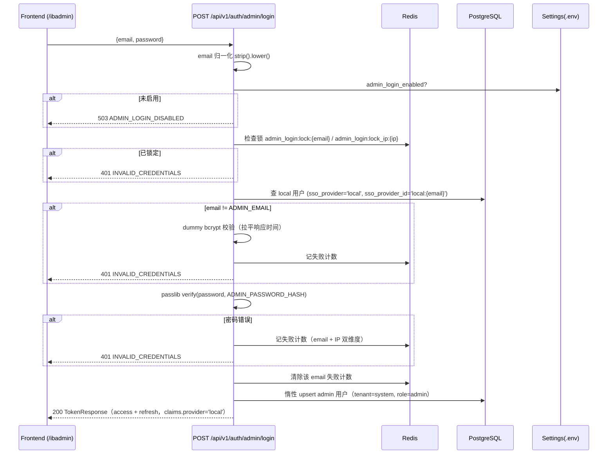

# InstantBoard 本地管理员登录设计 (admin-login)

## 1. 目标

为 InstantBoard 提供一条**独立于 SSO 的本地管理员登录通道**，用于：

- SSO 提供商不可用 / 未配置时的运维兜底入口（前端 `/ibadmin`）；
- 私有化部署中不依赖任何第三方 OAuth 凭据即可完成管理面访问。

核心约束：**不引入密码字段到 `users` 表、不改动任何 SSO 流程、凭据完全由环境变量配置驱动**，
并可通过"删除环境变量并重启"一键撤销所有本地管理员会话。

## 2. 身份模型：登录入口隔离（重点）

本设计与常见的"本地账号与 SSO 账号按 email 合并"的方案**相反**：按登录入口隔离身份，
**不做 email 合并**。

| 维度 | SSO 用户 | 本地管理员 |
|------|----------|------------|
| users 记录 | 首次 SSO 登录时创建 | 首次本地登录成功后**惰性 upsert** |
| tenant_id | 默认租户 (`default`) | **系统租户 `SYSTEM_TENANT_ID`**（`app.core.constants`，全零 UUID） |
| sso_provider | `google` / `github` / ... | `local` |
| sso_provider_id | 提供商侧的用户 ID | `local:{email}` |
| role | `member` | 恒为 `admin` |
| 密码字段 | 无 | **无**（users 表不加密码列；校验对象是环境变量中的哈希） |

关键结论：

1. 即使本地管理员的 email 与某个 SSO 用户相同，二者是 `users` 表中**两条互不影响的记录**。
   `uq_users_tenant_email (tenant_id, email)` 唯一约束因租户不同（system vs default）而不冲突；
   `uq_users_sso (sso_provider, sso_provider_id)` 因 provider 不同而不冲突。
2. SSO 登录流程（`sso_login` / `_get_or_create_user`）**一律不改、不受影响**；
   本地登录只走独立的 `admin_login` 路径。
3. `users.sso_provider` 的 CHECK 约束新增 `'local'` 取值（见 §6）。

> 前端约定：本地登录入口是独立的"会话入口"概念 —— `/ibadmin` 页面使用独立于普通用户
> 登录的会话上下文（token 单独存取），进入该入口即代表运维/管理员身份；不与 SSO
> 会话互相顶替或合并。

## 3. 流程时序



## 4. API

### 4.1 `POST /api/v1/auth/admin/login`

请求体：

```json
{
  "email": "admin@example.com",     // EmailStr
  "password": "..."                  // str, max_length=72（bcrypt 上限 72 字节）
}
```

响应 `SuccessResponse[TokenResponse]`（与 SSO 登录返回结构完全一致，前端可复用同一
token 存取逻辑）：

```json
{
  "success": true,
  "data": {
    "access_token": "...",
    "refresh_token": "...",
    "token_type": "Bearer",
    "expires_in": 3600,
    "user": {
      "id": "...",
      "email": "admin@example.com",
      "name": "admin",
      "avatar_url": null,
      "tenant_id": "00000000-0000-0000-0000-000000000000",
      "role": "admin",
      "sso_provider": "local"
    }
  }
}
```

JWT claims（access/refresh 均携带）：`sub`、`tenant_id`、`role`、`provider: "local"`
+ 现有签发函数自动附加的 `exp/iat/jti/type(/refresh_version)`。**不新增自定义 claim**，
沿用 `create_access_token` / `create_refresh_token`。

错误响应（`ErrorResponse` 包在 HTTP 4xx/5xx 中）：

| 场景 | HTTP | error.code | 消息 |
|------|------|-----------|------|
| 密码错误 / 邮箱未知 / 锁定中（统一，不区分原因） | 401 | `INVALID_CREDENTIALS` | `Incorrect email or password` |
| 未配置 `ADMIN_EMAIL` + `ADMIN_PASSWORD_HASH` | 503 | `ADMIN_LOGIN_DISABLED` | `Admin login is not enabled` |
| email 格式非法 / 密码超 72 字符 | 422 | (FastAPI 校验) | — |

日志约定：失败日志只落 `email + client_ip`，**不落密码**。

### 4.2 client_ip 取值

小工具函数 `get_client_ip(request)`（`app/dependencies.py`）：

1. `X-Forwarded-For` 首段（逗号分隔取第一个，strip）；
2. 兜底 `request.client.host`，再兜底 `"unknown"`。

nginx 检查结论：`docker/nginx/conf.d/http-server.conf.template` 与
`https-server.conf.template` 的 `location /api/`、`location /api/v1/auth/` 均已设置
`proxy_set_header X-Forwarded-For $proxy_add_x_forwarded_for;`，**无需改动**。

### 4.3 refresh kill-switch（撤销开关）

`POST /api/v1/auth/refresh` 流程中新增判断：

> 若 token claims `provider == "local"` 且当前 `settings.admin_login_enabled == False`
> → 拒绝续期，返回 401 `INVALID_REFRESH_TOKEN`（message: `Admin login is disabled`）。

效果：运维删除 `.env` 中 `ADMIN_EMAIL` / `ADMIN_PASSWORD_HASH` 并重启后，存量 local
会话的 refresh 全部失效（access token 到期后自然终结），实现"一键撤销"。
拒绝发生在 token rotation/黑名单写入之前，恢复配置后同一 refresh token 仍可使用。

## 5. 配置项（`app/config.py`）

| 环境变量 | 类型 | 说明 |
|----------|------|------|
| `ADMIN_EMAIL` | str \| None | 本地管理员邮箱 |
| `ADMIN_PASSWORD_HASH` | str \| None | bcrypt 哈希（`scripts/gen_admin_password_hash.py` 生成） |
| `ADMIN_PASSWORD` | str \| None | **仅非生产容忍**的明文（见下） |

计算属性：`admin_login_enabled = bool(admin_email) and bool(admin_password_hash)`。

明文 `ADMIN_PASSWORD` 处理（Settings 初始化时一次性完成）：

- `ENV != production`：启动时用 bcrypt 哈希一次并记 **WARNING**，随后丢弃明文；
  若同时配置了 `ADMIN_PASSWORD_HASH`，明文哈希**覆盖**之（显式明文视为更明确的选择）。
- `ENV == production`：记 **ERROR** 并视为未配置（不影响已正确配置的
  `ADMIN_PASSWORD_HASH`）。

## 6. 数据模型

- `users` 表**不加**任何密码字段。
- 唯一 DDL 变更：CHECK 约束 `chk_users_sso_provider` 扩为
  `sso_provider IN ('google','azure_ad','github','apple','facebook','local')`。
  - 项目当前以 `Base.metadata.create_all` 建表（仓库未启用 alembic），全新部署自动生效；
  - **存量库升级**需手工执行：
    `ALTER TABLE users DROP CONSTRAINT chk_users_sso_provider;`
    `ALTER TABLE users ADD CONSTRAINT chk_users_sso_provider CHECK (sso_provider IN ('google','azure_ad','github','apple','facebook','local'));`
- 系统租户（slug=`system`，id=`SYSTEM_TENANT_ID`）由 `init_db.seed_default_data` 创建；
  本地登录的惰性 upsert 若发现系统租户缺失会自行补建（幂等），避免外键失败。

## 7. 防爆破（Redis 固定窗口）

| 维度 | 计数键 | 窗口 | 阈值 | 锁键 | 锁时长 |
|------|--------|------|------|------|--------|
| email | `admin_login:fail:{email}` | 15 分钟 | 5 次 | `admin_login:lock:{email}` | 15 分钟 |
| IP | `admin_login:fail_ip:{ip}` | 1 小时 | 20 次 | `admin_login:lock_ip:{ip}` | 1 小时 |

- 计数采用 `INCR + EXPIRE`（固定窗口，首次失败时设置 TTL）；达到阈值写锁键（`SET EX`）。
- 请求先查锁：任一维度命中锁 → 直接 401 `INVALID_CREDENTIALS`（不泄露锁定状态）。
- 登录成功：清除该 email 的失败计数键。
- **降级（fail-open）**：Redis 任何操作异常 → 记告警日志并放行本次请求，
  登录正确性判断不依赖 Redis（与项目"Redis 故障降级"总体策略一致）。
- 时序对抗：未知邮箱也执行一次针对固定 dummy 哈希的 bcrypt 校验，
  使"邮箱不存在"与"密码错误"的响应耗时一致；错误响应统一文案不区分原因。

## 8. 脚本

`scripts/gen_admin_password_hash.py`：

```bash
python scripts/gen_admin_password_hash.py 'MySecret'   # 参数传入
python scripts/gen_admin_password_hash.py              # 交互式隐藏输入（getpass）
# 或
make gen-admin-hash pass='MySecret'
```

输出 bcrypt 哈希（复用 `app.core.security.hash_password`），填入 `ADMIN_PASSWORD_HASH`。

## 9. 依赖修复说明

本地登录依赖**真实可用**的 bcrypt 校验。排查发现 `passlib 1.7.4` 与 `bcrypt>=5.0`
不兼容（passlib 后端自检用 >72 字节密码探测 wrap bug，bcrypt 5 直接抛 ValueError，
导致 `hash_password`/`verify_password` 在真实调用时崩溃；既有单测因 mock 了
`pwd_context` 而未暴露）。本次将依赖锁定为 `bcrypt>=4.1.0,<5`
（pyproject.toml 与 requirements/base.txt 同步）。

## 10. 测试要点

- 配置组合：启用/未启用（缺 email 或缺 hash）；非生产明文自动哈希；**生产明文拒绝**。
- 正确密码 → 200，`user.role == "admin"`、`sso_provider == "local"`、claims
  `provider == "local"`；随后 `GET /auth/me` 返回 admin、`GET /dashboard/system`
  （`require_admin`）放行 200。
- 错误密码 → 401 `INVALID_CREDENTIALS`，文案不含可区分信息；未知邮箱同码且 dummy
  校验路径被执行。
- 隔离性：先建同 email 的 SSO 用户（member），admin 登录后 SSO 记录不受影响、仍为
  member，且两条记录分属不同租户。
- 锁定：同 email 连续 5 次失败 → 锁定期内即使密码正确也被拒。
- 未启用 → 503 `ADMIN_LOGIN_DISABLED`。
- refresh kill-switch：禁用配置后 local 会话 refresh 被 401 拒绝；SSO 会话 refresh
  不受影响。

## 11. 边界情况与遗留风险

- **单管理员模型**：本方案仅支持 `.env` 配置的那一个管理员邮箱；多管理员需扩展为
  配置列表或独立凭据表（不在本次范围）。
- **固定窗口**的窗口切换瞬间理论上限为 2×阈值（5/15min、20/1h），对本场景可接受。
- lock 命中返回 401 而非 429，是刻意选择：不向探测者暴露"账户存在且被锁定"的状态。
- 已签发的 access token 在撤销开关生效后仍有效至其自然过期（默认 ≤60 分钟）；
  这是 JWT 无状态模型的固有属性，可接受。
- `X-Forwarded-For` 可被客户端伪造首段；生产部署应由 nginx（`realip`/可信代理）
  保证该头只追加真实来源。当前模板直连部署下风险可控。

## 12. 与其他模块的依赖

- → [security.md](security.md): SSO 统一流程、JWT 双 Token、限流分层（本地登录为
  该体系新增的旁路入口，SSO 路径零改动）
- → [api.md](api.md): 认证端点清单（新增 `POST /api/v1/auth/admin/login`）
- → [database.md](database.md): users 表 CHECK 约束扩展
- → [infrastructure.md](infrastructure.md): nginx `X-Forwarded-For`（已具备）
