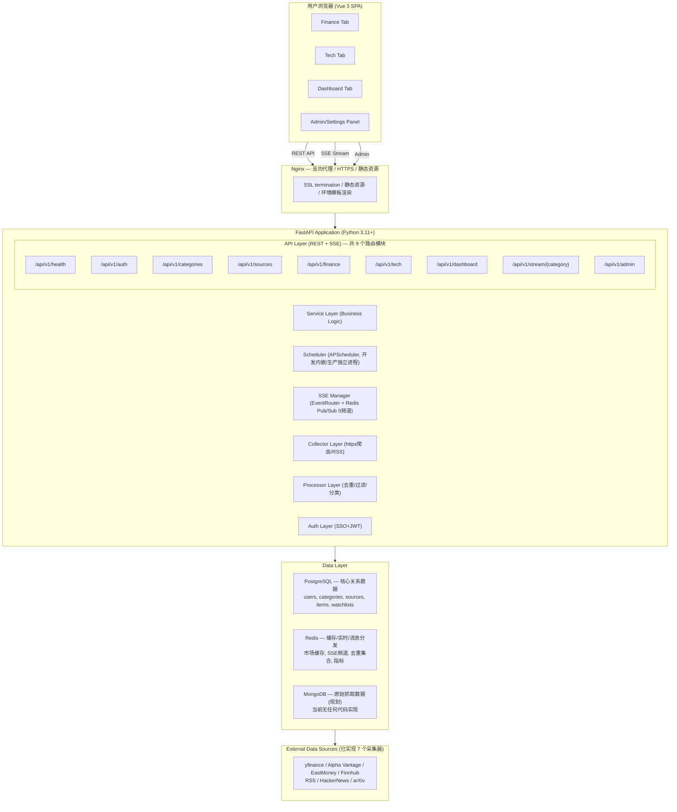
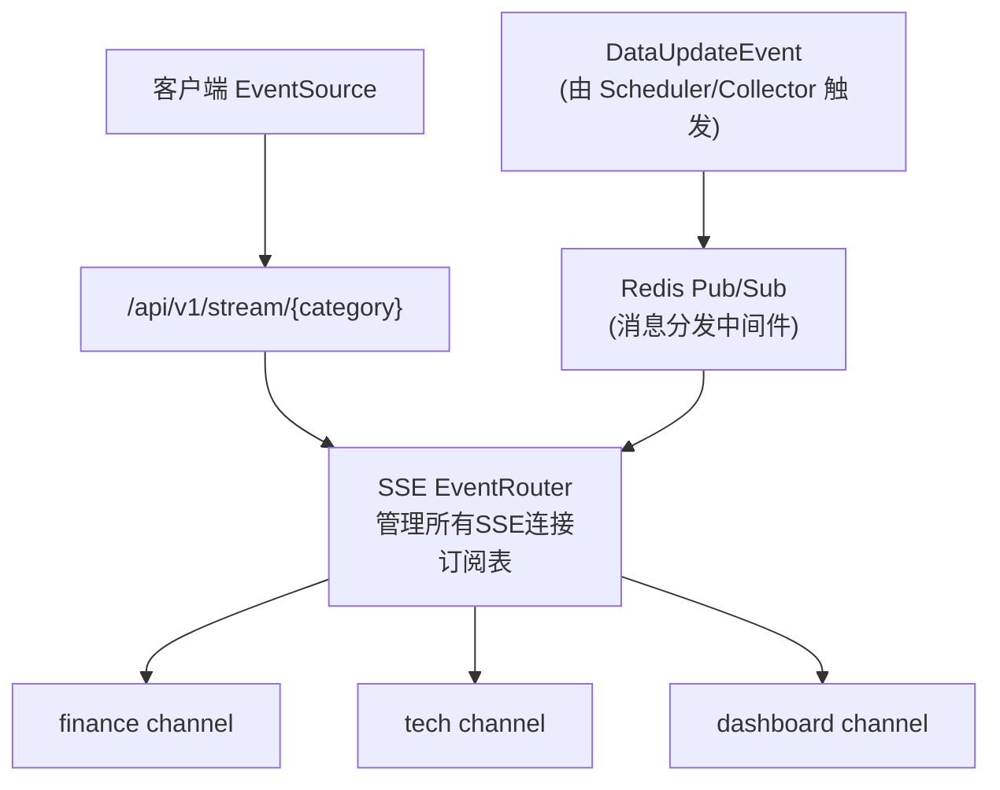

# InstantBoard 总体架构设计

## 1. 目标

定义 InstantBoard 实时信息聚合消息板的系统整体架构，包括前后端分离、实时推送、模块划分、部署架构和技术栈选型，确保各 subagent 可基于此架构并行实现。

## 2. 方案概述

采用 **前后端分离 + SSE 实时推送 + 分层异步数据管道** 架构，后端 FastAPI 提供 REST API 与 SSE 推送，Vue 3 前端通过 Composition API 消费数据并实时渲染，Docker Compose 编排所有服务。

## 3. 详细设计

### 3.1 系统整体架构图



> ⚠️ **未实现**：Nginx 限流与 CSP。`docker/nginx/nginx.conf:45-48` 的三个 `limit_req_zone`（api/sse/auth）全部被注释，文件中无任何 `limit_req` 指令，全仓库亦无 Content-Security-Policy 响应头。

> ⚠️ **未实现**：限流中间件。`RedisKeys.RATE_LIMIT` 有定义但 `RateLimitMiddleware`（`app/core/middleware.py:129-132`）是空壳直通，`RATE_LIMIT_PER_MINUTE`/`RATE_LIMIT_BURST` 配置项无任何消费者。

> ⚠️ **未实现**：外部源 NewsAPI / Twitter(X) / 通用 Web Scraping。`COLLECTOR_REGISTRY`（`app/collectors/__init__.py`）当前注册 9 个采集器（`yfinance` / `alpha_vantage` / `eastmoney` / `finnhub` / `iex_cloud` / `rss` / `hackernews` / `arxiv` / `reddit`）。

> 说明：`config.mongodb_url` 有定义但**无任何代码实现**（无连接层、无使用方），与"初始版本不启用"决策一致，仅保留 compose 中 `profiles: [mongodb]` 服务定义。

### 3.2 前后端分离架构

```mermaid
graph LR
    subgraph Frontend["前端 (Vue 3 SPA) — src/"]
        subgraph Views["views/ (7 个)"]
            FinanceView["FinanceView / TechView / DashboardView"]
            SettingsView["SettingsView"]
            AuthViews["LoginView / AdminLoginView / SSOCallbackView"]
        end
        subgraph Components["components/ (layout/common/finance/tech/dashboard/settings)"]
            FinanceGrid["finance/FinanceGrid"]
            Watchlist["finance/Watchlist + WatchlistMini"]
            SearchSymbols["finance/SearchSymbols"]
            NewsFeed["tech/NewsFeed + NewsCard"]
            ChartWrapper["dashboard/ChartWrapper"]
        end
        subgraph Stores["stores/ (Pinia)"]
            financeStore["financeStore"]
            techStore["techStore"]
            dashboardStore["dashboardStore"]
            settingsStore["settingsStore"]
        end
        subgraph Composables["composables/ (5 个)"]
            useSSE["useSSE"]
            useAuth["useAuth"]
            useInfiniteScroll["useInfiniteScroll"]
            useResponsive["useResponsive"]
            useTheme["useTheme"]
        end
    end

    subgraph Backend["后端 (FastAPI) — app/"]
        subgraph APIRoute["api/ — 路由层"]
            RouterPy["router.py — 注册 9 个模块"]
            subgraph V1["v1/"]
                auth["auth.py"]
                categories["categories.py"]
                sources["sources.py"]
                finance["finance.py"]
                tech["tech.py"]
                dashboard["dashboard.py"]
                health["health.py"]
                sse["sse.py"]
                admin["admin.py"]
            end
        end
        Services["services/ — 业务逻辑层"]
        Collectors["collectors/ — 数据采集层 (finance/ + tech/ 子包)"]
        Processors["processors/ — 数据处理层"]
        Models["models/ — 数据模型层"]
        SchedulerDir["scheduler/ — manager.py + worker.py"]
        CoreDir["core/ — sse_router.py / security.py / sso_handlers.py / middleware.py / redis.py"]
        ConfigPy["config.py — 配置 (单文件)"]
        MainPy["main.py"]
    end

    subgraph BackendOther[""]
        Tests["backend/tests/ — unit + integration"]
        Alembic["app/alembic/ — 迁移脚手架 (无 versions/)"]
    end
```

**通信方式**:
- REST API: `axios` / `fetch` → JSON 请求/响应
- SSE: `EventSource` → 服务端实时推送
- 前端状态管理: Pinia stores 消费 SSE 事件 + REST 数据

### 3.3 SSE 实时推送架构



**关键设计**:
- SSE 连接由 `SSEEventRouter`（`app/core/sse_router.py`）管理，维护 `{client_id → SSEConnection}` 与 `{channel → set[client_id]}` 两张映射表
- 后端数据更新时，通过 Redis Pub/Sub 发布事件（消息含 `event_id`），EventRouter 按 tenant_id 精确匹配转发给订阅连接；订阅频道为 finance / tech / dashboard / admin / all 共 5 个
- 连接建立时先推送具名事件 `event: connected`（携带 client_id / category / timestamp，`api/v1/sse.py:93-101`）作为握手确认
- 心跳机制：`SSE_HEARTBEAT_INTERVAL`（默认 30s）内无事件时推送具名事件 `event: heartbeat\ndata: {"timestamp": ...}`（`api/v1/sse.py:112-114`、`core/sse_router.py:185-194`）——**不是** `:heartbeat` 注释行
- 连接断开后由前端指数退避重连（初始 1s、上限 60s，`frontend/src/utils/sse.ts`）

### 3.4 微服务/模块划分

采用**模块化单体 (Modular Monolith)** 架构，初期不拆微服务，但模块边界清晰，后续可独立拆分：

| 模块 | 职责 | 对外接口 | 内部依赖 |
|------|------|---------|---------|
| **auth** | SSO 认证、JWT、会话管理 | `/api/v1/auth/*` | Redis, PostgreSQL |
| **categories** | 内容分类 CRUD | `/api/v1/categories/*` | PostgreSQL |
| **sources** | 数据源管理 CRUD | `/api/v1/sources/*` | PostgreSQL, categories |
| **finance** | 股票/基金搜索、自选、估值、市场指数 | `/api/v1/finance/*`, `/api/v1/stream/finance` | PostgreSQL, Redis, external APIs |
| **tech** | 科技资讯聚合、话题标签 | `/api/v1/tech/*`, `/api/v1/stream/tech` | PostgreSQL, Redis, collectors |
| **dashboard** | 系统状态监控 | `/api/v1/dashboard/*`, `/api/v1/stream/dashboard` | Redis, PostgreSQL |
| **collector** | 数据采集引擎 | 内部调度接口 | httpx, feedparser, sources |
| **processor** | 数据处理管道 | 内部管道接口 | collector, PostgreSQL, Redis |
| **sse** | SSE 推送管理 | `/api/v1/stream/*` | Redis Pub/Sub, processor |
| **scheduler** | 定时任务编排 | 内部管理接口 | APScheduler, collector, processor |

### 3.5 部署架构 (Docker Compose)

```yaml
# 生产 Docker Compose 架构 (docker/docker-compose.prod.yml)
services:
  nginx:          # 反向代理 + SSL + 静态资源 (entrypoint.sh envsubst 模板渲染)
  api:            # FastAPI 应用 (gunicorn + UvicornWorker, SCHEDULER_ENABLED=false)
  worker:         # 采集调度 Worker — APScheduler 独立进程:
                  #   复用 backend 镜像 (target: production)
                  #   command: python -m app.scheduler.worker (docker-compose.prod.yml:117)
                  #   每 15s 写 Redis 心跳 (契约见 infrastructure.md §3.5)
  frontend:       # 前端静态资源容器 (与 nginx 共享卷, 仅经 nginx 访问)
  postgres:       # PostgreSQL 15-alpine
  redis:          # Redis 7-alpine (缓存 + Pub/Sub)
  mongodb:        # MongoDB 6 (profiles: [mongodb], 初始版本不启用)
```

> ⚠️ **未实现**：Celery / Flower 从未实现（requirements 无 celery 依赖、无 `docker/worker/Dockerfile`）。生产 worker 即上表的 APScheduler 独立进程（`backend/app/scheduler/worker.py`，含 Redis 心跳）。未来随规模增长可选引入消息队列替代直连调度。

**开发环境 Docker Compose**:
```yaml
services:
  api:            # FastAPI (uvicorn --reload) + 内嵌调度器 (SCHEDULER_ENABLED=true)
  postgres:       # PostgreSQL 17 (基础文件刻意不发布宿主机端口)
  redis:          # Redis 7-alpine
  mongodb:        # MongoDB 6 (profiles: [mongodb], 默认不启动)
  frontend:       # Vite dev server (构建目标 target: dev, 端口 3000)
  # nginx 开发不使用；端口发布与热重载挂载全部在
  # docker/docker-compose.override.yml (无 -f 时自动加载, 见 infrastructure.md §3.4)
```

### 3.6 技术栈选型及理由

| 技术 | 选型 | 理由 |
|------|------|------|
| 后端语言 | Python 3.11+ | 生态丰富（爬虫、数据处理库），async/await 原生支持 |
| Web框架 | FastAPI | 自动 OpenAPI 文档、Pydantic 验证、async 原生、高性能 |
| ASGI | uvicorn + gunicorn | 生产级 ASGI 服务器，多 worker 支持 |
| 前端框架 | Vue 3 Composition API | 响应式系统高效、Composition API 逻辑复用好 |
| 构建工具 | Vite | 开发体验极佳，HMR 快速，构建优化 |
| 状态管理 | Pinia | Vue 3 官方推荐，TypeScript 支持好，API 简洁 |
| 实时推送 | SSE (Server-Sent Events) | 单向推送场景足够、原生浏览器支持、自动重连、比 WebSocket 简单（详见 [data-flow.md](data-flow.md) §5.1） |
| 定时任务 | APScheduler（开发与生产统一，无 Celery） | 开发内嵌 api 进程（`SCHEDULER_ENABLED=true`）；生产独立进程 `python -m app.scheduler.worker`，避免引入消息队列的运维成本 |
| 关系数据库 | PostgreSQL 15 | 功能最强开源 RDBMS、JSON 支持、多租户友好 |
| 内存数据库 | Redis 7 | 缓存+Pub/Sub+会话+限流，一工具多场景 |
| 对象数据库 | MongoDB 6 | 规划项：存储原始抓取内容、历史市场数据（初始版本不启用，**当前无任何代码实现**，PostgreSQL JSONB 替代） |
| HTTP客户端 | httpx | async 支持、HTTP/2、比 aiohttp 更现代 |
| HTML解析 | BeautifulSoup | 简单可靠、社区成熟 |
| RSS解析 | feedparser | Python RSS 解析标准库 |
| 反向代理 | Nginx | SSL termination、静态资源、反向代理（限流已预留注释，未启用） |
| 容器编排 | Docker Compose | 开发+生产统一、服务隔离、一键启动 |
| CI/CD | GitHub Actions | 与 GitHub 集成、免费额度充足 |
| 数据迁移 | Alembic | SQLAlchemy/FastAPI 生态标准迁移工具 |
| ORM | SQLAlchemy 2.0 | async 支持、类型提示、成熟生态 |

## 4. 关键决策

| 决策 | 选择 | 理由 |
|------|------|------|
| 单体 vs 微服务 | **模块化单体** | 初期开发效率高，模块边界清晰可后续拆分 |
| SSE vs WebSocket | **SSE** | InstantBoard 主要是服务端→客户端推送，SSE 原生重连、简单、HTTP/2 多路复用（详见 [data-flow.md](data-flow.md)） |
| APScheduler vs Celery | **APScheduler 统一（Celery 未实现）** | 开发内嵌 api 进程、生产独立进程 `python -m app.scheduler.worker`（含 Redis 心跳）；未引入消息队列 |
| SQLite vs PostgreSQL | **统一 PostgreSQL** | 多租户、JSON 字段、并发写入需求，SQLite 不适合 |
| 是否用 MongoDB | **初始版本不启用，当前无任何代码实现** | 核心数据全部 PostgreSQL；`config.mongodb_url` 仅为预留，待原始抓取需求落地再实现 |

## 5. 边界情况

- **SSE 连接数限制**: Nginx 配置 `worker_connections` 和 `proxy_read_timeout`，单机 1000+ SSE 连接
- **数据采集失败**: Collector 失败时写入 `source_health` 表，标记失败状态，不影响 SSE 推送其他正常源
- **Redis 不可用**: 发布侧降级——`push_event` Pub/Sub 失败时直接内存转发（仅当前进程订阅者可达）；缓存读路径直落 PostgreSQL

> ⚠️ **未实现**：SSE 降级为客户端定时 REST 轮询不存在；前端仅有 1s→60s 指数退避重连（`frontend/src/utils/sse.ts`）。
- **多租户隔离**: PostgreSQL 行级隔离 (tenant_id)，Redis key 前缀隔离 (`t:{tenant_id}:*`)

## 6. 与其他模块的依赖

- → [infrastructure.md](infrastructure.md): 部署架构实现细节
- → [api.md](api.md): API 层接口定义
- → [database.md](database.md): 数据层设计
- → [data-flow.md](data-flow.md): 数据管道与 SSE 推送
- → [frontend.md](frontend.md): 前端架构
- → [security.md](security.md): 安全架构