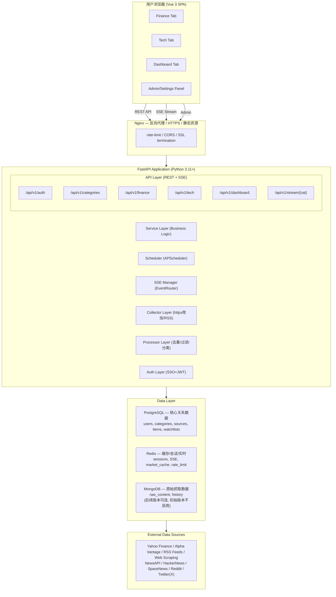
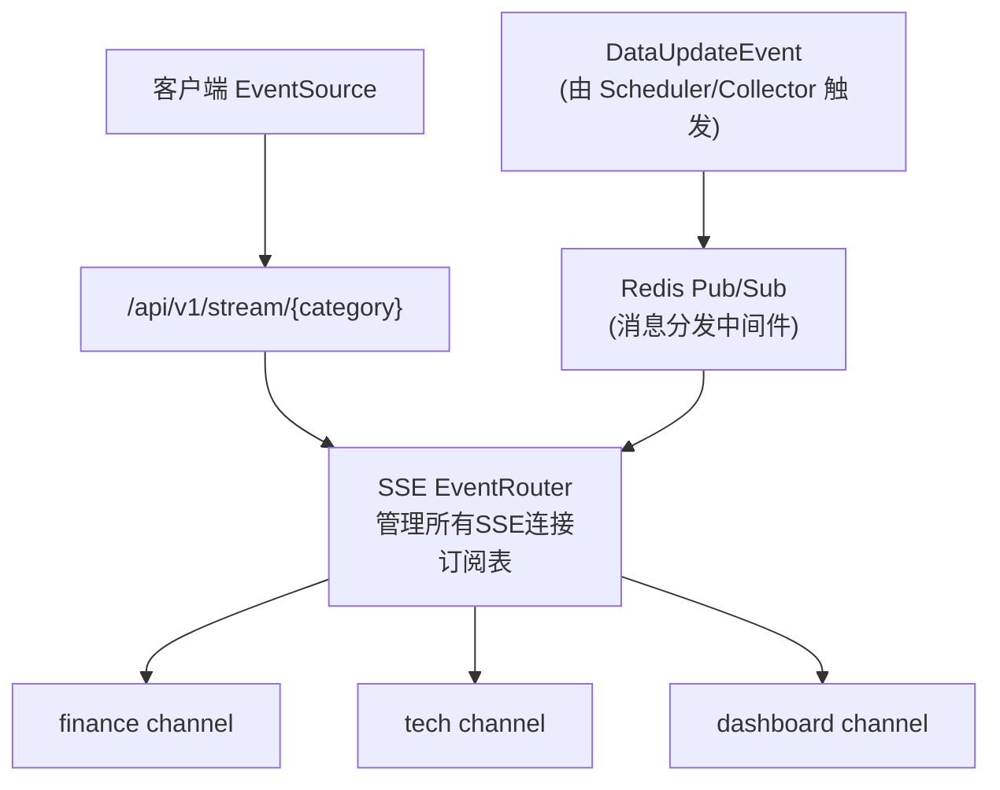

# InstantBoard 总体架构设计

## 1. 目标

定义 InstantBoard 实时信息聚合消息板的系统整体架构，包括前后端分离、实时推送、模块划分、部署架构和技术栈选型，确保各 subagent 可基于此架构并行实现。

## 2. 方案概述

采用 **前后端分离 + SSE 实时推送 + 分层异步数据管道** 架构，后端 FastAPI 提供 REST API 与 SSE 推送，Vue 3 前端通过 Composition API 消费数据并实时渲染，Docker Compose 编排所有服务。

## 3. 详细设计

### 3.1 系统整体架构图



### 3.2 前后端分离架构

```mermaid
graph LR
    subgraph Frontend["前端 (Vue 3 SPA) — src/"]
        subgraph Views["views/"]
            FinanceView["FinanceView"]
            TechView["TechView"]
            DashboardView["DashboardView"]
            SettingsView["SettingsView"]
        end
        subgraph Components["components/"]
            MarketTicker["MarketTicker"]
            NewsCard["NewsCard"]
            WatchlistPanel["WatchlistPanel"]
            SearchBar["SearchBar"]
            ChartWidget["ChartWidget"]
        end
        subgraph Stores["stores/ (Pinia)"]
            financeStore["financeStore"]
            techStore["techStore"]
            dashboardStore["dashboardStore"]
            settingsStore["settingsStore"]
        end
        subgraph Composables["composables/"]
            useSSE["useSSE"]
            useAuth["useAuth"]
            useFetch["useFetch"]
        end
    end

    subgraph Backend["后端 (FastAPI) — app/"]
        subgraph APIRoute["api/ — 路由层"]
            subgraph V1["v1/"]
                auth["auth.py"]
                categories["categories.py"]
                finance["finance.py"]
                tech["tech.py"]
                dashboard["dashboard.py"]
                stream["stream.py"]
            end
        end
        Services["services/ — 业务逻辑层"]
        Collectors["collectors/ — 数据采集层"]
        Processors["processors/ — 数据处理层"]
        Models["models/ — 数据模型层"]
        SchedulerDir["scheduler/ — 定时任务"]
        SSEDir["sse/ — SSE管理"]
        AuthDir["auth/ — 认证模块"]
        ConfigDir["config/ — 配置"]
        MainPy["main.py"]
    end

    subgraph BackendOther[""]
        Tests["tests/"]
        Alembic["alembic/ — 迁移"]
    end
```

**通信方式**:
- REST API: `axios` / `fetch` → JSON 请求/响应
- SSE: `EventSource` → 服务端实时推送
- 前端状态管理: Pinia stores 消费 SSE 事件 + REST 数据

### 3.3 SSE 实时推送架构



**关键设计**:
- SSE 连接由 `SSEEventRouter` 管理，维护 `{client_id → [subscriptions]}` 映射
- 后端数据更新时，通过 Redis Pub/Sub 发布事件，EventRouter 转发给匹配的 SSE 连接
- 每个客户端连接可订阅多个 category stream
- 连接断开时 EventSource 自动重连（SSE 原生机制）
- 心跳机制：每 30s 发送 `:heartbeat\n\n` 保持连接

### 3.4 微服务/模块划分

采用**模块化单体 (Modular Monolith)** 架构，初期不拆微服务，但模块边界清晰，后续可独立拆分：

| 模块 | 职责 | 对外接口 | 内部依赖 |
|------|------|---------|---------|
| **auth** | SSO 认证、JWT、会话管理 | `/api/v1/auth/*` | Redis, PostgreSQL |
| **categories** | 内容分类 CRUD | `/api/v1/categories/*` | PostgreSQL |
| **sources** | 数据源管理 CRUD | `/api/v1/sources/*` | PostgreSQL, categories |
| **finance** | 股票/基金搜索、自选、估值、市场指数 | `/api/v1/finance/*`, `/api/v1/stream/finance` | PostgreSQL, Redis, external APIs |
| **tech** | 科技资讯聚合、话题标签 | `/api/v1/tech/*`, `/api/v1/stream/tech` | PostgreSQL, Redis, collectors |
| **dashboard** | 系统状态监控 | `/api/v1/dashboard/*`, `/api/v1/stream/dashboard` | Redis, PostgreSQL |
| **collector** | 数据采集引擎 | 内部调度接口 | httpx, feedparser, sources |
| **processor** | 数据处理管道 | 内部管道接口 | collector, PostgreSQL, Redis |
| **sse** | SSE 推送管理 | `/api/v1/stream/*` | Redis Pub/Sub, processor |
| **scheduler** | 定时任务编排 | 内部管理接口 | APScheduler, collector, processor |

### 3.5 部署架构 (Docker Compose)

```yaml
# 生产 Docker Compose 架构
services:
  nginx:          # 反向代理 + SSL + 静态资源 + rate-limit
  api:            # FastAPI 应用 (uvicorn + gunicorn)
  worker:         # 后台任务 Worker (Celery/APScheduler)
  postgres:       # PostgreSQL 15
  redis:          # Redis 7 (缓存 + Pub/Sub)
  mongodb:        # MongoDB 6 (后续版本可选, 初始版本不启用, profiles方式)
  flower:         # Celery 任务监控面板 (可选)
```

**开发环境 Docker Compose**:
```yaml
services:
  api:            # FastAPI (热重载 uvicorn --reload)
  postgres:       # PostgreSQL 15
  redis:          # Redis 7
  mongodb:        # MongoDB 6 (后续版本可选, 初始版本默认不启动)
  # nginx 在开发中不使用，直接 uvicorn 提供服务
  # worker 在开发中集成在 api 进程内 (APScheduler)
```

### 3.6 技术栈选型及理由

| 技术 | 选型 | 理由 |
|------|------|------|
| 后端语言 | Python 3.11+ | 生态丰富（爬虫、数据处理库），async/await 原生支持 |
| Web框架 | FastAPI | 自动 OpenAPI 文档、Pydantic 验证、async 原生、高性能 |
| ASGI | uvicorn + gunicorn | 生产级 ASGI 服务器，多 worker 支持 |
| 前端框架 | Vue 3 Composition API | 响应式系统高效、Composition API 逻辑复用好 |
| 构建工具 | Vite | 开发体验极佳，HMR 快速，构建优化 |
| 状态管理 | Pinia | Vue 3 官方推荐，TypeScript 支持好，API 简洁 |
| 实时推送 | SSE (Server-Sent Events) | 单向推送场景足够、原生浏览器支持、自动重连、比 WebSocket 简单（详见 [data-flow.md](data-flow.md) §5.1） |
| 定时任务 | APScheduler (开发) → Celery (生产) | APScheduler 简单够用；Celery 生产级可靠、支持重试、优先级 |
| 关系数据库 | PostgreSQL 15 | 功能最强开源 RDBMS、JSON 支持、多租户友好 |
| 内存数据库 | Redis 7 | 缓存+Pub/Sub+会话+限流，一工具多场景 |
| 对象数据库 | MongoDB 6 | 后续版本可选：存储原始抓取内容、历史市场数据（初始版本不启用，PostgreSQL JSONB 替代） |
| HTTP客户端 | httpx | async 支持、HTTP/2、比 aiohttp 更现代 |
| HTML解析 | BeautifulSoup | 简单可靠、社区成熟 |
| RSS解析 | feedparser | Python RSS 解析标准库 |
| 反向代理 | Nginx | SSL termination、静态资源、rate-limit、负载均衡 |
| 容器编排 | Docker Compose | 开发+生产统一、服务隔离、一键启动 |
| CI/CD | GitHub Actions | 与 GitHub 集成、免费额度充足 |
| 数据迁移 | Alembic | SQLAlchemy/FastAPI 生态标准迁移工具 |
| ORM | SQLAlchemy 2.0 | async 支持、类型提示、成熟生态 |

## 4. 关键决策

| 决策 | 选择 | 理由 |
|------|------|------|
| 单体 vs 微服务 | **模块化单体** | 初期开发效率高，模块边界清晰可后续拆分 |
| SSE vs WebSocket | **SSE** | InstantBoard 主要是服务端→客户端推送，SSE 原生重连、简单、HTTP/2 多路复用（详见 [data-flow.md](data-flow.md)） |
| APScheduler vs Celery | **渐进式** | 开发用 APScheduler（集成在 API 进程），生产用 Celery（独立 worker） |
| SQLite vs PostgreSQL | **统一 PostgreSQL** | 多租户、JSON 字段、并发写入需求，SQLite 不适合 |
| 是否用 MongoDB | **初始版本不启用，后续按需启用** | 核心数据全部 PostgreSQL，MongoDB 仅用于原始抓取数据存储，初始版本不启用以简化部署 |

## 5. 边界情况

- **SSE 连接数限制**: Nginx 配置 `worker_connections` 和 `proxy_read_timeout`，单机 1000+ SSE 连接
- **数据采集失败**: Collector 失败时写入 `source_health` 表，标记失败状态，不影响 SSE 推送其他正常源
- **Redis 不可用**: 降级模式——直接从 PostgreSQL 查询，SSE 降级为客户端定时 REST 拉取
- **多租户隔离**: PostgreSQL 行级隔离 (tenant_id)，Redis key 前缀隔离 (`t:{tenant_id}:*`)

## 6. 与其他模块的依赖

- → [infrastructure.md](infrastructure.md): 部署架构实现细节
- → [api.md](api.md): API 层接口定义
- → [database.md](database.md): 数据层设计
- → [data-flow.md](data-flow.md): 数据管道与 SSE 推送
- → [frontend.md](frontend.md): 前端架构
- → [security.md](security.md): 安全架构