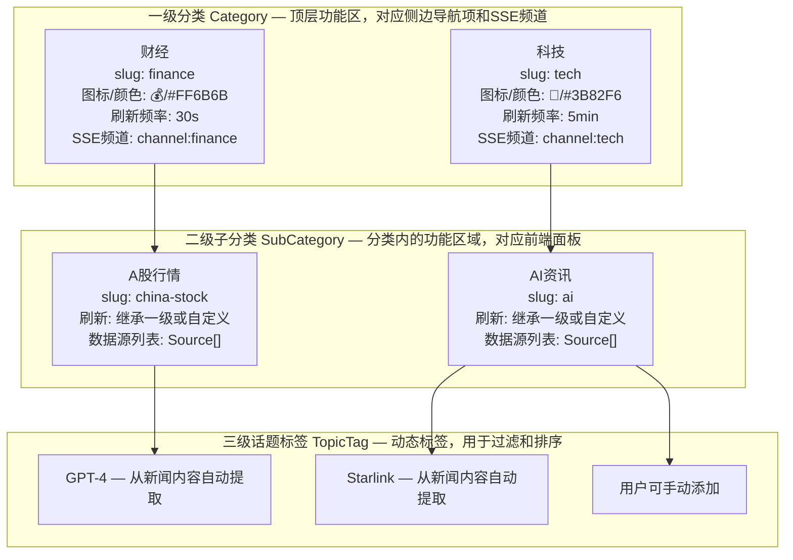
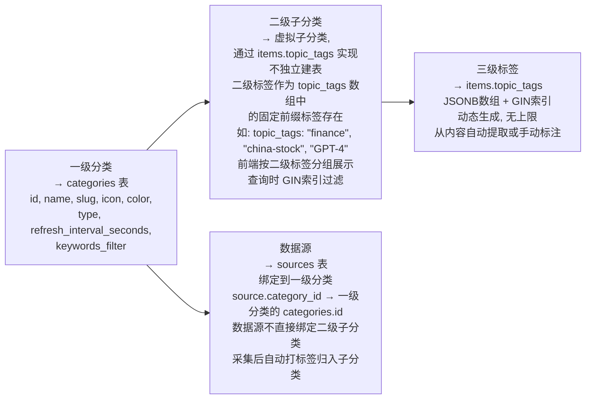
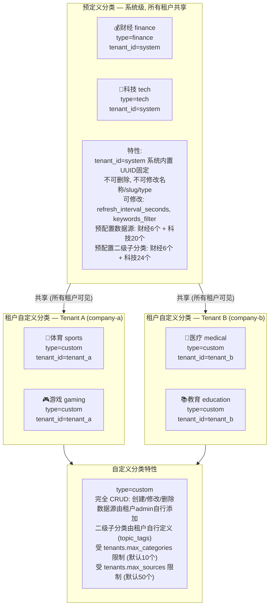
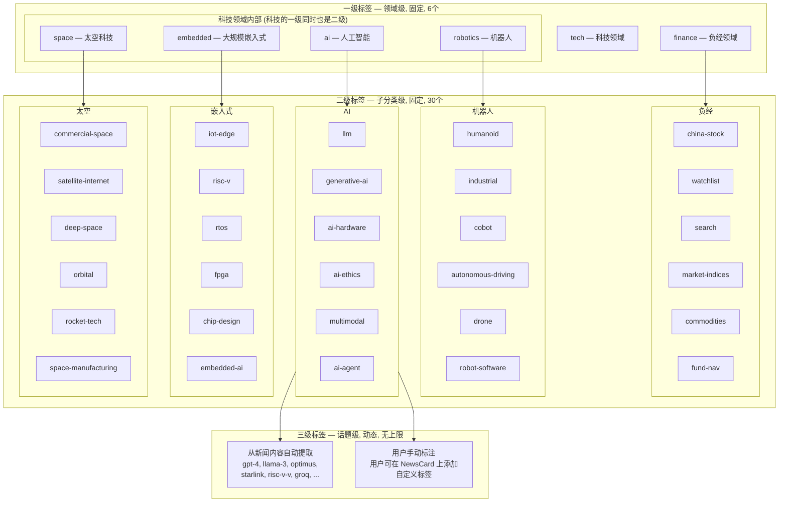
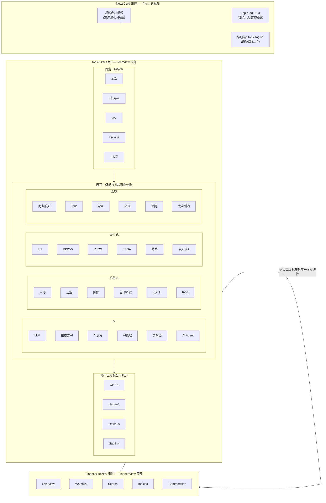

# InstantBoard 内容分类体系设计

## 目录

1. 目标
2. 方案概述
3. 详细设计
   - 3.1 分类层级结构
   - 3.2 分类与数据源映射关系表格
   - 3.3 分类扩展策略
   - 3.4 用户自定义分类 (多租户场景)
   - 3.5 预定义分类清单
   - 3.6 标签体系设计
4. 关键决策
5. 边界情况
6. 与其他模块的依赖

## 1. 目标

定义 InstantBoard 的内容分类体系，包括分类层级结构、分类与数据源的映射、分类扩展流程、多租户自定义分类、预定义分类清单和标签体系，确保数据按内容语义组织而非按数据源类型组织。

## 2. 方案概述

采用 **三级分类体系 (一级领域 → 二级子分类 → 三级话题标签) + 数据源绑定到一级分类 + 二级子分类通过 topic_tags 虚拟实现 + 用户可自定义扩展** 方案，分类驱动数据采集频率和展示方式，而非数据源类型驱动。

## 3. 详细设计

### 3.1 分类层级结构

#### 3.1.1 层级定义



#### 3.1.2 数据模型映射



### 3.2 分类与数据源映射关系表格

#### 3.2.1 财经分类映射

| 一级分类 | 一级slug | 二级子分类(虚拟) | 二级slug | 数据源 | 源类型 | 刷新频率 |
|---------|---------|----------------|---------|--------|--------|---------|
| 财经 | finance | A股行情 | china-stock | 东方财富(A股实时) | web_scrape | 15s(交易时段) |
| 财经 | finance | A股行情 | china-stock | yfinance(000001.SS, 399001.SZ, 000300.SS) | api | 30s |
| 财经 | finance | 世界市场指数 | market-indices | yfinance(^GSPC, ^DJI, ^IXIC, ^HSI, ^N225, ^FTSE, ^GDAXI) | api | 30s(交易时段) |
| 财经 | finance | 世界市场指数 | market-indices | Alpha Vantage(failover) | api | 30s |
| 财经 | finance | 大宗商品/期货 | commodities | yfinance(GC=F, SI=F, CL=F, NG=F, HG=F, ZS=F, ZC=F) | api | 60s |
| 财经 | finance | 大宗商品/期货 | commodities | Alpha Vantage(failover) | api | 60s |
| 财经 | finance | 基金NAV估值 | fund-nav | 天天基金(官方NAV) | web_scrape | 每日20:00 |
| 财经 | finance | 基金NAV估值 | fund-nav | 东方财富(NAV补充) | web_scrape | 每日 |
| 财经 | finance | 基金NAV估值 | fund-nav | yfinance(指数行情,用于估值计算) | api | 120s(交易时段) |
| 财经 | finance | 自选行情 | watchlist | yfinance(用户自选symbols) | api | 30s |
| 财经 | finance | 自选行情 | watchlist | Finnhub(failover) | api | 30s |
| 财经 | finance | 财经新闻 | finance-news | Google News Finance RSS | rss | 5min |

#### 3.2.2 科技分类映射 — 机器人领域

| 一级分类 | 一级slug | 二级子分类(虚拟) | 二级slug | 数据源 | 源类型 | 刷新频率 |
|---------|---------|----------------|---------|--------|--------|---------|
| 科技 | tech | 机器人-人形机器人 | humanoid | HackerNews(robotics tag) | rss | 2min |
| 科技 | tech | 机器人-人形机器人 | humanoid | The Robot Report | rss | 5min |
| 科技 | tech | 机器人-工业机器人 | industrial | HackerNews(robotics tag) | rss | 2min |
| 科技 | tech | 机器人-工业机器人 | industrial | The Robot Report | rss | 5min |
| 科技 | tech | 机器人-协作机器人 | cobot | HackerNews(robotics tag) | rss | 2min |
| 科技 | tech | 机器人-协作机器人 | cobot | IEEE Robotics RSS | rss | 每日 |
| 科技 | tech | 机器人-自动驾驶 | autonomous-driving | HackerNews(robotics tag) | rss | 2min |
| 科技 | tech | 机器人-自动驾驶 | autonomous-driving | Automotive News | web_scrape | 每日 |
| 科技 | tech | 机器人-无人机 | drone | HackerNews(robotics tag) | rss | 2min |
| 科技 | tech | 机器人-无人机 | drone | Hackaday | rss | 5min |
| 科技 | tech | 机器人-机器人OS/软件 | robot-software | HackerNews(robotics tag) | rss | 2min |
| 科技 | tech | 机器人-机器人OS/软件 | robot-software | ROS Blog | rss | 每周 |

#### 3.2.3 科技分类映射 — AI领域

| 一级分类 | 一级slug | 二级子分类(虚拟) | 二级slug | 数据源 | 源类型 | 刷新频率 |
|---------|---------|----------------|---------|--------|--------|---------|
| 科技 | tech | AI-大语言模型 | llm | MIT Tech Review AI Feed | rss | 5min |
| 科技 | tech | AI-大语言模型 | llm | HackerNews(AI/ML tag) | rss | 2min |
| 科技 | tech | AI-大语言模型 | llm | OpenAI Blog | web_scrape | 30min |
| 科技 | tech | AI-生成式AI | generative-ai | MIT Tech Review AI Feed | rss | 5min |
| 科技 | tech | AI-生成式AI | generative-ai | HackerNews(AI/ML tag) | rss | 2min |
| 科技 | tech | AI-AI芯片/硬件 | ai-hardware | HackerNews(AI/ML tag) | rss | 2min |
| 科技 | tech | AI-AI芯片/硬件 | ai-hardware | Arxiv CS.AI | rss | 30min |
| 科技 | tech | AI-AI伦理与治理 | ai-ethics | MIT Tech Review AI Feed | rss | 5min |
| 科技 | tech | AI-AI伦理与治理 | ai-ethics | HackerNews(AI/ML tag) | rss | 2min |
| 科技 | tech | AI-多模态AI | multimodal | HackerNews(AI/ML tag) | rss | 2min |
| 科技 | tech | AI-多模态AI | multimodal | Arxiv CS.AI | rss | 30min |
| 科技 | tech | AI-AI Agent/应用 | ai-agent | HackerNews(AI/ML tag) | rss | 2min |
| 科技 | tech | AI-AI Agent/应用 | ai-agent | The Batch (Andrew Ng) | rss | 每周 |

#### 3.2.4 科技分类映射 — 大规模嵌入式领域

| 一级分类 | 一级slug | 二级子分类(虚拟) | 二级slug | 数据源 | 源类型 | 刷新频率 |
|---------|---------|----------------|---------|--------|--------|---------|
| 科技 | tech | 嵌入式-IoT与边缘计算 | iot-edge | Hackaday | rss | 5min |
| 科技 | tech | 嵌入式-IoT与边缘计算 | iot-edge | Embedded.com | rss | 5min |
| 科技 | tech | 嵌入式-RISC-V与处理器 | risc-v | Hackaday | rss | 5min |
| 科技 | tech | 嵌入式-RISC-V与处理器 | risc-v | RISC-V International Blog | rss | 30min |
| 科技 | tech | 嵌入式-实时操作系统 | rtos | Embedded.com | rss | 5min |
| 科技 | tech | 嵌入式-实时操作系统 | rtos | Zephyr Project Blog | rss | 每月 |
| 科技 | tech | 嵌入式-FPGA与硬件加速 | fpga | Hackaday | rss | 5min |
| 科技 | tech | 嵌入式-FPGA与硬件加速 | fpga | EE Times | rss | 每日 |
| 科技 | tech | 嵌入式-芯片设计 | chip-design | EE Times | rss | 每日 |
| 科技 | tech | 嵌入式-芯片设计 | chip-design | Hackaday | rss | 5min |
| 科技 | tech | 嵌入式-嵌入式AI | embedded-ai | Hackaday | rss | 5min |
| 科技 | tech | 嵌入式-嵌入式AI | embedded-ai | Embedded.com | rss | 5min |

#### 3.2.5 科技分类映射 — 太空科技领域

| 一级分类 | 一级slug | 二级子分类(虚拟) | 二级slug | 数据源 | 源类型 | 刷新频率 |
|---------|---------|----------------|---------|--------|--------|---------|
| 科技 | tech | 太空-商业航天 | commercial-space | SpaceNews | rss | 5min |
| 科技 | tech | 太空-商业航天 | commercial-space | SpaceX Updates | web_scrape | 30min |
| 科技 | tech | 太空-卫星互联网 | satellite-internet | SpaceNews | rss | 5min |
| 科技 | tech | 太空-卫星互联网 | satellite-internet | Ars Technica Space | rss | 5min |
| 科技 | tech | 太空-深空探测 | deep-space | NASA News | rss | 30min |
| 科技 | tech | 太空-深空探测 | deep-space | Ars Technica Space | rss | 5min |
| 科技 | tech | 太空-空间站与在轨服务 | orbital | NASA News | rss | 30min |
| 科技 | tech | 太空-空间站与在轨服务 | orbital | ESA News | rss | 30min |
| 科技 | tech | 太空-火箭技术 | rocket-tech | SpaceNews | rss | 5min |
| 科技 | tech | 太空-火箭技术 | rocket-tech | SpaceX Updates | web_scrape | 30min |
| 科技 | tech | 太空-太空制造与资源 | space-manufacturing | NASA News | rss | 30min |
| 科技 | tech | 太空-太空制造与资源 | space-manufacturing | SpaceNews | rss | 5min |

#### 3.2.6 跨领域通用数据源映射

| 一级分类 | 二级子分类(虚拟) | 数据源 | 源类型 | 覆盖领域 |
|---------|----------------|--------|--------|---------|
| 科技 | 全部子分类 | Reddit (r/artificial, r/robotics, r/embedded, r/space) | social | 全领域 |
| 科技 | 全部子分类 | Google News Tech | rss | 全领域 |
| 科技 | 全部子分类 | Twitter/X Lists | social | 全领域(付费租户可选) |

#### 3.2.7 映射关系设计要点

```
关键设计要点:

1. 数据源绑定到一级分类 (sources.category_id → categories.id)
   不是绑定到二级子分类, 因为:
   - 一个数据源 (如 HackerNews) 可能覆盖多个子分类
   - 二级子分类是虚拟的, 通过采集后的 Categorizer 自动打标签
   - sources 表无 sub_category 字段

2. 二级子分类通过 topic_tags 虚拟实现
   - Categorizer 处理器根据关键词映射自动将条目归入二级标签
   - 如: "GPT" → topic_tags += ["ai", "llm"]
   - 如: "Starlink" → topic_tags += ["space", "satellite-internet"]
   - 前端查询: GET /api/v1/tech/news?topic=ai&subtopic=llm
     → SQL: WHERE topic_tags @> '["ai", "llm"]'

3. 财经分类特殊处理
   - 财经行情数据不走 items 通用模型, 而走专用表
     (finance_symbols, finance_quotes, fund_nav_estimates)
   - 财经的二级子分类对应子面板切换
     (Overview/Watchlist/Search/Indices/Commodities)
   - 财经新闻走 items 通用模型, category_id 指向 finance 分类,
     topic_tags 包含二级标签

4. 同一数据源可映射到多个二级子分类
   - HackerNews 同时覆盖机器人、AI、嵌入式、太空所有领域
   - Categorizer 通过关键词匹配决定每条新闻的二级归属
```

### 3.3 分类扩展策略

#### 3.3.1 添加新分类的完整流程

```mermaid
graph TD
    step1["Step 1: 前端操作 — CategoryAdmin 面板<br/>用户在 SettingsView → CategoryAdmin 点击 添加分类<br/>→ 弹出 CategoryForm:<br/>名称(required): 体育<br/>Slug(auto): sports<br/>图标(select): 🏃<br/>颜色(picker): #22C55E<br/>类型(select): custom<br/>刷新频率(slider): 300s<br/>关键词过滤(multi-input): NBA, FIFA, 奥运<br/>→ 提交表单 → POST /api/v1/categories"]
    step2["Step 2: API 层 — categories.py<br/>POST /api/v1/categories<br/>→ Pydantic CategoryCreateRequest 验证<br/>→ 注入 tenant_id (从 JWT)<br/>→ 检查租户分类数量上限 (tenants.max_categories)<br/>→ 检查 slug 唯一性 (UNIQUE tenant_id + slug)<br/>→ INSERT INTO categories<br/>→ 返回 CategoryResponse"]
    step3["Step 3: 数据库 — categories 表<br/>INSERT categories:<br/>id = gen_random_uuid()<br/>tenant_id = {current_tenant}<br/>name = 体育, slug = sports<br/>icon = running, color = #22C55E<br/>type = custom<br/>refresh_interval_seconds = 300<br/>keywords_filter = NBA, FIFA, 奥运<br/>is_active = true<br/>同时预留 SSE 频道: channel:sports"]
    step4["Step 4: 添加数据源 — SourceAdmin 面板<br/>用户在 CategoryAdmin → 新分类 体育 → 添加数据源<br/>→ SourceForm:<br/>名称: ESPN RSS<br/>category_id: {新分类UUID}<br/>source_type: rss<br/>url: https://www.espn.com/rss/news<br/>refresh_interval_seconds: 300<br/>→ POST /api/v1/sources<br/>→ INSERT INTO sources<br/>→ Scheduler 注册新采集任务"]
    step5["Step 5: 采集器启动 — Scheduler 动态注册<br/>Scheduler 收到 source_created 事件<br/>Redis Pub/Sub channel:admin<br/>→ scheduler.add_job(<br/>collect_and_process,<br/>trigger=interval,<br/>seconds=300,<br/>id=collect_{source_id},<br/>max_instances=1)<br/>→ 采集任务开始运行<br/>→ Collector采集 → Processor处理 → Store存入 → SSE推送"]
    step6["Step 6: SSE 推送生效 — EventRouter 频道注册<br/>EventRouter 新增频道: channel:sports<br/>→ Redis Pub/Sub subscribe(channel:sports)<br/>→ 前端订阅: EventSource(/api/v1/stream/sports?token=xxx)<br/>→ 接收 item_update → Pinia sportsStore → Vue 渲染<br/>前端侧边导航新增: 🏃 体育 Tab<br/>→ SportsView 加载 → 显示新闻卡片列表"]
    step1 --> step2 --> step3 --> step4 --> step5 --> step6
```



#### 3.3.2 修改分类的流程

```
修改分类属性 (如刷新频率、关键词过滤):

1. 前端: CategoryAdmin → 编辑分类 → PUT /api/v1/categories/{id}
2. API:  验证 + UPDATE categories SET ...
3. DB:    更新 categories 行
4. SSE:   如果修改了 refresh_interval →
          → Scheduler.reschedule_job(collect_{source_id}, seconds=new_interval)
          → 对该分类下所有 sources 重新调度
5. SSE:   如果修改了 keywords_filter →
          → FilterProcessor 下次使用新的关键词列表
          → 不影响已入库的条目 (已过滤过的不会变)
```

#### 3.3.3 删除分类的流程

```
删除分类 (级联删除):

1. 前端: CategoryAdmin → 删除分类 → DELETE /api/v1/categories/{id}
2. API:  验证 + 检查分类下是否有活跃数据源
         → 提示确认: "删除此分类将同时删除 N 个数据源"
3. DB:    DELETE categories WHERE id = {id}
         → CASCADE DELETE sources (ON DELETE CASCADE)
         → CASCADE DELETE items (ON DELETE CASCADE)
         → CASCADE DELETE source_health (ON DELETE CASCADE)
4. SSE:   Scheduler.remove_all_jobs(category_sources)
         → EventRouter 移除频道订阅
         → 向订阅此频道的前端发送 category_deleted 事件
         → 前端: 从侧边导航移除 Tab, 切换到默认分类
```

#### 3.3.4 添加新二级子分类的流程

```
添加新二级子分类 (虚拟, 不建表):

1. 二级子分类是 topic_tags 中的标签, 不需要数据库操作
2. 步骤:
   a. 更新 Categorizer 关键词映射表:
      keyword_to_tag["新关键词"] = ["一级标签", "新二级标签"]
   b. 前端 TopicFilter 组件添加新二级标签按钮
   c. 无需修改数据库表结构

3. 示例: 在科技-AI领域添加 "AI搜索" 子分类:
   a. keyword_to_tag.update({
        "Perplexity": ["ai", "ai-search"],
        "AI搜索": ["ai", "ai-search"],
      })
   b. TopicFilter 新增按钮: [AI搜索]
   c. 采集器下次处理时, 包含 "Perplexity" 的新闻自动打上
      ["ai", "ai-search"] 标签
```

### 3.4 用户自定义分类 (多租户场景)

#### 3.4.1 多租户分类架构



#### 3.4.2 分类可见性规则

```
分类查询可见性:

GET /api/v1/categories (获取租户可见的所有分类):

SQL查询逻辑:
  SELECT * FROM categories
  WHERE (tenant_id = :current_tenant_id)           -- 租户自定义分类
     OR (tenant_id = 'system')                      -- 预定义分类
  ORDER BY type ASC, name ASC                       -- 预定义优先

结果: 租户看到 = 预定义分类(不可删) + 自定义分类(可删)
前端: 侧边导航显示所有可见分类, 预定义分类有 🔒 标识表示不可删除

数据隔离:
  - 租户 A 看不到租户 B 的自定义分类 (WHERE tenant_id隔离)
  - 预定义分类的数据源和数据对所有租户共享
  - 自定义分类的数据源和数据仅本租户可见
  - PostgreSQL RLS (Row Level Security) 保障租户隔离
```

#### 3.4.3 预定义分类与自定义分类的权限差异

| 操作 | 预定义分类 (type=finance/tech) | 自定义分类 (type=custom) |
|------|------------------------------|------------------------|
| 查看 | ✅ 所有租户可见 | ✅ 仅本租户可见 |
| 创建 | ❌ 仅系统管理员 | ✅ 租户admin/member |
| 修改名称/slug/type | ❌ 不可修改 | ✅ 可修改 |
| 修改刷新频率/关键词 | ✅ 可修改(租户级覆盖) | ✅ 可修改 |
| 删除分类 | ❌ 不可删除 | ✅ 租户admin可删除 |
| 添加/删除数据源 | ✅ 租户admin可操作 | ✅ 租户admin可操作 |
| 修改二级子分类 | ✅ 可新增虚拟子分类 | ✅ 可自由定义 |
| SSE订阅 | ✅ 所有租户可订阅 | ✅ 仅本租户可订阅 |

#### 3.4.4 租户级配置覆盖

```
租户级刷新频率覆盖:

预定义分类的默认刷新频率:
  finance: 30s (行情高频)
  tech:    300s (新闻低频)

租户可在 tenants.settings 中覆盖:
  tenants.settings = {
    "refresh_overrides": {
      "finance": 60,    // 租户A希望财经降频到60s (降低API消耗)
      "tech": 300       // 保持默认
    },
    "color_overrides": {
      "finance": "#FF0000",  // 租户A希望财经分类使用自定义颜色
    },
    "color_scheme": "international",  // 租户A覆盖配色方案为国际配色(绿涨红跌), 默认为中国配色(红涨绿跌)
  }
  }

实际刷新频率 = tenants.settings.refresh_overrides[category.slug]
               ?? category.refresh_interval_seconds
```

### 3.5 预定义分类清单

#### 3.5.1 财经类子分类

| # | 一级分类 | 二级子分类 | slug | 对应前端面板 | 数据类型 | 刷新频率(交易时段) |
|---|---------|----------|------|-------------|---------|------------------|
| 1 | 财经 | A股行情 | china-stock | Overview/Watchlist | 行情数据 | 15-30s |
| 2 | 财经 | 自选关注 | watchlist | Watchlist面板 | 用户自选行情 | 30s |
| 3 | 财经 | 股票/基金搜索 | search | Search面板 | 搜索(按需) | 按需触发 |
| 4 | 财经 | 世界市场指数 | market-indices | Indices面板 | 指数行情 | 30s |
| 5 | 财经 | 大宗商品/期货 | commodities | Commodities面板 | 商品行情 | 60s |
| 6 | 财经 | 基金NAV估值 | fund-nav | NAVCalculator面板 | 估值数据 | 120s |

> 注: 财经子分类对应 [finance-tab.md](finance-tab.md) §3.6 中的5个子面板 (Overview/Watchlist/Search/Indices/Commodities) + NAV估值。Overview是混合视图，不单独作为子分类；搜索是按需功能，不持续采集。

#### 3.5.2 科技类子分类 — 机器人领域

| # | 一级分类 | 领域 | 二级子分类 | slug | 关注话题关键词 |
|---|---------|------|----------|------|---------------|
| 1 | 科技 | 机器人 🤖 | 人形机器人 | humanoid | Atlas, Optimus, Figure 01, 双足行走, 运动控制 |
| 2 | 科技 | 机器人 🤖 | 工业机器人 | industrial | 焊接/装配/搬运, AMR, 柔性制造, 产线自动化 |
| 3 | 科技 | 机器人 🤖 | 协作机器人 | cobot | UR, Franka, 安全标准ISO 10218, 人机协作 |
| 4 | 科技 | 机器人 🤖 | 自动驾驶 | autonomous-driving | L4/L5, Waymo, Tesla FSD, 激光雷达, V2X |
| 5 | 科技 | 机器人 🤖 | 无人机 | drone | eVTOL, 农业植保, 快递物流, 反无人机 |
| 6 | 科技 | 机器人 🤖 | 机器人OS/软件 | robot-software | ROS2, MoveIt, Isaac Sim, 仿真平台 |

#### 3.5.3 科技类子分类 — AI领域

| # | 一级分类 | 领域 | 二级子分类 | slug | 关注话题关键词 |
|---|---------|------|----------|------|---------------|
| 7 | 科技 | AI 🧠 | 大语言模型 | llm | GPT, Claude, Llama, Gemini, Sora, 推理能力, 长上下文 |
| 8 | 科技 | AI 🧠 | 生成式AI | generative-ai | 图像生成(DALL-E/Midjourney), 视频生成, 3D生成, 音乐AI |
| 9 | 科技 | AI 🧠 | AI芯片/硬件 | ai-hardware | NVIDIA GPU, TPU, NPU, Groq, 存算一体, HBM |
| 10 | 科技 | AI 🧠 | AI伦理与治理 | ai-ethics | AI安全, 对齐问题, 监管法规, AI偏见, 可解释AI |
| 11 | 科技 | AI 🧠 | 多模态AI | multimodal | 视觉语言模型, 语音AI, 跨模态理解, OCR |
| 12 | 科技 | AI 🧠 | AI Agent/应用 | ai-agent | AutoGPT, LangChain, RAG, Coding Agent, AI助手 |

#### 3.5.4 科技类子分类 — 大规模嵌入式领域

| # | 一级分类 | 领域 | 二级子分类 | slug | 关注话题关键词 |
|---|---------|------|----------|------|---------------|
| 13 | 科技 | 嵌入式 ⚡ | IoT与边缘计算 | iot-edge | MQTT, CoAP, 边缘推理, TinyML, 数字孪生 |
| 14 | 科技 | 嵌入式 ⚡ | RISC-V与处理器 | risc-v | 开源指令集, RV32/RV64, 向量扩展, 芯片实现 |
| 15 | 科技 | 嵌入式 ⚡ | 实时操作系统 | rtos | FreeRTOS, Zephyr, RTLinux, 时序保证 |
| 16 | 科技 | 嵌入式 ⚡ | FPGA与硬件加速 | fpga | Xilinx/Altera, HLS, 部分重配置, ASIC替代 |
| 17 | 科技 | 嵌入式 ⚡ | 芯片设计 | chip-design | EDA工具, 后摩尔定律, 3D封装, Chiplet |
| 18 | 科技 | 嵌入式 ⚡ | 嵌入式AI | embedded-ai | 模型量化, 端侧推理, NPU微架构, 低功耗AI |

#### 3.5.5 科技类子分类 — 太空科技领域

| # | 一级分类 | 领域 | 二级子分类 | slug | 关注话题关键词 |
|---|---------|------|----------|------|---------------|
| 19 | 科技 | 太空 🚀 | 商业航天 | commercial-space | SpaceX, Blue Origin, Rocket Lab, 发射市场 |
| 20 | 科技 | 太空 🚀 | 卫星互联网 | satellite-internet | Starlink, Kuiper, OneWeb, 相控阵天线 |
| 21 | 科技 | 太空 🚀 | 深空探测 | deep-space | 月球基地, Mars, 望远镜, 行星科学 |
| 22 | 科技 | 太空 🚀 | 间站与在轨服务 | orbital | ISS, Tiangong, 在轨制造, 间碎片清除 |
| 23 | 科技 | 太空 🚀 | 火箭技术 | rocket-tech | 可回收, 液氧甲烷, 固体火箭, 发动机创新 |
| 24 | 科技 | 太空 🚀 | 太空制造与资源 | space-manufacturing | 太空3D打印, 月球采矿, 原位资源利用ISRU |

> 注: 科技子分类与 [tech-tab.md](tech-tab.md) §3.1.2 的四大领域×6个子分类完全对应，共24个二级子分类。

#### 3.5.6 预定义一级分类总览

| 一级分类 | slug | 图标 | 颜色 | type | 刷新频率(默认) | SSE频道 | 二级子分类数 |
|---------|------|------|------|------|--------------|---------|------------|
| 财经 | finance | 💰 | #FF6B6B | finance | 30s | channel:finance | 6 |
| 科技 | tech | 🔬 | #3B82F6 | tech | 300s(5min) | channel:tech | 24 |

> 后续可扩展的预定义分类: 新闻 (news, 📰, #6366F1, 300s)、体育 (sports, 🏃, #22C55E, 300s) 等，初始版本仅实现财经和科技。

### 3.6 标签体系设计

#### 3.6.1 三级标签层级定义



#### 3.6.2 标签存储与索引

```
标签存储方案 (见 [database.md](database.md) items表):

items.topic_tags: JSONB数组
  存储格式: ["finance", "china-stock", "GPT-4"]
  包含一级+二级+三级标签的扁平数组
  
  示例:
  一条AI新闻: topic_tags = ["tech", "ai", "llm", "gpt-4"]
  一条财经新闻: topic_tags = ["finance", "market-indices", "s&p-500"]
  一条跨领域新闻: topic_tags = ["tech", "ai", "ai-hardware",
                                  "space", "commercial-space", "nvidia"]

索引:
  CREATE INDEX idx_items_tags ON items USING gin(topic_tags);
  
  查询示例:
  -- 查询AI领域所有新闻
  WHERE topic_tags @> '["ai"]'
  
  -- 查询AI-大语言模型子分类新闻
  WHERE topic_tags @> '["ai", "llm"]'
  
  -- 查询包含"gpt-4"话题的新闻
  WHERE topic_tags @> '["gpt-4"]'
  
  -- 查询跨领域新闻(AI+太空)
  WHERE topic_tags @> '["ai"]' AND topic_tags @> '["space"]'
```

#### 3.6.3 标签自动提取算法

```python
# processors/categorizer.py — TechTopicExtractor
# 与 [tech-tab.md](tech-tab.md) §3.4.2 一致

class TechTopicExtractor:
    """
    三级标签自动提取算法:
    
    输入: 新闻 title + summary
    输出: topic_tags 数组 ["tech", "ai", "llm", "gpt-4"]
    
    算法步骤:
    1. 一级标签: 由 source.category_id 决定 (固定)
       如: source绑定到tech分类 → 一级标签 = "tech"
    
    2. 二级标签: 关键词规则匹配 (预定义200+关键词→二级标签映射)
       keyword_to_tag = {
         "GPT":        ["ai", "llm"],
         "transformer": ["ai", "llm"],
         "Optimus":     ["robotics", "humanoid"],
         "ROS2":        ["robotics", "robot-software"],
         "RISC-V":      ["embedded", "risc-v"],
         "Starlink":    ["space", "satellite-internet"],
         "SpaceX":      ["space", "commercial-space", "rocket-tech"],
         "FPGA":        ["embedded", "fpga"],
         "TinyML":      ["embedded", "embedded-ai", "iot-edge"],
         ...
       }
    
    3. 三级标签: TF-IDF辅助提取
       a. 对无规则匹配的内容, TF-IDF提取高频术语作为候选
       b. 术语出现频率 > 阈值 → 作为三级标签
       c. 未来增强: 调用轻量LLM对标题+摘要分类
    
    标签去重: topic_tags中不重复 (Set去重)
    标签排序: 一级 → 二级 → 三级 (保持层级顺序)
    """
    
    # 一级标签: 由 source.category_id 确定
    # 二级标签: 关键词→二级标签映射表 (200+关键词)
    keyword_to_tag: dict[str, list[str]] = {
        # === AI领域 ===
        "GPT": ["ai", "llm"],
        "Claude": ["ai", "llm"],
        "Llama": ["ai", "llm"],
        "Gemini": ["ai", "llm"],
        "Sora": ["ai", "generative-ai", "llm"],
        "transformer": ["ai", "llm"],
        "DALL-E": ["ai", "generative-ai"],
        "Midjourney": ["ai", "generative-ai"],
        "NVIDIA": ["ai", "ai-hardware", "embedded", "chip-design"],
        "GPU": ["ai", "ai-hardware"],
        "TPU": ["ai", "ai-hardware"],
        "Groq": ["ai", "ai-hardware"],
        "alignment": ["ai", "ai-ethics"],
        "AI safety": ["ai", "ai-ethics"],
        "multimodal": ["ai", "multimodal"],
        "AutoGPT": ["ai", "ai-agent"],
        "LangChain": ["ai", "ai-agent"],
        "RAG": ["ai", "ai-agent"],
        
        # === 机器人领域 ===
        "Atlas": ["robotics", "humanoid"],
        "Optimus": ["robotics", "humanoid"],
        "Figure": ["robotics", "humanoid"],
        "AMR": ["robotics", "industrial"],
        "UR": ["robotics", "cobot"],
        "Waymo": ["robotics", "autonomous-driving"],
        "Tesla FSD": ["robotics", "autonomous-driving"],
        "eVTOL": ["robotics", "drone"],
        "ROS2": ["robotics", "robot-software"],
        "Isaac Sim": ["robotics", "robot-software"],
        
        # === 嵌入式领域 ===
        "MQTT": ["embedded", "iot-edge"],
        "TinyML": ["embedded", "embedded-ai", "iot-edge"],
        "RISC-V": ["embedded", "risc-v"],
        "FreeRTOS": ["embedded", "rtos"],
        "Zephyr": ["embedded", "rtos"],
        "FPGA": ["embedded", "fpga"],
        "EDA": ["embedded", "chip-design"],
        "Chiplet": ["embedded", "chip-design"],
        "NPU": ["ai", "ai-hardware", "embedded", "embedded-ai"],
        
        # === 太空领域 ===
        "Starlink": ["space", "satellite-internet"],
        "Kuiper": ["space", "satellite-internet"],
        "SpaceX": ["space", "commercial-space", "rocket-tech"],
        "Blue Origin": ["space", "commercial-space"],
        "Rocket Lab": ["space", "commercial-space"],
        "Mars": ["space", "deep-space"],
        "ISS": ["space", "orbital"],
        "Tiangong": ["space", "orbital"],
        "ISRU": ["space", "space-manufacturing"],
        
        # === 财经领域 ===
        "S&P 500": ["finance", "market-indices"],
        "沪深300": ["finance", "china-stock"],
        "NAV": ["finance", "fund-nav"],
        "gold": ["finance", "commodities"],
        "crude oil": ["finance", "commodities"],
    }
```

#### 3.6.4 标签与前端组件映射



#### 3.6.5 标签统计与热度

```
标签热度统计 (每15分钟刷新):

GET /api/v1/tech/topics → 返回标签列表+热度
  {
    "data": [
      { "tag": "ai", "label": "人工智能", "level": 1, "count": 234 },
      { "tag": "llm", "label": "大语言模型", "level": 2, "count": 89 },
      { "tag": "gpt-4", "label": "GPT-4", "level": 3, "count": 23 },
      ...
    ]
  }

热度计算:
  SELECT tag, COUNT(*) as count
  FROM items, jsonb_array_elements_text(topic_tags) AS tag
  WHERE tenant_id = :tid AND published_at > :since
  GROUP BY tag
  ORDER BY count DESC

SSE推送: topic_stats_update (每15分钟)
  → TopicFilter 组件动态更新热门标签列表
```

## 4. 关键决策

| 决策 | 选择 | 理由 |
|------|------|------|
| 分类层级 | 三级: 一级领域→二级子分类→三级话题标签 | 层级清晰、前端可按级过滤、GIN索引高效查询 |
| 二级子分类实现 | 虚拟子分类 (topic_tags 中的标签) | 子分类数量多(30+)，独立建表过度设计；topic_tags 已支持过滤和展示，利用 GIN 索引高效查询 |
| 数据源绑定层级 | 绑定到一级分类 (sources.category_id) | 一个数据源可能覆盖多个二级子分类（如 HackerNews 覆盖4个领域）；二级子分类通过 Categorizer 自动打标签归入 |
| 标签体系 | 三级扁平数组存储 (topic_tags JSONB) | 比 nested JSONB 更易查询；GIN 索引 `@>` 操作符天然支持层级过滤；扁平数组可同时表达层级和具体标签 |
| 标签提取 | 规则匹配 + TF-IDF辅助 | 规则匹配可控、简单可靠；TF-IDF补充无规则匹配的内容；后续可增加 LLM 标注增强 |
| 跨领域新闻 | 多标签支持 (一条新闻多个 topic_tags) | "太空中的AI" 可同时有 ["tech", "ai", "space"] 标签，在所有相关面板中显示 |
| 多租户分类 | 预定义共享 + 自定义私有 | 预定义分类所有租户共享避免重复配置；自定义分类仅本租户可见保证隔离 |
| 财经子分类映射 | 对应前端子面板而非 topic_tags 过滤 | 财经数据模型特殊（行情专用表而非 items 通用表），子面板切换比标签过滤更直觉 |
| 预定义分类不可删 | tenant_id=system + 前端🔒标识 | 避免租户误删核心分类导致数据丢失；刷新频率和关键词可覆盖 |
| 分类扩展流程 | 6步全链路: 前端→API→DB→数据源→采集器→SSE | 确保新分类从创建到数据推送全流程打通，无遗漏环节 |

## 5. 边界情况

- **二级子分类标签缺失**: 采集器处理的新闻未匹配到任何二级标签 → 自动归入一级标签下"未分类"区，前端显示为一级分类的全量流
- **三级标签爆炸增长**: 动态标签随时间增长过多 → 热门标签（count>10）显示在 TopicFilter，冷门标签需搜索发现；超过1000个三级标签时考虑标签合并/归档
- **跨领域新闻重复显示**: 一条新闻在多个面板中显示 → 前端合并流视图去重（按 item.id），领域面板视图允许同一新闻在不同面板出现
- **租户分类数达到上限**: tenants.max_categories=10 → API 返回 400 `VALIDATION_ERROR` + 提示"已达分类上限"，前端禁用"添加分类"按钮
- **数据源达到上限**: tenants.max_sources=50 → 同上，限制数据源数量
- **预定义分类 slug 冲突**: 租户创建 slug="finance" 的自定义分类 → 被系统预定义 slug 占用 → UNIQUE(tenant_id, slug) 约束阻止，API 返回 `DUPLICATE_CATEGORY`
- **删除自定义分类的级联影响**: 删除分类 → CASCADE 删除 sources + items + source_health → 数据不可恢复 → 前端二次确认弹窗 + 输入分类名称确认
- **Categorizer 关键词映射表更新**: 添加新关键词映射 → 需重启服务或热加载配置 → 已入库的新闻不会重新分类，仅新采集的新闻生效；可提供"重新分类"按钮触发批量更新
- **财经与科技混合标签**: 财经新闻如果也有 tech 标签（如"科技公司财报"）→ 允许混合标签，但财经新闻主分类是 finance，tech 标签仅作为辅助过滤
- **空分类无数据**: 新创建的分类未添加数据源 → SSE 频道推送 heartbeat 但无 item_update → 前端显示空状态"添加数据源以获取内容"
- **标签查询性能**: items 表百万级时 topic_tags GIN 查询 → PostgreSQL GIN 索引高效，但需定期 VACUUM 维护索引健康

## 6. 与其他模块的依赖

- → [database.md](database.md): categories 表结构、items 表 topic_tags JSONB + GIN 索引、sources 表 category_id 外键、tenants 表 max_categories/max_sources 限制、RLS 多租户隔离
- → [api.md](api.md): `/api/v1/categories/*` CRUD API、`/api/v1/sources/*` CRUD API、`/api/v1/stream/{category}` SSE 端点、`/api/v1/tech/topics` 标签统计 API
- → [data-flow.md](data-flow.md): Categorizer 处理器在处理管道中的位置、Redis Pub/Sub 频道与分类 slug 映射、SSE EventRouter 频道注册
- → [data-sources.md](data-sources.md): 各数据源的 URL、配置、failover 链、与分类的绑定关系
- → [finance-tab.md](finance-tab.md): 财经子分类定义（6个子分类对应5个子面板+NAV）、财经数据源选型、刷新策略
- → [tech-tab.md](tech-tab.md): 科技四大领域×6个子分类定义、三级标签体系详细设计、TechTopicExtractor 关键词映射表
- → [frontend.md](frontend.md): TopicFilter 组件、FinanceSubNav 组件、NewsCard 标签展示、CategoryAdmin 管理面板
- → [architecture.md](architecture.md): SSE 推送架构中频道与分类的对应、模块划分（categories/sources/tech/finance模块）
