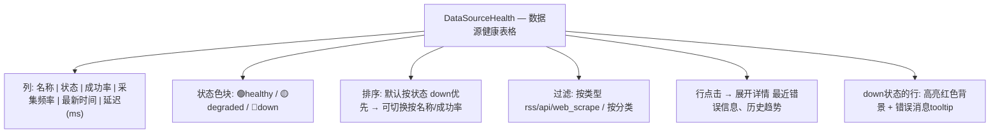
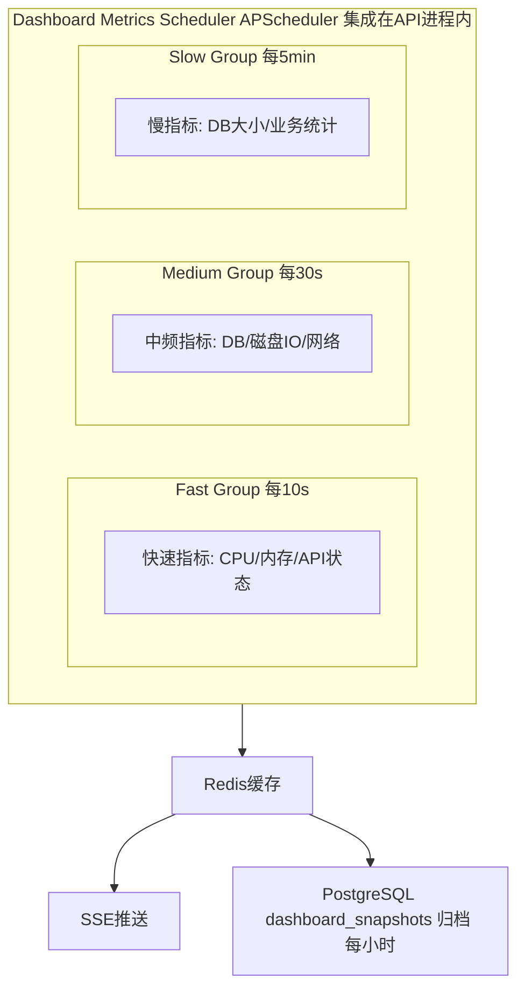
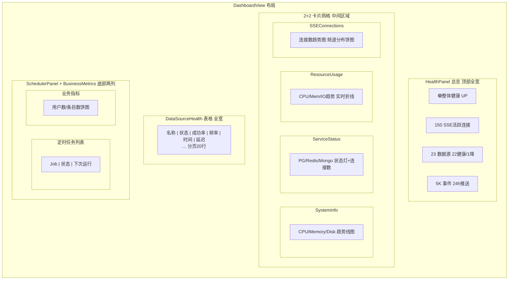

# InstantBoard Dashboard 模块详细设计

## 目录

1. 目标
2. 方案概述
3. 详细设计
   - 3.1 系统状态指标
   - 3.2 数据采集状态指标
   - 3.3 数据库状态指标
   - 3.4 资源消耗指标
   - 3.5 业务指标
   - 3.6 指标采集方式
   - 3.7 实时更新策略
   - 3.8 图表可视化设计
   - 3.9 资源消耗最小化策略
4. 关键决策
5. 边界情况
6. 与其他模块的依赖

## 1. 目标

定义 InstantBoard Dashboard 监控 Tab 的完整功能设计，包括系统/数据采集/数据库/资源/业务五类指标的定义、采集方式、实时更新策略和可视化方案，要求"尽可能详细又少占资源"。

## 2. 方案概述

提供 **轻量级运维仪表盘**，通过分层指标展示 (总览→分组→详情) 实现信息密度高但资源消耗低，核心策略: PostgreSQL/Redis内部指标复用 + psutil轻量采集 + SSE增量推送 + 按需深度查询。

## 3. 详细设计

### 3.1 系统状态指标

#### 3.1.1 API 服务健康状态

| 指标 | 采集方式 | 更新频率 | 展示 |
|------|---------|---------|------|
| API 服务状态 (UP/DOWN) | FastAPI lifespan 心跳 + `/api/v1/health` 自检 | 10s | 🟢UP / 🔴DOWN 状态灯 |
| SSE 连接数 (活跃/总计) | SSEEventRouter 实时计数 | 10s | 数字: "150活跃 / 200峰值" |
| 请求速率 (QPS) | Redis rate counter 汇总 | 30s | 数字 + 最近1h趋势线 |
| 平均响应时间 (ms) | FastAPI middleware 计时 | 30s | 数字 + 最近1h趋势线 |
| 错误率 (4xx/5xx) | FastAPI middleware 错误计数 | 30s | 百分比 + 最近1h趋势线 |

**采集实现**:

```python
# services/dashboard_service.py

class SystemMetricsCollector:
    """
    轻量级系统指标采集器
    
    策略: 不引入独立监控系统 (Prometheus/Grafana太重)
    使用 FastAPI middleware + Redis + psutil 完成采集
    """
    
    async def collect_api_metrics(self) -> dict:
        # 1. API健康: 直接访问 /api/v1/health 内部函数 (无HTTP开销)
        # 2. SSE连接数: SSEEventRouter.connections_count (内存计数器)
        # 3. QPS: Redis INCR rate:{tid}:api:{minute_key} → 1min窗口计数
        # 4. 响应时间: FastAPI RequestTimeMiddleware 记录到Redis Sorted Set
        # 5. 错误率: FastAPI ErrorCountMiddleware 记录到Redis Hash
        
        return {
            "api_status": "UP",
            "sse_active": SSEEventRouter.active_count,
            "sse_total": SSEEventRouter.total_count,
            "qps_1min": await redis.get(f"rate:{tid}:api:current_minute"),
            "avg_response_ms": await redis.zavg(f"response_times:{tid}:1h"),
            "error_rate_4xx": await redis.hget(f"errors:{tid}:1h", "4xx"),
            "error_rate_5xx": await redis.hget(f"errors:{tid}:1h", "5xx"),
        }
```

### 3.2 数据采集状态指标

#### 3.2.1 各数据源健康状态

| 指标 | 来源 | 更新频率 | 展示 |
|------|------|---------|------|
| 数据源健康 (healthy/degraded/down) | source_health 表 (见[database.md](database.md)) | 5min缓存 + 实时变更推送 | 色块表格: 🟢/🟡/🔴 |
| 采集成功率 (24h) | source_health.success_count_24h / total_fetches_24h | 每次采集后更新 | 百分比 |
| 采集频率 (实际 vs 预期) | source_health.total_fetches_24h vs sources.refresh_interval | 5min | 如 "48次/24h (预期48)" |
| 最新采集时间 | source_health.last_success_at | 每次采集后更新 | 相对时间: "5分钟前" |
| 数据源延迟 (ms) | source_health.avg_response_time_ms | 每次采集后更新 | 数字 |

**DataSourceHealth UI组件**:



### 3.3 数据库状态指标

| 指标 | 采集方式 | 更新频率 | 展示 |
|------|---------|---------|------|
| PostgreSQL 连接池状态 | SQLAlchemy pool检查 (pool.status()) | 30s | 数字: "12/20活跃连接" |
| PostgreSQL 数据库大小 | `pg_database_size()` 查询 | 5min | "500MB" |
| PostgreSQL 活跃查询数 | `pg_stat_activity` 查询 | 30s | 数字 |
| Redis 内存使用 | `INFO memory` 命令 | 30s | "128MB / 512MB (25%)" |
| Redis 连接客户端数 | `INFO clients` 命令 | 30s | 数字 |
| Redis Key总数 | `DBSIZE` 命令 | 5min | 数字 |
| MongoDB 状态 (如启用) | `db.serverStatus()` | 30s | 状态灯 + 存储大小 |

**采集实现**:

```python
# services/dashboard_service.py

class DatabaseMetricsCollector:
    async def collect_postgres_metrics(self) -> dict:
        # 1. 连接池: SQLAlchemy async session pool.status()
        #    → {pool_size, checked_in, checked_out, overflow}
        # 2. DB大小: SELECT pg_database_size(current_database())
        # 3. 活跃查询: SELECT count(*) FROM pg_stat_activity WHERE state='active'
        # 4. 所有查询使用已有连接池，无额外连接开销
    
    async def collect_redis_metrics(self) -> dict:
        # 1. INFO memory → used_memory_human, maxmemory_human
        # 2. INFO clients → connected_clients
        # 3. DBSIZE → key总数
        # 4. 单次 INFO 命令获取所有信息
    
    async def collect_mongodb_metrics(self) -> dict:
        # 仅在 MongoDB 启用时采集
        # db.serverStatus() → connections, storageSize, opcounters
```

### 3.4 资源消耗指标

| 指标 | 采集方式 | 更新频率 | 展示 |
|------|---------|---------|------|
| CPU 使用率 (%) | psutil.cpu_percent(interval=0.5) | 10s | 数字 + 1h趋势线 |
| 内存使用率 (%) | psutil.virtual_memory().percent | 10s | 数字 + 1h趋势线 |
| 内存使用/总量 (MB) | psutil.virtual_memory().used/total | 10s | "2048/8192 MB" |
| 磁盘 I/O (read/write MB/s) | psutil.disk_io_counters() | 30s | 数字 |
| 磁盘使用/总量 (GB) | psutil.disk_usage('/') | 5min | "45/100 GB (45%)" |
| 网络流量 (in/out KB/s) | psutil.net_io_counters() | 30s | 数字 |

**psutil 采集策略**:
- `cpu_percent(interval=0.5)`: 0.5s采样间隔，非阻塞 (asyncio.to_thread)
- `virtual_memory()`: 无开销，直接读取/proc/meminfo
- `disk_io_counters()`: 无开销，直接读取/proc/diskstats
- `net_io_counters()`: 无开销，直接读取/proc/net/dev
- 总采集成本: < 1ms/次 (Linux /proc 文件系统读取)

### 3.5 业务指标

| 指标 | 采集方式 | 更新频率 | 展示 |
|------|---------|---------|------|
| 活跃用户数 | sse_connections 表 WHERE disconnected_at IS NULL | 30s | 数字 |
| 今日新增数据条目数 | items 表 COUNT WHERE created_at >= today | 5min | 数字 + 各分类饼图 |
| 各分类数据量分布 | items 表 GROUP BY category_id COUNT | 5min | 饼图/柱状图 |
| 自选列表总条目数 | watchlist_items 表 COUNT | 5min | 数字 (总览) |
| SSE推送事件数 (1h) | Redis counter `events:{tid}:1h` | 1min | 数字 |

### 3.6 指标采集方式汇总

#### 3.6.1 采集架构



#### 3.6.2 FastAPI Middleware 采集

```python
# auth/middleware.py — RequestMetricsMiddleware

class RequestMetricsMiddleware:
    """
    轻量级请求指标中间件
    在每个请求处理前后记录:
    - 请求开始时间 → Redis Sorted Set (key: response_times:{tid}:{minute})
    - 请求状态码 → Redis Hash (key: errors:{tid}:{hour})
    - 不阻塞请求处理，异步写入Redis
    """
    
    async def dispatch(request, call_next):
        start = time.monotonic()
        response = await call_next(request)
        duration_ms = (time.monotonic() - start) * 1000
        
        # 异步记录 (不阻塞响应)
        asyncio.create_task(record_metrics(
            tenant_id=request.state.tenant_id,
            duration_ms=duration_ms,
            status_code=response.status_code,
            endpoint=request.url.path,
        ))
        
        return response
```

### 3.7 实时更新策略

#### 3.7.1 SSE 推送策略

| 指标组 | SSE事件类型 | 推送频率 | 推送条件 |
|--------|-----------|---------|---------|
| 快速指标 | `system_metric_update` | 10s | 值变化超过阈值时推送 (CPU>5%变化) |
| 中频指标 | `db_metric_update` | 30s | 每次采集后推送 |
| 慢指标 | `business_metric_update` | 5min | 每次采集后推送 |
| 数据源健康 | `source_health_update` | 实时 | 状态变更时立即推送 |
| 心跳 | `heartbeat` | 30s | 固定 |

**增量推送优化**:
- 不每次推送全部指标，只推送变化的指标
- 前端首次连接时通过 REST API 获取完整基线数据，后续仅接收 SSE 增量更新
- 增量数据格式: `{metric_name: new_value}` (仅包含变化的字段)

### 3.8 图表可视化设计

#### 3.8.1 图表选型

使用 **Chart.js** (轻量 ~60KB gzip)，不使用 D3/Plotly 等重型库。

| 图表类型 | 用途 | Chart.js 类型 | 数据点 |
|---------|------|-------------|--------|
| 实时趋势线 | CPU/内存/QPS/响应时间 | Line (streaming) | 最近1h, 6min间隔 = 10点 |
| 状态仪表盘 | 整体健康状态 | 自定义SVG指示灯 | 1个状态 |
| 饼图 | 分类数据量分布 | Doughnut | 最多8扇 |
| 柱状图 | 数据源成功率对比 | Bar | 最多25根 |
| 数据表格 | 数据源健康详情 | HTML table (无Chart.js) | 分页20行 |

#### 3.8.2 Dashboard 布局设计


```

#### 3.8.3 图表渲染优化

```javascript
// composables/useDashboard.ts

// 策略: 图表数据复用, 不每次重建
// - Chart.js instance 缓存在组件 ref 中
// - SSE增量更新 → chart.data.datasets[0].data.push(newPoint) + chart.update('none')
// - 'none' 模式: 不动画, 立即更新 (性能最优)
// - 数据窗口: 保留最近60个点 (1h × 1min), 旧点自动移除
// - 非活跃Dashboard tab: 暂停图表渲染, 仅更新Pinia store数据
```

### 3.9 资源消耗最小化策略

#### 3.9.1 采集资源优化

| 策略 | 实现 | 节省 |
|------|------|------|
| **psutil非阻塞** | `asyncio.to_thread(psutil.cpu_percent, 0.5)` | 不阻塞主线程 |
| **复用已有连接** | DB指标用现有SQLAlchemy连接池，不新建连接 | 避免连接开销 |
| **Redis INFO单次** | 一次INFO命令获取所有Redis指标 | 减少Redis交互 |
| **增量推送** | SSE仅推送变化字段，不全量推送 | 减少网络带宽50%+ |
| **非活跃暂停** | Dashboard tab不可见时暂停图表渲染 | 减少前端CPU/GPU |
| **归档降频** | dashboard_snapshots每小时归档，非每秒 | 减少PG写入 |
| **采样而非全量** | 响应时间记录采样1/10请求 (高QPS时) | 减少Redis写入 |

#### 3.9.2 前端资源优化

| 策略 | 实现 | 节省 |
|------|------|------|
| **Chart.js懒加载** | Dashboard tab激活时才import Chart.js | 首屏不加载60KB |
| **虚拟滚动** | DataSourceHealth表格使用虚拟滚动 (行>50) | 减少DOM节点 |
| **数据点限制** | 趋势线最多60点 (1h)，不存储更长 | 减少内存 |
| **暂停不可见** | `document.hidden` → 暂停SSE处理和图表更新 | 减少后台CPU |
| **图表共享Canvas** | 同类型图表复用Chart.js配置 | 减少初始化 |

#### 3.9.3 存储优化

- dashboard_snapshots 仅每小时归档1行 → 每天仅24行
- 趋势线数据不存PG，仅Redis缓存最近1h → 自动过期
- 超过30天的 dashboard_snapshots 自动清理 (cron job)

## 4. 关键决策

| 决策 | 选择 | 理由 |
|------|------|------|
| 监控方案 | 自建轻量 (psutil+middleware+Redis) | 不引入Prometheus/Grafana，资源消耗极低 |
| 指标采集库 | psutil | Linux /proc读取，无额外进程，<1ms/次 |
| 图表库 | Chart.js | ~60KB gzip，满足需求，比D3轻20倍 |
| 推送策略 | 增量推送+基线REST | 避免全量重复推送，带宽节省50%+ |
| 归档频率 | 每小时1次 | 每天24行，存储成本极低 |
| 前端优化 | 懒加载+暂停不可见 | Dashboard非高频访问，按需加载 |
| 采样率 | 1/10请求记录响应时间 | 高QPS下避免Redis写入瓶颈 |

## 5. 边界情况

- **psutil不可用** (Windows开发): 降级为不显示CPU/内存指标，仅显示API/DB指标
- **Redis内存>80%**: Dashboard显示警告，自动触发Redis LRU淘汰 + 高频采集降频
- **数据库连接池耗尽**: Dashboard显示红色警告，建议检查慢查询
- **SSE连接数>1000**: Dashboard显示警告，建议检查是否有异常连接
- **数据源大面积down**: Dashboard总览变红色，DataSourceHealth表格按down优先排序
- **Dashboard自身影响性能**: 采集频率可动态调整 — 当系统负载高时自动降频(10s→30s)
- **MongoDB未启用**: MongoDB状态卡片显示"未启用"灰色标识，不报错
- **历史数据缺失**: 新部署时无dashboard_snapshots → 趋势线显示"暂无历史数据"

## 6. 与其他模块的依赖

- → [api.md](api.md): Dashboard API端点 (`/api/v1/dashboard/*`)、SSE事件定义
- → [database.md](database.md): source_health表、dashboard_snapshots表、sse_connections表
- → [frontend.md](frontend.md): DashboardView组件层级、布局设计
- → [data-flow.md](data-flow.md): SSE推送机制、Redis Pub/Sub分发
- → [architecture.md](architecture.md): dashboard模块职责划分
- → [data-sources.md](data-sources.md): 数据源健康状态定义、failover设计