# InstantBoard 数据流与SSE推送设计

## 目录

1. 目标
2. 方案概述
3. 详细设计
   - 3.1 数据采集流程
   - 3.2 SSE 实时推送数据流设计
   - 3.3 数据处理管道设计
   - 3.4 异步任务队列设计
   - 3.5 Redis Pub/Sub 消息分发设计
   - 3.6 数据缓存与过期策略
   - 3.7 错误处理与重试机制
   - 3.8 数据流时序图
4. 关键决策
5. 边界情况
6. 与其他模块的依赖

## 1. 目标

定义 InstantBoard 从外部数据源采集到前端实时展示的完整数据流设计，包括采集流程、处理管道、SSE推送机制、异步任务调度、消息分发、缓存策略和错误处理，确保数据流畅、实时、可靠。

## 2. 方案概述

采用 **分层异步管道 + SSE单向推送 + Redis Pub/Sub分发** 架构，数据从外部源采集后经过去重/过滤/分类处理，存入数据库和缓存，通过Redis Pub/Sub触发SSE推送，前端通过EventSource实时消费。

## 3. 详细设计

### 3.1 数据采集流程

#### 3.1.1 完整采集流程图

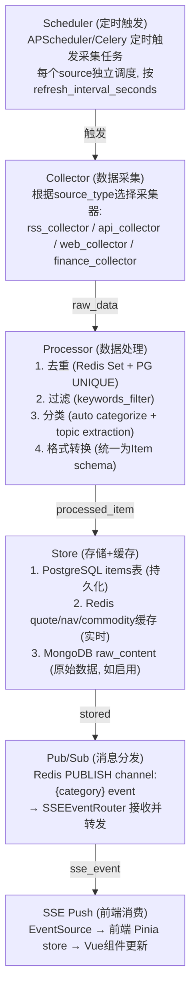

#### 3.1.2 各采集器类型实现

```python
# collectors/base.py

class BaseCollector:
    """采集器抽象基类"""
    
    async def collect(self, source: Source) -> list[RawItem]:
        """采集数据，返回原始条目列表"""
        raise NotImplementedError
    
    async def update_health(self, source_id: UUID, success: bool, 
                           response_time_ms: int, error: str = None):
        """更新数据源健康状态 (每次采集后调用)"""
        # 写入 source_health 表 + Redis缓存
        # 连续失败3次 → status='degraded'
        # 连续失败10次 → status='down'
        # 成功1次 → 从degraded恢复为healthy

# collectors/rss_collector.py
class RSSCollector(BaseCollector):
    """RSS源采集器 — feedparser解析"""
    async def collect(self, source):
        # 1. httpx.AsyncClient GET source.url
        # 2. feedparser.parse(response.text)
        # 3. 提取: title, summary, link, published, author
        # 4. 返回 RawItem列表

# collectors/api_collector.py
class APICollector(BaseCollector):
    """API源采集器 — JSON解析"""
    async def collect(self, source):
        # 1. httpx.AsyncClient GET source.url (带config中的headers/params)
        # 2. JSON解析 (config.parse_rules指定字段映射)
        # 3. 返回 RawItem列表

# collectors/web_collector.py  
class WebCollector(BaseCollector):
    """网页抓取采集器 — BeautifulSoup解析"""
    async def collect(self, source):
        # 1. httpx.AsyncClient GET source.url
        # 2. BeautifulSoup(html, 'lxml')
        # 3. 按config.parse_rules提取目标区域
        # 4. 返回 RawItem列表

# collectors/finance_collector.py
class FinanceCollector(BaseCollector):
    """财经数据采集器 — yfinance/Alpha Vantage"""
    async def collect(self, source):
        # 特殊: 不产生items, 而产生quotes/indices/commodities
        # 1. yfinance.Ticker(symbol).info / .history
        # 2. 存入 finance_quotes 表 + Redis缓存
        # 3. SSE推送 quote_update / market_index_update / commodity_update
```

### 3.2 SSE 实时推送数据流详细设计

#### 3.2.1 SSE vs WebSocket 选型分析

| 维度 | SSE (Server-Sent Events) | WebSocket |
|------|--------------------------|-----------|
| **方向性** | 单向 (服务端→客户端) ✅ InstantBoard仅需推送 | 双向 (服务端↔客户端) |
| **协议** | HTTP/1.1+ (HTTP/2多路复用) | 独立ws://协议 |
| **自动重连** | ✅ 浏览器原生EventSource自动重连 | ❌ 需手动实现重连逻辑 |
| **浏览器支持** | ✅ 所有现代浏览器 (除IE) | ✅ 所有现代浏览器 |
| **实现复杂度** | 🟢 低 (FastAPI StreamingResponse) | 🔴 高 (需维护连接状态、心跳、重连) |
| **防火墙/代理** | ✅ 标准HTTP, 代理友好 | ❌ ws://可能被代理/防火墙阻断 |
| **连接数限制** | HTTP/2下多路复用, 单连接多流 | 每频道独立连接 |
| **认证** | query param token (EventSource不支持自定义header) | 可在握手时发送header |
| **资源消耗** | 🟢 低 (单向, 无需维护双向缓冲) | 🔴 中 (双向缓冲+心跳) |
| **数据格式** | 文本 (event + data字段) | 文本/二进制 |

**最终推荐: SSE** ✅

理由:
1. InstantBoard核心需求是服务端→客户端推送 (行情更新、新闻推送)，无需双向通信
2. SSE原生自动重连，断线恢复无需前端额外逻辑
3. HTTP/2下SSE可多路复用 (单TCP连接多SSE流)，比WebSocket多连接更高效
4. 实现简单 — FastAPI `StreamingResponse` 即可，无需WebSocket库
5. 代理/防火墙友好 — 纯HTTP协议

#### 3.2.2 SSE 推送数据流架构

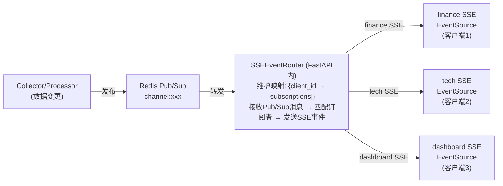

#### 3.2.3 SSE EventRouter 实现

```python
# sse/event_router.py

class SSEEventRouter:
    """
    SSE事件路由器
    
    职责:
    1. 管理所有SSE连接 (client_id → subscriptions映射)
    2. 监听Redis Pub/Sub频道
    3. 收到消息后匹配订阅者并转发
    4. 连接断开时清理映射
    """
    
    # 连接映射: {client_id: SSEConnection}
    connections: dict[str, SSEConnection] = {}
    
    # 订阅映射: {channel: set[client_id]}
    subscriptions: dict[str, set[str]] = {}
    
    async def add_connection(self, client_id: str, channels: list[str]):
        """新SSE连接加入"""
        self.connections[client_id] = SSEConnection(client_id, channels)
        for channel in channels:
            self.subscriptions.setdefault(channel, set()).add(client_id)
    
    async def remove_connection(self, client_id: str):
        """SSE连接断开 — 清理映射"""
        conn = self.connections.pop(client_id, None)
        if conn:
            for channel in conn.channels:
                self.subscriptions[channel].discard(client_id)
    
    async def on_pub_sub_message(self, channel: str, event_data: dict):
        """Redis Pub/Sub消息到达 — 转发给订阅者"""
        subscribers = self.subscriptions.get(channel, set())
        for client_id in subscribers:
            conn = self.connections.get(client_id)
            if conn and conn.is_active:
                await conn.send_event(event_data)
    
    async def start_redis_listener(self):
        """启动Redis Pub/Sub监听 (后台任务)"""
        redis_client = get_redis()
        pubsub = redis_client.pubsub()
        await pubsub.subscribe("channel:finance", "channel:tech", "channel:dashboard")
        
        async for message in pubsub.listen():
            if message["type"] == "message":
                channel = message["channel"]
                data = json.loads(message["data"])
                await self.on_pub_sub_message(channel, data)
```

#### 3.2.4 SSE 端点实现

```python
# api/v1/stream.py

@router.get("/stream/{category}")
async def sse_stream(category: str, token: str = Query(...)):
    """
    SSE推送端点
    
    流程:
    1. 验证JWT token (query param)
    2. 注册SSE连接到EventRouter
    3. 返回StreamingResponse (事件流)
    4. 心跳每30s
    5. 连接断开时清理
    """
    # JWT验证
    user = verify_jwt(token)
    
    # 注册连接
    client_id = f"{user.id}:{category}"
    await event_router.add_connection(client_id, [category])
    
    async def event_generator():
        try:
            while True:
                # 等待事件 (从EventRouter队列)
                event = await event_router.wait_for_event(client_id, timeout=30)
                if event:
                    yield f"event: {event.type}\ndata: {json.dumps(event.data)}\n\n"
                else:
                    # 心跳
                    yield f"event: heartbeat\ndata: {json.dumps({'timestamp': now()})}\n\n"
        finally:
            await event_router.remove_connection(client_id)
    
    return StreamingResponse(event_generator(), media_type="text/event-stream")
```

### 3.3 数据处理管道设计

#### 3.3.1 处理管道流程

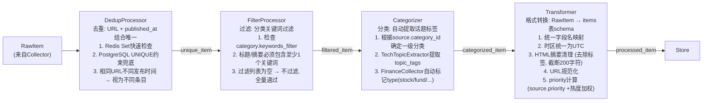

#### 3.3.2 处理器链实现

```python
# processors/processor_chain.py

class ProcessorChain:
    """
    处理器链 — 依次执行各处理器
    
    支持: 跳过已处理条目 (is_processed标记)
    支持: 处理失败时记录错误但不中断链
    """
    
    processors = [
        DedupProcessor(),
        FilterProcessor(),
        Categorizer(),
        Transformer(),
    ]
    
    async def process(self, raw_items: list[RawItem], source: Source) -> list[Item]:
        processed = []
        for raw_item in raw_items:
            try:
                item = raw_item
                for processor in self.processors:
                    result = await processor.process(item, source)
                    if result is None:  # 被过滤/去重
                        break
                    item = result
                if item is not None:
                    processed.append(item)
            except Exception as e:
                logger.warning(f"Processing failed for {raw_item.url}: {e}")
                # 不中断链，继续处理下一个
        return processed
```

### 3.4 异步任务队列设计

#### 3.4.1 APScheduler (开发) → Celery (生产) 渐进式方案

| 维度 | APScheduler (开发) | Celery (生产) |
|------|-------------------|---------------|
| 运行位置 | 集成在API进程内 | 独立Worker容器 |
| 任务定义 | Python函数装饰器 | Celery task装饰器 |
| 调度方式 | interval/cron触发 | Celery Beat调度 |
| 重试 | 简单(max_retries) | 完善(自动重试+exponential backoff) |
| 监控 | API日志 | Flower Web面板 |
| 扩展性 | 单进程 | 多Worker水平扩展 |
| 依赖 | 无额外服务 | 需Redis作为broker |

#### 3.4.2 任务定义

```python
# scheduler/jobs.py

# ===== APScheduler (开发环境) =====

from apscheduler.schedulers.asyncio import AsyncIOScheduler

scheduler = AsyncIOScheduler()

# 采集任务: 每个source独立调度
async def schedule_source_collection(source: Source):
    scheduler.add_job(
        collect_and_process,
        trigger="interval",
        seconds=source.refresh_interval_seconds,
        id=f"collect_{source.id}",
        kwargs={"source_id": source.id},
        max_instances=1,  # 防止重叠执行
        misfire_grace_time=60,
    )

# ===== Celery (生产环境) =====

from celery import Celery

app = Celery("instantboard", broker=REDIS_URL)

@app.task(bind=True, max_retries=3, soft_time_limit=30)
def collect_and_process(self, source_id: str):
    """Celery任务: 采集+处理+推送"""
    try:
        # 同collect_and_process逻辑
    except Exception as exc:
        self.retry(exc=exc, countdown=60 * self.request.retries)  # exponential backoff

# Celery Beat调度: 动态注册
@app.on_after_configure.connect
def setup_periodic_tasks(sender, **kwargs):
    # 从数据库读取所有active sources
    # 为每个source注册periodic task
```

#### 3.4.3 任务编排策略

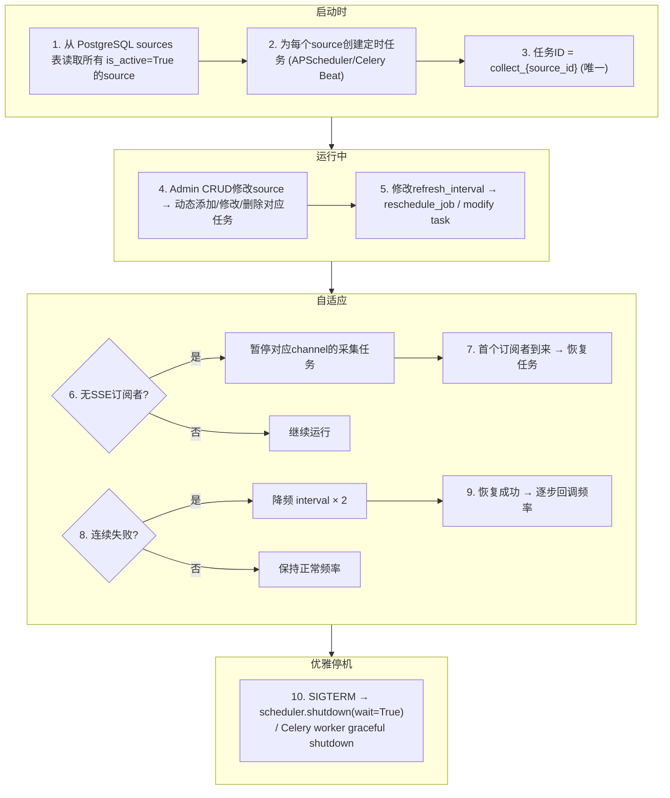

### 3.5 Redis Pub/Sub 消息分发设计

#### 3.5.1 Pub/Sub 频道定义

| 频道名称 | 发布者 | 订阅者 | 消息内容 |
|---------|--------|--------|---------|
| `channel:finance` | FinanceCollector/Processor | SSEEventRouter (finance订阅者) | quote_update / market_index_update / commodity_update / nav_estimate_update / alert_update |
| `channel:tech` | TechCollectors/Processor | SSEEventRouter (tech订阅者) | item_update / topic_stats_update |
| `channel:dashboard` | DashboardMetricsCollector | SSEEventRouter (dashboard订阅者) | system_metric_update / db_metric_update / business_metric_update / source_health_update |
| `channel:admin` | Source CRUD API | Scheduler (动态任务调度) | source_created / source_updated / source_deleted |
| `channel:all` | 任意发布者 | SSEEventRouter (all订阅者) | 聚合所有频道消息 |

#### 3.5.2 消息格式

```json
// Pub/Sub消息统一格式
{
  "event_type": "quote_update",       // SSE事件类型
  "channel": "finance",               // 目标频道
  "data": {                           // SSE data字段内容
    "symbol": "AAPL",
    "current_price": 178.52,
    "change_percent": 1.32,
    "timestamp": "2026-06-23T10:00:00Z"
  },
  "tenant_id": "uuid",                // 租户隔离
  "published_at": "2026-06-23T10:00:00Z"  // 发布时间
}
```

#### 3.5.3 SSE连接与Pub/Sub映射

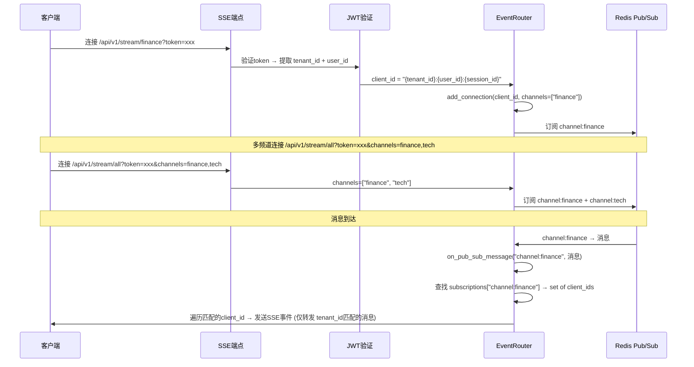

#### 3.5.4 source_health_update 事件契约 (数据源健康表格增量刷新)

本契约是前后端共同遵守的单一事实来源；发布侧/消费侧代码注释均引用本节。

**事件元信息**:

| 项 | 值 |
|----|----|
| 事件名 (event_type) | `source_health_update` (`SSEEventType.SOURCE_HEALTH_UPDATE`) |
| 频道 (channel) | `dashboard` (Redis key `channel:dashboard`) |
| 发布方 | 采集调度器: `app/scheduler/manager.py::_update_health_after_collection` → `app/services/sse.py::publish_source_health_update` |
| 推送条件 | `source_health.status` 发生变化时 (healthy ↔ degraded ↔ down) |
| 消费方 | 前端 `stores/dashboard.ts::updateSourceHealthFromSSE` → Dashboard "数据源健康"表格 (`DataSourcesHealth.vue`) |

**Payload 字段** (`data` 部分，由 `app/services/sse.py::build_source_health_update_payload` 从 `source_health` 记录 + 所属 `sources` 行构造，包含前端表格渲染所需的完整行状态):

| 字段 | 类型 | 语义 |
|------|------|------|
| `source_id` | str(UUID) | **行匹配键**: 前端按 `sources[].id === source_id` 定位表格行 |
| `name` | str | 数据源名称 (上下文信息，前端不用其覆盖行) |
| `source_type` | str | rss / api / web_scrape / social |
| `status` | str | 新状态: healthy / degraded / down |
| `previous_status` | str | 变更前状态 |
| `last_error` | str \| null | 最近错误信息 (source_health.last_error_message) |
| `last_success_at` | ISO8601 \| null | 最近成功采集时间 |
| `last_failure_at` | ISO8601 \| null | 最近失败采集时间 |
| `avg_response_time_ms` | int | 24h 平均响应时间 |
| `consecutive_failures` | int | 连续失败次数 |
| `success_count_24h` | int | 24h 成功次数 |
| `total_fetches_24h` | int | 24h 采集总次数 |
| `success_rate_24h` | float \| null | success_count_24h / total_fetches_24h；无采集时为 null |
| `timestamp` | ISO8601 | 事件发布时间 (UTC) |

**租户路由语义** (见 §3.5.2 / §3.5.3):

- 消息外层携带 `tenant_id = str(source.tenant_id)` (不在 `data` 内)，由发布侧按源所属租户设置；默认值为 `str(SYSTEM_TENANT_ID)`。
- `SSEEventRouter._on_redis_message` 按**字符串精确匹配**转发：仅 `conn.tenant_id == tenant_id` 的连接能收到。
- 种子/系统级数据源归属 system 租户 (`SYSTEM_TENANT_ID`，固定 UUID `00000000-0000-0000-0000-000000000000`)；admin 帐号位于 system 租户，其 JWT `tenant_id` claim 即 `str(SYSTEM_TENANT_ID)`，SSE 连接按该值注册 → **admin 会话能收到系统源的健康事件**。
- 其他租户的连接收不到 system 源健康事件（租户隔离，与 REST `/dashboard/data-sources` 的可见性规则一致）。
- 禁止使用字面量字符串（如 `"system"`、`"default"`）作为租户发布或连接注册的 fallback：它们与任何租户 UUID 字符串永不相等，事件将无法送达任何连接；发布侧/连接侧的 falsy fallback 一律使用 `str(SYSTEM_TENANT_ID)`。

**前端消费规则**:

- 按 `source_id` 匹配行；找不到则忽略（不新增行）。
- 合并更新 `status` / `last_success_at` / `last_failure_at` / `avg_response_time_ms` / `consecutive_failures` / `total_fetches_24h` / `success_rate_24h` / `last_error` 等可变字段；**不覆盖** `id` / `name` / `source_type` 身份列。
- 事件中时间字段为 `null` 视为"无变化"，保留行内原值。
- 每次更新后重算 `healthy` / `degraded` / `down` 汇总计数。

> 缺陷修复记录：旧发布侧 payload 仅含 `{source_id, status, last_error, timestamp}`，前端却按 `data.id` 匹配并整行替换，导致表格行永远无法增量刷新；现已统一为本契约。`services/source.py` 中曾存在的绕过 `event_router` 的直接 `redis_publish` 旁路（无 `tenant_id`、事件键为 `event` 而非 `event_type`，会被误投为 item_update 且破坏租户隔离）已随无调用方的 `update_source_health` 一并删除。

### 3.6 数据缓存与过期策略

#### 3.6.1 缓存层级

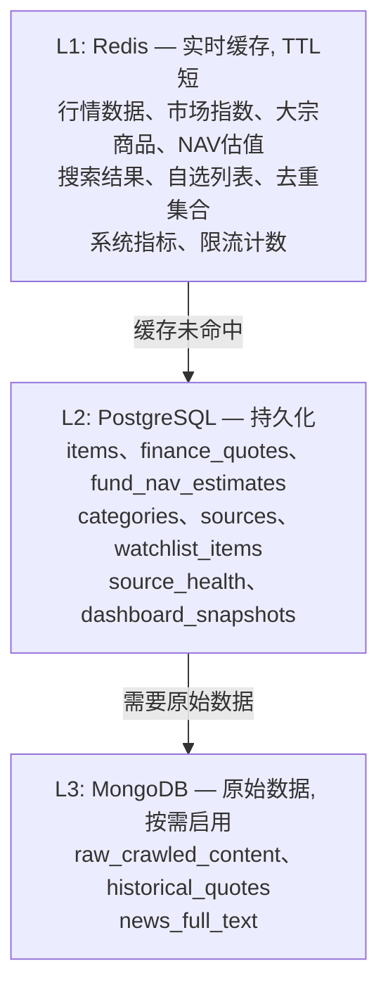

#### 3.6.2 Redis缓存过期策略

| Key模式 | TTL | 过期策略 | 说明 |
|---------|-----|---------|------|
| `t:{tid}:quote:{symbol}` | 30s-5min | 主动更新+被动过期 | 交易时段30s，休市5min |
| `t:{tid}:market_indices` | 60s | 主动更新覆盖 | 每次采集直接SET覆盖 |
| `t:{tid}:commodities` | 60s | 主动更新覆盖 | 同market_indices |
| `t:{tid}:nav:{symbol}` | 120s | 主动更新覆盖 | 估值数据 |
| `t:{tid}:dedup:{source_id}` | 24h | 被动过期 | 去重URL集合，24h后自动清理 |
| `t:{tid}:search:{hash}` | 5min | 被动过期 | 搜索结果缓存 |
| `t:{tid}:watchlist:{uid}` | 10min | 主动更新 | 自选列表变更时SET覆盖 |
| `dashboard:system_metrics` | 10s | 主动更新覆盖 | 系统指标 |
| `source_health:{sid}` | 5min | 主动更新覆盖 | 数据源健康 |

**Redis全局策略** (见[database.md](database.md) §3.2):
- `maxmemory-policy: allkeys-lru` — 内存满时LRU淘汰
- `maxmemory: 512mb (开发/生产统一)`
- `appendonly: no` — 默认关闭 AOF, 仅 RDB 快照持久化

### 3.7 错误处理与重试机制

#### 3.7.1 采集错误处理

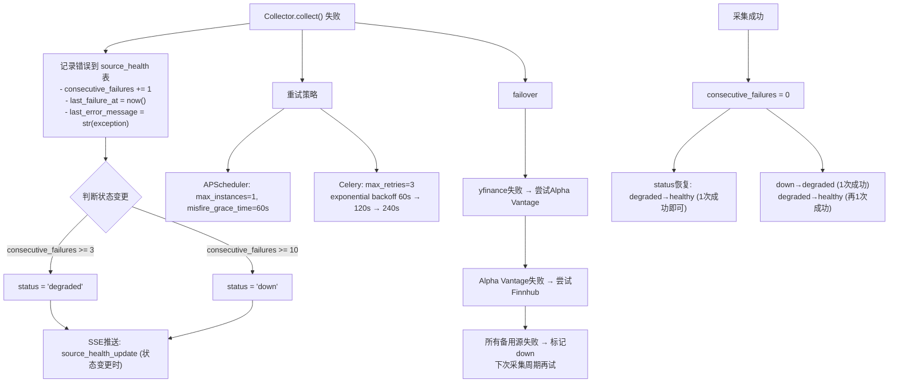

#### 3.7.2 处理错误处理

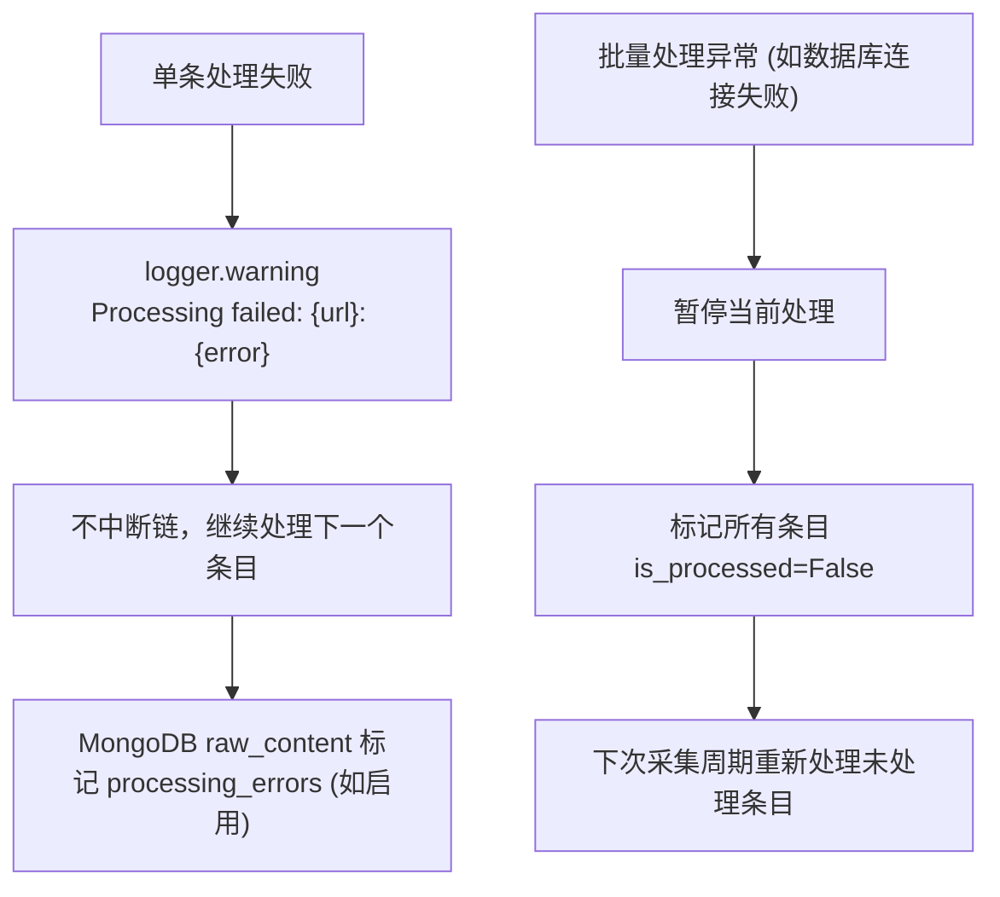

#### 3.7.3 SSE推送错误处理

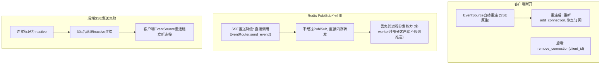

#### 3.7.4 全链路错误恢复

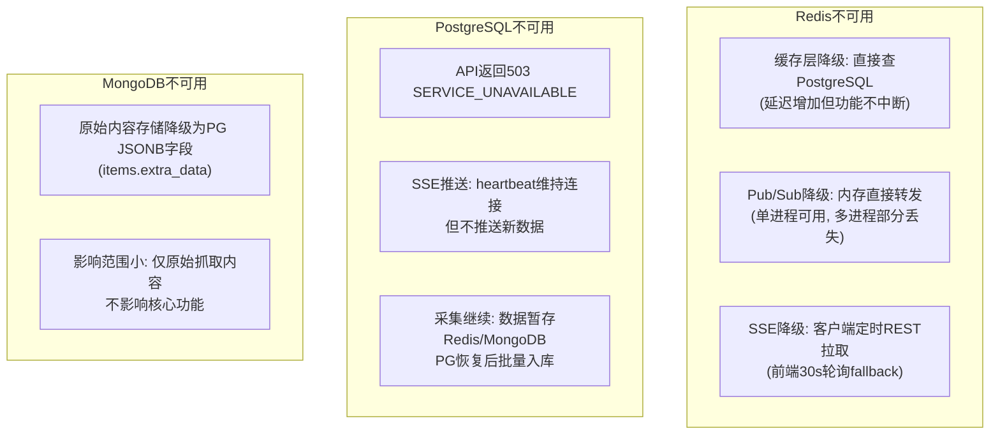

### 3.8 数据流时序图

#### 3.8.1 科技新闻采集-推送时序

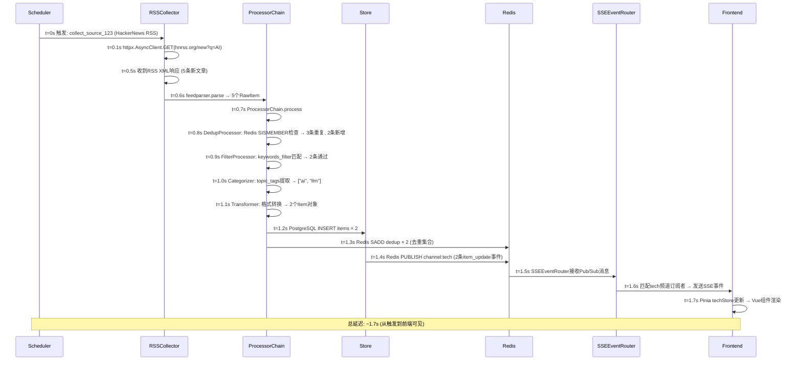

#### 3.8.2 财经行情采集-推送时序

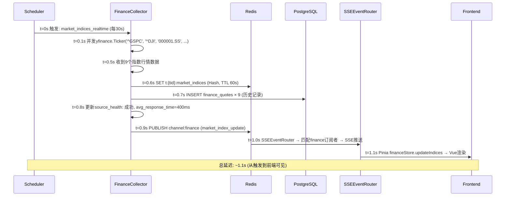

## 4. 关键决策

| 决策 | 选择 | 理由 |
|------|------|------|
| 实时推送 | SSE (非WebSocket) | 单向推送足够、原生重连、HTTP/2多路复用、实现简单 |
| 消息分发 | Redis Pub/Sub | 轻量、支持多进程分发、与缓存共用Redis实例 |
| 异步任务 | APScheduler→Celery渐进 | 开发简单(APScheduler单进程), 生产可靠(Celery独立Worker) |
| 去重策略 | Redis Set快速检查 + PG UNIQUE兜底 | Redis快速避免重复处理，PG持久保证最终一致 |
| 处理管道 | 链式处理器 (可跳过/容错) | 灵活、可扩展、单条失败不中断 |
| 缓存策略 | Redis主动更新+被动过期 | 行情数据主动SET(保证实时), 搜索/去重被动TTL(自动清理) |
| 错误恢复 | 多层failover+降级 | yfinance→Alpha Vantage→Finnhub, Redis不可用→PG直查, SSE不可用→REST轮询 |

## 5. 边界情况

- **采集重叠**: 同一source任务未完成时下一个周期触发 → APScheduler `max_instances=1` 防重叠
- **大量新条目涌入**: 单次采集>50条 → 处理器分批处理(每批20条)，避免内存溢出
- **Redis Pub/Sub消息丢失**: Redis重启时Pub/Sub消息丢失 → SSE降级为内存转发，前端重连后REST补拉
- **Celery Worker崩溃**: 任务丢失 → Celery任务结果持久化到Redis，Beat重新调度
- **去重集合膨胀**: 活跃源24h内URL很多 → Redis Set TTL 24h自动清理，不影响内存
- **SSE连接数>1000**: Nginx `worker_connections`限制 → 单机1000+连接需调整Nginx配置
- **跨进程SSE**: 多worker时Pub/Sub消息需跨进程 → Redis Pub/Sub天然支持多进程
- **数据库写入瓶颈**: 高频行情写入(30s×9指数) → 使用批量INSERT + 异步写入

## 6. 与其他模块的依赖

- → [architecture.md](architecture.md): SSE架构、模块划分、技术栈选型(SSE vs WebSocket决策)
- → [api.md](api.md): SSE端点定义、事件类型、REST API fallback
- → [database.md](database.md): items表去重约束、source_health表、Redis Key模式
- → [data-sources.md](data-sources.md): 各数据源的采集URL、频率、failover链
- → [content-categories.md](content-categories.md): 分类→频道映射、topic_tags提取规则
- → [frontend.md](frontend.md): 前端EventSource消费、Pinia store更新逻辑
- → [security.md](security.md): SSE认证(query param token)、限流(SSE连接限制)