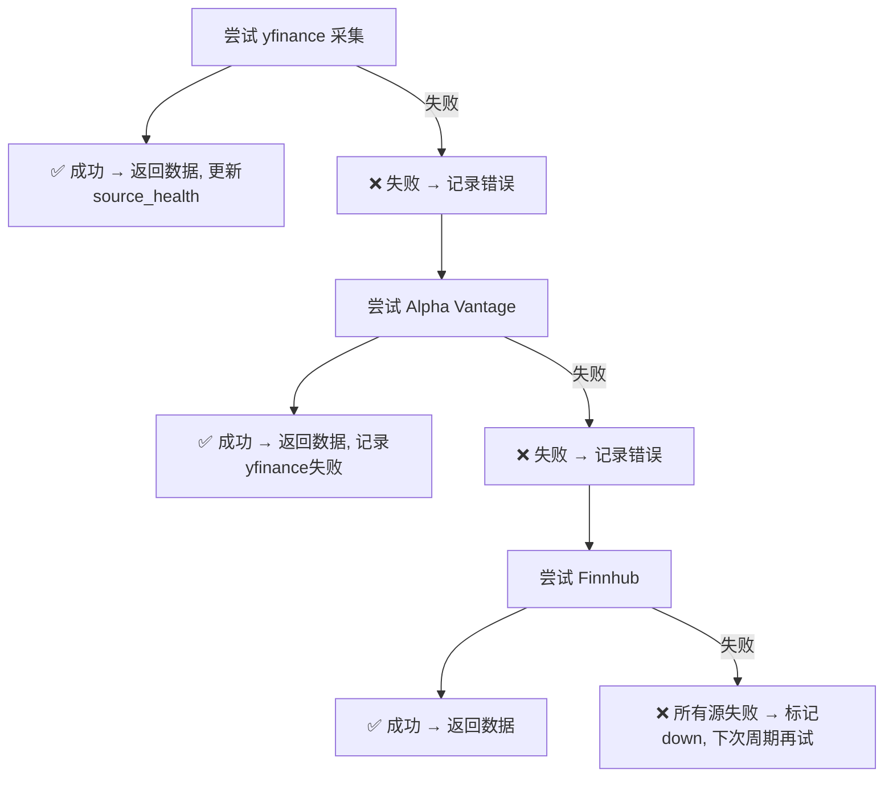
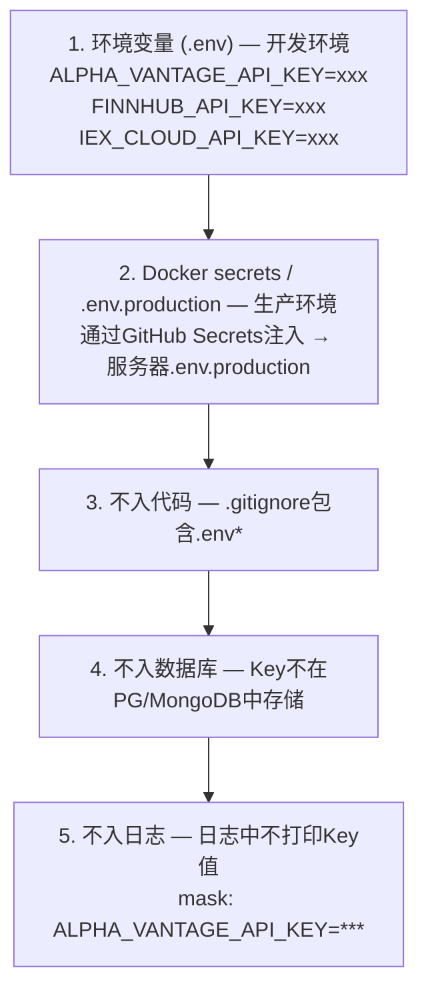

# InstantBoard 数据源配置设计

## 目录

1. 目标
2. 方案概述
3. 详细设计
   - 3.1 所有外部数据源清单表格
   - 3.2 财经数据源详细列表
   - 3.3 科技数据源详细列表
   - 3.4 数据源健康监控设计
   - 3.5 数据源切换/failover设计
   - 3.6 API Key管理策略
4. 关键决策
5. 边界情况
6. 与其他模块的依赖

## 1. 目标

定义 InstantBoard 所有外部数据源的完整清单、配置方式、健康监控、failover策略和API Key管理，确保数据源可靠、可切换、可监控。

## 2. 方案概述

采用 **多数据源优先级链 + 自动failover + source_health监控 + 环境变量API Key管理** 方案，每个数据类型配置主源和备用源，采集失败自动切换，健康状态实时监控和推送。

## 3. 详细设计

### 3.1 所有外部数据源清单表格

| # | 名称 | 类型 | URL | 频率 | 数据格式 | 费用 | 所属模块 |
|---|------|------|-----|------|---------|------|---------|
| 1 | Yahoo Finance (yfinance) | API/库 | yfinance Python包 | 30s-5min | JSON | 免费 | 财经 |
| 2 | Alpha Vantage | REST API | alphavantage.co | 30s-5min | JSON | 免费(限量)/付费 | 财经 |
| 3 | 东方财富 | Web抓取 | eastmoney.com | 15s-5min | HTML→JSON | 免费 | 财经 |
| 4 | Finnhub | REST API | finnhub.io | 30s | JSON | 免费(限量)/付费 | 财经 |
| 5 | IEX Cloud | REST API | iexcloud.io | 30s | JSON | 免费(限量)/付费 | 财经 |
| 6 | 天天基金 | Web抓取 | fund.eastmoney.com | 每日 | HTML→JSON | 免费 | 财经 |
| 7 | MIT Tech Review | RSS | technologyreview.com/feed | 5min | RSS XML | 免费 | 科技-AI |
| 8 | HackerNews | RSS/API | hnrss.org / news.ycombinator.com | 2min | RSS/JSON | 免费 | 科技-全领域 |
| 9 | Arxiv CS.AI | RSS/API | arxiv.org/list/cs.AI/recent | 30min | RSS XML | 免费 | 科技-AI |
| 10 | OpenAI Blog | Web抓取 | openai.com/blog | 30min | HTML→JSON | 免费 | 科技-AI |
| 11 | The Robot Report | RSS | robotreport.com | 5min | RSS XML | 免费 | 科技-机器人 |
| 12 | IEEE Robotics | RSS | ieee.org/publications | 每日 | RSS XML | 免费 | 科技-机器人 |
| 13 | Hackaday | RSS | hackaday.com/blog/feed | 5min | RSS XML | 免费 | 科技-嵌入式 |
| 14 | Embedded.com | RSS | embedded.com/rss | 5min | RSS XML | 免费 | 科技-嵌入式 |
| 15 | RISC-V International | RSS/Web | riscv.org/blog | 30min | RSS/HTML | 免费 | 科技-嵌入式 |
| 16 | SpaceNews | RSS | spacenews.com/feed | 5min | RSS XML | 免费 | 科技-太空 |
| 17 | NASA News | RSS | nasa.gov/rss | 30min | RSS XML | 免费 | 科技-太空 |
| 18 | SpaceX Updates | Web抓取 | spacex.com/updates | 30min | HTML→JSON | 免费 | 科技-太空 |
| 19 | Ars Technica Space | RSS | arstechnica.com/science | 5min | RSS XML | 免费 | 科技-太空 |
| 20 | Reddit | API | reddit.com/r/{sub} | 10min | JSON | 免费(限流) | 科技-全领域 |
| 21 | Google News Tech | RSS | news.google.com/rss/search?q=technology | 5min | RSS XML | 免费 | 科技-通用 |
| 22 | ESA News | RSS | esa.int/RSS | 30min | RSS XML | 免费 | 科技-太空 |

### 3.2 财经数据源详细列表

#### 3.2.1 Yahoo Finance / yfinance

| 属性 | 值 |
|------|-----|
| **类型** | Python库 (非官方Yahoo Finance API封装) |
| **覆盖范围** | 全球股票、指数、ETF、基金、期货、外汇 |
| **URL** | 通过 `yfinance.Ticker(symbol)` Python API调用 |
| **数据格式** | JSON (.info, .history) |
| **费用** | 免费 |
| **API Key** | 无需 |
| **频率限制** | 无官方限制 (非官方API, Yahoo可能随时变更/限流) |
| **数据延迟** | ~1-2分钟 |
| **优点** | 免费、无需Key、覆盖全球、Python直接调用 |
| **缺点** | 非官方API不稳定、可能被Yahoo封禁、无SLA |
| **优先级** | **首选** (Primary) |
| **采集器** | `FinanceCollector` |

**关键配置** (`sources.config` JSONB):
```json
{
  "library": "yfinance",
  "symbols": ["^GSPC", "^DJI", "^IXIC", "000001.SS", "^HSI", "^N225", "^FTSE", "^GDAXI"],
  "history_period": "5d",
  "retry_on_fail": True
}
```

#### 3.2.2 Alpha Vantage

| 属性 | 值 |
|------|-----|
| **类型** | REST API (官方) |
| **覆盖范围** | 美股、外汇、加密货币、技术指标、基本面 |
| **URL** | `https://www.alphavantage.co/query?function=TIME_SERIES_INTRADAY&symbol=AAPL&apikey={KEY}` |
| **数据格式** | JSON |
| **费用** | 免费(5 calls/min) / Premium($49/月, 600 calls/min) |
| **API Key** | 需要 (`ALPHA_VANTAGE_API_KEY`) |
| **频率限制** | 5 calls/min (免费) / 600/min (付费) |
| **数据延迟** | 实时 (付费) / 15min延迟 (免费部分功能) |
| **优点** | 官方API、有SLA、技术指标丰富 |
| **缺点** | 免费Key严格限流(5/min)、付费成本、非全球覆盖 |
| **优先级** | **备用** (Failover #1) |

#### 3.2.3 东方财富

| 属性 | 值 |
|------|-----|
| **类型** | Web抓取 |
| **覆盖范围** | A股、港股、中国基金NAV |
| **URL** | `https://push2.eastmoney.com/api/qt/...` (公开数据接口) |
| **数据格式** | HTML→JSON (公开接口返回JSON) |
| **费用** | 免费 |
| **API Key** | 无需 |
| **频率限制** | 无明确限制 (需控制频率避免IP封禁, 建议≤10次/min) |
| **数据延迟** | 实时 (A股) |
| **优点** | A股数据最全最准、基金NAV官方数据 |
| **缺点** | 非官方接口可能变更、需控制抓取频率 |
| **优先级** | **A股首选** / **美股备用** |

#### 3.2.4 Finnhub

| 属性 | 值 |
|------|-----|
| **类型** | REST API + WebSocket |
| **覆盖范围** | 全球股票、外汇、加密、新闻 |
| **Base URL** | `https://finnhub.io/api/v1` |
| **数据格式** | JSON |
| **费用** | 免费(60 calls/min) / Premium |
| **API Key** | 需要 (`FINNHUB_API_KEY`), 支持多Key池 (`FINNHUB_API_KEYS`) |
| **频率限制** | 60 calls/min (免费), 429时自动等待60s重试 |
| **数据延迟** | 实时 |
| **优点** | WebSocket实时推送、官方API、搜索和基本面数据丰富 |
| **缺点** | 免费版大宗商品支持有限、覆盖不如yfinance全面 |
| **优先级** | **可选备用** (Failover #2) |
| **采集器** | `FinnhubCollector` |

**API Endpoints (已实现)**:

| Endpoint | 路径 | 参数 | 用途 |
|----------|------|------|------|
| **Quote** | `/quote?symbol={SYM}&token={KEY}` | symbol | 实时行情 (c/h/l/o/pc/d/dp) |
| **Symbol Lookup** | `/search?q={QUERY}&token={KEY}` | q | 搜索股票代码 |
| **Company Profile** | `/stock/profile2?symbol={SYM}&token={KEY}` | symbol | 公司基本面 (市值/行业/国家) |

**关键配置** (`sources.config` JSONB):
```json
{
  "data_type": "stock_quote",
  "symbols": ["AAPL", "MSFT", "GOOGL"],
  "api_key_env": "FINNHUB_API_KEY"
}
```

支持的 `data_type` 值: `stock_quote`, `market_indices`, `commodities`, `search`, `company_profile`

**API Key轮换策略**: 多Key池 (round-robin), 429限流时自动切换下一个Key, 所有Key限流时等待60s

**错误处理**:
- 401/403: 标记Key失效, 返回None → 上层触发failover到下一个数据源
- 429: 等待60秒重试一次
- 超时: 10秒, 走BaseCollector的retry机制 (3次指数退避)

#### 3.2.5 天天基金 (中国基金NAV)

| 属性 | 值 |
|------|-----|
| **类型** | Web抓取 |
| **覆盖范围** | 中国基金官方NAV |
| **URL** | `https://fund.eastmoney.com/f10/F10DataApi.aspx?type=...` |
| **数据格式** | HTML→JSON |
| **费用** | 免费 |
| **API Key** | 无需 |
| **频率限制** | 需控制 (≤5次/min) |
| **数据延迟** | T+1日官方NAV |
| **优点** | 官方NAV数据源、数据权威 |
| **缺点** | 仅中国基金、非官方接口 |
| **优先级** | **中国基金NAV必备** |

#### 3.2.6 IEX Cloud (可选)

| 属性 | 值 |
|------|-----|
| **类型** | REST API |
| **覆盖范围** | 美股为主 |
| **URL** | `https://cloud.iexapis.com/stable/stock/AAPL/quote?token={KEY}` |
| **数据格式** | JSON |
| **费用** | 免费(限量) / 付费 |
| **优先级** | **可选** (美股深度数据需求时启用) |

### 3.3 科技数据源详细列表

#### 3.3.1 机器人领域 (5个数据源)

| # | 名称 | 类型 | URL | 频率 | 费用 | config示例 |
|---|------|------|-----|------|------|-----------|
| 1 | **HackerNews (robotics)** | RSS | `https://hnrss.org/new?q=robot+robotics` | 2min | 免费 | `{parse_rules: {summary: "comments_text"}}` |
| 2 | **The Robot Report** | RSS | `https://www.robotreport.com/feed` | 5min | 免费 | `{parse_rules: {summary: "excerpt"}}` |
| 3 | **IEEE Robotics** | RSS | `https://www.ieee.org/publications/rss_feed.xml` | 每日 | 免费 | `{parse_rules: {summary: "abstract"}}` |
| 4 | **ROS Blog** | RSS | `https://ros.org/blog/rss.xml` | 每周 | 免费 | `{parse_rules: {}}` |
| 5 | **Automotive News** | Web | `https://www.autonews.com` | 每日 | 免费(有限) | `{parse_rules: {title: "h2.article-title", summary: "p.excerpt"}}` |

#### 3.3.2 AI领域 (5个数据源)

| # | 名称 | 类型 | URL | 频率 | 费用 | config示例 |
|---|------|------|-----|------|------|-----------|
| 1 | **MIT Tech Review** | RSS | `https://www.technologyreview.com/feed/` | 5min | 免费 | `{parse_rules: {summary: "excerpt"}}` |
| 2 | **HackerNews (AI)** | RSS | `https://hnrss.org/new?q=AI+machine+learning` | 2min | 免费 | `{parse_rules: {summary: "comments_text", extra: {hn_votes: "score"}}}` |
| 3 | **Arxiv CS.AI** | RSS | `https://arxiv.org/rss/cs.AI` | 30min | 免费 | `{parse_rules: {summary: "abstract", extra: {arxiv_id: "id"}}}` |
| 4 | **OpenAI Blog** | Web | `https://openai.com/blog` | 30min | 免费 | `{parse_rules: {title: "h2", summary: "p.excerpt"}}` |
| 5 | **The Batch (deeplearning.ai)** | RSS/Web | `https://deeplearning.ai/the-batch/` | 每周 | 免费 | `{parse_rules: {}}` |

#### 3.3.3 大规模嵌入式领域 (5个数据源)

| # | 名称 | 类型 | URL | 频率 | 费用 | config示例 |
|---|------|------|-----|------|------|-----------|
| 1 | **Hackaday** | RSS | `https://hackaday.com/blog/feed/` | 5min | 免费 | `{parse_rules: {summary: "excerpt"}}` |
| 2 | **Embedded.com** | RSS | `https://www.embedded.com/rss/` | 5min | 免费 | `{parse_rules: {}}` |
| 3 | **RISC-V International** | RSS/Web | `https://riscv.org/blog/` | 30min | 免费 | `{parse_rules: {title: "h2.post-title", summary: "p"}}` |
| 4 | **EE Times** | RSS/Web | `https://www.eetimes.com/rss/` | 每日 | 免费(有限) | `{parse_rules: {}}` |
| 5 | **Zephyr Project Blog** | RSS | `https://zephyrproject.org/blog/rss` | 每月 | 免费 | `{parse_rules: {}}` |

#### 3.3.4 太空科技领域 (5个数据源)

| # | 名称 | 类型 | URL | 频率 | 费用 | config示例 |
|---|------|------|-----|------|------|-----------|
| 1 | **SpaceNews** | RSS | `https://spacenews.com/feed/` | 5min | 免费 | `{parse_rules: {summary: "excerpt"}}` |
| 2 | **NASA News** | RSS | `https://www.nasa.gov/rss/dyn/breaking_news.rss` | 30min | 免费 | `{parse_rules: {summary: "description"}}` |
| 3 | **SpaceX Updates** | Web | `https://www.spacex.com/updates/` | 30min | 免费 | `{parse_rules: {title: "h3.update-title", summary: "p"}}` |
| 4 | **ESA News** | RSS | `https://www.esa.int/RSS` | 30min | 免费 | `{parse_rules: {}}` |
| 5 | **Ars Technica Space** | RSS | `https://arstechnica.com/science/feed/` | 5min | 免费 | `{parse_rules: {summary: "excerpt"}}` |

#### 3.3.5 跨领域通用数据源

| # | 名称 | 类型 | URL | 频率 | 费用 | 说明 |
|---|------|------|-----|------|------|------|
| 1 | **Reddit** | API | `https://www.reddit.com/r/{subreddit}/new.json` | 10min | 免费(限流) | 子版: r/artificial, r/robotics, r/embedded, r/space |
| 2 | **Google News Tech** | RSS | `https://news.google.com/rss/search?q=technology+AI+robotics` | 5min | 免费 | 通用科技新闻 |
| 3 | **Twitter/X** | Social | Twitter API v2 (Lists) | 10min | 付费($100/月) | 高成本, 仅付费租户可选启用 |

### 3.4 数据源健康监控设计

#### 3.4.1 source_health 表 (见[database.md](database.md) §3.1)

```sql
-- source_health 表字段与监控逻辑对应:

status:            'healthy' | 'degraded' | 'down'
  → healthy:  连续失败0次, 成功率>95%
  → degraded: 连续失败3-9次, 成功率50-95%
  → down:     连续失败≥10次, 成功率<50%

last_success_at:   最近一次成功采集时间
  → >1h未成功 → 显示警告

last_failure_at:   最近一次失败时间
  → 记录失败时刻

last_error_message: 最近一次错误信息
  → 显示在Dashboard DataSourceHealth表格

consecutive_failures: 连续失败次数
  → 状态判断依据

total_fetches_24h:  24h内总采集次数
  → 与预期频率对比

success_count_24h:  24h内成功次数
  → success_rate = success_count / total_fetches

avg_response_time_ms: 平均响应时间
  → 监控数据源延迟趋势
```

#### 3.4.2 健康状态判定算法

```python
# services/source_health_service.py

class SourceHealthEvaluator:
    """
    数据源健康评估器
    
    状态转换规则:
    healthy → degraded: 连续失败3次
    degraded → down:    连续失败10次 (或成功率24h<50%)
    down → degraded:    成功1次
    degraded → healthy: 连续成功2次
    
    自动通知:
    状态变更 → SSE推送 source_health_update
    down持续>1h → 日志告警 + Dashboard高亮
    """
    
    async def evaluate(self, source_id: UUID) -> HealthStatus:
        health = await get_source_health(source_id)
        
        if health.consecutive_failures >= 10:
            new_status = "down"
        elif health.consecutive_failures >= 3:
            new_status = "degraded"
        elif health.consecutive_failures == 0 and health.success_count_24h / health.total_fetches_24h > 0.95:
            new_status = "healthy"
        else:
            new_status = health.status  # 不变
        
        if new_status != health.status:
            await update_source_health(source_id, status=new_status)
            await publish_sse_event("source_health_update", {
                "source_id": source_id,
                "status": new_status,
                "last_error": health.last_error_message,
            })
        
        return new_status
```

#### 3.4.3 前端健康状态展示

详见 [dashboard-tab.md](dashboard-tab.md) §3.2 DataSourceHealth组件。

### 3.5 数据源切换/failover设计

#### 3.5.1 Failover链配置

```python
# config/failover.py

FINANCE_FAILOVER_CHAINS = {
    "stock_quote": [
        {"source_type": "api", "name": "yfinance", "config": {"library": "yfinance"}},
        {"source_type": "api", "name": "alpha_vantage", "config": {"api_key_env": "ALPHA_VANTAGE_API_KEY"}},
        {"source_type": "api", "name": "finnhub", "config": {"api_key_env": "FINNHUB_API_KEY"}},
    ],
    "cn_stock_quote": [
        {"source_type": "web_scrape", "name": "eastmoney", "config": {"url_pattern": "..."}},
        {"source_type": "api", "name": "yfinance", "config": {"library": "yfinance"}},
    ],
    "fund_nav": [
        {"source_type": "web_scrape", "name": "fund_eastmoney", "config": {}},
        {"source_type": "web_scrape", "name": "eastmoney", "config": {}},
    ],
    "market_indices": [
        {"source_type": "api", "name": "yfinance", "config": {"library": "yfinance"}},
        {"source_type": "api", "name": "alpha_vantage", "config": {"api_key_env": "ALPHA_VANTAGE_API_KEY"}},
    ],
    "commodities": [
        {"source_type": "api", "name": "yfinance", "config": {"library": "yfinance"}},
        {"source_type": "api", "name": "alpha_vantage", "config": {"api_key_env": "ALPHA_VANTAGE_API_KEY"}},
    ],
}

TECH_FAILOVER = None  # 科技源无failover链 (RSS源之间不替代, 每个源独立)
```

#### 3.5.2 自动Failover流程



#### 3.5.3 科技源独立策略

科技数据源不设failover链，理由：
- 每个RSS源内容不同 (HackerNews ≠ MIT Tech Review)，不是替代关系
- 源失败时: 仅标记degraded/down，不影响其他源采集
- 前端: 失败源的条目减少或为空，其他源正常显示
- 源恢复后: 自动恢复采集，无需手动干预

### 3.6 API Key管理策略

#### 3.6.1 存储方式



#### 3.6.2 Key轮换策略

```python
# config/api_keys.py

class APIKeyManager:
    """
    API Key管理器
    
    功能:
    1. 多Key池: 支持同一服务配置多个Key (避免单Key限流)
       ALPHA_VANTAGE_API_KEYS=key1,key2,key3
       
    2. 自动轮换: 按顺序使用Key, 限流时切换下一个
       current_key_index = Redis GET api_key_index:{service}
       
    3. 限流检测: 收到429响应 → 标记当前Key限流, 切换下一个
       限流Key: Redis SET限流标记 TTL=60s
       
    4. Key失效检测: Key返回401 → 标记失效, 通知管理员
       失效Key: 不再使用, Dashboard显示警告
    """
    
    def get_next_key(self, service: str) -> str:
        keys = settings.get_list(f"{service}_API_KEYS")
        if len(keys) == 1:
            return keys[0]
        
        # 轮换: 跳过限流/失效的Key
        current_idx = int(redis.get(f"api_key_index:{service}") or "0")
        for i in range(len(keys)):
            idx = (current_idx + i) % len(keys)
            if not redis.exists(f"api_key_ratelimited:{service}:{idx}"):
                redis.set(f"api_key_index:{service}", idx)
                return keys[idx]
        
        # 所有Key限流 → 使用最早解除限流的Key
        raise AllKeysRateLimited(f"{service}所有API Key均限流")
```

#### 3.6.3 Key配置清单

| 服务 | 环境变量 | 必需? | 免费 | 付费 | 说明 |
|------|---------|------|------|------|------|
| Yahoo Finance | 无 | 否 | - | - | yfinance无需Key |
| Alpha Vantage | `ALPHA_VANTAGE_API_KEY` 或 `ALPHA_VANTAGE_API_KEYS` | 推荐(备用源) | 5/min | $49/月 600/min | 多Key逗号分隔 |
| Finnhub | `FINNHUB_API_KEY` | 可选 | 60/min | $29/月 | WebSocket需付费 |
| IEX Cloud | `IEX_CLOUD_API_KEY` | 可选 | 限量 | $9/月起 | 美股深度数据 |
| 东方财富 | 无 | 否 | - | - | 无需Key, 控制频率即可 |
| Reddit | 无(公开) / `REDDIT_CLIENT_ID` | 可选 | 限量 | - | OAuth2更稳定 |

## 4. 关键决策

| 决策 | 选择 | 理由 |
|------|------|------|
| 财经主数据源 | yfinance | 免费、无需Key、全球覆盖、Python库直调 |
| 财经failover | 多源链式切换 | yfinance→Alpha Vantage→Finnhub，自动切换保障可用 |
| 科技源策略 | 独立无failover | RSS源内容不同不可替代，失败仅标记不影响其他 |
| 健康监控 | source_health表+Redis缓存 | PG持久记录+Redis快速查询，双重保障 |
| API Key存储 | .env环境变量 | 不入代码/数据库/日志，安全且易管理 |
| Key限流处理 | 多Key池+自动轮换 | 避免单Key限流阻塞，429时自动切换 |
| 采集频率 | 分类级别配置(30s-5min可调) | 高频行情30s, 低频新闻5min, 灵活可配 |

## 5. 边界情况

- **yfinance被Yahoo封禁**: 非官方API可能被封 → Alpha Vantage failover自动切换；长期封禁需评估替代方案
- **Alpha Vantage免费Key限流严重**: 5 calls/min → 使用多Key池轮换；仍不够则升级付费Key
- **东方财富接口变更**: 公开接口可能变更 → Web抓取需要维护parse_rules；变更后需更新config
- **Reddit API限流**: 公开JSON接口限流 → 降低频率(10min)；OAuth2 API更稳定但需Client ID
- **RSS源停止更新**: 源7天无新内容 → source_health标记degraded，前端提示
- **所有财经源不可用**: failover全链失败 → 使用Redis缓存数据(旧数据) + SSE推送"数据源暂时不可用"
- **API Key泄露**: .env文件泄露 → 立即更换Key；生产使用Docker secrets更安全
- **新数据源添加**: Admin CRUD创建 → Scheduler动态注册采集任务 → 无需重启服务

## 6. 与其他模块的依赖

- → [architecture.md](architecture.md): Collector模块架构、数据源类型定义
- → [api.md](api.md): `/api/v1/sources/*` CRUD API、`/api/v1/sources/{id}/health`
- → [database.md](database.md): sources表、source_health表、Redis Key模式
- → [data-flow.md](data-flow.md): 采集流程、failover执行逻辑、处理管道
- → [finance-tab.md](finance-tab.md): 财经数据源选型详细对比、刷新策略
- → [tech-tab.md](tech-tab.md): 科技各领域数据源推荐列表