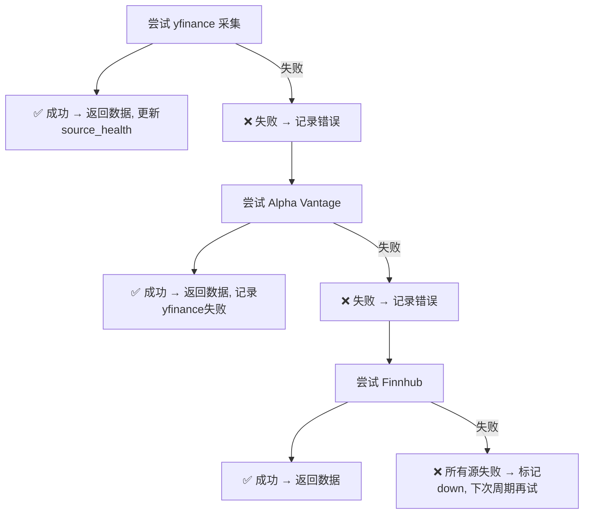
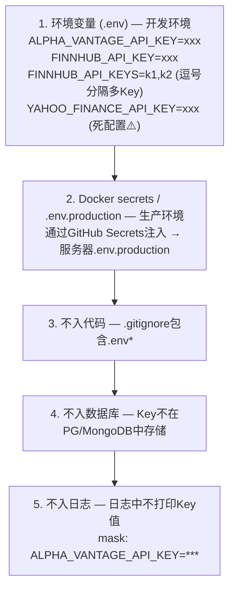

# InstantBoard 数据源配置设计

## 目录

1. 目标
2. 方案概述
3. 详细设计
   - 3.1 所有外部数据源清单表格
   - 3.2 财经数据源详细列表
   - 3.3 科技数据源详细列表
   - 3.4 数据源健康监控设计
   - 3.5 数据源切换/failover设计
   - 3.6 API Key管理策略
4. 关键决策
5. 边界情况
6. 与其他模块的依赖

## 1. 目标

定义 InstantBoard 所有外部数据源的完整清单、配置方式、健康监控、failover策略和API Key管理，确保数据源可靠、可切换、可监控。

## 2. 方案概述

采用 **多数据源优先级链 + 自动failover + source_health监控 + 环境变量API Key管理** 方案，每个数据类型配置主源和备用源，采集失败自动切换，健康状态实时监控和推送。

## 3. 详细设计

### 3.1 所有外部数据源清单表格

| # | 名称 | 类型 | URL | 频率 | 数据格式 | 费用 | 所属模块 | 现状 |
|---|------|------|-----|------|---------|------|---------|------|
| 1 | Yahoo Finance | API (非官方, httpx直连) | query1.finance.yahoo.com/v8/finance/chart/{symbol} | 30s-60s | JSON | 免费 | 财经 | ✅ 活跃 (3条种子源) |
| 2 | Alpha Vantage | REST API | alphavantage.co | 按需 | JSON | 免费(限量)/付费 | 财经 | ✅ 采集器已实现; 种子为未激活模板 |
| 3 | 东方财富 | 公开数据接口 | push2.eastmoney.com | 15s + failover按需 | JSON | 免费 | 财经 | ✅ 活跃种子 + 指数failover第一顺位 |
| 4 | Finnhub | REST API | finnhub.io | 按需 (failover链内) | JSON | 免费(限量)/付费 | 财经 | ✅ 采集器已实现; 无定时种子源 |
| 5 | IEX Cloud | REST API | iexcloud.io | - | JSON | 免费(限量)/付费 | 财经 | ⚠️ 未实现 |
| 6 | 天天基金 | Web抓取 | fund.eastmoney.com | 每日 | HTML→JSON | 免费 | 财经 | ⚠️ 未激活种子 (无web_scrape采集器) |
| 7 | MIT Tech Review | RSS | technologyreview.com/feed | 5min | RSS XML | 免费 | 科技-AI | ✅ 活跃 |
| 8 | HackerNews | RSS | hnrss.org | 2min | RSS/JSON | 免费 | 科技-全领域 | ✅ 活跃 |
| 9 | Arxiv CS.AI | RSS/API | arxiv.org/rss/cs.AI | 30min | RSS XML | 免费 | 科技-AI | ✅ 活跃 |
| 10 | OpenAI Blog | Web抓取 | openai.com/blog | 30min | HTML→JSON | 免费 | 科技-AI | ⚠️ 未激活种子 (无web_scrape采集器) |
| 11 | The Robot Report (经Google News) | RSS | news.google.com/rss/search?q=robotics+... | 5min | RSS XML | 免费 | 科技-机器人 | ✅ 活跃 |
| 12 | IEEE Robotics | RSS | ieee.org/publications | 每日 | RSS XML | 免费 | 科技-机器人 | ✅ 活跃 |
| 13 | Hackaday | RSS | hackaday.com/blog/feed | 5min | RSS XML | 免费 | 科技-嵌入式 | ✅ 活跃 |
| 14 | Embedded.com | RSS | embedded.com/feed | 5min | RSS XML | 免费 | 科技-嵌入式 | ✅ 活跃 |
| 15 | RISC-V International | Web抓取 | riscv.org/blog | 30min | HTML→JSON | 免费 | 科技-嵌入式 | ⚠️ 未激活种子 (无web_scrape采集器) |
| 16 | SpaceNews | RSS | spacenews.com/feed | 5min | RSS XML | 免费 | 科技-太空 | ✅ 活跃 |
| 17 | NASA News | RSS | nasa.gov/rss | 30min | RSS XML | 免费 | 科技-太空 | ✅ 活跃 |
| 18 | SpaceX Updates | Web抓取 | spacex.com/updates | 30min | HTML→JSON | 免费 | 科技-太空 | ⚠️ 未激活种子 (无web_scrape采集器) |
| 19 | Ars Technica Space | RSS | arstechnica.com/science/feed | 5min | RSS XML | 免费 | 科技-太空 | ✅ 活跃 |
| 20 | Reddit | API | reddit.com/r/{sub} | 10min | JSON | 免费(限流) | 科技-全领域 | ⚠️ 未激活种子 (无social采集器) |
| 21 | Google News Tech | RSS | news.google.com/rss/search?q=technology | 5min | RSS XML | 免费 | 科技-通用 | ✅ 活跃 |
| 22 | ESA News | RSS | esa.int/RSS | 30min | RSS XML | 免费 | 科技-太空 | ✅ 活跃 |

> ⚠️ **种子与采集器现状**（以 `app/db/init_db.py` 与 `app/collectors/__init__.py` 为准）：
> - 已注册采集器仅 7 个：`yfinance` / `alpha_vantage` / `eastmoney` / `finnhub` / `rss` / `hackernews` / `arxiv`（`COLLECTOR_REGISTRY`）。
> - **无 `web_scrape` / `social` 采集器**：此类种子源（#6/#10/#15/#18，另含机器人领域 Automotive News 与 #20 Reddit）一律 `is_active=False`，仅作为未来开发模板保留；`beautifulsoup4`/`lxml` 依赖已声明但无任何 HTML 抓取代码。
> - **IEX Cloud** 完全未实现（无采集器/配置/种子）；**Twitter/X** 完全缺失。
> - Finnhub 无定时采集种子源（种子财经源共 6 条，不含 Finnhub），仅在财经 failover 链内按需调用（见 §3.5）。
> - source_type 为 api/web_scrape 的源通过 `config.library` 回退解析采集器（见 §3.5.1）；解析失败时 `collector_available=false`，且激活会被拒绝。

### 3.2 财经数据源详细列表

#### 3.2.1 Yahoo Finance

| 属性 | 值 |
|------|-----|
| **类型** | 非官方REST API (httpx直连Yahoo chart API；**不使用yfinance库**——依赖在requirements中但无任何代码import) |
| **覆盖范围** | 全球股票、指数、ETF、期货 (chart API覆盖范围) |
| **URL** | `https://query1.finance.yahoo.com/v8/finance/chart/{symbol}?interval=1d&range=5d` |
| **数据格式** | JSON (chart meta + indicators) |
| **费用** | 免费 |
| **API Key** | 无需 |
| **频率限制** | 无官方限制 (Yahoo可能随时429限流；采集器附带浏览器模拟头降低被封概率，429时视为本次失败交棒failover) |
| **数据延迟** | ~1-2分钟 |
| **优点** | 免费、无需Key、全球覆盖 |
| **缺点** | 非官方API不稳定、可能被Yahoo封禁、无SLA |
| **优先级** | **首选** (Primary) |
| **采集器** | `YFinanceCollector` (`app/collectors/finance/yfinance_collector.py`) |

**关键配置** (`sources.config` JSONB, 种子示例):
```json
{
  "library": "yfinance",
  "symbols": ["^GSPC", "^DJI", "^IXIC", "000001.SS", "^HSI", "^N225", "^FTSE", "^GDAXI"],
  "history_period": "5d",
  "retry_on_fail": true
}
```

> 注: 采集器只消费 `library`（供 `resolve_collector` 回退解析）与 `symbols`；`history_period`/`retry_on_fail` 字段在种子中存在但**不被消费**（采集器硬编码 `range=5d`、`interval=1d`）。

#### 3.2.2 Alpha Vantage

| 属性 | 值 |
|------|-----|
| **类型** | REST API (官方) |
| **覆盖范围** | 美股、外汇、加密货币、技术指标、基本面 |
| **URL** | `https://www.alphavantage.co/query?function=TIME_SERIES_INTRADAY&symbol=AAPL&apikey={KEY}` |
| **数据格式** | JSON |
| **费用** | 免费(5 calls/min) / Premium($49/月, 600 calls/min) |
| **API Key** | 需要 (`ALPHA_VANTAGE_API_KEY`) |
| **频率限制** | 5 calls/min (免费) / 600/min (付费) |
| **数据延迟** | 实时 (付费) / 15min延迟 (免费部分功能) |
| **优点** | 官方API、有SLA、技术指标丰富 |
| **缺点** | 免费Key严格限流(5/min)、付费成本、非全球覆盖 |
| **优先级** | **备用** (Failover #1) |

#### 3.2.3 东方财富

| 属性 | 值 |
|------|-----|
| **类型** | Web抓取 |
| **覆盖范围** | A股、港股、中国基金NAV |
| **URL** | `https://push2.eastmoney.com/api/qt/...` (公开数据接口) |
| **数据格式** | HTML→JSON (公开接口返回JSON) |
| **费用** | 免费 |
| **API Key** | 无需 |
| **频率限制** | 无明确限制 (需控制频率避免IP封禁, 建议≤10次/min) |
| **数据延迟** | 实时 (A股) |
| **优点** | A股数据最全最准、基金NAV官方数据 |
| **缺点** | 非官方接口可能变更、需控制抓取频率 |
| **优先级** | **市场指数failover链第一顺位** + **独立活跃种子源** |

> **实际地位**（由原"补充"提级）：
> 1. `market_indices` failover 链第一顺位：`_get_failover_chain` 返回 eastmoney→yfinance（`services/finance.py:719-727`）；
> 2. 独立活跃种子源："东方财富-A股实时"，`config={"library":"eastmoney","data_type":"cn_indices"}`，刷新 15s（`init_db.py:38-48`）；其 source_type 为 `web_scrape`，靠 `config.library` 回退解析到 `EastMoneyCollector`（见 §3.5.1）。

#### 3.2.4 Finnhub

| 属性 | 值 |
|------|-----|
| **类型** | REST API + WebSocket |
| **覆盖范围** | 全球股票、外汇、加密、新闻 |
| **Base URL** | `https://finnhub.io/api/v1` |
| **数据格式** | JSON |
| **费用** | 免费(60 calls/min) / Premium |
| **API Key** | 需要 (`FINNHUB_API_KEY`), 支持多Key池 (`FINNHUB_API_KEYS`) |
| **频率限制** | 60 calls/min (免费), 429时自动等待60s重试 |
| **数据延迟** | 实时 |
| **优点** | WebSocket实时推送、官方API、搜索和基本面数据丰富 |
| **缺点** | 免费版大宗商品支持有限、覆盖不如yfinance全面 |
| **优先级** | **按需备用** (非CN stock_quote链第3顺位；无定时种子源，仅failover时调用) |
| **采集器** | `FinnhubCollector` |

**API Endpoints (已实现)**:

| Endpoint | 路径 | 参数 | 用途 |
|----------|------|------|------|
| **Quote** | `/quote?symbol={SYM}&token={KEY}` | symbol | 实时行情 (c/h/l/o/pc/d/dp) |
| **Symbol Lookup** | `/search?q={QUERY}&token={KEY}` | q | 搜索股票代码 |
| **Company Profile** | `/stock/profile2?symbol={SYM}&token={KEY}` | symbol | 公司基本面 (市值/行业/国家) |

**关键配置** (`sources.config` JSONB):
```json
{
  "data_type": "stock_quote",
  "symbols": ["AAPL", "MSFT", "GOOGL"]
}
```

> 注: `FinnhubCollector` **不读取 `config.api_key_env`**，Key 直接来自 `settings.finnhub_api_key`（单Key）/ `settings.finnhub_api_keys`（逗号分隔多Key列表）（`finnhub_collector.py:39-45`）。

支持的 `data_type` 值: `stock_quote`, `market_indices`, `commodities`, `search`, `company_profile`

**API Key轮换策略**: 多Key池进程内round-robin（`FinnhubCollector._key_index` 顺序取Key，内存索引、进程重启丢失、不跨进程/实例共享）；**无429限流标记、无Key间限流状态共享、无Key失效通知**（429仅使当前请求等待60s重试一次）

**错误处理**:
- 401/403: 标记Key失效, 返回None → 上层触发failover到下一个数据源
- 429: 等待60秒重试一次
- 超时: 10秒, 走BaseCollector的retry机制 (3次指数退避)

#### 3.2.5 天天基金 (中国基金NAV)

| 属性 | 值 |
|------|-----|
| **类型** | Web抓取 |
| **覆盖范围** | 中国基金官方NAV |
| **URL** | `https://fund.eastmoney.com/f10/F10DataApi.aspx?type=...` |
| **数据格式** | HTML→JSON |
| **费用** | 免费 |
| **API Key** | 无需 |
| **频率限制** | 需控制 (≤5次/min) |
| **数据延迟** | T+1日官方NAV |
| **优点** | 官方NAV数据源、数据权威 |
| **缺点** | 仅中国基金、非官方接口 |
| **优先级** | **中国基金NAV必备** |

> ⚠️ **未实现**：目前仅保留为未激活种子模板（"天天基金-官方NAV"，`is_active=False`，`init_db.py:103-111`）。系统**无任何 web_scrape 采集器**，官方 NAV 抓取整体缺失；`get_fund_nav` 只读取库中已有的 NAV 估算数据，不做在线采集（见 §3.5.1）。

#### 3.2.6 IEX Cloud (可选)

| 属性 | 值 |
|------|-----|
| **类型** | REST API |
| **覆盖范围** | 美股为主 |
| **URL** | `https://cloud.iexapis.com/stable/stock/AAPL/quote?token={KEY}` |
| **数据格式** | JSON |
| **费用** | 免费(限量) / 付费 |
| **优先级** | **可选** (美股深度数据需求时启用) |

> ⚠️ **未实现**：无采集器、无配置字段、无种子源。

### 3.3 科技数据源详细列表

#### 3.3.1 机器人领域 (5个数据源)

| # | 名称 | 类型 | URL | 频率 | 费用 | config示例 |
|---|------|------|-----|------|------|-----------|
| 1 | **HackerNews (robotics)** | RSS | `https://hnrss.org/new?q=robot+robotics` | 2min | 免费 | `{parse_rules: {summary: "comments_text"}}` |
| 2 | **The Robot Report** | RSS | `https://www.robotreport.com/feed` | 5min | 免费 | `{parse_rules: {summary: "excerpt"}}` |
| 3 | **IEEE Robotics** | RSS | `https://www.ieee.org/publications/rss_feed.xml` | 每日 | 免费 | `{parse_rules: {summary: "abstract"}}` |
| 4 | **ROS Blog** | RSS | `https://ros.org/blog/rss.xml` | 每周 | 免费 | `{parse_rules: {}}` |
| 5 | **Automotive News** | Web | `https://www.autonews.com` | 每日 | 免费(有限) | `{parse_rules: {title: "h2.article-title", summary: "p.excerpt"}}` |

> ⚠️ Automotive News 为 `web_scrape` 源，种子 `is_active=False`（系统无 web_scrape 采集器）。

#### 3.3.2 AI领域 (5个数据源)

| # | 名称 | 类型 | URL | 频率 | 费用 | config示例 |
|---|------|------|-----|------|------|-----------|
| 1 | **MIT Tech Review** | RSS | `https://www.technologyreview.com/feed/` | 5min | 免费 | `{parse_rules: {summary: "excerpt"}}` |
| 2 | **HackerNews (AI)** | RSS | `https://hnrss.org/new?q=AI+machine+learning` | 2min | 免费 | `{parse_rules: {summary: "comments_text", extra: {hn_votes: "score"}}}` |
| 3 | **Arxiv CS.AI** | RSS | `https://arxiv.org/rss/cs.AI` | 30min | 免费 | `{parse_rules: {summary: "abstract", extra: {arxiv_id: "id"}}}` |
| 4 | **OpenAI Blog** | Web | `https://openai.com/blog` | 30min | 免费 | `{parse_rules: {title: "h2", summary: "p.excerpt"}}` |
| 5 | **The Batch (deeplearning.ai)** | RSS/Web | `https://deeplearning.ai/the-batch/` | 每周 | 免费 | `{parse_rules: {}}` |

> ⚠️ OpenAI Blog 为 `web_scrape` 源，种子 `is_active=False`（系统无 web_scrape 采集器）。

#### 3.3.3 大规模嵌入式领域 (5个数据源)

| # | 名称 | 类型 | URL | 频率 | 费用 | config示例 |
|---|------|------|-----|------|------|-----------|
| 1 | **Hackaday** | RSS | `https://hackaday.com/blog/feed/` | 5min | 免费 | `{parse_rules: {summary: "excerpt"}}` |
| 2 | **Embedded.com** | RSS | `https://www.embedded.com/rss/` | 5min | 免费 | `{parse_rules: {}}` |
| 3 | **RISC-V International** | RSS/Web | `https://riscv.org/blog/` | 30min | 免费 | `{parse_rules: {title: "h2.post-title", summary: "p"}}` |
| 4 | **EE Times** | RSS/Web | `https://www.eetimes.com/rss/` | 每日 | 免费(有限) | `{parse_rules: {}}` |
| 5 | **Zephyr Project Blog** | RSS | `https://zephyrproject.org/blog/rss` | 每月 | 免费 | `{parse_rules: {}}` |

> ⚠️ RISC-V International 种子类型为 `web_scrape` 且 `is_active=False`（系统无 web_scrape 采集器）；启用需改用 RSS 替代或实现抓取采集器。

#### 3.3.4 太空科技领域 (5个数据源)

| # | 名称 | 类型 | URL | 频率 | 费用 | config示例 |
|---|------|------|-----|------|------|-----------|
| 1 | **SpaceNews** | RSS | `https://spacenews.com/feed/` | 5min | 免费 | `{parse_rules: {summary: "excerpt"}}` |
| 2 | **NASA News** | RSS | `https://www.nasa.gov/rss/dyn/breaking_news.rss` | 30min | 免费 | `{parse_rules: {summary: "description"}}` |
| 3 | **SpaceX Updates** | Web | `https://www.spacex.com/updates/` | 30min | 免费 | `{parse_rules: {title: "h3.update-title", summary: "p"}}` |
| 4 | **ESA News** | RSS | `https://www.esa.int/RSS` | 30min | 免费 | `{parse_rules: {}}` |
| 5 | **Ars Technica Space** | RSS | `https://arstechnica.com/science/feed/` | 5min | 免费 | `{parse_rules: {summary: "excerpt"}}` |

> ⚠️ SpaceX Updates 为 `web_scrape` 源，种子 `is_active=False`（系统无 web_scrape 采集器）。

#### 3.3.5 跨领域通用数据源

| # | 名称 | 类型 | URL | 频率 | 费用 | 说明 |
|---|------|------|-----|------|------|------|
| 1 | **Reddit** | API | `https://www.reddit.com/r/{subreddit}/new.json` | 10min | 免费(限流) | 子版: r/artificial, r/robotics, r/embedded, r/space |
| 2 | **Google News Tech** | RSS | `https://news.google.com/rss/search?q=technology+AI+robotics` | 5min | 免费 | 通用科技新闻 |
| 3 | **Twitter/X** | Social | Twitter API v2 (Lists) | 10min | 付费($100/月) | 高成本, 仅付费租户可选启用 |

> ⚠️ **未实现**：Reddit 种子存在但 `is_active=False`（`init_db.py:291-299`），系统无 social 采集器、无 `REDDIT_CLIENT_ID` 配置；Twitter/X 完全缺失。

### 3.4 数据源健康监控设计

#### 3.4.1 source_health 表 (见[database.md](database.md) §3.1)

```sql
-- source_health 表字段与监控逻辑对应:

status:            'healthy' | 'degraded' | 'down'
  → healthy:  连续失败0次, 成功率>95%
  → degraded: 连续失败3-9次, 成功率50-95%
  → down:     连续失败≥10次, 成功率<50%

last_success_at:   最近一次成功采集时间
  → >1h未成功 → 显示警告

last_failure_at:   最近一次失败时间
  → 记录失败时刻

last_error_message: 最近一次错误信息
  → 显示在Dashboard DataSourceHealth表格

consecutive_failures: 连续失败次数
  → 状态判断依据

total_fetches_24h:  24h内总采集次数
  → 与预期频率对比

success_count_24h:  24h内成功次数
  → success_rate = success_count / total_fetches

avg_response_time_ms: 平均响应时间
  → 监控数据源延迟趋势
```

#### 3.4.2 健康状态判定算法

健康判定与推送**没有独立的 health service**，由采集调度闭环内联完成：每次采集（成功 / 失败 / 空结果）结束时都会调用
`app/scheduler/manager.py::_update_health_after_collection(source, collection_result)`，规则如下：

```
采集成功:
  consecutive_failures = 0
  last_success_at = now
  total_fetches_24h += 1, success_count_24h += 1
  avg_response_time_ms 按移动平均重算 (仅当本次 response_time_ms > 0)
  状态恢复: degraded → healthy, down → degraded (每次成功恢复一级)

采集失败:
  consecutive_failures += 1
  last_failure_at = now
  last_error_message = result.error
  total_fetches_24h += 1
  状态恶化: consecutive_failures >= 3 → degraded, >= 10 → down

首次采集 (source_health 记录不存在):
  新建记录: 成功 → status='healthy'; 失败 → status='degraded'

状态发生变化 (new_status != previous_status) 时:
  SSEService.publish_source_health_update(
      build_source_health_update_payload(source, health, previous_status),
      tenant_id=str(source.tenant_id),   # falsy fallback 用 str(SYSTEM_TENANT_ID)，禁止字面量
  )
  随后 adaptive_reschedule 调整采集间隔倍率:
  healthy ×1.0 / degraded ×2.0 / down ×10.0
```

> `source_health_update` 的完整 payload 契约（全行状态字段、前端按 `source_id` 匹配行、租户路由语义）统一以
> [data-flow.md](data-flow.md) §3.5.4 为单一事实来源；发布侧为
> `app/services/sse.py::publish_source_health_update` + `build_source_health_update_payload`。
> `services/source.py` 中曾存在的 `update_source_health(source_id, status=...)` 函数及绕过
> `event_router` 的直接 redis_publish 旁路已删除（缺陷修复记录见 data-flow.md §3.5.4 末尾）。

#### 3.4.3 前端健康状态展示

详见 [dashboard-tab.md](dashboard-tab.md) §3.2 DataSourceHealth组件。

### 3.5 数据源切换/failover设计

#### 3.5.1 Failover链配置

Failover 链**硬编码**于 `app/services/finance.py::_get_failover_chain`（:703-735），**不存在 `config/failover.py` 或任何配置文件**：

```
# 代码实况 (按 data_type 分发):
stock_quote (非CN符号):
    [yfinance, alpha_vantage, finnhub]

stock_quote (CN符号: .SS/.SZ后缀或0/3开头代码):
    [eastmoney, yfinance]

market_indices:
    [eastmoney, yfinance]
    # eastmoney 覆盖A股指数 (国内源、staging可达)，
    # yfinance 全覆盖兜底；配合 _fetch_indices_with_failover
    # 的"按symbol归并"逻辑合并多源结果

commodities:
    [yfinance, alpha_vantage]

其他 data_type (search / company_profile / fund_nav 等):
    [yfinance]   # 默认单源
```

> **fund_nav 说明**：无 `fund_nav` 专属链（落入默认 `[yfinance]`）；且 `get_fund_nav` 本身仅读取库中已有 NAV 估算数据，**不走 failover、不做在线采集**（官方 NAV 抓取整体未实现，见 §3.2.5）。
>
> 科技源不配置 failover 链（见 §3.5.3）。

**采集器解析机制**（`app/collectors/__init__.py::resolve_collector`）：

1. 先按 `source_type` 查 `COLLECTOR_REGISTRY`（rss / hackernews / arxiv）；
2. source_type 无对应采集器时（api / web_scrape），按 `config.library` 回退解析：yfinance / alpha_vantage / eastmoney / finnhub / rss / hackernews / arxiv；
3. 仍无法解析返回 `None` → 该源尚不可采集：响应字段 `collector_available` 向前端暴露此状态；创建/更新激活前经 `_check_collector_available` 前置校验（`services/source.py:118-131`）抛出 `NoCollectorAvailable`（`exceptions.py:31-41`），防止源处于"永久激活却从不采集"的状态。

#### 3.5.2 自动Failover流程



> 此图对应**非CN stock_quote**链；其他 data_type 的链见 §3.5.1。Failover 在 FinanceService 的抓取方法内按 symbol/批次执行：链上当前源返回空或失败即交棒下一源。

#### 3.5.3 科技源独立策略

科技数据源不设failover链，理由：
- 每个RSS源内容不同 (HackerNews ≠ MIT Tech Review)，不是替代关系
- 源失败时: 仅标记degraded/down，不影响其他源采集
- 前端: 失败源的条目减少或为空，其他源正常显示
- 源恢复后: 自动恢复采集，无需手动干预

### 3.6 API Key管理策略

#### 3.6.1 存储方式



#### 3.6.2 Key轮换策略

> ⚠️ **未实现**：`config/api_keys.py::APIKeyManager` **不存在**——无 Redis 轮换索引、无 429 限流标记、无 Key 失效检测/通知、无 `AllKeysRateLimited` 异常。现状仅 Finnhub 多 Key 进程内 round-robin（`finnhub_collector.py:34-52`，见 §3.2.4）。以下为设计意图，保留供参考：

```python
# config/api_keys.py (设计意图, 未实现)

class APIKeyManager:
    """
    API Key管理器
    
    功能:
    1. 多Key池: 支持同一服务配置多个Key (避免单Key限流)
       ALPHA_VANTAGE_API_KEYS=key1,key2,key3
       
    2. 自动轮换: 按顺序使用Key, 限流时切换下一个
       current_key_index = Redis GET api_key_index:{service}
       
    3. 限流检测: 收到429响应 → 标记当前Key限流, 切换下一个
       限流Key: Redis SET限流标记 TTL=60s
       
    4. Key失效检测: Key返回401 → 标记失效, 通知管理员
       失效Key: 不再使用, Dashboard显示警告
    """
    
    def get_next_key(self, service: str) -> str:
        keys = settings.get_list(f"{service}_API_KEYS")
        if len(keys) == 1:
            return keys[0]
        
        # 轮换: 跳过限流/失效的Key
        current_idx = int(redis.get(f"api_key_index:{service}") or "0")
        for i in range(len(keys)):
            idx = (current_idx + i) % len(keys)
            if not redis.exists(f"api_key_ratelimited:{service}:{idx}"):
                redis.set(f"api_key_index:{service}", idx)
                return keys[idx]
        
        # 所有Key限流 → 使用最早解除限流的Key
        raise AllKeysRateLimited(f"{service}所有API Key均限流")
```

#### 3.6.3 Key配置清单

| 服务 | 环境变量 | 必需? | 免费 | 付费 | 说明 |
|------|---------|------|------|------|------|
| Yahoo Finance | `YAHOO_FINANCE_API_KEY` ⚠️死配置 | 否 | - | - | httpx直连、无需Key；字段已定义但无使用方 |
| Alpha Vantage | `ALPHA_VANTAGE_API_KEY` | 推荐(备用源) | 5/min | $49/月 600/min | **仅单Key**，`ALPHA_VANTAGE_API_KEYS` 多Key不支持 |
| Finnhub | `FINNHUB_API_KEY` / `FINNHUB_API_KEYS` | 可选 | 60/min | $29/月 | 支持多Key列表（进程内round-robin） |
| IEX Cloud | ⚠️ 未实现 | 可选 | 限量 | $9/月起 | 无采集器/配置/种子 |
| 东方财富 | 无 | 否 | - | - | 无需Key, 控制频率即可 |
| Reddit | ⚠️ 未实现 | 可选 | 限量 | - | 无 `REDDIT_CLIENT_ID` 配置、无 social 采集器 |

## 4. 关键决策

| 决策 | 选择 | 理由 |
|------|------|------|
| 财经主数据源 | yfinance | 免费、无需Key、全球覆盖、Python库直调 |
| 财经failover | 多源链式切换 (硬编码链, 见§3.5.1) | 非CN stock_quote: yfinance→Alpha Vantage→Finnhub；market_indices: eastmoney→yfinance，自动切换保障可用 |
| 科技源策略 | 独立无failover | RSS源内容不同不可替代，失败仅标记不影响其他 |
| 健康监控 | source_health表+Redis缓存 | PG持久记录+Redis快速查询，双重保障 |
| API Key存储 | .env环境变量 | 不入代码/数据库/日志，安全且易管理 |
| Key限流处理 | Finnhub多Key池进程内round-robin | 缓解单Key限流；统一Key管理器（限流标记/失效检测）未实现，见§3.6.2 |
| 采集频率 | 分类级别配置(30s-5min可调) | 高频行情30s, 低频新闻5min, 灵活可配 |

## 5. 边界情况

- **yfinance被Yahoo封禁**: 非官方API可能被封 → Alpha Vantage failover自动切换；长期封禁需评估替代方案
- **Alpha Vantage免费Key限流严重**: 5 calls/min → 使用多Key池轮换；仍不够则升级付费Key
- **东方财富接口变更**: 公开接口可能变更 → Web抓取需要维护parse_rules；变更后需更新config
- **Reddit API限流**: 公开JSON接口限流 → 降低频率(10min)；OAuth2 API更稳定但需Client ID
- **RSS源停止更新**: 源7天无新内容 → source_health标记degraded，前端提示
- **所有财经源不可用**: ⚠️ 方案的"Redis旧数据兜底 + SSE不可用提示"**未实现**——当前全链失败直接抛出 `ServiceUnavailable`（"Market indices data temporarily unavailable" / "Commodity data temporarily unavailable"，`services/finance.py:216-217, 264-265`），无旧数据兜底、无提示推送
- **API Key泄露**: .env文件泄露 → 立即更换Key；生产使用Docker secrets更安全
- **新数据源添加**: ⚠️ "无需重启服务"仅部分成立——创建后 `source_created` 事件发布在 **channel:dashboard**，但 worker 忽略该事件（`SOURCE_EVENT_NAMES` 仅含 `source_enabled`/`source_disabled`/`source_deleted`，`scheduler/worker.py:35-37`），新源需 worker 重启或后续启用操作才开始采集。启用/停用/删除事件由 worker 实时消费以增删采集任务；worker 每 15s 上报心跳（Redis TTL 45s），API 侧 45s 无心跳视为 worker 掉线。创建/更新前有 `collector_available` 前置校验，无可解析采集器的源无法被启用（`NoCollectorAvailable`）

## 6. 与其他模块的依赖

- → [architecture.md](architecture.md): Collector模块架构、数据源类型定义
- → [api.md](api.md): `/api/v1/sources/*` CRUD API、`/api/v1/sources/{id}/health`
- → [database.md](database.md): sources表、source_health表、Redis Key模式
- → [data-flow.md](data-flow.md): 采集流程、failover执行逻辑、处理管道
- → [finance-tab.md](finance-tab.md): 财经数据源选型详细对比、刷新策略
- → [tech-tab.md](tech-tab.md): 科技各领域数据源推荐列表