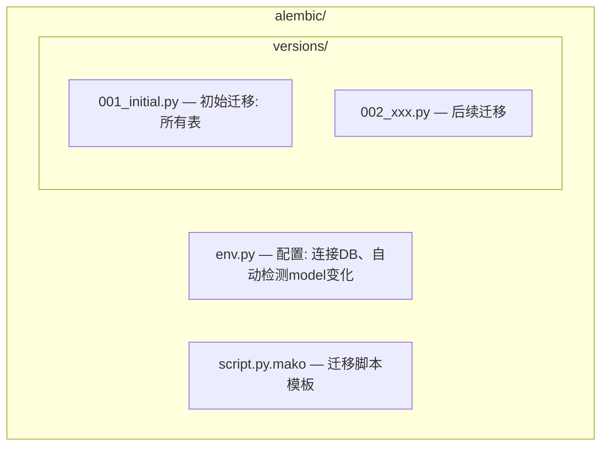

# InstantBoard 数据库设计

## 1. 目标

定义 InstantBoard 的完整数据库方案：PostgreSQL 表结构、Redis 使用场景、MongoDB 后续版本按需启用场景、数据迁移策略和多租户隔离方案。

## 2. 方案概述

**PostgreSQL 存核心关系数据，Redis 存缓存/实时/会话数据，MongoDB 初始版本不启用（后续版本按需启用）**，初始版本通过 PostgreSQL JSONB 替代 MongoDB 的灵活存储场景。

## 3. 详细设计

### 3.1 PostgreSQL 表结构

```sql
-- ============================================
-- 租户与用户
-- ============================================

CREATE TABLE tenants (
    id              UUID PRIMARY KEY DEFAULT gen_random_uuid(),
    name            VARCHAR(100) NOT NULL,
    slug            VARCHAR(50) NOT NULL UNIQUE,
    plan            VARCHAR(20) NOT NULL DEFAULT 'free'  -- 'free'|'pro'|'enterprise'
                    CHECK (plan IN ('free', 'pro', 'enterprise')),
    settings        JSONB NOT NULL DEFAULT '{}',           -- 租户级配置 (刷新频率覆盖等)
    max_users       INTEGER NOT NULL DEFAULT 5,
    max_categories  INTEGER NOT NULL DEFAULT 10,
    max_sources     INTEGER NOT NULL DEFAULT 50,
    is_active       BOOLEAN NOT NULL DEFAULT true,
    created_at      TIMESTAMPTZ NOT NULL DEFAULT now(),
    updated_at      TIMESTAMPTZ NOT NULL DEFAULT now()
);

CREATE TABLE users (
    id              UUID PRIMARY KEY DEFAULT gen_random_uuid(),
    tenant_id       UUID NOT NULL REFERENCES tenants(id) ON DELETE CASCADE,
    email           VARCHAR(255) NOT NULL,
    name            VARCHAR(100) NOT NULL,
    avatar_url      TEXT,
    sso_provider    VARCHAR(20) NOT NULL  -- 'google'|'azure_ad'|'github'|'apple'|'facebook'
                    CHECK (sso_provider IN ('google', 'azure_ad', 'github', 'apple', 'facebook')),
    sso_provider_id VARCHAR(255) NOT NULL,  -- SSO 提供商的用户ID
    role            VARCHAR(20) NOT NULL DEFAULT 'member'  -- 'admin'|'member'|'viewer'
                    CHECK (role IN ('admin', 'member', 'viewer')),
    preferences     JSONB NOT NULL DEFAULT '{}',           -- 用户偏好 (主题、默认tab等)
    last_login_at   TIMESTAMPTZ,
    created_at      TIMESTAMPTZ NOT NULL DEFAULT now(),
    updated_at      TIMESTAMPTZ NOT NULL DEFAULT now(),
    
    UNIQUE (tenant_id, email),
    UNIQUE (sso_provider, sso_provider_id)
);

CREATE INDEX idx_users_tenant ON users(tenant_id);
CREATE INDEX idx_users_sso ON users(sso_provider, sso_provider_id);

-- ============================================
-- 分类与数据源
-- ============================================

CREATE TABLE categories (
    id                  UUID PRIMARY KEY DEFAULT gen_random_uuid(),
    tenant_id           UUID NOT NULL REFERENCES tenants(id) ON DELETE CASCADE,
    name                VARCHAR(50) NOT NULL,
    slug                VARCHAR(50) NOT NULL,
    description         VARCHAR(200),
    icon                VARCHAR(50) DEFAULT 'folder',      -- 图标名称
    color               VARCHAR(7) DEFAULT '#3B82F6',       -- hex color
    type                VARCHAR(20) NOT NULL  -- 'finance'|'tech'|'news'|'custom'
                        CHECK (type IN ('finance', 'tech', 'news', 'custom')),
    refresh_interval_seconds INTEGER NOT NULL DEFAULT 300,  -- 刷新频率(秒)
    keywords_filter     JSONB DEFAULT '[]',                  -- 关键词过滤列表
    priority_sort       BOOLEAN NOT NULL DEFAULT false,      -- 是否按优先级排序
    is_active           BOOLEAN NOT NULL DEFAULT true,
    created_at          TIMESTAMPTZ NOT NULL DEFAULT now(),
    updated_at          TIMESTAMPTZ NOT NULL DEFAULT now(),
    
    UNIQUE (tenant_id, slug)
);

CREATE INDEX idx_categories_tenant ON categories(tenant_id);
CREATE INDEX idx_categories_type ON categories(tenant_id, type);

CREATE TABLE sources (
    id                      UUID PRIMARY KEY DEFAULT gen_random_uuid(),
    tenant_id               UUID NOT NULL REFERENCES tenants(id) ON DELETE CASCADE,
    category_id             UUID NOT NULL REFERENCES categories(id) ON DELETE CASCADE,
    name                    VARCHAR(100) NOT NULL,
    source_type             VARCHAR(20) NOT NULL  -- 'rss'|'api'|'web_scrape'|'social'
                            CHECK (source_type IN ('rss', 'api', 'web_scrape', 'social')),
    url                     TEXT NOT NULL,
    config                  JSONB NOT NULL DEFAULT '{}',     -- 源类型特定配置
    refresh_interval_seconds INTEGER,                         -- null = 使用分类默认值
    is_active               BOOLEAN NOT NULL DEFAULT true,
    priority                INTEGER NOT NULL DEFAULT 5,      -- 1(高) - 10(低)
    created_at              TIMESTAMPTZ NOT NULL DEFAULT now(),
    updated_at              TIMESTAMPTZ NOT NULL DEFAULT now()
);

CREATE INDEX idx_sources_category ON sources(category_id);
CREATE INDEX idx_sources_tenant ON sources(tenant_id);
CREATE INDEX idx_sources_type ON sources(tenant_id, source_type);

-- ============================================
-- 数据源健康监控
-- ============================================

CREATE TABLE source_health (
    id                  UUID PRIMARY KEY DEFAULT gen_random_uuid(),
    source_id           UUID NOT NULL REFERENCES sources(id) ON DELETE CASCADE,
    status              VARCHAR(10) NOT NULL DEFAULT 'healthy'  -- 'healthy'|'degraded'|'down'
                        CHECK (status IN ('healthy', 'degraded', 'down')),
    last_success_at     TIMESTAMPTZ,
    last_failure_at     TIMESTAMPTZ,
    last_error_message  TEXT,
    consecutive_failures INTEGER NOT NULL DEFAULT 0,
    total_fetches_24h   INTEGER NOT NULL DEFAULT 0,
    success_count_24h   INTEGER NOT NULL DEFAULT 0,
    avg_response_time_ms INTEGER NOT NULL DEFAULT 0,
    updated_at          TIMESTAMPTZ NOT NULL DEFAULT now(),
    
    UNIQUE (source_id)
);

CREATE INDEX idx_source_health_status ON source_health(status);

-- ============================================
-- 信息条目 (所有分类的通用内容模型)
-- ============================================

CREATE TABLE items (
    id              UUID PRIMARY KEY DEFAULT gen_random_uuid(),
    tenant_id       UUID NOT NULL REFERENCES tenants(id) ON DELETE CASCADE,
    category_id     UUID NOT NULL REFERENCES categories(id) ON DELETE CASCADE,
    source_id       UUID NOT NULL REFERENCES sources(id) ON DELETE CASCADE,
    title           VARCHAR(500) NOT NULL,
    summary         TEXT,
    url             TEXT NOT NULL,
    image_url       TEXT,
    published_at    TIMESTAMPTZ NOT NULL,
    fetched_at      TIMESTAMPTZ NOT NULL DEFAULT now(),
    topic_tags      JSONB DEFAULT '[]',       -- 话题标签数组
    extra_data      JSONB DEFAULT '{}',       -- 扩展数据 (财经行情、科技元数据等)
    priority        INTEGER NOT NULL DEFAULT 5,
    is_processed    BOOLEAN NOT NULL DEFAULT true,
    created_at      TIMESTAMPTZ NOT NULL DEFAULT now(),
    
    -- 去重: 同一 URL + 发布时间 不重复
    UNIQUE (tenant_id, source_id, url, published_at)
);

CREATE INDEX idx_items_category ON items(category_id, published_at DESC);
CREATE INDEX idx_items_tenant_time ON items(tenant_id, published_at DESC);
CREATE INDEX idx_items_tags ON items USING gin(topic_tags);
CREATE INDEX idx_items_extra_data ON items USING gin(extra_data);
CREATE INDEX idx_items_source ON items(source_id);

-- ============================================
-- 财经专用表
-- ============================================

CREATE TABLE finance_symbols (
    id              UUID PRIMARY KEY DEFAULT gen_random_uuid(),
    tenant_id       UUID NOT NULL REFERENCES tenants(id) ON DELETE CASCADE,
    symbol          VARCHAR(20) NOT NULL,          -- 股票/基金代码
    name            VARCHAR(200) NOT NULL,
    type            VARCHAR(20) NOT NULL  -- 'stock'|'fund'|'index'|'commodity'|'futures'|'currency'
                    CHECK (type IN ('stock', 'fund', 'index', 'commodity', 'futures', 'currency')),
    market          VARCHAR(10) NOT NULL,          -- 'US'|'CN'|'HK'|'JP'|'EU'|'GLOBAL'
    exchange        VARCHAR(50),
    currency        VARCHAR(3) DEFAULT 'USD',
    is_active       BOOLEAN NOT NULL DEFAULT true,
    created_at      TIMESTAMPTZ NOT NULL DEFAULT now(),
    updated_at      TIMESTAMPTZ NOT NULL DEFAULT now(),
    
    UNIQUE (tenant_id, symbol)
);

CREATE INDEX idx_finance_symbols_type ON finance_symbols(tenant_id, type);
CREATE INDEX idx_finance_symbols_market ON finance_symbols(tenant_id, market);

CREATE TABLE finance_quotes (
    id              UUID PRIMARY KEY DEFAULT gen_random_uuid(),
    tenant_id       UUID NOT NULL REFERENCES tenants(id) ON DELETE CASCADE,
    symbol_id       UUID NOT NULL REFERENCES finance_symbols(id) ON DELETE CASCADE,
    current_price   DECIMAL(18,4),
    open_price      DECIMAL(18,4),
    high_price      DECIMAL(18,4),
    low_price       DECIMAL(18,4),
    close_previous  DECIMAL(18,4),
    volume          BIGINT,
    change_value    DECIMAL(18,4),
    change_percent  DECIMAL(8,4),
    market_cap      BIGINT,
    pe_ratio        DECIMAL(8,2),
    52_week_high    DECIMAL(18,4),
    52_week_low     DECIMAL(18,4),
    timestamp       TIMESTAMPTZ NOT NULL,
    source_name     VARCHAR(50),                  -- 数据来源名称
    created_at      TIMESTAMPTZ NOT NULL DEFAULT now()
);

CREATE INDEX idx_finance_quotes_symbol_time ON finance_quotes(symbol_id, timestamp DESC);
CREATE INDEX idx_finance_quotes_tenant ON finance_quotes(tenant_id);

-- 分区: 按月分区历史行情数据 (>1个月的数据归档到冷分区)
-- ALTER TABLE finance_quotes PARTITION BY RANGE (timestamp);

CREATE TABLE fund_nav_estimates (
    id                  UUID PRIMARY KEY DEFAULT gen_random_uuid(),
    tenant_id           UUID NOT NULL REFERENCES tenants(id) ON DELETE CASCADE,
    symbol_id           UUID NOT NULL REFERENCES finance_symbols(id) ON DELETE CASCADE,
    nav_official        DECIMAL(18,4),             -- 最新官方NAV
    nav_official_date   DATE,                      -- 官方NAV日期
    nav_estimate        DECIMAL(18,4),             -- 实时估值
    nav_estimate_deviation_percent DECIMAL(8,4),   -- 估值偏差百分比
    estimate_method     VARCHAR(50),                -- 估值方法名称
    estimate_timestamp  TIMESTAMPTZ NOT NULL,
    underlying_index_symbol VARCHAR(20),            -- 跟踪指数代码
    underlying_index_value  DECIMAL(18,4),          -- 指数当前值
    underlying_index_change_percent DECIMAL(8,4),   -- 指数涨跌幅
    created_at          TIMESTAMPTZ NOT NULL DEFAULT now()
);

CREATE INDEX idx_fund_nav_symbol ON fund_nav_estimates(symbol_id, estimate_timestamp DESC);

-- ============================================
-- 自选关注列表
-- ============================================

CREATE TABLE watchlist_items (
    id              UUID PRIMARY KEY DEFAULT gen_random_uuid(),
    tenant_id       UUID NOT NULL REFERENCES tenants(id) ON DELETE CASCADE,
    user_id         UUID NOT NULL REFERENCES users(id) ON DELETE CASCADE,
    symbol_id       UUID NOT NULL REFERENCES finance_symbols(id) ON DELETE CASCADE,
    display_order   INTEGER NOT NULL DEFAULT 0,      -- 排序位置
    notes           VARCHAR(200),                     -- 用户备注
    alert_threshold_percent DECIMAL(8,4),            -- 涨跌提醒阈值
    created_at      TIMESTAMPTZ NOT NULL DEFAULT now(),
    
    UNIQUE (user_id, symbol_id)
);

CREATE INDEX idx_watchlist_user ON watchlist_items(user_id, display_order);

-- ============================================
-- SSE 连接记录 (审计/统计)
-- ============================================

CREATE TABLE sse_connections (
    id              UUID PRIMARY KEY DEFAULT gen_random_uuid(),
    tenant_id       UUID NOT NULL REFERENCES tenants(id) ON DELETE CASCADE,
    user_id         UUID NOT NULL REFERENCES users(id) ON DELETE CASCADE,
    channels        JSONB NOT NULL DEFAULT '[]',      -- 订阅频道列表
    connected_at    TIMESTAMPTZ NOT NULL DEFAULT now(),
    disconnected_at TIMESTAMPTZ,
    last_heartbeat_at TIMESTAMPTZ,
    client_ip       VARCHAR(45),                     -- IPv4/IPv6
    user_agent      TEXT
);

CREATE INDEX idx_sse_connections_user ON sse_connections(user_id);
CREATE INDEX idx_sse_connections_active ON sse_connections(disconnected_at) WHERE disconnected_at IS NULL;

-- ============================================
-- Dashboard 指标快照 (每小时归档)
-- ============================================

CREATE TABLE dashboard_snapshots (
    id              UUID PRIMARY KEY DEFAULT gen_random_uuid(),
    tenant_id       UUID NOT NULL REFERENCES tenants(id) ON DELETE CASCADE,
    cpu_usage_percent   DECIMAL(5,2),
    memory_used_mb      INTEGER,
    memory_total_mb     INTEGER,
    disk_used_gb        DECIMAL(8,2),
    disk_total_gb       DECIMAL(8,2),
    active_sse_connections INTEGER,
    events_pushed_hour   INTEGER,
    healthy_sources      INTEGER,
    degraded_sources     INTEGER,
    down_sources         INTEGER,
    scheduler_jobs_active INTEGER,
    timestamp           TIMESTAMPTZ NOT NULL DEFAULT now()
);

CREATE INDEX idx_dashboard_snapshots_time ON dashboard_snapshots(tenant_id, timestamp DESC);
```

### 3.2 Redis 使用场景

| 场景 | Key 模式 | Value 类型 | TTL | 说明 |
|------|---------|-----------|-----|------|
| **用户会话** | `session:{session_id}` | Hash | 24h | JWT refresh token + user info |
| **行情实时缓存** | `t:{tenant_id}:quote:{symbol}` | Hash | 30s-5min | 当前价格、涨跌幅、时间戳 |
| **市场指数缓存** | `t:{tenant_id}:market_indices` | Hash | 60s | 所有市场指数汇总 |
| **大宗商品缓存** | `t:{tenant_id}:commodities` | Hash | 60s | 黄金、原油等 |
| **基金NAV缓存** | `t:{tenant_id}:nav:{symbol}` | Hash | 120s | 估值数据 |
| **SSE Pub/Sub** | `channel:{category}` | Pub/Sub | 无 | 数据更新事件分发 |
| **限流计数** | `rate:{tenant_id}:{ip}:{endpoint}` | String (counter) | 1min | 请求频率计数 |
| **去重URL集合** | `t:{tenant_id}:dedup:{source_id}` | Set | 24h | 已抓取URL集合 (快速去重) |
| **自选列表缓存** | `t:{tenant_id}:watchlist:{user_id}` | Sorted Set | 10min | 自选列表+排序 |
| **数据源健康缓存** | `source_health:{source_id}` | Hash | 5min | 健康状态快速查询 |
| **系统指标缓存** | `dashboard:system_metrics` | Hash | 10s | 实时系统指标 |
| **SSO State** | `sso_state:{state_key}` | String | 10min | OAuth state 参数防 CSRF |

**Redis 配置要点**:
- `maxmemory-policy: allkeys-lru` — 内存满时淘汰最久未使用的 key
- `maxmemory: 512mb` (开发) / `2gb` (生产)
- `appendonly: yes` — 持久化 (AOF)
- `requirepass` — 生产环境密码认证

### 3.3 MongoDB 使用场景

**初始版本不启用 MongoDB**。以下场景标注为后续版本按需启用，初始版本通过 PostgreSQL JSONB 字段替代。

**何时使用 MongoDB**: 仅在以下场景按需启用（初始版本默认不启动，生产环境通过 `--profile mongodb` 按需启动，后续版本可启用）

| 场景 | Collection | 理由 | 初始版本替代方案 |
|------|-----------|------|----------------|
| **原始抓取内容** | `raw_crawled_content` | RSS原文、网页HTML，schema不统一 | PostgreSQL items.extra_data JSONB 字段存储 |
| **历史行情数据** | `historical_quotes` | 日级/分钟级历史数据量大 | PostgreSQL finance_quotes 分区表 (近期数据) + 归档策略 |
| **新闻全文** | `news_full_text` | 部分源提供全文，内容长度不一 | PostgreSQL items.summary 字段 (截断200字符) + items.extra_data JSONB |

**Collection 定义**:

```javascript
// raw_crawled_content
{
  _id: ObjectId,
  tenant_id: UUID,
  source_id: UUID,
  raw_html: String,         // 原始HTML
  raw_json: Object,         // 原始JSON (API源)
  fetched_at: ISODate,
  processed: Boolean,
  processing_errors: Array
}

// historical_quotes (时序集合)
{
  _id: ObjectId,
  tenant_id: UUID,
  symbol: String,
  timestamp: ISODate,
  open: Number,
  high: Number,
  low: Number,
  close: Number,
  volume: Number
}
// 创建时序集合:
// db.createCollection("historical_quotes", { timeseries: { timeField: "timestamp", metaField: "symbol" } })

// news_full_text
{
  _id: ObjectId,
  tenant_id: UUID,
  item_id: UUID,             // 关联 PostgreSQL items 表
  full_text: String,
  images: Array,
  metadata: Object,
  fetched_at: ISODate
}
```

**MongoDB 不存储的数据**:
- 用户/租户/权限 → PostgreSQL (关系完整性)
- 分类/数据源配置 → PostgreSQL (结构化配置)
- 最新行情 → Redis (高频实时)
- 自选列表 → PostgreSQL (持久化) + Redis (缓存)

### 3.4 数据迁移策略

**工具**: Alembic (SQLAlchemy 生态标准)



**迁移流程**:
1. Model 变更 → `alembic revision --autogenerate -m "描述"`
2. 检查生成的迁移脚本 (确认自动检测正确)
3. `alembic upgrade head` 应用迁移
4. `alembic downgrade -1` 回滚 (开发调试)

**生产迁移策略**:
- 迁移在 Worker 容器启动时自动执行 (`entrypoint.sh: alembic upgrade head`)
- 无损迁移: 添加列/表可在线执行
- 有损迁移: 先添加新列 → 数据迁移 → 再删除旧列 (多步迁移)
- MongoDB 迁移: 不使用工具，schema-free，直接修改应用代码

### 3.5 多租户数据隔离方案

**方案**: **共享数据库 + 行级隔离 (Shared DB, Shared Schema, Row-level Isolation)**

**实现**:
- 所有业务表包含 `tenant_id` 列 (NOT NULL, FK → tenants)
- 所有查询自动注入 `WHERE tenant_id = <current_tenant_id>`
- 通过 FastAPI 中间件 `TenantMiddleware` 从 JWT claims 中提取 `tenant_id` 并注入 SQLAlchemy session context
- PostgreSQL Row Level Security (RLS) 作为额外保障层

```sql
-- 启用 RLS (PostgreSQL 特性)
ALTER TABLE categories ENABLE ROW LEVEL SECURITY;
ALTER TABLE sources ENABLE ROW LEVEL SECURITY;
ALTER TABLE items ENABLE ROW LEVEL SECURITY;
ALTER TABLE finance_symbols ENABLE ROW LEVEL SECURITY;
ALTER TABLE finance_quotes ENABLE ROW LEVEL SECURITY;

-- 创建策略: 仅允许访问自己租户的数据
CREATE POLICY tenant_isolation ON categories
    USING (tenant_id = current_setting('app.current_tenant_id')::UUID);
```

**中间件伪代码**:
```python
class TenantMiddleware:
    async def dispatch(request, call_next):
        # 从 JWT 提取 tenant_id
        tenant_id = request.state.user.tenant_id
        # 设置 PostgreSQL session 变量
        await db.execute(text("SET app.current_tenant_id = :tid"), {"tid": tenant_id})
        request.state.tenant_id = tenant_id
        response = await call_next(request)
        return response
```

**Redis 隔离**: 所有 key 前缀 `t:{tenant_id}:xxx`
**MongoDB 隑离** (后续版本启用时): 所有查询包含 `tenant_id` 条件

## 4. 关键决策

| 决策 | 选择 | 理由 |
|------|------|------|
| 多租户隔离 | 行级隔离 + RLS | 共享数据库成本最低、运维简单、RLS保证安全 |
| 历史行情存储 | PostgreSQL 近期 (初始版本) | 初始版本仅用PostgreSQL分区存储近期行情，历史数据归档策略后续优化；MongoDB时序存储为后续版本可选增强 |
| 去重策略 | PostgreSQL UNIQUE + Redis Set | 双重保障：PG持久化去重、Redis快速去重 |
| 是否分区 | finance_quotes 按月分区 | 行情数据量大，分区查询性能好 |
| 连接池 | SQLAlchemy async session + pool | FastAPI async 需要异步连接池 |

## 5. 边界情况

- **数据库连接失败**: FastAPI lifespan 中检测连接，失败时返回 503
- **Redis 不可用**: 降级为直接 PostgreSQL 查询，SSE 降级为 REST 拉取
- **MongoDB 不可用**: 初始版本不启用MongoDB，原始内容存储使用PostgreSQL JSONB字段 (items.extra_data)；后续版本启用MongoDB时，MongoDB不可用降级为PostgreSQL JSONB字段
- **迁移冲突**: 多 worker 同时启动时，使用 `alembic upgrade head` 的幂等性，只有一个成功执行
- **大表查询**: items 表可能百万级，依赖索引 + 分页，不使用全量查询

## 6. 与其他模块的依赖

- → [api.md](api.md): API schema 与数据库模型映射
- → [security.md](security.md): 多租户隔离安全、RLS配置
- → [data-flow.md](data-flow.md): 数据存储流程、去重逻辑
- → [data-sources.md](data-sources.md): 数据源配置决定抓取频率和数据格式