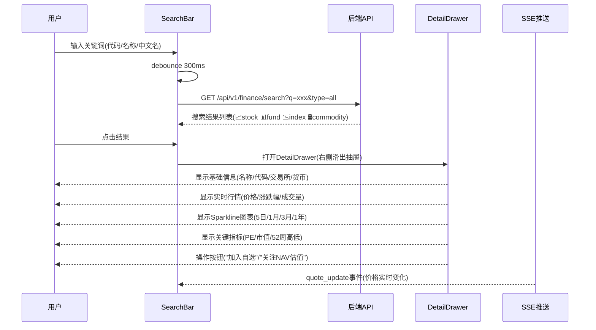
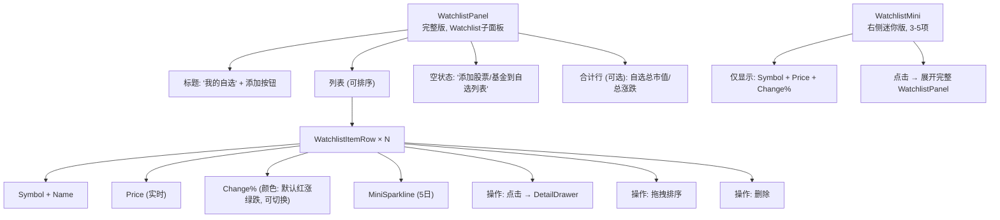
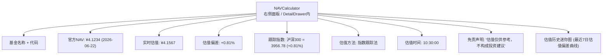
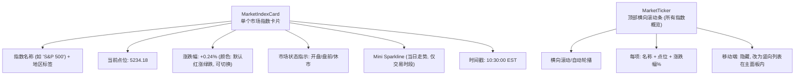
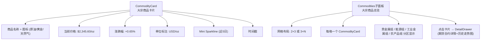
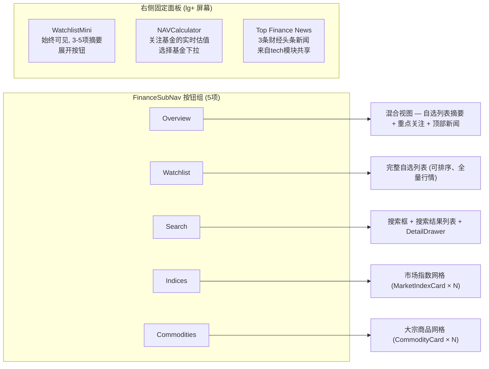
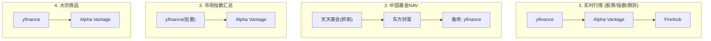

# InstantBoard 财经模块详细设计

## 1. 目标

定义 InstantBoard 财经聚合 Tab 的完整功能设计，包括股票/基金搜索、自选关注列表、基金估值实时计算、世界主要市场指数和商品数据展示、子导航方案，以及数据源选型和刷新策略。

## 2. 方案概述

提供 **类似 Google Finance 的面板式体验**，通过子导航面板切换不同功能区（Overview/Watchlist/Search/Indices/Commodities），右侧始终可见迷你自选列表和NAV估值面板。

## 3. 详细设计

### 3.1 股票/基金搜索功能详细设计

**交互流程**:


**搜索逻辑 (后端)**:
```python
# finance_service.py
async def search_symbols(query: str, type: str, market: str):
    # 1. 优先精确匹配: symbol == query (AAPL, 510300)
    # 2. 前缀匹配: symbol LIKE query% (AAP → AAPL, AAPU...)
    # 3. 名称匹配: name ILIKE %query% (Apple → Apple Inc.)
    # 4. Redis缓存搜索结果 (TTL 5min, key: t:{tid}:search:{query_hash})
    # 5. 如果缓存未命中 → PostgreSQL finance_symbols 表搜索
    # 6. 结果中每个symbol附带实时行情 (从Redis quote缓存)
    # 7. 如果symbol不在本地DB → 调用外部API搜索 (Yahoo Finance)
    # 8. 搜索到的新symbol → 存入 finance_symbols 表
```

### 3.2 自选关注列表 (Watchlist) 功能详细设计

**Watchlist 数据模型** (见 [database.md](database.md) `watchlist_items` 表)

**交互流程**:
```
1. 初始状态: WatchlistPanel 显示用户自选列表
   - 每行: symbol + name + 当前价 + 涨跌幅(颜色) + mini sparkline
    - 涨: 红色 ↑ (默认中国配色), 跌: 绿色 ↓ (默认中国配色)
    - 可切换为国际配色: 涨绿跌红 (SettingsView → ProfileSettings)
   - 可拖拽排序 (display_order)
   - 左滑(移动端)或右键菜单 → 移除/设置提醒阈值
2. SSE实时更新: quote_update 事件 → 实时刷新价格和涨跌幅
3. 添加到自选:
   - 搜索结果 → "加入自选"按钮 → POST /api/v1/finance/watchlist
   - DetailDrawer → "加入自选"按钮
4. 自选列表全量行情:
   - GET /api/v1/finance/watchlist/quotes → 返回所有自选symbol的最新行情
   - SSE推送: 订阅自选symbol的 quote_update 事件
5. 涨跌提醒:
   - 用户设置 alert_threshold_percent (如 ±3%)
   - 后端检测行情变化超过阈值 → SSE推送 alert_update 事件
   - 前端显示提醒通知 (桌面 Notification API + 应用内通知)
```

**Watchlist UI 组件**:



### 3.3 基金估值实时计算逻辑设计

**NAV估值原理**:
ETF基金的实时NAV = (官方NAV × 跟踪指数实时涨跌幅) × 修正系数

**估值计算逻辑**:
```python
# finance_service.py — NAV估值算法

async def estimate_fund_nav(symbol_id: UUID):
    """
    NAV实时估值算法 (适用于指数型ETF):
    
    公式: NAV_estimate = NAV_official × (1 + underlying_index_change_percent × tracking_ratio)
    
    其中:
    - NAV_official: 上一个交易日官方公布的NAV
    - underlying_index_change_percent: 跟踪指数当前涨跌幅
    - tracking_ratio: 跟踪比率 (通常≈1, 从历史数据计算)
    
    对于非指数型基金 (主动管理基金):
    - 仅显示官方NAV + 上次更新时间
    - 不提供实时估值 (因为无法精确估计)
    """
    
    # Step 1: 获取基金基本信息
    fund = await get_fund_symbol(symbol_id)
    
    # Step 2: 获取最新官方NAV
    nav_official = await get_official_nav(symbol_id)
    # 来源: PostgreSQL fund_nav_estimates 表
    
    # Step 3: 获取跟踪指数实时行情
    index_quote = await get_index_quote(fund.underlying_index_symbol)
    # 来源: Redis quote缓存
    
    # Step 4: 计算估值
    if fund.type == 'index_fund':
        index_change = index_quote.change_percent
        tracking_ratio = await get_tracking_ratio(symbol_id)  # 从历史数据计算
        nav_estimate = nav_official * (1 + index_change * tracking_ratio)
        deviation = (nav_estimate - nav_official) / nav_official * 100
    else:
        # 主动管理基金: 仅返回官方NAV，不估算
        nav_estimate = None
        deviation = None
    
    # Step 5: 存入Redis缓存 + PostgreSQL
    await store_nav_estimate(symbol_id, nav_estimate, deviation)
    
    # Step 6: SSE推送
    await publish_sse_event("nav_estimate_update", { ... })
    
    return { nav_official, nav_estimate, deviation, ... }
```

**估值精度说明**:
- 指数ETF: 估值偏差通常 < 0.5%，实时性取决于指数数据频率
- 需考虑: 申赎份额变化、现金替代、汇率因素 (跨境ETF)
- 估值仅供参考，不作为交易依据 (UI需标注免责声明)

**NAVCalculator UI组件**:


### 3.4 世界主要证券市场指数数据源与展示设计

#### 3.4.1 覆盖的市场指数清单

| 指数名称 | Symbol (Yahoo) | 地区 | 数据源 | 优先级 |
|---------|---------------|------|--------|-------|
| S&P 500 | ^GSPC | 美国 | Yahoo Finance / yfinance | 核心 |
| Dow Jones Industrial Average | ^DJI | 美国 | Yahoo Finance / yfinance | 核心 |
| NASDAQ Composite | ^IXIC | 美国 | Yahoo Finance / yfinance | 核心 |
| 上证综合指数 | 000001.SS | 中国 | Yahoo Finance / 东方财富 | 核心 |
| 深证成份指数 | 399001.SZ | 中国 | Yahoo Finance / 东方财富 | 核心 |
| 沪深300 | 000300.SS | 中国 | Yahoo Finance / 东方财富 | 核心 |
| 恒生指数 | ^HSI | 香港 | Yahoo Finance / yfinance | 核心 |
| 日经225 | ^N225 | 日本 | Yahoo Finance / yfinance | 核心 |
| FTSE 100 | ^FTSE | 英国 | Yahoo Finance / yfinance | 重要 |
| DAX 40 | ^GDAXI | 德国 | Yahoo Finance / yfinance | 重要 |
| CAC 40 | ^FCHI | 法国 | Yahoo Finance / yfinance | 可选 |
| KOSPI | ^KS11 | 韩国 | Yahoo Finance / yfinance | 可选 |
| BSE Sensex | ^BSESN | 印度 | Yahoo Finance / yfinance | 可选 |

#### 3.4.2 数据采集方案

```python
# collectors/finance_collector.py — MarketIndicesCollector

class MarketIndicesCollector(BaseCollector):
    """
    市场指数数据采集器
    
    数据源层级 (failover):
    1. yfinance (首选，免费，延迟~1min)
    2. Alpha Vantage (备用，API key限制)
    3. 东方财富API (中国指数补充)
    
    采集逻辑:
    - 盘前/盘后: 仅采集收盘价，频率 5min
    - 交易时段: 采集实时价，频率 30s (美股) / 15s (A股)
    - 休市日: 不采集 (通过交易日历判断)
    """
    
    async def fetch_all_indices(self, tenant_id: UUID):
        # 1. 判断各市场当前状态 (open/closed/pre-market)
        # 2. 按市场状态决定采集频率
        # 3. 并发采集所有活跃指数 (asyncio.gather)
        # 4. 存入 Redis: t:{tid}:market_indices (Hash, TTL 60s)
        # 5. SSE推送: market_index_update 事件
        # 6. 写入 PostgreSQL finance_quotes (历史记录)
```

#### 3.4.3 MarketIndexCard UI组件



#### 3.4.4 交易日历与市场状态判断

```python
# services/finance_service.py

MARKET_TIMEZONES = {
    "US": "America/New_York",    # 9:30-16:00 ET
    "CN": "Asia/Shanghai",       # 9:30-15:00 CST (含午休11:30-13:00)
    "HK": "Asia/Hong_Kong",      # 9:30-16:00 HKT
    "JP": "Asia/Tokyo",          # 9:00-15:00 JST
    "EU_LONDON": "Europe/London",# 8:00-16:30 GMT/BST
    "EU_FRANKFURT": "Europe/Berlin",  # 9:00-17:30 CET/CEST
}

PRE_MARKET_MINUTES = 60  # 盘前1小时开始显示预估
```

- 市场状态通过时间区间 + 交易日历判断 (排除节假日)
- A股节假日数据: 预加载中国证券交易所年度休市日历
- 美股节假日数据: 预加载NYSE年度休市日历

### 3.5 黄金、原油、期货数据源与展示设计

#### 3.5.1 覆盖的大宗商品清单

| 商品名称 | Symbol (Yahoo) | 类别 | 单位 | 数据源 |
|---------|---------------|------|------|--------|
| 黄金期货 | GC=F | 贵金属 | USD/oz | Yahoo Finance / yfinance |
| 白银期货 | SI=F | 贵金属 | USD/oz | Yahoo Finance / yfinance |
| WTI原油期货 | CL=F | 能源 | USD/bbl | Yahoo Finance / yfinance |
| 天然气期货 | NG=F | 能源 | USD/MMBtu | Yahoo Finance / yfinance |
| 铜期货 | HG=F | 工业金属 | USD/lb | Yahoo Finance / yfinance |
| 大豆期货 | ZS=F | 农产品 | USD/bushel | Yahoo Finance / yfinance |
| 玉米期货 | ZC=F | 农产品 | USD/bushel | Yahoo Finance / yfinance |

#### 3.5.2 CommodityCard UI组件



#### 3.5.3 数据采集方案

```python
# collectors/finance_collector.py — CommoditiesCollector

class CommoditiesCollector(BaseCollector):
    """
    大宗商品数据采集器
    
    特点:
    - 期货合约月份滚动: 自动跟踪最近月合约
    - 交易时段: 电子盘近乎24h (采集频率 60s)
    - 休市时段: 仅更新收盘价 (采集频率 5min)
    """
    
    async def fetch_all_commodities(self, tenant_id: UUID):
        # 1. 并发采集所有商品期货实时数据
        # 2. 存入 Redis: t:{tid}:commodities (Hash, TTL 60s)
        # 3. SSE推送: commodity_update 事件
        # 4. 写入 PostgreSQL finance_quotes
```

### 3.6 子导航/子分区 UI 方案

#### 3.6.1 方案对比分析

| 方案 | 描述 | 优点 | 缺点 | 适用场景 |
|------|------|------|------|---------|
| **A: 传统嵌套Tab** | 顶部Tab → 二级Tab | 简单直觉 | 嵌套混乱、占用垂直空间、移动端困难 | 少量子页面(2-3) |
| **B: 侧边子导航** | 右侧/左侧垂直子导航 | 层级清晰、可折叠 | 占用宽度、不适合财经内容区 | 多层级导航 |
| **C: 面板切换按钮组** | 水平按钮组切换子面板 (类似Google Finance) | 不嵌套、切换快、响应式友好 | 按钮过多时需滚动/分组 | **InstantBoard最佳** |
| **D: 左右分栏** | 左侧主内容+右侧固定面板 | 布局稳定、右侧始终可见 | 移动端需要折叠右侧 | 信息密度高的页面 |

#### 3.6.2 最终推荐: **方案 C + D 组合 — 面板切换按钮组 + 右侧固定面板**

**设计理由**:
1. FinanceSubNav (按钮组) 不嵌套在Tab中，独立于侧边导航，切换流畅
2. 右侧面板始终可见 (WatchlistMini + NAVCalculator)，不因主面板切换而消失
3. 移动端: 按钮组变为下拉选择器，右侧面板折叠为可展开抽屉
4. 5个子面板按钮数量适中，无需滚动

**子面板定义**:



**响应式适配**:

| 屏幕宽度 | 主内容区 | 右侧面板 | SubNav |
|---------|---------|---------|--------|
| ≥1366px | 动态切换子面板 | 300px固定 | 水平按钮组 |
| 1024-1366px | 动态切换 | 隐藏(内容移入主面板内标签) | 水平按钮组 |
| 768-1024px | 动态切换 | 隐藏 | 水平按钮组(紧凑) |
| <768px | 动态切换 | 底部抽屉 | 下拉选择器 |

### 3.7 数据源 API 选型

#### 3.7.1 选型对比

| 数据源 | 类型 | 覆盖范围 | 频率限制 | 费用 | 数据质量 | 推荐用途 |
|--------|------|---------|---------|------|---------|---------|
| **yfinance (Yahoo Finance)** | Python库 | 全球股票/指数/期货/基金 | 无官方限制(非官方API) | 免费 | 好(延迟1-2min) | **首选**: 行情搜索、指数、大宗商品 |
| **Alpha Vantage** | REST API | 美股/外汇/加密/技术指标 | 5 calls/min (免费) / 600/min (付费$49/月) | 免费/付费 | 好(实时) | **备用**: yfinance不可用时failover |
| **东方财富 API** | Web抓取 | A股/港股/中国基金 | 无明确限制 | 免费 | 好(A股数据最全) | **补充**: A股特有数据(基金NAV、A股实时) |
| **Finnhub** | REST API | 全球股票/外汇/加密 | 60 calls/min(免费) | 免费/付费 | 好(WebSocket实时) | **可选**: 实时WebSocket行情 |
| **IEX Cloud** | REST API | 美股为主 | 有量限制 | 免费(限量)/付费 | 优(美股实时) | **可选**: 美股深度数据 |
| **申万宏源/天天基金** | Web抓取 | 中国基金NAV | 无限制 | 免费 | 优(官方NAV) | **必备**: 中国基金官方NAV |

#### 3.7.2 最终选型与层级



**API Key管理策略** (详见 [data-sources.md](data-sources.md) §4):
- 所有API Key存储在 `.env` 环境变量中，不入代码/不入Git
- yfinance无需API Key (优势)
- Alpha Vantage免费Key: 5 calls/min，生产环境需付费Key
- Key轮换: 支持多个Key自动轮换 (避免单Key限流)

### 3.8 数据刷新策略

#### 3.8.1 按数据类型分级

| 数据类型 | 刷新频率 (交易时段) | 刷新频率 (休市时段) | 缓存TTL (Redis) | 推送方式 |
|---------|-------------------|-------------------|---------------|---------|
| 自选股票行情 | 30s | 5min | 30s | SSE quote_update |
| 市场指数 | 30s (多市场并行) | 5min | 60s | SSE market_index_update |
| 大宗商品 | 60s | 5min | 60s | SSE commodity_update |
| 基金NAV估值 | 120s (交易时段) | 不刷新 | 120s | SSE nav_estimate_update |
| 搜索结果 | 按需(用户触发) | - | 5min | REST API |
| 自选列表配置 | 不定时(用户修改) | - | 10min | REST CRUD |

#### 3.8.2 高频数据采集优化策略

```python
# scheduler/jobs.py — 采集任务调度

FINANCE_SCHEDULE_CONFIG = {
    # 高频组: 交易时段每30s刷新
    "market_indices_realtime": {
        "trigger": "interval",
        "seconds": 30,
        "active_hours": {"US": "9:30-16:00", "CN": "9:30-15:00"},
        "pause_on_holiday": True,
    },
    "watchlist_quotes_realtime": {
        "trigger": "interval",
        "seconds": 30,
        "active_hours": "same_as_indices",
        "pause_on_holiday": True,
    },
    
    # 中频组: 交易时段每60-120s
    "commodities_realtime": {
        "trigger": "interval",
        "seconds": 60,
        "active_hours": "near_24h",  # 电子盘
    },
    "nav_estimates": {
        "trigger": "interval",
        "seconds": 120,
        "active_hours": {"CN": "9:30-15:00"},
        "pause_on_holiday": True,
    },
    
    # 低频组: 休市/非交易时段
    "market_indices_off_hours": {
        "trigger": "interval",
        "seconds": 300,  # 5min
        "active_hours": "off_hours",  # 非交易时段
    },
    "daily_fund_nav_official": {
        "trigger": "cron",
        "hour": 20,  # 每晚20:00更新官方NAV
        "active_on_holiday": False,
    },
}
```

#### 3.8.3 动态频率调整

- **自适应降频**: 当SSE连接数 > 500 或 Redis内存 > 80% → 高频任务降频 (30s→60s)
- **无连接暂停**: 当某频道无SSE订阅者 → 暂停对应采集任务，首个订阅者到来时恢复
- **错误降频**: 连续失败3次 → 采集频率加倍 (30s→60s)，恢复后逐步回调

### 3.9 SSE 事件类型定义 (财经频道)

| 事件类型 | 数据内容 | 触发条件 | 频率 |
|---------|---------|---------|------|
| `quote_update` | `{symbol, name, current_price, change, change_percent, volume, timestamp}` | 行情数据刷新完成 | 30s (交易时段) |
| `market_index_update` | `{symbol, name, value, change, change_percent, market_status, region, timestamp}` | 指数数据刷新完成 | 30s |
| `commodity_update` | `{symbol, name, value, change, change_percent, unit, timestamp}` | 商品数据刷新完成 | 60s |
| `nav_estimate_update` | `{symbol, name, nav_official, nav_estimate, deviation_percent, estimate_method, timestamp}` | NAV估值刷新完成 | 120s |
| `alert_update` | `{symbol, threshold, current_change_percent, direction, timestamp}` | 行情变化超过用户设置阈值 | 实时 |
| `heartbeat` | `{timestamp}` | 保持连接 | 30s |

详见 [api.md](api.md) §3.8 SSE 端点完整定义。

## 4. 关键决策

| 决策 | 选择 | 理由 |
|------|------|------|
| 主数据源 | yfinance (Yahoo Finance) | 免费、覆盖全球、无需API Key、Python库直接调用 |
| 备用数据源 | Alpha Vantage + 东方财富 | failover保障、Alpha Vantage官方API可靠、东方财富A股数据最全 |
| 子导航方案 | 面板切换按钮组 + 右侧固定面板 | 不嵌套Tab、切换流畅、右侧始终可见、移动端友好 |
| 行情刷新频率 | 30s高频 + 5min低频 + 动态调整 | 交易时段高频实时、休市低频省资源、自适应降频保护系统 |
| 市场状态判断 | 时间区间 + 交易日历 | 精确判断开盘/休市/盘前，避免休市无效采集 |
| NAV估值方法 | 指数跟踪法 (仅指数ETF) | 主动管理基金无法精确估值，仅提供指数ETF的实时估算 |
| 涨跌颜色 | 默认中国配色（红涨绿跌），提供设置切换选项 | 默认红涨绿跌符合中国用户直觉，国际用户可切换为绿涨红跌；CSS变量实现运行时切换，无需重建样式 |
| 自选列表存储 | PostgreSQL持久化 + Redis缓存 | PG保证持久、Redis保证实时查询快 |

## 5. 边界情况

- **yfinance API不稳定**: Yahoo Finance非官方API，可能随时变更 → Alpha Vantage failover自动切换
- **A股午休时段 (11:30-13:00)**: 行情不更新，UI显示"午休休市"标识，不采集
- **期货合约月份滚动**: 期货合约到期自动切换到下月合约 → yfinance 自动处理，需监控切换是否成功
- **跨境ETF估值偏差**: 汇率因素、时差因素导致估值偏差较大 → UI标注"跨境ETF估值偏差可能较大"
- **搜索结果过旧**: Redis缓存5min → 超时后强制重新搜索
- **休市日无数据**: 交易日历判断 → 采集器跳过，前端显示"今日休市"
- **自选列表超过512项**: 性能影响 → UI限制最多512项，超出提示"已达上限"
- **Alpha Vantage限流**: 5 calls/min → 使用Key池轮换 + 失败后排队等待

## 6. 与其他模块的依赖

- → [frontend.md](frontend.md): 财经界面组件层级、布局、响应式适配
- → [api.md](api.md): 财经API端点定义、SSE事件类型
- → [database.md](database.md): finance_symbols、finance_quotes、fund_nav_estimates、watchlist_items 表
- → [data-sources.md](data-sources.md): 数据源详细配置、API Key管理
- → [data-flow.md](data-flow.md): 数据采集→处理→缓存→推送完整流程
- → [architecture.md](architecture.md): 模块划分 (finance模块职责)