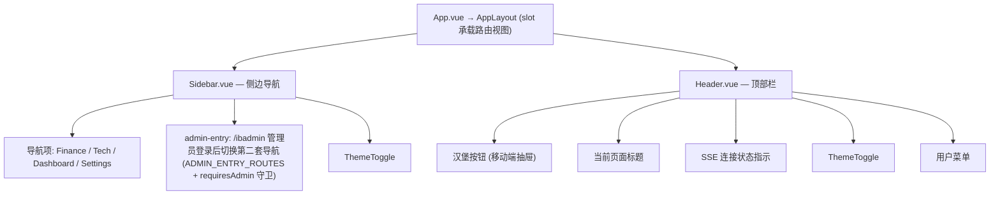
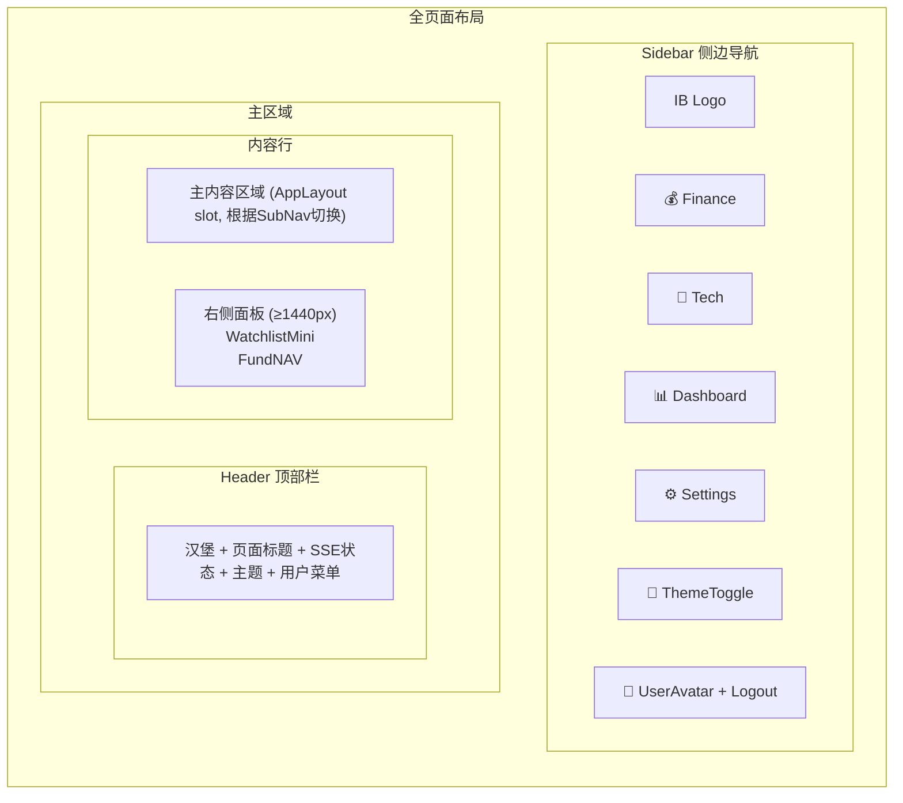

# InstantBoard 前端 UI 设计

## 1. 目标

定义 InstantBoard Vue 3 前端的完整 UI 设计，包括项目结构、组件层级、响应式布局策略、导航方案（含替代方案分析）、三个主 Tab 的详细界面、主题支持和移动端适配。

## 2. 方案概述

采用 **侧边导航 + 动态面板** 替代传统 Tab，通过 Vue 3 Composition API + Pinia 状态管理 + SSE 实时更新，实现响应式暗/亮色主题的实时信息聚合面板。

## 3. 详细设计

### 3.1 Vue.js 项目结构（与代码一致）

```
frontend/src/
├── App.vue                 # 根组件: AppLayout 包裹 + onMounted 初始化主题/路由守卫相关
├── main.ts                 # createApp + Pinia + Router（无 ThemePlugin）
├── api/                    # ← 补充：REST 请求层（基于 client.ts）
│   ├── client.ts           # axios 实例，baseURL/拦截器
│   ├── categories.ts
│   ├── dashboard.ts
│   ├── finance.ts
│   ├── sources.ts
│   └── tech.ts
├── router/                 # 路由: / → Finance, /tech, /dashboard, /settings, /login, /auth/callback, /ibadmin
├── views/                  # 共 7 个视图
│   ├── FinanceView.vue
│   ├── TechView.vue
│   ├── DashboardView.vue
│   ├── SettingsView.vue
│   ├── LoginView.vue
│   ├── SSOCallbackView.vue   # /auth/callback
│   └── AdminLoginView.vue    # /ibadmin（admin-entry 入口）
├── components/
│   ├── layout/             # Sidebar.vue / Header.vue / AppLayout.vue
│   │                       # （主内容容器是 AppLayout 的 slot；无 AppFooter/MainContent 组件）
│   ├── common/             # 实际 4 个:
│   │   ├── ErrorAlert.vue
│   │   ├── EmptyState.vue
│   │   ├── ThemeToggle.vue
│   │   └── LoadingSpinner.vue
│   │   # ⚠️ 未实现: MessageCard / SearchBar / Pagination / ConfirmationDialog
│   ├── finance/            # 实际 9 个:
│   │   ├── Watchlist.vue / WatchlistMini.vue / SearchSymbols.vue
│   │   ├── Commodities.vue / MarketIndices.vue / FundNAV.vue
│   │   ├── QuoteCard.vue / FinanceGrid.vue / FinanceSubNav.vue
│   │   # ⚠️ 未实现: MarketTicker / WatchlistPanel / StockDetail / FundDetail /
│   │   #   NAVCalculator / MarketIndexCard / CommodityCard / FinanceSearch / QuoteChart
│   ├── tech/               # TopicFilter.vue / NewsFeed.vue / NewsCard.vue / TopicTag.vue /
│   │   │                   # CategoryPanel.vue / TechSubNav.vue（补充）
│   │   # ⚠️ 未实现: TrendChart（话题热度图）
│   ├── dashboard/          # 实际 6 个:
│   │   ├── HealthPanel.vue / SystemStatus.vue / ServicesHealth.vue
│   │   ├── DataSourcesHealth.vue / SSEStats.vue / ChartWrapper.vue
│   ├── settings/           # CategoryEditor.vue / SourceEditor.vue / ProfileSettings.vue / ThemeToggle.vue
├── stores/                 # Pinia 共 6 个:
│   ├── auth.ts             # token/user/login-logout + 主题状态(theme/themeMode/colorScheme)
│   ├── finance.ts          # quotes, watchlist, indices, commodities + 逐面板错误态
│   ├── tech.ts             # news, topics
│   ├── dashboard.ts        # system, services, sources, sse stats
│   ├── settings.ts         # categories, sources（不含主题）
│   └── sse.ts              # SSE 频道状态汇总
├── composables/            # useSSE.ts(存在但零调用) / useAuth / useFetch / useResponsive / useTheme /
│                           # useWatchlist / useInfiniteScroll
├── types/
│   └── index.ts            # 单文件集中定义全部类型（非按域拆分）
├── utils/
│   ├── api.ts              # axios 封装（apiGet/Post/Put/Delete + 错误消息格式化）
│   ├── sse.ts              # ← 补充：SSEConnection 核心实现（连接/事件分发/自动重连）
│   ├── format.ts           # currency/percent/日期格式化
│   └── constants.ts        # BREAKPOINTS 断点、DEFAULT_THEME_MODE 等
└── styles/
    ├── variables.css       # CSS 变量（颜色/间距/断点），暗色用 [data-theme="dark"] 块
    └── global.css          # 全局样式（纯 CSS，无 .scss；sass 依赖未使用）
```

> ⚠️ **未实现组件集中标注**：MarketTicker（财经顶部滚动条）、StockDetail/FundDetail 模态抽屉、QuoteChart sparkline、右栏 Top News、Overview 混合视图、TrendChart（话题热度）、AppFooter、MessageCard/SearchBar/Pagination/ConfirmationDialog 公共组件。

### 3.2 组件层级设计（现状要点）



> Header 实际**只有**：汉堡按钮、页面标题、SSE 状态指示、ThemeToggle、用户菜单；**无全局搜索框、无通知中心**。

各视图布局摘要:

- **FinanceView**: FinanceSubNav + FinanceGrid；右栏（≥1440px）WatchlistMini + FundNAV；Overview 面板目前只渲染 MarketIndices（见 [finance-tab.md](finance-tab.md)）
- **TechView**: TechSubNav + TopicFilter + CategoryPanel×4 / NewsFeed 双视图（见 [tech-tab.md](tech-tab.md)）
- **DashboardView**: HealthPanel + 双列 flex（左 SystemStatus/DataSourcesHealth，右 ServicesHealth/SSEStats）（见 [dashboard-tab.md](dashboard-tab.md)）
- **SettingsView**: CategoryEditor / SourceEditor / ProfileSettings / ThemeToggle
- **LoginView**: SSO 按钮；SSOCallbackView 处理 /auth/callback；AdminLoginView 为 /ibadmin 独立入口

### 3.3 响应式布局策略

> ⚠️ 本节断点为早期草案（含 1366px 阈值），已被 §3.10 的统一断点标准（640/768/1024/1440/1920）取代，仅保留作为设计背景。

**基于 W3Schools 数据的断点设计**:

| 断点名称 | CSS 断点 | 目标分辨率 | 占比 | 布局策略 |
|---------|---------|----------|------|---------|
| **xs** | ≤768px | 手机/小平板 | ~6% | 单列，侧边栏折叠为抽屉 |
| **sm** | 768-1024px | 1024×768, 1280×800 | ~2% | 两列简化，侧边栏折叠，主内容全宽 |
| **md** | 1024-1366px | 1366×768 | ~18% | 两列，侧边栏展开，右侧面板简化 |
| **lg** | 1366-1920px | 1920×1080 | ~18% | 三列 (侧边栏 + 主内容 + 右侧面板) |
| **xl** | ≥1920px | >1920×1080 | ~47% | 三列，间距加大 |

**CSS 变量定义** (`variables.css`): 主题色见 §3.8；断点变量与 §3.10 一致。

### 3.4 导航方案分析

#### 方案对比

| 方案 | 优点 | 缺点 | 适合场景 |
|------|------|------|---------|
| **A: 传统 Tab** | 简单熟悉、实现容易 | 固定顶部占用空间、子tab嵌套混乱、扩展性差 | 3个简单页 |
| **B: 侧边导航** | 可折叠节省空间、子菜单自然、扩展性好 | 宽屏才好用、移动端需要抽屉模式 | 多页面/多功能 |
| **C: 拖拽式仪表盘** | 自由度高、个性化 | 实现复杂、布局易混乱、移动端困难 | 高度定制化需求 |
| **D: 侧边导航 + 面板切换** | 侧边导航优点 + 内容区灵活切换子面板 | 需要设计面板切换逻辑 | **InstantBoard 最佳选择** |

#### 最终推荐: **方案 D — 侧边导航 + 动态面板**

理由:
1. InstantBoard 有 3 个主要功能区 + 设置页，侧边导航比 tab 更优雅
2. Finance 页需要多个子面板 (Overview/Watchlist/Search/Indices/Commodities)，侧边导航配合子面板切换比嵌套 tab 更清晰
3. 侧边导航可折叠，在中小分辨率下节省空间
4. 未来新增模块只需在侧边导航添加一项，不需重构 tab 系统

**侧边导航设计**:



**移动端 (<768px)**: 侧边栏变为 off-canvas 抽屉，由 Header 汉堡按钮触发。

### 3.5 Tab1 财经界面详细设计

见 [finance-tab.md](finance-tab.md) 完整设计。

**核心布局（现状）**:
- 主内容区: FinanceSubNav (子面板切换) + FinanceGrid 动态内容
- 右侧面板 (≥1440px): WatchlistMini + FundNAV
- 搜索交互: 内联 QuoteCard（无抽屉/模态）

### 3.6 Tab2 科技界面详细设计

见 [tech-tab.md](tech-tab.md) 完整设计。

**核心布局**:
- 顶部: TechSubNav（一级领域）+ TopicFilter（二级标签单选）
- 主体: 四大领域 CategoryPanel（双视图可切换合并流 NewsFeed）

### 3.7 Tab3 Dashboard 界面详细设计

见 [dashboard-tab.md](dashboard-tab.md) 完整设计。

**核心布局（现状）**:
- 顶部: HealthPanel (总览，关键数字)
- 下方双列: 左 SystemStatus + DataSourcesHealth；右 ServicesHealth + SSEStats

### 3.8 暗色/亮色主题支持

**实现方案**: CSS 变量 + `data-theme` 属性切换；初始化在 `App.vue onMounted` 中调用 `authStore.initTheme()`（**无 ThemePlugin**，main.ts 仅安装 Pinia + Router）。

```
ThemeToggle → useTheme composable:
  - 主题状态 (theme / themeMode / colorScheme) 存于 stores/auth.ts
  - 支持 light / dark / system 三态循环切换（useTheme.ts）
  - 默认模式 DEFAULT_THEME_MODE = "system"（跟随系统）
  - system 模式下监听系统偏好并映射为具体主题
  - 切换 document.documentElement dataset.theme
```

**优先级**: 用户存储的模式选择（localStorage）> 默认 `system`（跟随操作系统偏好）。

**暗色主题设计要点**:
- 背景: 深蓝灰 (#0F172A / #1E293B)，不是纯黑
- 文字: 高对比度浅色 (#E2E8F0)
- 卡片: 微妙边框区分 (#334155)，不用阴影
- 图表: 使用透明填充色，网格线浅色

**涨跌配色方案 (可切换)**:

默认采用**中国配色** (红涨绿跌)，用户可在 SettingsView → ProfileSettings 中切换为**国际配色** (绿涨红跌)。配色方案存储在 `users.preferences.colorScheme` 中，前端经 `[data-color-scheme]` 选择器切换。

| 配色方案 | 上涨 (positive) | 下跌 (negative) | 适用场景 |
|---------|----------------|----------------|---------|
| **中国配色 (默认)** | 🔴 红色 `--up-color: #EF4444` / 暗色 `#F87171` | 🟢 绿色 `--down-color: #10B981` / 暗色 `#34D399` | 中国A股/港股用户直觉 |
| **国际配色 (可选)** | 🟢 绿色 `--up-color: #10B981` / 暗色 `#34D399` | 🔴 红色 `--down-color: #EF4444` / 暗色 `#F87171` | 美股/国际市场用户习惯 |

CSS 变量实现:
```css
:root {
  --up-color: #EF4444;    /* 中国配色默认: 红涨 */
  --down-color: #10B981;  /* 中国配色默认: 绿跌 */
}
[data-theme="dark"] {
  --up-color: #F87171;
  --down-color: #34D399;
}
[data-color-scheme="international"] {
  --up-color: #10B981;    /* 国际配色: 绿涨 */
  --down-color: #EF4444;  /* 国际配色: 红跌 */
}
[data-theme="dark"][data-color-scheme="international"] {
  --up-color: #34D399;
  --down-color: #F87171;
}
```

前端组件使用 `var(--up-color)` 和 `var(--down-color)` 替代硬编码颜色，所有涨跌相关 UI（Watchlist、MarketIndices、Commodities、QuoteCard）统一使用 CSS 变量。

### 3.9 移动端适配策略

| 组件 | 桌面 (≥1024px) | 平板 (768-1024px) | 手机 (<768px) |
|------|---------------|-----------------|-------------|
| Sidebar | 展开 220px | 折叠 60px (图标) | 隐藏，汉堡菜单抽屉 |
| 右侧面板 | ≥1440px 显示 | 隐藏 | 隐藏 |
| FinanceGrid | 双区(主+右栏) | 单列 | 单列 |
| NewsCard | 完整 (标题+摘要) | 同左 | 极简 (标题+来源+时间) |
| Dashboard 卡片 | 双列 | 双列 | 单列堆叠 |

**触控优化**:
- 所有可点击元素最小 44×44px 触控区域
> ⚠️ **未实现**：滑动手势（左滑删除自选项/右滑展开详情）、移动端 SSE 降频（心跳 30s→60s）— 全前端无相关代码。

### 3.10 响应式断点（现行统一标准，2026-08 修订）

取代 §3.3 草案中的旧断点（旧 `lg: 1366` 阈值全部迁移至 1440）。CSS 媒体查询（`variables.css`、`global.css` 及各组件 scoped 样式）与 JS 断点（`src/utils/constants.ts` 的 `BREAKPOINTS` + `src/composables/useResponsive.ts`）必须保持同一套阈值。

**断点表**:

| 档位 | JS 名称 | 宽度区间 | CSS 阈值 | 目标设备 | 布局行为 |
|------|---------|----------|----------|----------|----------|
| 1 | `xs` | <640px | `max-width: 767px`（与 sm 合并为移动端） | 手机竖屏（360–430px 宽） | 单列；侧边栏 off-canvas（汉堡+遮罩）；SubNav 下拉化 |
| 2 | `sm` | 640–767px | 同上 | 大屏手机 / 小平板 | 同 `xs`（仍走 <768px 移动端逻辑） |
| 3 | `md` | 768–1023px | `min-width: 768px` | 平板竖屏/横屏（768×1024 等） | 侧边栏折叠为 60px 图标栏；右栏隐藏 |
| 4 | `lg` | 1024–1439px | `min-width: 1024px` | 笔记本（含 1366×768、1536×864 缩放后、1280×800） | 侧边栏展开 220px；右栏隐藏 |
| 5 | `xl` | 1440–1919px | `min-width: 1440px` | 大屏笔记本/桌面（1536×864、1440×900） | 完整三列：侧边栏 + 主内容 + 300px 右栏 |
| 6 | `xxl` | ≥1920px | `min-width: 1920px` | 全高清及以上（1920×1080、2K） | 同 `xl`；主内容区 `max-width: 1600px` 居中，防止超宽拉伸 |

**数据来源**: w3schools 主流浏览器分辨率统计（Top resolutions: 1920×1080、1366×768、1536×864、1280×720 等），叠加移动端常见视口宽度 360/390/412px。目标浏览器为 Chrome/Edge/Safari/Firefox 现代版本，无需厂商前缀。

**配套规则**:
- 侧边栏遮挡补偿：`.main-area` 的 `margin-left` 跟随与 Sidebar 相同的折叠状态源（`useResponsive().sidebarCollapsed`），取值 `var(--sidebar-width)` / 折叠态 `var(--sidebar-collapsed-width)`，<768px 归零（off-canvas）。
- 内容宽度上限：`.main-content` 统一 `max-width: 1600px; margin: 0 auto;`，一处覆盖全部视图。
- 右栏显隐双保险：JS `showRightPanel`（≥1440px）与 CSS `--right-panel-width`/`max-width: 1439px` 隐藏规则阈值一致。

### 3.11 admin-entry 会话机制（补充）

- `ADMIN_ENTRY_ROUTES`（utils/constants.ts）定义管理员入口路由集（如 /ibadmin），router 配置 `requiresAdmin` 守卫
- 管理员登录后（AdminLoginView），**Sidebar 切换第二套导航**（管理员功能菜单，`Sidebar.vue`）
- 普通用户与管理员的导航/权限在同一会话内通过登录态区分
- 详见 [admin-login.md](admin-login.md)

## 4. 关键决策

| 决策 | 选择 | 理由 |
|------|------|------|
| 导航方案 | 侧边导航 + 动态面板 | 比传统Tab扩展性更好，子面板比子Tab更灵活 |
| 状态管理 | Pinia（6 个 store） | Vue 3官方推荐 |
| CSS策略 | 纯 CSS 变量 + `[data-theme]`（variables.css/global.css，无 SCSS） | 运行时切换、无构建期预处理依赖 |
| 图表库 | Chart.js (vue-chartjs, ChartWrapper 封装) | 轻量、满足Dashboard需求 |
| 图标库 | Lucide Icons | 轻量SVG图标、树摇优化 |
| HTTP客户端 | axios（api/client.ts 封装） | 拦截器方便(注入认证)、错误处理统一 |
| 响应式策略 | 6档断点分级 640/768/1024/1440/1920（见 §3.10） | 精确覆盖W3Schools分辨率分布 |
| 主题切换 | CSS变量 + data-theme，默认 system 三态 | 运行时切换、跟随系统 |
| SSE 实现 | `utils/sse.ts` SSEConnection（各 store 直接使用） | 统一重连/心跳；`composables/useSSE.ts` 存在但零调用，属遗留代码 |

> 依赖备注：`@vueuse/core` 已在 package.json 声明但代码中零使用（僵尸依赖，可在后续清理）。

## 5. 边界情况

- **SSE 断线重连**: `utils/sse.ts` SSEConnection 实现了自动重连（含退避），但**重连后不带 since 参数补拉**，缺失数据靠组件重挂载时的 REST 拉取补齐
> ⚠️ **未实现**：
> - 重连按 `since` 增量补拉（后端也无此参数）
> - `performance.memory` 低端设备降级
> - Service Worker 离线缓存

## 6. 与其他模块的依赖

- → [api.md](api.md): 前端消费的所有API端点
- → [finance-tab.md](finance-tab.md): 财经界面详细设计
- → [tech-tab.md](tech-tab.md): 科技界面详细设计
- → [dashboard-tab.md](dashboard-tab.md): Dashboard界面详细设计
- → [admin-login.md](admin-login.md): admin-entry 会话与导航机制
