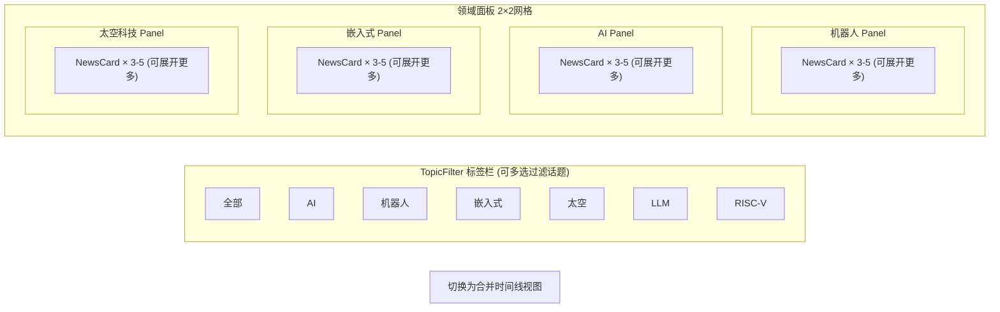
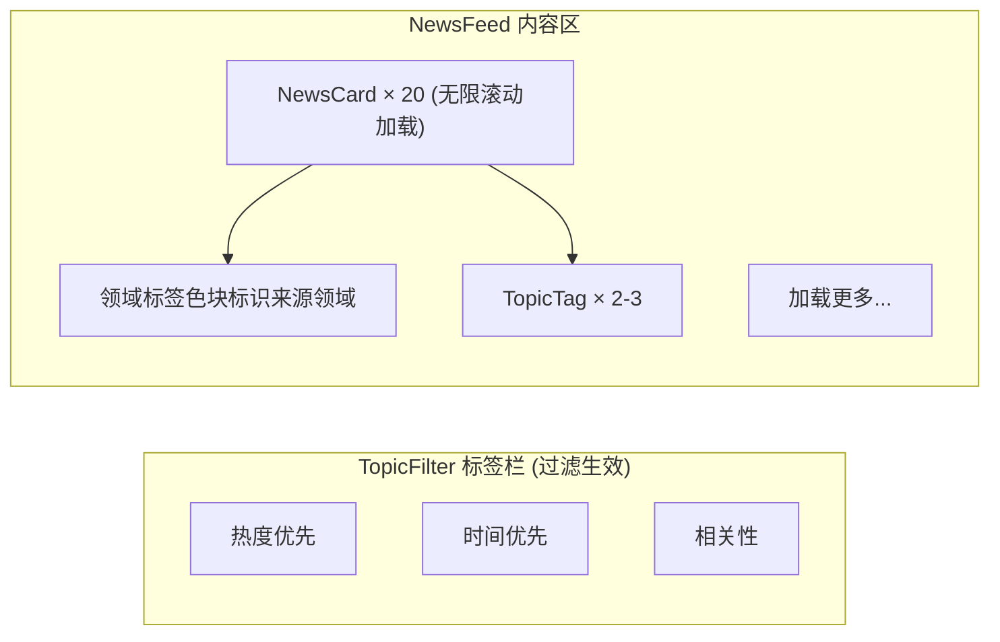
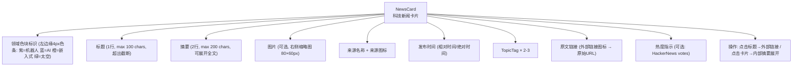
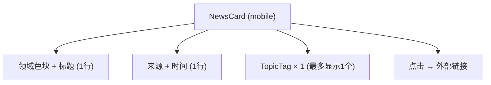
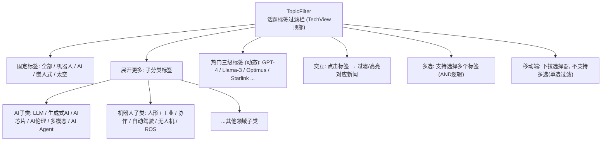
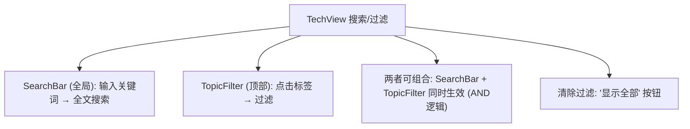

# InstantBoard 科技模块详细设计

## 目录

1. 目标
2. 方案概述
3. 详细设计
   - 3.1 四大领域定义与子分类
   - 3.2 各领域数据源选型
   - 3.3 新闻流展示设计
   - 3.4 话题标签与分类体系
   - 3.5 推荐算法/排序策略
   - 3.6 数据刷新频率
   - 3.7 搜索与过滤功能
   - 3.8 SSE 事件类型定义 (科技频道)
4. 关键决策
5. 边界情况
6. 与其他模块的依赖

## 1. 目标

定义 InstantBoard 科技聚合 Tab 的完整功能设计，覆盖四大领域（机器人、AI、大规模嵌入式、太空科技）的信息聚合、数据源选型、展示方案、话题标签体系、排序策略和刷新机制。

## 2. 方案概述

提供 **话题驱动的信息聚合面板**，四大领域以可展开/折叠的 CategoryPanel 展示，顶部 TopicFilter 标签栏支持跨领域话题筛选，新闻卡片按热度+时间混合排序，SSE 实时推送新条目。

## 3. 详细设计

### 3.1 四大领域定义与子分类

#### 3.1.1 领域总览

| 领域 | slug | 图标 | 主题色 | 核心关注话题 |
|------|------|------|--------|-------------|
| **机器人** | robotics | 🤖 | #8B5CF6 (紫) | 人形机器人、工业机器人、协作机器人、自动驾驶、无人机、机器人OS |
| **人工智能** | ai | 🧠 | #3B82F6 (蓝) | 大语言模型、生成式AI、AI芯片、AI伦理、多模态、AI Agent |
| **大规模嵌入式** | embedded | ⚡ | #F59E0B (橙) | IoT、边缘计算、RISC-V、实时OS、FPGA、芯片设计、嵌入式AI |
| **太空科技** | space | 🚀 | #10B981 (绿) | 商业航天、卫星互联网、深空探测、太空站、火箭回收、太空制造 |

#### 3.1.2 子分类与关注话题详细定义

**机器人领域子分类**:

| 子分类 | slug | 关注话题 |
|--------|------|---------|
| 人形机器人 | humanoid | Atlas, Optimus, Figure 01, 双足行走, 运动控制 |
| 工业机器人 | industrial | 焊接/装配/搬运, AMR, 柔性制造, 产线自动化 |
| 协作机器人 | cobot | UR, Franka, 安全标准ISO 10218, 人机协作 |
| 自动驾驶 | autonomous-driving | L4/L5, Waymo, Tesla FSD, 激光雷达, V2X |
| 无人机 | drone | eVTOL, 农业植保, 快递物流, 反无人机 |
| 机器人OS/软件 | robot-software | ROS2, MoveIt, Isaac Sim, 仿真平台 |

**人工智能领域子分类**:

| 子分类 | slug | 关注话题 |
|--------|------|---------|
| 大语言模型 | llm | GPT, Claude, Llama, Gemini, Sora, 推理能力, 长上下文 |
| 生成式AI | generative-ai | 图像生成(DALL-E/Midjourney), 视频生成, 3D生成, 音乐AI |
| AI芯片/硬件 | ai-hardware | NVIDIA GPU, TPU, NPU, Groq, 存算一体, HBM |
| AI伦理与治理 | ai-ethics | AI安全, 对齐问题, 监管法规, AI偏见, 可解释AI |
| 多模态AI | multimodal | 视觉语言模型, 语音AI, 跨模态理解, OCR |
| AI Agent/应用 | ai-agent | AutoGPT, LangChain, RAG, Coding Agent, AI助手 |

**大规模嵌入式领域子分类**:

| 子分类 | slug | 关注话题 |
|--------|------|---------|
| IoT与边缘计算 | iot-edge | MQTT, CoAP, 边缘推理, TinyML, 数字孪生 |
| RISC-V与处理器 | risc-v | 开源指令集, RV32/RV64, 向量扩展, 芯片实现 |
| 实时操作系统 | rtos | FreeRTOS, Zephyr, RTLinux, 时序保证 |
| FPGA与硬件加速 | fpga | Xilinx/Altera, HLS, 部分重配置, ASIC替代 |
| 芯片设计 | chip-design | EDA工具, 后摩尔定律, 3D封装, Chiplet |
| 嵌入式AI | embedded-ai | 模型量化, 端侧推理, NPU微架构, 低功耗AI |

**太空科技领域子分类**:

| 子分类 | slug | 关注话题 |
|--------|------|---------|
| 商业航天 | commercial-space | SpaceX, Blue Origin, Rocket Lab, 发射市场 |
| 卫星互联网 | satellite-internet | Starlink, Kuiper, OneWeb, 相控阵天线 |
| 深空探测 | deep-space | 月球基地, Mars, 望远镜, 行星科学 |
| 空间站与在轨服务 | orbital | ISS, Tiangong, 在轨制造, 空间碎片清除 |
| 火箭技术 | rocket-tech | 可回收, 液氧甲烷, 固体火箭, 发动机创新 |
| 太空制造与资源 | space-manufacturing | 太空3D打印, 月球采矿, 原位资源利用ISRU |

### 3.2 各领域数据源选型

#### 3.2.1 机器人领域数据源

| 数据源名称 | 类型 | URL/来源 | 频率 | 费用 | 推荐度 |
|-----------|------|---------|------|------|--------|
| **IEEE Robotics RSS** | RSS | ieee.org/publications/rss | 每日 | 免费 | ⭐⭐⭐ |
| **The Robot Report** | RSS/Web | robotreport.com | 每日 | 免费 | ⭐⭐⭐⭐ |
| **ROS Blog** | RSS | ros.org/blog | 每周 | 免费 | ⭐⭐⭐ |
| **HackerNews (robotics tag)** | RSS/API | hnrss.org/new?q=robot | 每小时 | 免费 | ⭐⭐⭐⭐⭐ |
| **Automotive News (autonomous)** | Web抓取 | autonews.com | 每日 | 免费(有限) | ⭐⭐⭐ |

#### 3.2.2 AI 领域数据源

| 数据源名称 | 类型 | URL/来源 | 频率 | 费用 | 推荐度 |
|-----------|------|---------|------|------|--------|
| **MIT Tech Review AI Feed** | RSS | technologyreview.com/feed | 每日 | 免费 | ⭐⭐⭐⭐⭐ |
| **HackerNews (AI/ML tag)** | RSS/API | hnrss.org/new?q=AI+machine+learning | 每小时 | 免费 | ⭐⭐⭐⭐⭐ |
| **Arxiv CS.AI** | RSS/API | arxiv.org/list/cs.AI/recent | 每日 | 免费 | ⭐⭐⭐⭐ |
| **OpenAI Blog** | RSS/Web | openai.com/blog | 不定期 | 免费 | ⭐⭐⭐⭐⭐ |
| **The Batch (Andrew Ng)** | RSS/Web | deeplearning.ai/the-batch | 每周 | 免费 | ⭐⭐⭐⭐ |

#### 3.2.3 大规模嵌入式领域数据源

| 数据源名称 | 类型 | URL/来源 | 频率 | 费用 | 推荐度 |
|-----------|------|---------|------|------|--------|
| **Embedded.com** | RSS | embedded.com/rss | 每日 | 免费 | ⭐⭐⭐⭐ |
| **RISC-V International Blog** | RSS/Web | riscv.org/blog | 每周 | 免费 | ⭐⭐⭐⭐⭐ |
| **Hackaday** | RSS | hackaday.com/blog/feed | 每日 | 免费 | ⭐⭐⭐⭐⭐ |
| **EE Times** | RSS/Web | eetimes.com | 每日 | 免费(有限) | ⭐⭐⭐⭐ |
| **Zephyr Project Blog** | RSS | zephyrproject.org/blog | 每月 | 免费 | ⭐⭐⭐ |

#### 3.2.4 太空科技领域数据源

| 数据源名称 | 类型 | URL/来源 | 频率 | 费用 | 推荐度 |
|-----------|------|---------|------|------|--------|
| **SpaceNews** | RSS | spacenews.com/feed | 每日 | 免费 | ⭐⭐⭐⭐⭐ |
| **NASA News** | RSS | nasa.gov/rss | 每日 | 免费 | ⭐⭐⭐⭐⭐ |
| **SpaceX Updates** | Web抓取 | spacex.com/updates | 不定期 | 免费 | ⭐⭐⭐⭐ |
| **ESA News** | RSS | esa.int/RSS | 每周 | 免费 | ⭐⭐⭐⭐ |
| **Ars Technica Space** | RSS | arstechnica.com/science | 每日 | 免费 | ⭐⭐⭐⭐⭐ |

#### 3.2.5 跨领域通用数据源

| 数据源名称 | 类型 | 覆盖领域 | 费用 | 推荐度 |
|-----------|------|---------|------|--------|
| **Reddit (r/artificial, r/robotics, r/embedded, r/space)** | API/Social | 全领域 | 免费(API限流) | ⭐⭐⭐⭐ |
| **Google News (tech section)** | RSS | 全领域 | 免费 | ⭐⭐⭐ |
| **Twitter/X Lists** | Social | 全领域 | 免费(有限)/付费 | ⭐⭐⭐ |

### 3.3 新闻流展示设计

#### 3.3.1 展示方案对比

| 方案 | 描述 | 优点 | 缺点 | 适用场景 |
|------|------|------|------|---------|
| **A: 纯卡片列表** | 所有新闻按时间排列 | 简单、直觉 | 无法体现领域差异、信息量大易迷失 | 通用新闻流 |
| **B: 领域面板分组** | 四大领域各一个面板 | 领域清晰、可折叠 | 切换成本高、跨领域话题不便 | 多领域聚合 |
| **C: 时间线式** | 时间轴+事件节点 | 时间感强 | 实现复杂、不适合高频信息 | 低频事件(如太空发射) |
| **D: 领域面板 + 合并流** | 面板分组为主，可切换合并流 | 兼顾领域区分和跨领域浏览 | 需两种布局切换逻辑 | **InstantBoard最佳** |

#### 3.3.2 最终推荐: **方案 D — 领域面板 + 合并流切换**

**默认视图: 领域面板分组**:



**合并流视图**:



#### 3.3.3 NewsCard 组件设计



**移动端 NewsCard 极简版**:


### 3.4 话题标签与分类体系

#### 3.4.1 标签层级设计

```mermaid
graph TD
    Root["话题标签层级"]

    Root --> L1["一级标签 (领域级, 4个固定)"]
    L1 --> robotics["robotics"]
    L1 --> ai["ai"]
    L1 --> embedded["embedded"]
    L1 --> space["space"]

    robotics --> L2R["二级标签 (机器人, 6个子分类)"]
    L2R --> humanoid["humanoid"]
    L2R --> industrial["industrial"]
    L2R --> cobot["cobot"]
    L2R --> autodrive["autonomous-driving"]
    L2R --> drone["drone"]
    L2R --> robosoft["robot-software"]

    ai --> L2A["二级标签 (AI, 6个子分类)"]
    L2A --> llm["llm"]
    L2A --> genai["generative-ai"]
    L2A --> aihw["ai-hardware"]
    L2A --> aiethics["ai-ethics"]
    L2A --> multimodal["multimodal"]
    L2A --> aiagent["ai-agent"]

    embedded --> L2E["二级标签 (嵌入式, 6个子分类)"]
    L2E --> iotedge["iot-edge"]
    L2E --> riscv["risc-v"]
    L2E --> rtos["rtos"]
    L2E --> fpga["fpga"]
    L2E --> chipdesign["chip-design"]
    L2E --> embai["embedded-ai"]

    space --> L2S["二级标签 (太空, 6个子分类)"]
    L2S --> comspace["commercial-space"]
    L2S --> satinet["satellite-internet"]
    L2S --> deepspace["deep-space"]
    L2S --> orbital["orbital"]
    L2S --> rockettech["rocket-tech"]
    L2S --> spacemfg["space-manufacturing"]

    L3["三级标签 (话题级, 动态生成, 无上限)"]
    L3 --> gpt4["gpt-4"]
    L3 --> llama3["llama-3"]
    L3 --> optimus["optimus"]
    L3 --> starlink["starlink"]
    L3 --> riscvv["risc-v-v"]
    L3 --> groq["groq"]
    L3 --> note["... (从新闻内容自动提取或手动标注)"]
```



#### 3.4.2 标签自动提取算法

```python
# processors/categorizer.py

class TechTopicExtractor:
    """
    从新闻标题和摘要中自动提取话题标签
    
    算法:
    1. 规则匹配: 关键词→标签映射表 (预定义200+关键词)
       如 "GPT" → tag:llm, "Starlink" → tag:satellite-internet
    2. TF-IDF辅助: 对无规则匹配的内容，提取高频术语作为候选三级标签
    3. LLM标注 (可选未来增强): 调用轻量LLM对标题+摘要分类
    
    映射表示例:
    keyword_to_tag = {
        "GPT": ["llm", "ai"],
        "transformer": ["llm", "ai"],
        "Optimus": ["humanoid", "robotics"],
        "ROS2": ["robot-software", "robotics"],
        "RISC-V": ["risc-v", "embedded"],
        "Starlink": ["satellite-internet", "space"],
        "SpaceX": ["commercial-space", "space", "rocket-tech"],
        "FPGA": ["fpga", "embedded"],
        "TinyML": ["embedded-ai", "embedded", "iot-edge"],
    }
    """
```

#### 3.4.3 TopicFilter UI 组件



### 3.5 推荐算法/排序策略

#### 3.5.1 排序策略对比

| 策略 | 公式 | 优点 | 缺点 | 适用 |
|------|------|------|------|------|
| **纯时间排序** | `sort by published_at DESC` | 简单公平 | 老新闻淹没重要新闻 | 默认fallback |
| **纯热度排序** | `sort by priority DESC` | 重要新闻突出 | 热度衰减慢、旧热点持续居顶 | HackerNews类 |
| **时间衰减热度** | `score = priority × e^(-λ × age_hours)` | 新鲜+重要兼顾 | 参数λ需调优 | **推荐主排序** |
| **用户相关性** | `score × user_interest_weight` | 个性化 | 需用户历史数据 | 未来增强 |

#### 3.5.2 最终推荐: **时间衰减热度排序 (默认) + 用户可选切换**

```python
# services/tech_service.py

def calculate_news_score(item: NewsItem, user_prefs: UserPrefs = None) -> float:
    """
    新闻评分公式:
    
    base_score = item.priority  (1-10, 数据源priority + 话题热度加权)
    age_hours = (now - item.published_at).total_seconds() / 3600
    
    # 时间衰减: 半衰期12小时 (λ = ln(2)/12 ≈ 0.0578)
    decayed_score = base_score * math.exp(-0.0578 * age_hours)
    
    # HackerNews votes 加权 (如有):
    if item.extra_data.get("hn_votes"):
        decayed_score += math.log(item.extra_data["hn_votes"]) * 0.5
    
    # 用户兴趣加权 (如有偏好):
    if user_prefs and item.topic_tags:
        overlap = len(set(item.topic_tags) & set(user_prefs.favorite_tags))
        decayed_score *= (1 + overlap * 0.2)
    
    return decayed_score
```

**排序模式切换** (前端提供3种):
- 🔥 热度优先: `sort by score DESC` (时间衰减热度)
- 🕐 时间优先: `sort by published_at DESC` (纯时间)
- 🎯 相关性: `sort by score × user_interest_weight DESC` (需用户偏好数据)

### 3.6 数据刷新频率

| 数据类型 | 刷新频率 | 缓存TTL (Redis) | 推送方式 |
|---------|---------|---------------|---------|
| RSS新闻 (主流源) | 5min | 10min | SSE item_update |
| RSS新闻 (低频源, 如NASA) | 30min | 30min | SSE item_update |
| HackerNews API | 2min | 5min | SSE item_update |
| Reddit API | 10min | 15min | SSE item_update |
| Web抓取 (SpaceX等) | 30min | 30min | SSE item_update |
| 话题热度统计 | 15min | 15min | SSE topic_stats_update |
| 搜索结果 | 按需 | 5min | REST API |

**与财经对比**: 科技资讯刷新频率整体低于财经行情，因为新闻更新频率远低于市场行情。RSS源5min检查一次新文章足够。

### 3.7 搜索与过滤功能

#### 3.7.1 搜索 API

```
GET /api/v1/tech/search?q=xxx&topic=ai&sort=score&page=1&page_size=20

搜索逻辑:
1. PostgreSQL items 表 full-text search (title + summary)
2. 使用 GIN索引 on topic_tags 过滤话题
3. 使用 GIN索引 on extra_data 过滤来源/领域
4. 搜索结果按当前排序策略排序
5. Redis缓存搜索结果 (TTL 5min)
```

#### 3.7.2 过滤维度

| 过滤维度 | 参数 | 类型 | 示例 |
|---------|------|------|------|
| 领域 | `topic` | 一级标签 | `topic=ai` |
| 子分类 | `subtopic` | 二级标签 | `subtopic=llm` |
| 数据源 | `source_id` | UUID | 指定HackerNews源 |
| 时间范围 | `since` | ISO8601 | `since=2026-06-20T00:00:00Z` |
| 关键词 | `q` | 全文搜索 | `q=GPT+benchmark` |

#### 3.7.3 前端交互



### 3.8 SSE 事件类型定义 (科技频道)

| 事件类型 | 数据内容 | 触发条件 | 频率 |
|---------|---------|---------|------|
| `item_update` | `{id, title, summary, url, source_name, category_id, topic_tags, published_at, priority}` | 新新闻条目入库 | 2-5min |
| `topic_stats_update` | `{tag, count, trending_change}` | 话题热度统计刷新 | 15min |
| `source_health_update` | `{source_id, name, source_type, status, previous_status, last_error, last_success_at, last_failure_at, avg_response_time_ms, ...}` — 完整行状态契约见[data-flow.md](data-flow.md) §3.5.4 | 数据源健康状态变更 | 实时 |
| `heartbeat` | `{timestamp}` | 保持连接 | 30s |

## 4. 关键决策

| 决策 | 选择 | 理由 |
|------|------|------|
| 四大领域范围 | 机器人/AI/嵌入式/太空 | 用户需求明确、领域边界清晰、每个领域有丰富数据源 |
| 展示方案 | 领域面板+合并流切换 | 兼顾领域区分和跨领域浏览，比纯列表更结构化 |
| 排序策略 | 时间衰减热度 (半衰期12h) | 新鲜+重要兼顾，避免旧热点霸占 |
| 标签体系 | 三级: 领域→子分类→话题 | 结构化且可扩展，一级4个固定、二级24个固定、三级动态 |
| 标签提取 | 规则匹配+关键词映射 | 简单可靠，比NLP更可控，后续可增加LLM标注 |
| 主数据源类型 | RSS (70%) + API (20%) + Web抓取 (10%) | RSS最稳定可靠，API补充高频源(HackerNews)，Web抓取补充无RSS的源 |
| 刷新频率 | 2-5min (RSS/API) / 30min (Web) | 新闻更新频率低于行情，5min检查已足够 |
| NewsCard设计 | 领域色块+标题+摘要+标签+链接 | 信息密度适中，领域色块快速识别归属 |

## 5. 边界情况

- **RSS源停更**: 源持续无新内容 >7天 → source_health标记"degraded"，前端提示"此源近7天无更新"
- **HackerNews API限流**: 429响应 → 降频(2min→10min) + 使用缓存数据
- **重复新闻**: 不同源报道同一事件 → 埻重基于 URL+published_at (见[database.md](database.md) items表UNIQUE约束)
- **跨领域新闻**: 一条新闻涉及多个领域 (如"太空中的AI") → 允许多个topic_tags，在所有相关面板中显示
- **新闻量大爆发**: 单日某领域>100条 (如AI重大突破) → 面板内显示"今日N条新消息"，默认折叠只显示top5
- **Web抓取反爬**: SpaceX等网站反爬 → 限制抓取频率、使用rotating User-Agent、失败后标记degraded
- **话题标签爆炸**: 三级标签数量增长过多 → 热门标签显示在TopicFilter，冷门标签需搜索才能发现
- **无用户偏好数据**: 新用户首次访问 → 默认时间衰减热度排序，不使用个性化加权

## 6. 与其他模块的依赖

- → [frontend.md](frontend.md): TechView 组件层级、布局、NewsCard设计
- → [api.md](api.md): 科技API端点 (`/api/v1/tech/*`)、SSE事件定义
- → [database.md](database.md): items表(topic_tags GIN索引)、categories表、sources表
- → [data-sources.md](data-sources.md): 科技数据源详细配置、RSS/API URL
- → [data-flow.md](data-flow.md): RSS采集→处理→去重→分类→推送完整流程
- → [content-categories.md](content-categories.md): 分类层级结构定义、标签体系规范
- → [architecture.md](architecture.md): tech模块职责划分