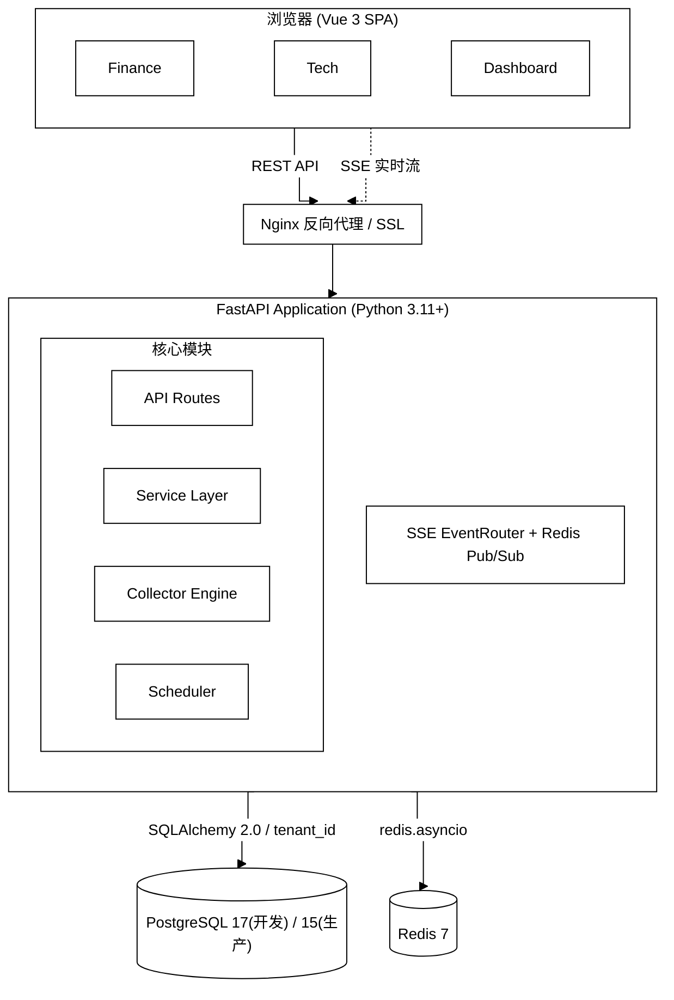

# 架构与代码导读

本页是 InstantBoard 的架构导读：技术栈全表、架构图与项目结构。架构与技术选型的完整理由见 [总体架构设计](design/architecture.md)。

## 技术栈

| 层级 | 技术 | 说明 |
|------|------|------|
| **前端** | Vue 3.4 + TypeScript + Vite 8 | Composition API, Pinia 状态管理, 手写 CSS（tailwindcss 仅为未使用的历史 devDependency） |
| **后端** | Python 3.11+ / FastAPI | Async 全链路, SQLAlchemy 2.0 ORM, APScheduler |
| **实时推送** | SSE + Redis Pub/Sub | 单向服务端推送, 30s 心跳, 自动重连 |
| **数据库** | PostgreSQL 17（开发）/ 15（生产·测试） | JSONB 支持, 应用层 `tenant_id` 隔离, 12 张核心表 |
| **缓存** | Redis 7 | 行情缓存 / 会话 / Pub/Sub / 限流 |
| **反向代理** | Nginx 1.25 | SSL, 静态资源, API 代理（limit_req 限流规则已注释，未启用） |
| **容器** | Docker Compose | 开发/生产统一编排 |
| **CI/CD** | GitHub Actions | Lint → Test → Build → Deploy |

## 架构图



API Routes 9 个端点模块、Service Layer 7 个业务服务、Collector Engine 7 个采集器；SSE 侧 7 种业务事件（+heartbeat）、5 个频道、30s 心跳。

## 项目结构

```
instantboard/
├── .env.example              # 环境变量模板
├── Makefile                  # 30+ 开发命令
├── LICENSE                   # GNU GPLv3
│
├── backend/                  # Python/FastAPI 后端
│   ├── app/
│   │   ├── main.py           # FastAPI 入口
│   │   ├── config.py         # Pydantic Settings
│   │   ├── dependencies.py   # FastAPI 依赖注入
│   │   ├── api/v1/           # 9 个 API 路由模块
│   │   │   ├── auth.py       # 认证 (SSO)
│   │   │   ├── finance.py    # 财经数据
│   │   │   ├── tech.py       # 科技资讯
│   │   │   ├── dashboard.py  # 监控仪表盘
│   │   │   ├── categories.py # 分类管理
│   │   │   ├── sources.py    # 数据源管理
│   │   │   ├── sse.py        # SSE 推送
│   │   │   ├── health.py     # 健康检查
│   │   │   └── admin.py      # 管理端点
│   │   ├── models/           # 12 个 SQLAlchemy 模型
│   │   ├── schemas/          # Pydantic 请求/响应 schema
│   │   ├── services/         # 7 个业务逻辑服务
│   │   ├── collectors/       # 7 个数据采集器 (4财经 + 3科技)
│   │   ├── processors/       # 4 个数据处理管道
│   │   ├── scheduler/        # APScheduler 任务编排
│   │   ├── core/             # 安全/Redis/中间件/SSE路由
│   │   ├── db/               # 数据库会话 + 种子数据
│   │   └── alembic/          # 数据库迁移
│   ├── requirements/         # base.txt / dev.txt / prod.txt
│   ├── Dockerfile            # 多阶段构建
│   └── entrypoint.sh         # 容器入口
│
├── frontend/                 # Vue.js 3 前端
│   ├── src/
│   │   ├── views/            # 7 个页面视图 (含 AdminLoginView、SSOCallbackView)
│   │   ├── components/       # 31 个 UI 组件
│   │   │   ├── layout/       # AppLayout, Header, Sidebar
│   │   │   ├── finance/      # 9 个财经组件
│   │   │   ├── tech/         # 6 个科技组件
│   │   │   ├── dashboard/    # 6 个监控组件
│   │   │   ├── settings/     # 3 个设置组件
│   │   │   └── common/       # 4 个通用组件
│   │   ├── stores/           # 6 个 Pinia 状态仓库
│   │   ├── composables/      # 5 个组合式函数
│   │   ├── api/              # API 客户端层
│   │   ├── types/            # TypeScript 类型定义
│   │   ├── utils/            # 工具函数
│   │   └── styles/           # 全局样式
│   ├── package.json
│   ├── vite.config.ts
│   └── Dockerfile            # 多阶段构建
│
├── docker/                   # Docker 编排
│   ├── docker-compose.yml    # 开发环境基础文件（刻意不发布宿主机端口）
│   ├── docker-compose.override.yml  # 开发专用覆盖（端口发布 + 源码热重载挂载）
│   ├── docker-compose.prod.yml  # 生产环境 (overlay)
│   ├── docker-compose.test.yml  # 测试环境
│   ├── nginx/                # Nginx 配置 + SSL
│   ├── postgres/             # 数据库初始化脚本
│   └── redis/                # Redis 配置
│
├── docs/                     # 文档（GitHub Wiki 内容源）
│   ├── Home.md               # wiki 着陆页
│   ├── _Sidebar.md           # wiki 侧边栏（特殊文件）
│   ├── _Footer.md            # wiki 页脚（特殊文件）
│   ├── user-guide/           # 用户手册 13 页
│   └── dev-guide/            # 开发者手册 3 页 + design/ 设计文档 16 份
│
├── scripts/                  # 运维脚本
│   ├── setup-dev.sh          # 一键初始化开发环境
│   ├── run-tests.sh          # 运行测试
│   ├── seed-data.sh          # 填充种子数据
│   ├── generate-migration.sh # 生成数据库迁移
│   ├── sync-wiki.sh          # docs/ → GitHub Wiki 同步
│   └── clean-dev.sh          # 清理开发环境
│
└── .github/workflows/        # GitHub Actions CI/CD
    ├── ci.yml
    ├── cd-staging.yml
    ├── cd-production.yml
    └── sync-wiki.yml
```

## 延伸阅读

- 数据管道与 SSE 推送流程：[数据流设计](design/data-flow.md)
- 数据库与缓存设计：[数据库设计](design/database.md)
- 前端架构：[前端设计](design/frontend.md)
- 部署与 CI/CD 基础设施：[基础设施设计](design/infrastructure.md)
