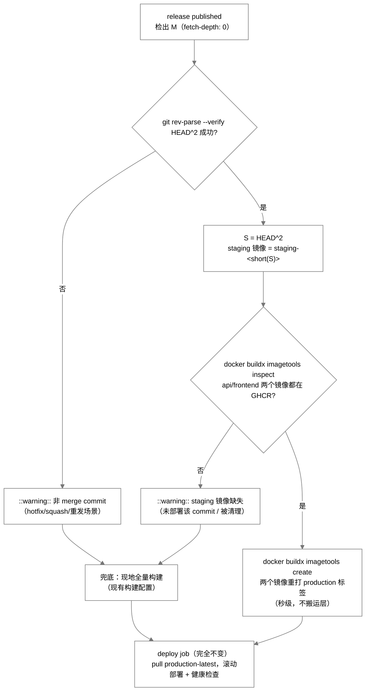

# InstantBoard CD 工作流优化设计 (cd-workflow-optimization)

> 本文是 [infrastructure.md](infrastructure.md) §3.3 CI/CD 章节的补充设计：不改变分支模型（`develop → staging → main + release published`）
> 与编排结构，仅优化三个 workflow 自身的**构建与交付策略**。

## 1. 目标

按优先级：

1. **阶段 1 —— 消除重复构建**
   - 修复 buildkit GHA 缓存的 scope 竞争（三个 workflow 共 6 处缓存配置全部零命中的根因），使依赖不变时 arm/v7 `pip install` 层命中缓存，staging 部署总时长从 ~31min 降至 **~6–8min**；
   - 生产发布改为 **build-once, promote**：release 时不再重建多架构镜像，而是把已在 staging 验证过的镜像重打标签。
2. **阶段 2 —— 降低缓存未命中时的模拟开销**
   - 在依赖变更/首次构建等场景下，压缩 ~24min 的 QEMU 模拟编译（最大杠杆是 uvloop 的去留决策，需用户拍板）。

## 2. 背景与实测数据摘要

### 2.1 实测耗时（最近两次成功的 `cd-staging` 运行）

| 环节 | 耗时 | 说明 |
|------|------|------|
| workflow 总时长 | 31m24s / 32m20s | |
| Build and push backend image | 26m01s（占总时长 **83%**） | arm/v7 QEMU 模拟 `pip install` ≈ 24min；其中源码编译 8 个 wheel 占 19.5min：**uvloop 11.6min、asyncpg 5.7min、cffi 47s、greenlet 41s**；amd64 原生同步骤仅 37.3s |
| Build and push frontend image | 27s | frontend/Dockerfile 的 `builder` 阶段已用 `--platform=$BUILDPLATFORM` 原生构建，**不在本次优化范围内** |
| Deploy via SSH | 4m10s | 以 RPi2 staging 主机拉取镜像为主 |
| Smoke test | 17s | |

其他基线数据：

- `cd-production.yml` **从未运行过**（仓库 0 个 release），其构建配置与 staging 同构，故一次全新发布构建同样约 31min；
- `ci.yml` 总时长 ~4m12s，其中 `build-docker` job（amd64-only、`push: false`、仅验证）约 1m41s。

> 2026-08-28 补充：staging 流水线最前端现已新增 `wait-for-ci` 门禁 job（`needs` 不能跨工作流，故显式轮询同一提交的 `ci.yml` 运行，成功后才进入 `build-and-push`）。本表的耗时口径不含门禁等待时间。

### 2.2 缓存零命中根因（已源码级定位）

三个 workflow 共 6 处 `cache-from: type=gha` / `cache-to: type=gha,mode=max` **均未指定 scope**，全部落到同一个默认索引键
`index-buildkit-1-{sha256(ref)[:8]}`。

buildkit 的 GHA 缓存导出（buildkit `cache/remotecache/gha/gha.go` 的 `Finalize()`）对索引是**整体替换**而非合并：每次导出都丢弃旧索引、写入新 blob。
CI backend / CI frontend / CD staging backend / CD staging frontend（含 cd-production 同构配置）这些写者交替覆写同一索引，而导入侧只读取最新索引 →
每次导入到的都是“另一种构建”的记录 → **永久性零命中循环**。Actions Cache 中实际存有 339 个 buildkit blob（~6GB）：内容在，索引错位。

修复方向：**一个 scope 一个写者**（见 §4.1）。

### 2.3 用户确认的约束

1. 只用 GitHub **公共 hosted runner**（无 self-hosted、无原生 ARM runner）；
2. staging 主机为 RPi2（arm/v7），生产主机**同时有 armv7 与 amd64** → 平台集合维持 `linux/amd64,linux/arm/v7`；
3. staging → main 通过 **merge commit** 合并（release 对应的 main commit sha ≠ staging commit sha，但 merge commit 的第二父提交 = staging 顶点）;
4. 分支流：develop → staging（push 即部署）→ main + GitHub Release（published 触发生产部署）；
5. uvloop 是否可移除：本文 §3 完成查证，结论待用户拍板（§9-①）。

## 3. 目标平台 wheel 可用性查证（阶段 2 的前置事实）

### 3.1 查证方法与日期

2026-08-25 通过 PyPI Simple API（`https://pypi.org/simple/<pkg>/`，PEP 503）获取各包**全部发布版本**的分发文件清单，
对全部 `.whl` 文件名检索 `armv7l`。四个源码编译大户均为零匹配。约束的解析结果按 `backend/requirements/base.txt` 现状
（`>=` 区间约束，pip 解析到兼容范围内的最新版）。

### 3.2 结论表（四大编译项）

| 包 | 约束来源 | 解析结果 | 有无 `cp311` + `armv7l` wheel | 结论 |
|----|----------|----------|-------------------------------|------|
| **uvloop** | `uvicorn[standard]` 的 extra | 0.22.1 | ❌ PyPI 全历史无（仅 x86_64/i686/aarch64/macOS） | 只能源码编译；11.6min 是最大编译项 → 见 §5.1 与 §9-① |
| **asyncpg** | `>=0.29.0,<0.32`（刻意上界，见 base.txt 注释） | 0.31.0 | ❌ 任何版本均无（仅 x86_64/i686/aarch64/macOS/Windows） | 只能源码编译（5.7min）；**放宽或改锁版本都不会带来 wheel** |
| **cffi** | cryptography 间接引入（python-jose[cryptography]） | 最新（查证时 1.17.x 系） | ❌ PyPI 全历史无 | 只能源码编译，但仅 47s，可接受 |
| **greenlet** | sqlalchemy[asyncio] 间接引入（实测构建中确有安装并编译） | 最新（查证时 3.x 系） | ❌ PyPI 全历史无 | 只能源码编译，但仅 41s，可接受 |

### 3.3 推断必然存在 armv7l wheel 的包

反证推理：staging 的 `linux/amd64,linux/arm/v7` 构建**成功**，而 backend/Dockerfile 的 `builder` 阶段只安装了
`build-essential / libssl-dev / libffi-dev`（无 Rust 工具链、无 libxml2-dev），凡“源码形态在该环境编不出来”的包必然是靠 wheel 装上的：

| 包 | 来源 | 推理 |
|----|------|------|
| cryptography | `python-jose[cryptography]` | 源码编译需 Rust 工具链 → 必有 wheel |
| pydantic-core | `pydantic>=2.5` | Rust/maturin 构建 → 必有 wheel |
| bcrypt | `passlib[bcrypt]` | Rust 构建（4.0 起）→ 必有 wheel |
| lxml | `lxml>=4.9.0` | 源码编译需系统库 libxml2-dev/libxslt-dev，builder 未安装 → 必有 wheel |
| watchfiles | `uvicorn[standard]` 的 extra | Rust 构建 → 必有 wheel（§5.1 移除 uvloop 后，该包随 extra 一起消失） |

### 3.4 关键推论

1. 四大编译项在 **PyPI 任何历史版本都没有** armv7 wheel → “锁定到有 wheel 的版本”（选项 c）没有出路，不可行；
2. `pip download --only-binary=:all: --platform manylinux*_armv7l` 只要依赖图中**任一**包无 wheel 就整体失败 → “全二进制安装”路径对完整依赖树不成立（§5.2）；
3. 冷缓存时 QEMU 编译开销的下限 = asyncpg 5.7min + cffi/greenlet 等小包 ~2min + 解析/安装模拟开销 → 阶段 2 的理论上限是把 24min 压到 ~10min，再往下需要换依赖或换工具链（§10）。

## 4. 阶段 1 设计：消除重复构建

### 4.1 缓存 scope 分离（修复零命中）

**原则：一个 scope 恰好一个写者；读者不限。** 读取/导入不触碰索引，天然无竞争。

scope 分配：

| scope | 写者 | 读者 |
|-------|------|------|
| `staging-backend` | cd-staging backend | cd-staging backend、cd-production backend（兜底构建）、ci build-docker（只读） |
| `staging-frontend` | cd-staging frontend | 同上（frontend 对应） |
| `production-backend` | cd-production backend（仅兜底构建时） | cd-production backend |
| `production-frontend` | cd-production frontend（仅兜底构建时） | cd-production frontend |

**CI `build-docker` 评估结论：只读不写**（不配 `cache-to`）。理由：

1. CI 构建是 amd64 单平台验证性构建（`push: false`），整个 job 仅 ~1m41s，自产缓存的价值低；
2. staging scope 以 `mode=max` 写入，已包含 amd64 侧的完整层级记录，CI 直接读它即可获得高命中率；
3. 少一个写者 = 少一份索引轮换与缓存条目增长（仓库缓存已占 ~6GB）；
4. 老默认 scope 下 CI 的 backend/frontend 两个 job 也在互相覆写，本就是零命中问题的一部分。

**改动点与配置片段**（仅改缓存两行，其余配置不动）：

`.github/workflows/cd-staging.yml`（两处，对应现文件 52-53 / 66-67 行）：

```yaml
      - name: Build and push backend image
        uses: docker/build-push-action@v7
        with:
          ...
          cache-from: type=gha,scope=staging-backend
          cache-to: type=gha,scope=staging-backend,mode=max

      - name: Build and push frontend image
        uses: docker/build-push-action@v7
        with:
          ...
          cache-from: type=gha,scope=staging-frontend
          cache-to: type=gha,scope=staging-frontend,mode=max
```

`.github/workflows/ci.yml`（两处，对应现文件 203-204 / 213-214 行，改为只读）：

```yaml
      - name: Build backend Docker image
        uses: docker/build-push-action@v7
        with:
          ...
          push: false
          cache-from: type=gha,scope=staging-backend
          # 只读，无 cache-to：CI 是验证性构建，不做缓存写者（见设计文档 §4.1）

      - name: Build frontend Docker image
        ...
          push: false
          cache-from: type=gha,scope=staging-frontend
```

`.github/workflows/cd-production.yml`（兜底构建的缓存配置；`cache-from` 同时读两个 scope，自身 scope 在前）：

```yaml
          cache-from: |
            type=gha,scope=production-backend
            type=gha,scope=staging-backend
          cache-to: type=gha,scope=production-backend,mode=max
```

> ⚠️ **一次性冷启动代价**：scope 变更后，新 scope 全部冷启动（旧默认 scope 缓存不再被引用），合入本改动后的**第一次**
> staging 构建仍是 ~31min。存量清理（可选）：旧默认 scope 的索引与孤儿 blob 已不会被任何 workflow 引用，可用
> `gh cache list` / `gh cache delete` 批量删除，或留给 GitHub 按 LRU 自动淘汰（仓库缓存上限 10GB）。

**预期效果**：依赖不变时，后续 staging 构建的 arm/v7 `pip install` 层 CACHED，“Build and push backend image” 从 26m01s 降至 ~3–5min，workflow 总时长降至 ~6–8min。

### 4.2 生产部署：build-once, promote

**目标**：release published 时不从零重建 `linux/amd64,linux/arm/v7`，而是把 staging 已验证的多架构镜像秒级重打标签。

**定位 staging 镜像**：release 事件检出 release 对应的提交 `M`（合入 main 的 merge commit）；
`M^2`（第二父提交）= 合并时的 staging 顶点 `S`；staging 部署时构建的镜像为 `staging-<short(S)>`
（cd-staging.yml:38 的 `sha_short` 用 `git rev-parse --short HEAD` 计算；本设计用同一命令计算 `S`，保证短 sha 口径一致）。

**流程**：



**关键脚本片段**（cd-production.yml 的 `build-and-push` job 重构如下；`deploy` job 保持现状）：

```yaml
  build-and-push:
    name: Build or Promote Production Images
    runs-on: ubuntu-latest
    permissions:
      contents: read       # checkout 全历史以解析 HEAD^2
      packages: write      # GHCR 登录：imagetools create / 兜底构建推送
    steps:
      - name: Checkout
        uses: actions/checkout@v7
        with:
          fetch-depth: 0    # HEAD^2 需要完整历史；默认 fetch-depth=1 解析不到父提交

      - name: Set up Docker Buildx
        uses: docker/setup-buildx-action@v4

      - name: Login to GHCR
        uses: docker/login-action@v4
        with:
          registry: ghcr.io
          username: ${{ github.actor }}
          password: ${{ secrets.GITHUB_TOKEN }}

      - name: Extract metadata
        id: meta
        run: |
          echo "sha_short=$(git rev-parse --short HEAD)" >> $GITHUB_OUTPUT
          echo "release_tag=${GITHUB_REF#refs/tags/}" >> $GITHUB_OUTPUT

      - name: Decide promote or fallback build
        id: decide
        run: |
          set -euo pipefail
          STAGING_SHA="$(git rev-parse --verify --quiet HEAD^2 || true)"
          if [ -z "$STAGING_SHA" ]; then
            echo "::warning::release commit is not a merge commit (no second parent) — falling back to full build"
            echo "mode=build" >> "$GITHUB_OUTPUT"
            exit 0
          fi
          SHORT="$(git rev-parse --short "$STAGING_SHA")"
          API="ghcr.io/${{ env.IMAGE_PREFIX }}-api:staging-$SHORT"
          FE="ghcr.io/${{ env.IMAGE_PREFIX }}-frontend:staging-$SHORT"
          if docker buildx imagetools inspect "$API" >/dev/null 2>&1 \
             && docker buildx imagetools inspect "$FE" >/dev/null 2>&1; then
            echo "::notice::promoting staging images (S=$SHORT)"
            echo "mode=promote" >> "$GITHUB_OUTPUT"
            echo "staging_short=$SHORT" >> "$GITHUB_OUTPUT"
          else
            echo "::warning::staging-$SHORT images not found in GHCR (never deployed / cleaned up) — falling back to full build"
            echo "mode=build" >> "$GITHUB_OUTPUT"
          fi

      - name: Promote staging images (retag, no rebuild)
        if: steps.decide.outputs.mode == 'promote'
        run: |
          set -euo pipefail
          SHORT="${{ steps.decide.outputs.staging_short }}"
          for name in api frontend; do
            docker buildx imagetools create \
              --tag "ghcr.io/${{ env.IMAGE_PREFIX }}-$name:production-latest" \
              --tag "ghcr.io/${{ env.IMAGE_PREFIX }}-$name:production-${{ steps.meta.outputs.sha_short }}" \
              --tag "ghcr.io/${{ env.IMAGE_PREFIX }}-$name:${{ steps.meta.outputs.release_tag }}" \
              "ghcr.io/${{ env.IMAGE_PREFIX }}-$name:staging-$SHORT"
          done

      - name: Set up QEMU
        if: steps.decide.outputs.mode == 'build'
        uses: docker/setup-qemu-action@v3

      - name: Build and push backend image (fallback)
        if: steps.decide.outputs.mode == 'build'
        uses: docker/build-push-action@v7
        with:
          ...   # 保留现配置（context/file/target/platforms/tags），缓存按 §4.1 修改

      - name: Build and push frontend image (fallback)
        if: steps.decide.outputs.mode == 'build'
        ...
```

**设计要点**：

| 要点 | 决策 | 理由 |
|------|------|------|
| `production-<sha>` 用哪个 sha | **release/merge commit `M` 的短 sha**（`steps.meta.outputs.sha_short`） | ① 两条路径口径一致：兜底构建从 `M` 检出，打的就是 `production-<short(M)>`；promote 沿用同一口径后，`production-<sha>` 语义恒为“该发布对应的 main 状态”，可用 `git log`/release 页面直接反查；② 来源信息不丢：promote 步骤日志输出 `M→S` 映射，且 `staging-<S>` 标签保留在 GHCR 可追溯。 |
| 存在性检查 | `docker buildx imagetools inspect`（退出码非 0 即不存在） | buildx 已就位、支持 manifest list、无额外依赖；GHCR 需要登录态 → 复用现有 `docker/login-action` 步骤（workflow 声明的 `packages: write` 权限足够）。不用 `docker pull`（拉 ~数百 MB 层只为验证存在，浪费）。 |
| 重打标签机制 | `docker buildx imagetools create --tag ... SOURCE` | 直接走 registry API：源与目标在同一 registry 时**只写新 manifest、不搬运任何层**，秒级完成；manifest list 结构原样保留（amd64 + arm/v7 俱在），双架构生产主机各自拉到正确架构。 |
| QEMU 步骤 | 加 `if: mode == 'build'` | promote 路径无需安装 QEMU，再省 ~20s。 |
| `fetch-depth: 0` | 必须 | 默认浅检出（depth=1）无法 `rev-parse HEAD^2`。 |
| `deploy` job | **保持现状**（cd-production.yml:72-190） | `needs: build-and-push`、`IMAGE_TAG=production-latest`、滚动部署、健康检查、`TODO(cd-parity)` 注释均不动；promote 与构建产出完全相同的三个标签，下游无感知。 |

**与现有 "Rollback on failure" 步骤的相互作用**（cd-production.yml:192-224）：

- 回滚的逻辑与依赖**不变**：`failure()` 时回滚到 `IMAGE_TAG="staging-latest"`；
- promote 后的新现象：若发布切出后 staging 未前进，`production-latest` 与 `staging-latest` 指向**同一个 manifest digest**（promote 只是重打标签）——
  此时回滚等价于“重新部署刚失败的镜像”，起不到恢复作用。这不是 promote 引入的新问题：
  cd-production.yml:203-215 的注释自己就把它列为限制 1（“staging-latest 可能含同一个坏 commit”），全量构建路径的内容来源同样如此；promote 只是让“同一镜像”更直观（digest 相同）；
- 附带的好处：digest 相同时，回滚的 `pull` 在宿主机直接命中本地层缓存，回滚更快；
- 可选增强（**不属于本设计默认范围**，见 §9-③）：在健康检查通过后把本次部署标签写入宿主
  `/opt/instantboard/.last-known-good`，回滚步骤优先读该文件、读不到再退回 `staging-latest`——即回滚步骤注释中已指明的 “last-known-good marker” 方向。

## 5. 阶段 2 设计：降低缓存未命中时的 QEMU 模拟开销

> 阶段 2 仅在冷构建场景（依赖变更 / 缓存被淘汰 / 首次构建）生效；稳态场景阶段 1 的缓存已解决。

### 5.1 最大杠杆：移除 uvloop 与否（需用户拍板）

查证结论（§3.2）：uvloop 在 PyPI **任何版本**都没有 armv7 wheel → 它的 11.6min 编译是 QEMU 下的固定成本；
选项 (c)“锁到有 wheel 的版本”不可行。只剩：

| 选项 | 内容 | 评估 |
|------|------|------|
| **(a) 移除 uvloop** | base.txt 中 `uvicorn[standard]>=0.24.0` 改为 `uvicorn>=0.24.0` | **设计侧推荐**。冷构建省 11.6min；运行影响对本项目为无（见下方分析）；改动可逆 |
| (b) 保留，接受编译 | 维持现状 | 零风险；冷构建每次照付 11.6min |
| (c) 锁到有 wheel 的版本 | — | 不可行：PyPI 全历史无 wheel（§3.2） |

**决策记录**：用户最终选择 **选项 (b)——保留 uvloop，不移除**；冷构建接受 11.6min 的 QEMU 源码编译（预期收益见 §6，决策见 §9-①）。
选项 (c) 已被 §3.2 查证否决（PyPI 全历史无 armv7l wheel）；选项 (a) 的运行影响分析保留如下作为决策依据存档，其改动点清单不再适用（已删除）。

**选项 (a) 的运行影响分析**——失去 `uvicorn[standard]` 同时失去 uvloop / httptools / websockets / watchfiles / python-dotenv / pyyaml，逐项对照本项目：

| 失去项 | 影响 |
|--------|------|
| uvloop → 事件循环退回标准 asyncio | api 容器为 `gunicorn --worker-class uvicorn.workers.UvicornWorker`、`--workers 1`；uvicorn 的 `loop=auto` 在无 uvloop 时自动使用 asyncio。本项目 IO-bound（异步 DB + httpx 抓取 + SSE 长连接）、单 worker 低 QPS 的仪表盘，循环调度开销不构成瓶颈。代码检索确认**整个 backend 无任何显式 `uvloop` 引用**——worker 容器（`python -m app.scheduler.worker`，APScheduler）也不经 uvloop，影响面仅 api 容器的 HTTP 事件循环。**评估：无实际影响** |
| httptools → HTTP 解析退回 h11（纯 Python） | `http=auto` 自动用 h11，低 QPS 下每请求解析开销差异为微秒级。**评估：无实际影响** |
| websockets | 代码检索确认 backend 无 WebSocket 使用（实时推送全部走 SSE）。**无影响** |
| watchfiles | 仅 `--reload` 热重载用；生产是 gunicorn 不带 reload。开发 compose 的 `uvicorn --reload` 会退回 StatReload（轮询、略慢）——下方改动清单的精化实现为 dev/CI 环境保留 `[standard]`，消除此影响 |
| python-dotenv / pyyaml | 项目配置读取走 `pydantic-settings` + `.env`，不依赖这两个包。**无影响** |

### 5.2 论证：为什么不做“全二进制安装”（纯 `--no-index`）

理想路径是：原生下载目标平台 wheel → 目标平台镜像里纯 `pip install --no-index --find-links` 安装，彻底摆脱 QEMU 编译。
但按 §3.2/§3.4：

```
pip download --dest /wheels \
  --platform manylinux2014_armv7l --platform manylinux_2_17_armv7l \
  --python-version 311 --implementation cp --abi cp311 \
  --only-binary=:all: -r requirements/prod-binary.txt
```

- `--platform` 与 `--only-binary=:all:` 是**强制搭配**；依赖图中任何一个包缺 armv7l wheel（本项目：asyncpg、cffi、greenlet，若保留还有 uvloop），pip 整体解析失败、一个 wheel 都不会下载——不存在“部分成功”语义；
- 因此只要四大编译项还在依赖树里，全量 `--no-index` 路径就不成立；
- 附带回答“纯 `--no-index` 安装的 QEMU 开销是否可接受”：**可以接受**——只解包预编译包、不编译，该依赖树在 GHA runner 的 QEMU 下估计 2–4min；被卡住的不是安装速度，而是 wheel 缺失。若未来上游开始提供 armv7 wheel，本条路径可重新启用。

### 5.3 交叉构建混合方案（本次实施方案）

保留 uvloop 的前提下（§5.1 决策记录），冷构建的 QEMU 成本 ≈ 源码编译 ~19.5min（uvloop 11.6min + asyncpg 5.7min + cffi/greenlet 等小包 ~1.5min，均不可免除，§3.2）
+ 解析/下载/安装模拟开销 ~4–5min ≈ 24–26min（§2.1 实测 backend 构建 26m01s）。
混合方案把**有 wheel 的包**的下载移到原生 amd64 阶段，在此基础上再省 2–4min 的下载/解析开销：

```dockerfile
# backend/Dockerfile 示意：新增原生 wheel 下载阶段
FROM --platform=$BUILDPLATFORM python:3.11-slim AS wheel-fetcher
WORKDIR /app
COPY requirements/prod-binary.txt requirements/prod-binary.txt
# 在 amd64 原生下载目标平台 wheel：快，不经过 QEMU
RUN pip download --dest /wheels \
      --platform manylinux2014_armv7l --platform manylinux_2_17_armv7l \
      --python-version 311 --implementation cp --abi cp311 \
      --only-binary=:all: -r requirements/prod-binary.txt

FROM python:3.11-slim AS builder      # 该阶段在 arm/v7 上仍走 QEMU
COPY --from=wheel-fetcher /wheels /wheels
COPY requirements/ requirements/
RUN pip install --no-cache-dir --upgrade pip && \
    # 有 wheel 的包优先走本地仓库（免 QEMU 下载）；
    # 无 wheel 的包（asyncpg/cffi/greenlet 等）继续走 PyPI sdist 编译
    pip install --no-cache-dir --find-links /wheels -r requirements/prod.txt
```

配套要求：拆分一份 `prod-binary.txt`（可二进制下载的包清单；不止一级包，还须包含有二进制传递依赖的包如
pydantic-core），与现有 prod.txt 并存；amd64 路径不受影响（amd64 下 `/wheels` 为空即完全退回现状行为，
也可按 `TARGETPLATFORM` 分支跳过 `wheel-fetcher`）。

### 5.4 QEMU 调优参数评估：不值得做

`docker/setup-qemu-action` 支持传 QEMU 参数（如 `cpu` 型号）。对**编译器型负载**，瓶颈在 QEMU 的指令翻译吞吐（TCG），
CPU 型号调整通常收益 <10%，还可能引入指令集兼容问题；实测 19.5min 以编译器运行（uvloop 为 Cython + -O2 生成代码）为主，调参无法本质改善。**结论：不做。**

## 6. 预期收益汇总

| 场景 | 现状实测 | 仅阶段 1 后（scope + promote） | 阶段 1 + 阶段 2（混合交叉构建，保留 uvloop） |
|------|----------|--------------------------------|--------------------------------|
| staging 常规推送（依赖不变，稳态） | 31m24s – 32m20s | **~6–8min**（backend 构建 26m → ~3–5min；宿主 pull 仅传变更层亦缩短） | 同左 |
| staging 依赖变更推送（冷构建） | ~31min | ~31min（scope 只修稳态） | 预计 ~24–26min（uvloop 11.6min + asyncpg 5.7min 编译保留；混合构建省 2–4min 下载/解析；首次落地后以实测回填） |
| 生产发布（promote 成功） | 未实测;按同构配置 ≈ 构建 26min + 部署 | **重打标签 ~1min + 部署**（部署时长照旧） | 同左 |
| 生产发布（兜底全量构建，依赖与 staging 一致） | — | **构建 ~7–9min**（读 `staging-*` scope 缓存命中），总 ~15min | 同左 |
| ci build-docker | ~1m41s | 稳态 ~1min（读 staging 缓存）；冷构建不变 | 同左 |

> 注意一次性冷启动代价：scope 变更后的第一次 staging 构建仍约 31min（缓存冷启动，§4.1）。

## 7. 风险与回退策略（逐改动点）

| # | 改动 | 文件 | 风险与缓解 | 回退方法 |
|---|------|------|------------|----------|
| 1 | 缓存 scope 分离 | 三个 workflow 共 6 处 | 低。变更后第一次构建全冷（§6 注）；旧默认 scope 缓存不再被引用（可清理，§4.1） | `git revert` 改回 6 行即可 |
| 2 | CI build-docker 改只读 | ci.yml 两处 | 极低。不写缓存即不新增缓存条目；最坏退化为 ~1m41s 冷构建 | 加回 `cache-to` 行 |
| 3 | promote | cd-production.yml build-and-push 重构 | ① `HEAD^2` 判定为 git 事实，无歧义；② `imagetools create` 中途失败 → job 红，重跑即自动走兜底构建路径；③ 打错标签可用再次发布覆盖或在 GHCR 删除；④ deploy job 与回滚路径未动 | revert cd-production.yml（回到全量构建）重新发布；或在宿主手动指定 `IMAGE_TAG=staging-<S>` 部署 |
| 4 | 移除 uvloop（若拍板通过） | base.txt / dev.txt / pyproject.toml | 运行退化评估为“无实际影响”（§5.1）；即便退化，staging（RPi2）先行验证、发布可挡 | 还原三行依赖声明、重建镜像即可完全回退 |
| 5 | 混合交叉构建（若将来实施） | backend/Dockerfile + requirements 拆分 | 清单与新增依赖漂移时 `pip download` 当轮构建即失败（fail-fast，不静默降级） | revert Dockerfile 与 requirements 拆分 |

## 8. 验证方案

### 8.1 缓存命中观察（阶段 1.1）

1. 首次（冷）构建完成后，向 staging 推送任意**非依赖变更**提交；
2. “Build and push backend image” 步骤日志中，`pip install -r requirements/prod.txt` 所在层输出 `CACHED`
   （buildkit 形如 `#8 [builder 4/5] RUN pip install ... CACHED`），步骤时长从 ~26min 降至 ~3–5min；
3. `gh cache list`（或 Settings → Actions → Cache）核对：出现键名含 `staging-backend` / `staging-frontend` 等
   scope 的独立条目，且默认 scope 条目不再新增。

### 8.2 promote 路径演练（阶段 1.2）

1. **正常路径**：staging 部署成功 → 在 main 上发一个 GitHub release（可先用 `v0.0.1-promote-test` 之类测试标签）→
   观察 cd-production 运行日志：出现 `::notice::promoting staging images (S=…)`，随后是 `Promoting ghcr.io/…` 两行，
   无 QEMU/build-push 步骤；build-and-push 阶段总耗时 ~1min；
2. **digest 对账**：`docker buildx imagetools inspect ghcr.io/<owner>/instantboard-api:production-latest` 与
   `…-api:staging-<S>` 输出的 manifest digest **完全一致**；frontend 同理；
3. **兜底路径 1（无第二父提交）**：在**非** merge commit（squash 合入或直接推送产生的提交）上发 release →
   日志出现 `::warning::… not a merge commit …` 并进入全量构建；
4. **兜底路径 2（镜像缺失）**：把 release 指向某个 `staging-<S>` 标签已不存在的旧 merge 提交（或提前清理该标签构造场景）→
   日志出现 `::warning::… not found in GHCR …` 并进入全量构建；
5. 注意：release 触发会**真实部署生产**。演练应安排在 environment: production 的审批门禁可用时进行，或用不影响生产的标签名
   演练后删除该 release、再发正式发布覆盖标签。

### 8.3 落地方案

4.1（缓存 scope）、4.2（promote）与 §5.3（混合交叉构建）**本次一并实施**（§9 各开放问题已决策）。落地后保留以下验证与观察建议：

1. 首次冷构建（仍约 31min）完成后，推送一次**非依赖变更**提交，验证稳态缓存命中（§8.1）；
2. 第一次真实 release 前，安排一次 promote 路径演练（§8.2），优先在 environment: production 审批门禁可用时进行；
3. 首次落地后以实测数据回填 §6 的冷构建预估，并持续观察缓存条目与冷构建频率。

## 9. 开放问题（含决策记录）

1. **是否移除 uvloop** —— 设计侧推荐：**移除**（选项 (a)，§5.1）。这是阶段 2 唯一高收益改动：冷构建 -11.6min，运行影响评估对本项目为无；选项 (c) 已被查证否决（PyPI 全历史无 armv7 wheel）。
   > **决策（2026-08-25）**：保留，不移除；冷构建接受 uvloop 11.6min 编译（见 §5.1 决策记录）。
2. **是否做混合 wheel 预下载/交叉构建**（§5.3）—— 设计侧建议：**缓做**。收益仅 2–4min 且只兑现在冷构建，代价是长期维护一份二进制包清单；待 §4.1 + §9-① 上线观察后再评估。
   > **决策（2026-08-25）**：本次实施，与阶段 1 一并落地（§5.3 已转为正式实施方案）。
3. **last-known-good 回滚标记**（§4.2 末尾）—— 可选。健康检查成功后在宿主记录部署标签、失败时优先回滚到该标签，使回滚精确化；建议在实际发生过生产回滚后再安排。
   > **决策（2026-08-25）**：暂不做（不实施 last-known-good 回滚标记）。
4. **`production-<sha>` 口径确认** —— 本设计采用 **release/merge commit `M` 的短 sha**（与兜底构建路径和现状行为对齐，见 §4.2 表格）；如希望改用 staging 顶点 `S` 的 sha，promote 脚本只改一处，但需接受两条路径标签口径不同。
   > **决策（2026-08-25）**：确认用 release/merge commit `M` 的短 sha。
5. **asyncpg 注定保留源码编译** —— PyPI 无任何版本的 armv7 wheel（§3.2），冷构建需接受 ~5.7min 编译；替代手段（换数据库驱动以获得 wheel / 交叉编译 wheel）见 §10，均不推荐。
   > **决策（2026-08-25）**：确认接受 asyncpg 冷构建 ~5.7min 源码编译。

## 10. 备选（暂不推荐）

| 备选 | 被考虑的原因 | 不推荐理由 |
|------|--------------|------------|
| self-hosted / 原生 ARM runner | 根治 QEMU | 与“只用公共 hosted”的已确认约束冲突；且 GitHub 无原生 arm/v7 runner |
| registry 镜像 / pull-through cache | 加速部署期 pull | staging 部署的 4m10s 以 RPi2 网络/磁盘拉取为主，镜像源不能根治；且构建（真正的大头）不受益 |
| 替换 asyncpg 换得有 wheel 的驱动 | 免除 5.7min 编译 | 核心数据层依赖变更；仓库为环境行为一致刻意锁 asyncpg `<0.32`（见 base.txt 注释），行为一致性风险大于构建时间收益 |
| amd64 上交叉编译 asyncpg/cffi 的 wheel（交叉工具链） | 一劳永逸的 wheel | 需要 arm 交叉 GCC + 目标 Python sysroot，构建链脆弱、维护成本高，隐性不兼容的 wheel 难以察觉 |
| 拆分“依赖基础镜像 + 应用镜像” | 依赖层与应用层解耦 | 与层缓存相比收益等价、还多一套基础镜像的版本管理，本项目规模下属于过度设计 |

## 11. 与其他模块的依赖

- → [infrastructure.md](infrastructure.md)：本文细化其 §3.3 “GitHub Actions CI/CD 流程”与“多架构构建策略”小节的构建/缓存/发布流水线；分支模型与编排结构不变。
- → [architecture.md](architecture.md)：api（单 gunicorn worker + SSE）/ worker（APScheduler 独立进程）的运行形态是 §5.1 移除 uvloop 影响评估的依据。
- → [deployment.md](../../user-guide/deployment.md)：生产主机同时含 armv7 与 amd64，是平台集合维持 `linux/amd64,linux/arm/v7` 的依据。
