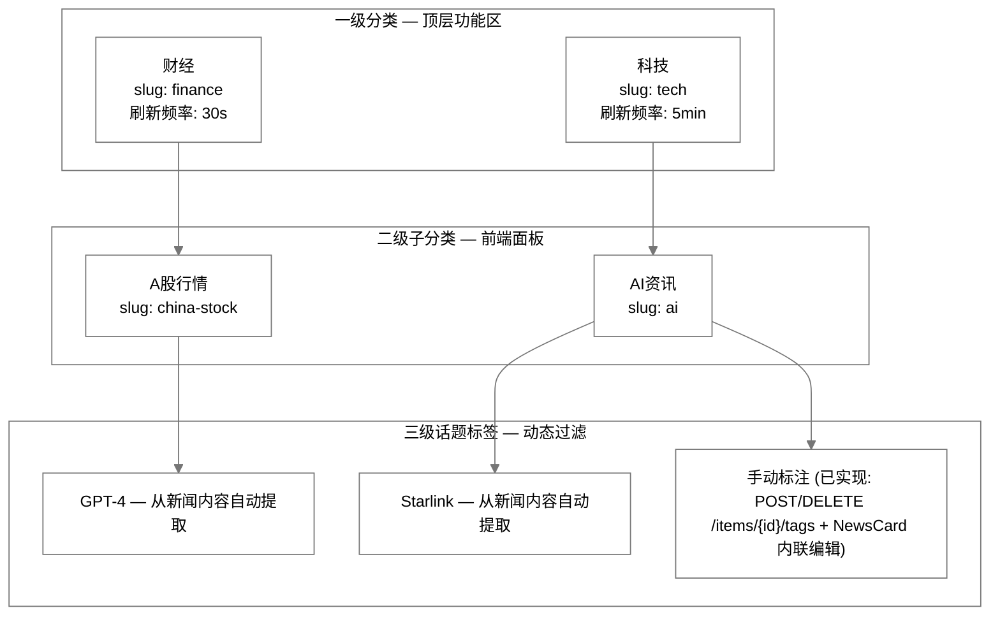
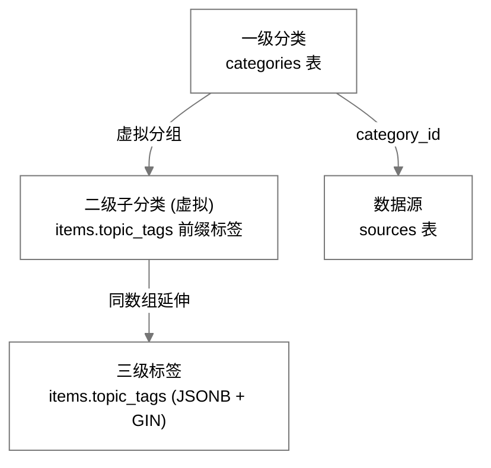
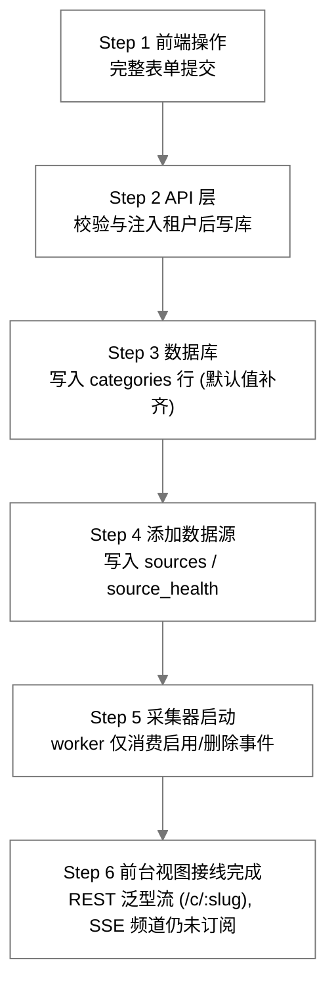
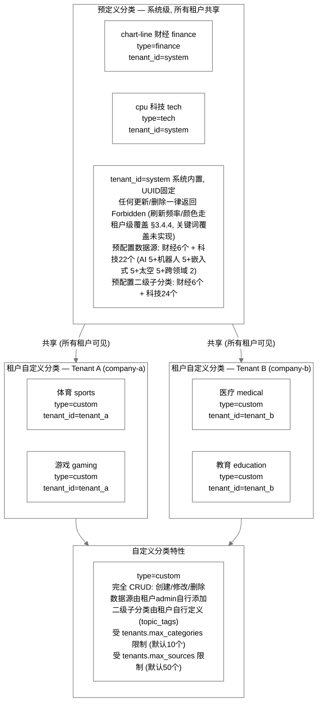
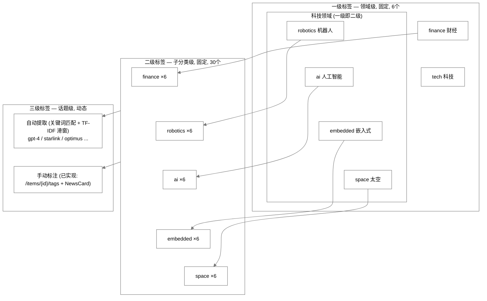
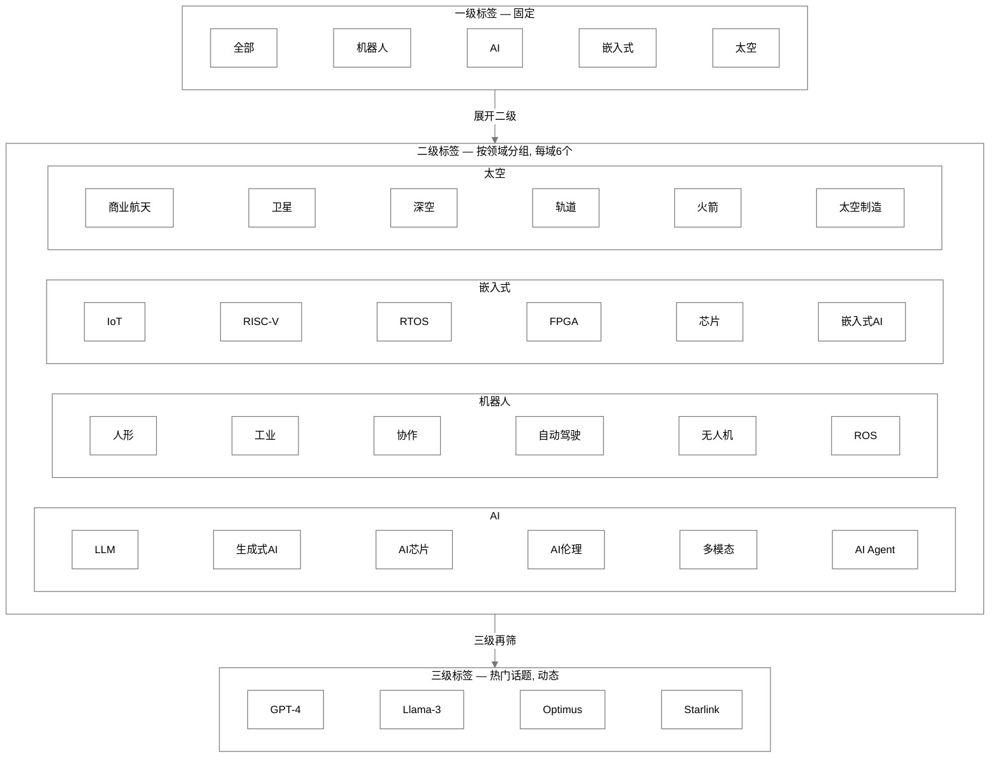

# InstantBoard 内容分类体系设计

## 目录

1. 目标
2. 方案概述
3. 详细设计
   - 3.1 分类层级结构
   - 3.2 分类与数据源映射关系表格
   - 3.3 分类扩展策略
   - 3.4 用户自定义分类 (多租户场景)
   - 3.5 预定义分类清单
   - 3.6 标签体系设计
4. 关键决策
5. 边界情况
6. 与其他模块的依赖

## 1. 目标

定义 InstantBoard 的内容分类体系，包括分类层级结构、分类与数据源的映射、分类扩展流程、多租户自定义分类、预定义分类清单和标签体系，确保数据按内容语义组织而非按数据源类型组织。

## 2. 方案概述

采用 **三级分类体系 (一级领域 → 二级子分类 → 三级话题标签) + 数据源绑定到一级分类 + 二级子分类通过 topic_tags 虚拟实现 + 用户可自定义扩展** 方案，分类驱动数据采集频率和展示方式，而非数据源类型驱动。

## 3. 详细设计

### 3.1 分类层级结构

#### 3.1.1 层级定义



一级分类 (Category) 对应侧边导航项和 SSE 频道，图标/颜色/频道等属性见 §3.5.6 预定义一级分类总览表；二级子分类 (SubCategory) 对应前端面板，刷新频率继承一级或自定义，各挂数据源列表 Source[]；三级话题标签 (TopicTag) 用于过滤和排序，从新闻内容自动提取，亦可由用户手动标注（见 §3.6.1）。

> ✅ **手动标注已实现**：三级标签支持用户打标/取消打标——`POST /api/v1/items/{item_id}/tags` 与 `DELETE /api/v1/items/{item_id}/tags/{tag}`（`api/v1/items.py` + `services/item.py`），前端 `NewsCard.vue` 提供标签行 "+" 内联添加与 "×" 移除（详见 §3.6.1）。

#### 3.1.2 数据模型映射



字段清单（对应 categories / sources / items 三表）：

| 图中节点 | 存储位置 | 字段清单 / 实现方式 |
|---------|---------|------------------|
| 一级分类 | categories 表 | id, name, slug, icon, color, type, refresh_interval_seconds, keywords_filter, priority_sort, is_active |
| 二级子分类 | 不独立建表（虚拟子分类） | 通过 items.topic_tags 实现：二级标签作为数组中的固定前缀标签存在，如 topic_tags: [finance, china-stock, GPT-4]；前端按二级标签分组展示，查询时 GIN 索引过滤 |
| 三级标签 | items.topic_tags | JSONB 数组 + GIN 索引；动态生成，无上限；从内容自动提取或手动标注 |
| 数据源 | sources 表 | 绑定到一级分类：source.category_id → categories.id；数据源不直接绑定二级子分类，采集后自动打标签归入子分类 |

### 3.2 分类与数据源映射关系表格

#### 3.2.1 财经分类映射

| 一级分类 | 一级slug | 二级子分类(虚拟) | 二级slug | 数据源 | 源类型 | 刷新频率 |
|---------|---------|----------------|---------|--------|--------|---------|
| 财经 | finance | A股行情 | china-stock | 东方财富(A股实时) | web_scrape | 15s(交易时段) |
| 财经 | finance | A股行情 | china-stock | yfinance(000001.SS, 399001.SZ, 000300.SS) | api | 30s |
| 财经 | finance | 世界市场指数 | market-indices | yfinance(^GSPC, ^DJI, ^IXIC, ^HSI, ^N225, ^FTSE, ^GDAXI) | api | 30s(交易时段) |
| 财经 | finance | 世界市场指数 | market-indices | Alpha Vantage(failover) | api | 30s |
| 财经 | finance | 大宗商品/期货 | commodities | yfinance(GC=F, SI=F, CL=F, NG=F, HG=F, ZS=F, ZC=F) | api | 60s |
| 财经 | finance | 大宗商品/期货 | commodities | Alpha Vantage(failover) | api | 60s |
| 财经 | finance | 基金NAV估值 | fund-nav | 天天基金(官方NAV, tiantian_fund 采集器) | api | 每日20:00 |
| 财经 | finance | 基金NAV估值 | fund-nav | 东方财富(NAV补充) | web_scrape | 每日 |
| 财经 | finance | 基金NAV估值 | fund-nav | yfinance(指数行情,用于估值计算) | api | 120s(交易时段) |
| 财经 | finance | 自选行情 | watchlist | yfinance(用户自选symbols) | api | 30s |
| 财经 | finance | 自选行情 | watchlist | Finnhub(failover) | api | 30s |
| 财经 | finance | 财经新闻 | finance-news | Google News Finance RSS | rss | 5min |

> ⚠️ **种子现状提示**（另见 data-sources.md §3.1）：当前财经种子源共 7 条——东方财富-A股实时（15s，活跃，兼市场指数 failover 链第一顺位）、yfinance×3（沪深300/世界指数/大宗商品，活跃）、天天基金-官方NAV（活跃，已改造为基金 NAV 专用源：`source_type=api` + `config.library=tiantian_fund`，配套每日 20:00 官方 NAV 任务，见 finance-tab.md §3.3）；Alpha Vantage failover 模板与 IEX Cloud 可选模板 `is_active=False`；Finnhub 无定时种子源（仅作 failover 按需调用）；Google News Finance RSS 未播种。

#### 3.2.2 科技分类映射 — 机器人领域

| 一级分类 | 一级slug | 二级子分类(虚拟) | 二级slug | 数据源 | 源类型 | 刷新频率 |
|---------|---------|----------------|---------|--------|--------|---------|
| 科技 | tech | 机器人-人形机器人 | humanoid | HackerNews(robotics tag) | rss | 2min |
| 科技 | tech | 机器人-人形机器人 | humanoid | The Robot Report | rss | 5min |
| 科技 | tech | 机器人-工业机器人 | industrial | HackerNews(robotics tag) | rss | 2min |
| 科技 | tech | 机器人-工业机器人 | industrial | The Robot Report | rss | 5min |
| 科技 | tech | 机器人-协作机器人 | cobot | HackerNews(robotics tag) | rss | 2min |
| 科技 | tech | 机器人-协作机器人 | cobot | IEEE Robotics RSS | rss | 每日 |
| 科技 | tech | 机器人-自动驾驶 | autonomous-driving | HackerNews(robotics tag) | rss | 2min |
| 科技 | tech | 机器人-自动驾驶 | autonomous-driving | Automotive News | web_scrape | 每日 |
| 科技 | tech | 机器人-无人机 | drone | HackerNews(robotics tag) | rss | 2min |
| 科技 | tech | 机器人-无人机 | drone | Hackaday | rss | 5min |
| 科技 | tech | 机器人-机器人OS/软件 | robot-software | HackerNews(robotics tag) | rss | 2min |
| 科技 | tech | 机器人-机器人OS/软件 | robot-software | ROS Blog | rss | 每周 |

> ✅ Automotive News（web_scrape）种子 `is_active=True`：由通用 `WebScrapeCollector` 采集（`config.parse_rules` CSS 选择器驱动，见 data-sources.md §3.1 注）。

#### 3.2.3 科技分类映射 — AI领域

| 一级分类 | 一级slug | 二级子分类(虚拟) | 二级slug | 数据源 | 源类型 | 刷新频率 |
|---------|---------|----------------|---------|--------|--------|---------|
| 科技 | tech | AI-大语言模型 | llm | MIT Tech Review AI Feed | rss | 5min |
| 科技 | tech | AI-大语言模型 | llm | HackerNews(AI/ML tag) | rss | 2min |
| 科技 | tech | AI-大语言模型 | llm | OpenAI Blog | web_scrape | 30min |
| 科技 | tech | AI-生成式AI | generative-ai | MIT Tech Review AI Feed | rss | 5min |
| 科技 | tech | AI-生成式AI | generative-ai | HackerNews(AI/ML tag) | rss | 2min |
| 科技 | tech | AI-AI芯片/硬件 | ai-hardware | HackerNews(AI/ML tag) | rss | 2min |
| 科技 | tech | AI-AI芯片/硬件 | ai-hardware | Arxiv CS.AI | rss | 30min |
| 科技 | tech | AI-AI伦理与治理 | ai-ethics | MIT Tech Review AI Feed | rss | 5min |
| 科技 | tech | AI-AI伦理与治理 | ai-ethics | HackerNews(AI/ML tag) | rss | 2min |
| 科技 | tech | AI-多模态AI | multimodal | HackerNews(AI/ML tag) | rss | 2min |
| 科技 | tech | AI-多模态AI | multimodal | Arxiv CS.AI | rss | 30min |
| 科技 | tech | AI-AI Agent/应用 | ai-agent | HackerNews(AI/ML tag) | rss | 2min |
| 科技 | tech | AI-AI Agent/应用 | ai-agent | The Batch (Andrew Ng) | rss | 每周 |

> ✅ OpenAI Blog（web_scrape）种子 `is_active=True`：由通用 `WebScrapeCollector` 采集（见 data-sources.md §3.1 注）。

#### 3.2.4 科技分类映射 — 大规模嵌入式领域

| 一级分类 | 一级slug | 二级子分类(虚拟) | 二级slug | 数据源 | 源类型 | 刷新频率 |
|---------|---------|----------------|---------|--------|--------|---------|
| 科技 | tech | 嵌入式-IoT与边缘计算 | iot-edge | Hackaday | rss | 5min |
| 科技 | tech | 嵌入式-IoT与边缘计算 | iot-edge | Embedded.com | rss | 5min |
| 科技 | tech | 嵌入式-RISC-V与处理器 | risc-v | Hackaday | rss | 5min |
| 科技 | tech | 嵌入式-RISC-V与处理器 | risc-v | RISC-V International Blog | web_scrape | 30min |
| 科技 | tech | 嵌入式-实时操作系统 | rtos | Embedded.com | rss | 5min |
| 科技 | tech | 嵌入式-实时操作系统 | rtos | Zephyr Project Blog | rss | 每月 |
| 科技 | tech | 嵌入式-FPGA与硬件加速 | fpga | Hackaday | rss | 5min |
| 科技 | tech | 嵌入式-FPGA与硬件加速 | fpga | EE Times | rss | 每日 |
| 科技 | tech | 嵌入式-芯片设计 | chip-design | EE Times | rss | 每日 |
| 科技 | tech | 嵌入式-芯片设计 | chip-design | Hackaday | rss | 5min |
| 科技 | tech | 嵌入式-嵌入式AI | embedded-ai | Hackaday | rss | 5min |
| 科技 | tech | 嵌入式-嵌入式AI | embedded-ai | Embedded.com | rss | 5min |

#### 3.2.5 科技分类映射 — 太空科技领域

| 一级分类 | 一级slug | 二级子分类(虚拟) | 二级slug | 数据源 | 源类型 | 刷新频率 |
|---------|---------|----------------|---------|--------|--------|---------|
| 科技 | tech | 太空-商业航天 | commercial-space | SpaceNews | rss | 5min |
| 科技 | tech | 太空-商业航天 | commercial-space | SpaceX Updates | web_scrape | 30min |
| 科技 | tech | 太空-卫星互联网 | satellite-internet | SpaceNews | rss | 5min |
| 科技 | tech | 太空-卫星互联网 | satellite-internet | Ars Technica Space | rss | 5min |
| 科技 | tech | 太空-深空探测 | deep-space | NASA News | rss | 30min |
| 科技 | tech | 太空-深空探测 | deep-space | Ars Technica Space | rss | 5min |
| 科技 | tech | 太空-空间站与在轨服务 | orbital | NASA News | rss | 30min |
| 科技 | tech | 太空-空间站与在轨服务 | orbital | ESA News | rss | 30min |
| 科技 | tech | 太空-火箭技术 | rocket-tech | SpaceNews | rss | 5min |
| 科技 | tech | 太空-火箭技术 | rocket-tech | SpaceX Updates | web_scrape | 30min |
| 科技 | tech | 太空-太空制造与资源 | space-manufacturing | NASA News | rss | 30min |
| 科技 | tech | 太空-太空制造与资源 | space-manufacturing | SpaceNews | rss | 5min |

> ✅ SpaceX Updates（web_scrape）种子 `is_active=True`：由通用 `WebScrapeCollector` 采集（见 data-sources.md §3.1 注）；页面为 JS 渲染时间线，服务端 HTML 无内容时返回空结果。

#### 3.2.6 跨领域通用数据源映射

| 一级分类 | 二级子分类(虚拟) | 数据源 | 源类型 | 覆盖领域 |
|---------|----------------|--------|--------|---------|
| 科技 | 全部子分类 | Reddit (r/artificial, r/robotics, r/embedded, r/space) | social | 全领域 |
| 科技 | 全部子分类 | Google News Tech | rss | 全领域 |
| 科技 | 全部子分类 | Twitter/X Lists | social | 全领域(付费租户可选) |

> ✅ Reddit 种子已激活（公开 JSON 接口、无需凭据；注册名 `reddit`，经 `source_type=social` + `config.library=reddit` 解析，`subreddits` 配置 r/artificial、r/robotics、r/embedded、r/space）；Twitter/X 采集器已实现但种子未激活待凭据（注册名 `twitter`，需配置 `TWITTER_BEARER_TOKEN`，且 recent search 端点仅付费档可用）。

#### 3.2.7 映射关系设计要点

```
关键设计要点:

1. 数据源绑定到一级分类 (sources.category_id → categories.id)
   不是绑定到二级子分类, 因为:
   - 一个数据源 (如 HackerNews) 可能覆盖多个子分类
   - 二级子分类是虚拟的, 通过采集后的 Categorizer 自动打标签
   - sources 表无 sub_category 字段

2. 二级子分类通过 topic_tags 虚拟实现
   - Categorizer 处理器根据关键词映射自动将条目归入二级标签
   - 如: "GPT" → topic_tags += ["ai", "llm"]
   - 如: "Starlink" → topic_tags += ["space", "satellite-internet"]
   - 前端查询: GET /api/v1/tech/news?topic=ai&subtopic=llm
     → SQL: WHERE topic_tags @> '["ai", "llm"]'

3. 财经分类特殊处理
   - 财经行情数据不走 items 通用模型, 而走专用表
     (finance_symbols, finance_quotes, fund_nav_estimates)
   - 财经的二级子分类对应子面板切换
     (Overview/Watchlist/Search/Indices/Commodities)
   - 财经新闻走 items 通用模型, category_id 指向 finance 分类,
     topic_tags 包含二级标签

4. 同一数据源可映射到多个二级子分类
   - HackerNews 同时覆盖机器人、AI、嵌入式、太空所有领域
   - Categorizer 通过关键词匹配决定每条新闻的二级归属
```

### 3.3 分类扩展策略

#### 3.3.1 添加新分类的完整流程



各步明细：

1. **Step 1 前端操作 — CategoryEditor 完整表单 (SettingsView)**：名称(必填) + 描述(可选) + 图标(15 个精选 lucide 图标，经 `categoryIcons.ts` 的 `CATEGORY_ICON_OPTIONS` 渲染，默认 folder，提交 lucide 图标名) + 颜色(`<input type="color">`，默认 #3B82F6) + 刷新频率(数字秒，客户端预校验 ≥10 且为整数，留空走后端默认 300) + 关键词过滤(逗号分隔 → 字符串数组，空白项过滤) + slug(可选，留空由后端 `_slugify(name)` 生成，`services/category.py:222`)，type 固定提交 custom → POST /api/v1/categories。后端 CategoryCreate 另支持 is_active，前端无控件（默认 true）；编辑模式 (PUT) 同步回填上述字段，唯 keywords_filter 不在 CategoryResponse 中返回，编辑时留空 = 保持不变（留空不进 PUT payload）。
2. **Step 2 API 层 — categories.py**：POST /api/v1/categories → Pydantic CategoryCreate 校验 → 注入 tenant_id (从 JWT) → 检查租户分类数量上限 (tenants.max_categories) → 检查 slug 唯一性 (UNIQUE tenant_id + slug) → INSERT INTO categories → 返回 CategoryResponse。
3. **Step 3 数据库 — categories 表**：INSERT categories：id = gen_random_uuid()，tenant_id = {current_tenant}，示例 name = 体育、slug = sports，icon = folder (默认)，color = #3B82F6 (默认)，type = custom，refresh_interval_seconds = 300 (默认)，is_active = true。
4. **Step 4 添加数据源 — 数据源管理面板**：POST /api/v1/sources：name / category_id / source_type / url / refresh_interval_seconds / config.library → collector_available 校验 (resolve_collector) → INSERT INTO sources + source_health → 发布 source_created 事件 (channel:dashboard⚠️)。
5. **Step 5 采集器启动 — worker 事件消费 (现状说明)**：worker 仅消费 SOURCE_EVENT_NAMES = {source_enabled, source_disabled, source_deleted}；source_created 被 worker 忽略 ⚠️ → 新源需 worker 重启或后续启用操作 (source_enabled → add_job) 才开始采集；启动后：Collector采集 → Processor处理 → Store存储 → SSE推送。
6. **Step 6 前台视图接线完成 — REST 泛型流已接线, SSE 频道仍未订阅 (现状)**：新建自定义分类后，前端侧边栏在固定 4 项（财经/科技/仪表盘/设置）之下动态渲染该分类条目（`type=custom` 且 `is_active`，`Sidebar.vue`），点击路由到 `/c/{slug}` 通用信息流视图（`CategoryView.vue`，复用 NewsCard + useInfiniteScroll 无限滚动）；条目经 `GET /api/v1/categories/{id}/items` 拉取（分页 + `since` + `sort`（time 默认/hot/relevance），响应复用 TechNewsResponse schema）。⚠️ 实时推送仍待接线：后端 /api/v1/stream/{category} 频道通用，可 EventSource(/api/v1/stream/sports) 订阅，但 stream/{category} 目前仍仅被前端订阅 finance/tech/dashboard，自定义分类视图不订阅其 SSE 频道。

> ✅ 原第 1 条"前端表单不完整"已实现：`CategoryEditor.vue` 提供完整表单——名称/描述/图标(15 个精选 lucide 图标，默认 folder)/颜色(`<input type="color">`，默认 #3B82F6)/刷新频率(秒，≥10，留空走后端默认 300)/关键词过滤(逗号分隔 → 数组)/slug(留空创建时由后端生成)；编辑模式同步回填，仅 keywords 因后端响应不含 keywords_filter 而无法回显（留空 = 保持不变）。
>
> ⚠️ **未实现（潜在体验问题）**：**新建源不会自动开始采集**：`source_created` 发布在 **channel:dashboard**（`services/source.py:286-294`），worker 忽略该事件（`scheduler/worker.py:35-37`），需 worker 重启或后续启用操作。
>
> ✅ 原第 3 条"自定义分类无前台视图"已实现：`Sidebar.vue` 在固定导航项之下动态渲染自定义分类条目（lucide 图标名映射 + Folder 兜底），路由到 `/c/:slug` 的 `CategoryView.vue` 通用信息流视图（无需逐分类建 SportsView/sportsStore），条目经 `GET /api/v1/categories/{id}/items` 拉取（见 §3.4.5）；仍遗留：前端未订阅自定义分类的 SSE 频道（见 Step 6）。

#### 3.3.2 修改分类的流程

```
修改分类属性 (如名称、刷新频率、关键词过滤) — 仅适用于自定义分类:

1. 前端: SettingsView → CategoryEditor（完整表单：名称/描述/slug/图标/
   颜色/刷新频率回填，关键词因响应不回显而留空 = 保持不变）
   → PUT /api/v1/categories/{id}
2. API:  权限校验:
         - 系统预定义分类 (tenant_id=system) 的任何更新一律返回 Forbidden
           (services/category.py:225-226)
         - 跨租户分类返回 Forbidden
         - slug 唯一性校验后 UPDATE categories
3. DB:   更新 categories 行
4. ⚠️ 无调度联动: 源的采集频率取各源自身的 refresh_interval_seconds,
   修改分类的 refresh_interval_seconds 不影响已运行的源任务。
   方案中"改分类 → Scheduler.reschedule_job 重排该分类下
   所有源"未实现 (services/category.py::update_category 无任何调度代码)
5. 修改 keywords_filter:
   → FilterProcessor 下次采集使用新的分类关键词列表
     (源级 keywords_filter 存在时优先生效)
   → 不影响已入库的条目 (已过滤过的不会变)
```

#### 3.3.3 删除分类的流程

```
删除分类 (现状: 前置条件删除, 无级联, 无 SSE 事件):

1. 前端: SettingsView → CategoryEditor → DELETE /api/v1/categories/{id}
2. API 校验 (services/category.py::delete_category):
   - 不存在 → 404 CATEGORY_NOT_FOUND
   - 系统预定义分类 → 403 Forbidden
   - 跨租户分类 → 403 Forbidden
   - 分类下仍有数据源 (>0) → 400 VALIDATION_ERROR,
     "Remove sources before deleting the category" (要求先删源)
3. DB:    DELETE categories WHERE id = {id} (HTTP 204)
          此时分类下已无源, 不发生级联删除
4. ⚠️ 不发布任何 category_deleted SSE 事件;
   方案中"CASCADE 级联删除 + 事件通知 + 侧边栏 Tab 移除"未实现
```

#### 3.3.4 添加新二级子分类的流程

```
添加新二级子分类 (虚拟, 不建表):

1. 二级子分类是 topic_tags 中的标签, 不需要数据库操作
2. 步骤:
   a. 更新 Categorizer 关键词映射表:
      keyword_to_tag["新关键词"] = ["一级标签", "新二级标签"]
   b. 前端 TopicFilter 组件添加新二级标签按钮
   c. 无需修改数据库表结构

3. 示例: 在科技-AI领域添加 "AI搜索" 子分类:
   a. keyword_to_tag.update({
        "Perplexity": ["ai", "ai-search"],
        "AI搜索": ["ai", "ai-search"],
      })
   b. TopicFilter 新增按钮: [AI搜索]
   c. 采集器下次处理时, 包含 "Perplexity" 的新闻自动打上
      ["ai", "ai-search"] 标签
```

### 3.4 用户自定义分类 (多租户场景)

#### 3.4.1 多租户分类架构



#### 3.4.2 分类可见性规则

```
分类查询可见性:

GET /api/v1/categories (获取租户可见的所有分类):

SQL查询逻辑:
  SELECT * FROM categories
  WHERE (tenant_id = :current_tenant_id)           -- 租户自定义分类
     OR (tenant_id = 'system')                      -- 预定义分类
  ORDER BY type ASC, name ASC                       -- 预定义优先

结果: 租户看到 = 预定义分类(不可删/不可改) + 自定义分类(可删/可改)
前端: 分类管理在 SettingsView → CategoryEditor 面板;
     侧边导航固定项为 财经/科技/仪表盘/设置 (Sidebar.vue)，
     其下动态渲染当前租户的自定义分类条目 (type=custom 且
     is_active，lucide 图标名映射 + Folder 兜底)，点击路由到
     /c/{slug} 通用信息流视图 CategoryView；
     预定义分类仍走各自专属视图，不进入 /c/{slug}

数据隔离:
  - 租户 A 看不到租户 B 的自定义分类 (WHERE tenant_id隔离)
  - 预定义分类的数据源和数据对所有租户共享
  - 自定义分类的数据源和数据仅本租户可见
  - PostgreSQL RLS (Row Level Security) 保障租户隔离
```

#### 3.4.3 预定义分类与自定义分类的权限差异

| 操作 | 预定义分类 (type=finance/tech) | 自定义分类 (type=custom) |
|------|------------------------------|------------------------|
| 查看 | ✅ 所有租户可见 | ✅ 仅本租户可见 |
| 创建 | ❌ 仅系统管理员 | ✅ 租户admin/member |
| 修改名称/slug/type | ❌ 不可修改 | ✅ 可修改 |
| 修改刷新频率/关键词 | ❌ 不可修改（任何更新一律返回 Forbidden，`services/category.py:225-226`） | ✅ 可修改 |
| 删除分类 | ❌ 不可删除 (Forbidden) | ✅ 租户admin可删除（需先删除分类下所有数据源，见§3.3.3） |
| 添加数据源 | ✅ 可添加（须通过 `collector_available` 前置校验） | ✅ 可添加 |
| 删除数据源 | ❌ 系统源一律 Forbidden（可被查看/启用） | ✅ 可删除 |
| 修改二级子分类 | ✅ 可新增虚拟子分类 | ✅ 可自由定义 |
| SSE订阅 | ✅ 所有租户可订阅 | ✅ 仅本租户可订阅 |

> 系统源权限细则（`app/services/source.py`）：系统租户下的源可被任何租户查看与启用，但删除一律返回 `Forbidden("Cannot delete system-level sources")`（:420-421）。
>
> ✅ **租户级覆盖**：刷新频率/颜色覆盖已实现（`tenants.settings.refresh_overrides` / `color_overrides`，API + 前端面板见 §3.4.4）；关键词覆盖仍未实现。

#### 3.4.4 租户级配置覆盖

> ✅ **已实现**：`tenants.settings` 中的 `refresh_overrides` / `color_overrides` 两个覆盖 map 已落地——后端端点（`api/v1/tenant.py` + `services/tenant.py`）、调度消费、前端管理面板（`TenantOverrides.vue`）；`color_scheme` 不属于租户覆盖范畴（见下方现状）。

设计意图:

```
租户级刷新频率覆盖:

预定义分类的默认刷新频率:
  finance: 30s (行情高频)
  tech:    300s (新闻低频)

租户可在 tenants.settings 中覆盖:
  tenants.settings = {
    "refresh_overrides": { "finance": 60, "tech": 300 },
    "color_overrides": { "finance": "#FF0000" },
    "color_scheme": "international",  // 绿涨红跌; 默认 chinese 红涨绿跌
  }

实际刷新频率 = tenants.settings.refresh_overrides[category.slug]
               ?? category.refresh_interval_seconds
```

**端点契约**（`backend/app/api/v1/tenant.py`、`backend/app/schemas/tenant.py`）:

| 端点 | 方法 | 权限 | 说明 |
|------|------|------|------|
| `/api/v1/tenant/settings` | GET | 本租户任意成员 | 返回 `{refresh_overrides, color_overrides}`；未配置时返回两个空对象（值只影响可见分类的颜色与刷新频率，无越权风险） |
| `/api/v1/tenant/settings` | PUT | 仅本租户 admin（member → 403 `FORBIDDEN`） | body `{refresh_overrides?, color_overrides?}`；**整体替换语义**——两个 map 各自整体替换现有值，省略某 slug / 留空即清除该 override；成功 200 回显更新后的完整配置 |

校验（`services/tenant.py::_validate_overrides`），失败 → 400 `VALIDATION_ERROR`，`error.details[] = {field, message}`：
- 刷新频率：整数秒，`10 ≤ v ≤ 86400`（`REFRESH_OVERRIDE_MIN/MAX_SECONDS`）；
- 颜色：必须匹配 `#RRGGBB`；
- slug：必须是系统预定义分类或本租户自有分类（即 `GET /categories` 可见集合，未知 slug 报错）。

**消费方**:
- 颜色：`GET /categories`（及单分类端点）把 `color_overrides` 合并进响应 `color` 字段（`services/category.py::_category_to_response`）；
- 频率：`resolve_effective_interval`（`scheduler/manager.py`）在调度注册时解析有效频率 = `refresh_overrides[slug] ?? 源频率 ?? 分类频率 ?? 类型默认值`，两处生效——启动全量重建（`load_all_tenant_settings` 一次批量查所有租户）与运行时源事件（源创建/重新启用时从 DB 读最新设置，创建后才保存的覆盖也能在重新启用时生效）；
- **运行中任务不热更新**：PUT 只写 `tenants.settings`，不通知调度器；已注册的任务沿用原频率，直至下次注册（进程重启重建 / 源重新启用）。

**前端面板**（`components/settings/TenantOverrides.vue` + `api/tenant.ts`，测试 `tests/unit/tenantOverrides.spec.ts`）:
- `SettingsView` 在 `authStore.user.role === "admin"` 时追加「租户覆盖」页签（与 session entry 无关），渲染面板：列出全部可见分类（系统 + 自有），每行显示默认值并提供刷新频率（数字输入，10–86400 秒）与颜色（`#RRGGBB` hex 文本）两个覆盖输入，加载时经 `GET /tenant/settings` 回填现有覆盖；
- 保存把当前填写组装成两个 map 调 `PUT /tenant/settings`——**留空的条目不放入 payload，即清除该 override**（与整体替换语义一致）；成功提示「已保存」并按响应回显归一化；400 时用 ErrorAlert 展示 `error.details[]` 第一条消息；403 降级提示无权限。

**现状**:
- 预定义分类本身仍完全不可修改（§3.4.3：任何更新返回 Forbidden），频率/颜色差异一律通过租户级覆盖表达；关键词覆盖尚未实现；
- 配色方案 `color_scheme` 与租户覆盖无关，实际是**前端按用户偏好**存储：存于 localStorage（`color_scheme` 键，默认 `chinese` 红涨绿跌，可切换 `international` 绿涨红跌），并与后端用户偏好同步（`frontend/src/stores/auth.ts:60-63, 96-97, 149`）。

#### 3.4.5 分类相关 API 端点一览（基础 CRUD 之外）

| 端点 | 方法 | 说明 | 实现位置 |
|------|------|------|---------|
| `/api/v1/categories/predefined` | GET | 系统预定义分类列表（含 source_count，按 name 升序） | `services/category.py::get_predefined_categories` |
| `/api/v1/categories/{id}/sources` | GET | 分类详情 + 全部数据源列表（含 health_status / priority / refresh_interval_seconds） | `get_category_with_sources` |
| `/api/v1/categories/{id}/subcategories` | GET | 二级子分类动态统计：按 `items.topic_tags` 聚合计数；财经/科技按固定二级 slug 白名单过滤，自定义分类返回全部标签 | `list_subcategories`（:375-460） |
| `/api/v1/categories/{id}/items` | GET | 通用分类条目流：分页（`page`/`page_size`，PaginationParams）+ `since`（ISO-8601 下界）+ `sort`（time 默认/hot/relevance）；响应复用 TechNewsResponse schema；分类不存在或跨租户 → 404 `CATEGORY_NOT_FOUND` | `services/category.py::list_category_items`（查询复用 `TechService.list_category_items`），映射复用 `api/v1/tech.py::build_news_response` |
| `/api/v1/categories/{id}/reclassify` | POST | 批量重打标：为该分类下**租户自有**条目（`items.tenant_id` 匹配，系统租户共享条目不重写）分批（500/批）重算 `topic_tags`——tech 走 `TechTopicExtractor`、finance 复用 `_determine_finance_tags`、其他类型回退 `[slug]`；一级标签保持 category slug 语义、仅写入标签有变化的条目、去重键不动；返回 `{scanned, updated}`；分类不存在或跨租户 → 404 `CATEGORY_NOT_FOUND` | `services/category.py::reclassify_category_items` |
| `/api/v1/tenant/settings` | GET | 租户级分类覆盖读取（任意成员）：`{refresh_overrides, color_overrides}`，默认空对象 | `services/tenant.py::TenantSettingsService.get_overrides` |
| `/api/v1/tenant/settings` | PUT | 租户级分类覆盖更新（仅 admin，member → 403）：**整体替换**语义，省略/留某 slug = 清除该 override；400 `VALIDATION_ERROR` 带 `details[]`（频率整数 10–86400 秒 / `#RRGGBB` / slug 须系统或自有分类）；见 §3.4.4 | `TenantSettingsService.update_overrides` |

> 数据模型补充：categories 表另含 `priority_sort`（Boolean，默认 false）与 `is_active` 字段（`models/category.py:24-25`）；`CategoryUpdate` 支持 `priority_sort` / `is_active` 的部分更新。

### 3.5 预定义分类清单

#### 3.5.1 财经类子分类

| # | 一级分类 | 二级子分类 | slug | 对应前端面板 | 数据类型 | 刷新频率(交易时段) |
|---|---------|----------|------|-------------|---------|------------------|
| 1 | 财经 | A股行情 | china-stock | Overview/Watchlist | 行情数据 | 15-30s |
| 2 | 财经 | 自选关注 | watchlist | Watchlist面板 | 用户自选行情 | 30s |
| 3 | 财经 | 股票/基金搜索 | search | Search面板 | 搜索(按需) | 按需触发 |
| 4 | 财经 | 世界市场指数 | market-indices | Indices面板 | 指数行情 | 30s |
| 5 | 财经 | 大宗商品/期货 | commodities | Commodities面板 | 商品行情 | 60s |
| 6 | 财经 | 基金NAV估值 | fund-nav | NAVCalculator面板 | 估值数据 | 120s |

> 注: 财经子分类对应 [finance-tab.md](finance-tab.md) §3.6 中的5个子面板 (Overview/Watchlist/Search/Indices/Commodities) + NAV估值。Overview是混合视图，不单独作为子分类；搜索是按需功能，不持续采集。

#### 3.5.2 科技类子分类 — 机器人领域

| # | 一级分类 | 领域 | 二级子分类 | slug | 关注话题关键词 |
|---|---------|------|----------|------|---------------|
| 1 | 科技 | 机器人 🤖 | 人形机器人 | humanoid | Atlas, Optimus, Figure 01, 双足行走, 运动控制 |
| 2 | 科技 | 机器人 🤖 | 工业机器人 | industrial | 焊接/装配/搬运, AMR, 柔性制造, 产线自动化 |
| 3 | 科技 | 机器人 🤖 | 协作机器人 | cobot | UR, Franka, 安全标准ISO 10218, 人机协作 |
| 4 | 科技 | 机器人 🤖 | 自动驾驶 | autonomous-driving | L4/L5, Waymo, Tesla FSD, 激光雷达, V2X |
| 5 | 科技 | 机器人 🤖 | 无人机 | drone | eVTOL, 农业植保, 快递物流, 反无人机 |
| 6 | 科技 | 机器人 🤖 | 机器人OS/软件 | robot-software | ROS2, MoveIt, Isaac Sim, 仿真平台 |

#### 3.5.3 科技类子分类 — AI领域

| # | 一级分类 | 领域 | 二级子分类 | slug | 关注话题关键词 |
|---|---------|------|----------|------|---------------|
| 7 | 科技 | AI 🧠 | 大语言模型 | llm | GPT, Claude, Llama, Gemini, Sora, 推理能力, 长上下文 |
| 8 | 科技 | AI 🧠 | 生成式AI | generative-ai | 图像生成(DALL-E/Midjourney), 视频生成, 3D生成, 音乐AI |
| 9 | 科技 | AI 🧠 | AI芯片/硬件 | ai-hardware | NVIDIA GPU, TPU, NPU, Groq, 存算一体, HBM |
| 10 | 科技 | AI 🧠 | AI伦理与治理 | ai-ethics | AI安全, 对齐问题, 监管法规, AI偏见, 可解释AI |
| 11 | 科技 | AI 🧠 | 多模态AI | multimodal | 视觉语言模型, 语音AI, 跨模态理解, OCR |
| 12 | 科技 | AI 🧠 | AI Agent/应用 | ai-agent | AutoGPT, LangChain, RAG, Coding Agent, AI助手 |

#### 3.5.4 科技类子分类 — 大规模嵌入式领域

| # | 一级分类 | 领域 | 二级子分类 | slug | 关注话题关键词 |
|---|---------|------|----------|------|---------------|
| 13 | 科技 | 嵌入式 ⚡ | IoT与边缘计算 | iot-edge | MQTT, CoAP, 边缘推理, TinyML, 数字孪生 |
| 14 | 科技 | 嵌入式 ⚡ | RISC-V与处理器 | risc-v | 开源指令集, RV32/RV64, 向量扩展, 芯片实现 |
| 15 | 科技 | 嵌入式 ⚡ | 实时操作系统 | rtos | FreeRTOS, Zephyr, RTLinux, 时序保证 |
| 16 | 科技 | 嵌入式 ⚡ | FPGA与硬件加速 | fpga | Xilinx/Altera, HLS, 部分重配置, ASIC替代 |
| 17 | 科技 | 嵌入式 ⚡ | 芯片设计 | chip-design | EDA工具, 后摩尔定律, 3D封装, Chiplet |
| 18 | 科技 | 嵌入式 ⚡ | 嵌入式AI | embedded-ai | 模型量化, 端侧推理, NPU微架构, 低功耗AI |

#### 3.5.5 科技类子分类 — 太空科技领域

| # | 一级分类 | 领域 | 二级子分类 | slug | 关注话题关键词 |
|---|---------|------|----------|------|---------------|
| 19 | 科技 | 太空 🚀 | 商业航天 | commercial-space | SpaceX, Blue Origin, Rocket Lab, 发射市场 |
| 20 | 科技 | 太空 🚀 | 卫星互联网 | satellite-internet | Starlink, Kuiper, OneWeb, 相控阵天线 |
| 21 | 科技 | 太空 🚀 | 深空探测 | deep-space | 月球基地, Mars, 望远镜, 行星科学 |
| 22 | 科技 | 太空 🚀 | 间站与在轨服务 | orbital | ISS, Tiangong, 在轨制造, 间碎片清除 |
| 23 | 科技 | 太空 🚀 | 火箭技术 | rocket-tech | 可回收, 液氧甲烷, 固体火箭, 发动机创新 |
| 24 | 科技 | 太空 🚀 | 太空制造与资源 | space-manufacturing | 太空3D打印, 月球采矿, 原位资源利用ISRU |

> 注: 科技子分类与 [tech-tab.md](tech-tab.md) §3.1.2 的四大领域×6个子分类完全对应，共24个二级子分类。

#### 3.5.6 预定义一级分类总览

| 一级分类 | slug | 图标 | 颜色 | type | 刷新频率(默认) | SSE频道 | 二级子分类数 |
|---------|------|------|------|------|--------------|---------|------------|
| 财经 | finance | chart-line (lucide图标名) | #FF6B6B | finance | 30s | channel:finance | 6 |
| 科技 | tech | cpu (lucide图标名) | #3B82F6 | tech | 300s(5min) | channel:tech | 24 |

> 后续可扩展的预定义分类: 新闻 (news, 📰, #6366F1, 300s)、体育 (sports, 🏃, #22C55E, 300s) 等，初始版本仅实现财经和科技。

### 3.6 标签体系设计

#### 3.6.1 三级标签层级定义



二级标签完整清单（财经 6 + 科技四领域 ×6 = 30 个 slug）由 §3.5.1-3.5.5 各表承载，不再进图；robotics / ai / embedded / space 在科技域兼具一级标签与二级分组依据的双重身份；三级标签来自采集时的关键词匹配与 TF-IDF 滑窗高频术语补全（§3.6.3）或用户手动标注（见下）。

> ✅ **手动标注已实现**（`POST/DELETE /api/v1/items/{item_id}/tags`，`api/v1/items.py` + `services/item.py` + `NewsCard.vue`）：
>
> - **打标** `POST /api/v1/items/{item_id}/tags`（body `{tag}`）：读-改-写 `items.topic_tags` JSONB，保持原层级顺序（系统标签在前、新标签追加在后），去重（已存在则幂等返回），仅租户自有条目可写（不存在/跨租户/系统共享条目一律 404 `ITEM_NOT_FOUND`）；标签格式 `^[a-z0-9-]{1,32}$`（小写字母/数字/连字符，不合法 → 400 `VALIDATION_ERROR`）；每条目达 20 个标签（`MAX_ITEM_TAGS`）后拒绝新增（400 `VALIDATION_ERROR`）。
> - **取消打标** `DELETE /api/v1/items/{item_id}/tags/{tag}`：移除单个标签并保持其余顺序；条目 404 `ITEM_NOT_FOUND`，标签不在列表中 → 400 `VALIDATION_ERROR`。
> - **UI**：`NewsCard.vue` 标签行"+"按钮内联输入框（Enter/确认提交，客户端同规则预校验），标签上"×"乐观移除（失败回滚）；成功后以服务端返回的 `topic_tags` 为准本地更新，失败行内提示（`getApiErrorMessage`）。
> - ⚠️ 遗留：批量重打标（`POST /categories/{id}/reclassify`）会重算租户自有条目的全部 `topic_tags`，手动标签随之被覆盖（无独立的用户标签存储）。

#### 3.6.2 标签存储与索引

```
标签存储方案 (见 [database.md](database.md) items表):

items.topic_tags: JSONB数组
  存储格式: ["finance", "china-stock", "GPT-4"]
  包含一级+二级+三级标签的扁平数组
  
  示例:
  一条AI新闻: topic_tags = ["tech", "ai", "llm", "gpt-4"]
  一条财经新闻: topic_tags = ["finance", "market-indices", "s&p-500"]
  一条跨领域新闻: topic_tags = ["tech", "ai", "ai-hardware",
                                  "space", "commercial-space", "nvidia"]

索引:
  CREATE INDEX idx_items_tags ON items USING gin(topic_tags);
  
  查询示例:
  -- 查询AI领域所有新闻
  WHERE topic_tags @> '["ai"]'
  
  -- 查询AI-大语言模型子分类新闻
  WHERE topic_tags @> '["ai", "llm"]'
  
  -- 查询包含"gpt-4"话题的新闻
  WHERE topic_tags @> '["gpt-4"]'
  
  -- 查询跨领域新闻(AI+太空)
  WHERE topic_tags @> '["ai"]' AND topic_tags @> '["space"]'
```

#### 3.6.3 标签自动提取算法

```python
# processors/categorizer.py — 模块级 KEYWORD_TO_TAG 映射 + TechTopicExtractor
# 现状: 关键词匹配 (大小写不敏感子串匹配), 无匹配时兜底打 "general";
# 规则标签不足时叠加 TF-IDF 三级标签 (进程内滑窗语料, 已实现);
# ⚠️ LLM 三级标签标注未实现。

class TechTopicExtractor:
    """
    三级标签自动提取算法:
    
    输入: 新闻 title + summary
    输出: topic_tags 数组 ["tech", "ai", "llm", "gpt-4"]
    
    算法步骤:
    1. 一级标签: 由 source.category_id 决定 (固定)
    2. 二级标签: 关键词规则匹配 (KEYWORD_TO_TAG 映射表, 约190个关键词)
    3. 三级标签 (已实现, TF-IDF 流式口径):
       - 进程内滑窗语料: 最近 2000 条已处理文本 (TFIDF_WINDOW_SIZE),
         deque + 增量 df 计数, 滑出时递减; 预热不足 50 条
         (TFIDF_WARMUP_SIZE) 时跳过三级提取
       - 触发条件: 规则匹配产出标签 < 3 个 (TFIDF_MIN_RULE_TAGS) 才补
       - 分词: 小写化, 长度 3-40, 字母/数字 + 连字符/+/# 白名单
         (risc-v / gpt-4o 等保持整体), 去约 115 条英文停用词 +
         http/https/www 等 URL/HTML 噪声, 排除纯数字
       - 候选: 仅标题中出现的词元 (降低噪声); 评分
         tf(标题tf×2 + 摘要tf) × idf(ln((1+N)/(1+df))+1);
         取 得分 ≥ 2.5 (TFIDF_MIN_SCORE) 且 df ≥ 3 (TFIDF_MIN_DOC_FREQ)
         的候选, 每条最多 3 个 (TFIDF_MAX_TERTIARY_TAGS)
       - 输出: slug 化 ([a-z0-9-]{1,32}), 与一级/二级标签去重后
         追加在末尾; 同分按 slug 字典序, 同输入同语料同输出 (确定性)
       - 降级: 语料维护/打分任何异常都只记日志, 回退纯规则标签,
         绝不影响条目入库
       ⚠️ LLM 标注 (原设计步骤3) 属未来增强, 未实现
    
    标签去重: topic_tags中不重复 (Set去重)
    标签排序: 一级 → 二级 → 其他规则标签 → 三级 (三级按得分追加在末尾)
    """
    
    # 一级标签: 由 source.category_id 确定
    # 二级标签: 关键词→二级标签映射表 (约190个关键词，'200+'为约数表述)
    keyword_to_tag: dict[str, list[str]] = {
        # === AI领域 ===
        "GPT": ["ai", "llm"],
        "Claude": ["ai", "llm"],
        "Llama": ["ai", "llm"],
        "Gemini": ["ai", "llm"],
        "Sora": ["ai", "generative-ai", "llm"],
        "transformer": ["ai", "llm"],
        "DALL-E": ["ai", "generative-ai"],
        "Midjourney": ["ai", "generative-ai"],
        "NVIDIA": ["ai", "ai-hardware", "embedded", "chip-design"],
        "GPU": ["ai", "ai-hardware"],
        "TPU": ["ai", "ai-hardware"],
        "Groq": ["ai", "ai-hardware"],
        "alignment": ["ai", "ai-ethics"],
        "AI safety": ["ai", "ai-ethics"],
        "multimodal": ["ai", "multimodal"],
        "AutoGPT": ["ai", "ai-agent"],
        "LangChain": ["ai", "ai-agent"],
        "RAG": ["ai", "ai-agent"],
        
        # === 机器人领域 ===
        "Atlas": ["robotics", "humanoid"],
        "Optimus": ["robotics", "humanoid"],
        "Figure": ["robotics", "humanoid"],
        "AMR": ["robotics", "industrial"],
        "UR": ["robotics", "cobot"],
        "Waymo": ["robotics", "autonomous-driving"],
        "Tesla FSD": ["robotics", "autonomous-driving"],
        "eVTOL": ["robotics", "drone"],
        "ROS2": ["robotics", "robot-software"],
        "Isaac Sim": ["robotics", "robot-software"],
        
        # === 嵌入式领域 ===
        "MQTT": ["embedded", "iot-edge"],
        "TinyML": ["embedded", "embedded-ai", "iot-edge"],
        "RISC-V": ["embedded", "risc-v"],
        "FreeRTOS": ["embedded", "rtos"],
        "Zephyr": ["embedded", "rtos"],
        "FPGA": ["embedded", "fpga"],
        "EDA": ["embedded", "chip-design"],
        "Chiplet": ["embedded", "chip-design"],
        "NPU": ["ai", "ai-hardware", "embedded", "embedded-ai"],
        
        # === 太空领域 ===
        "Starlink": ["space", "satellite-internet"],
        "Kuiper": ["space", "satellite-internet"],
        "SpaceX": ["space", "commercial-space", "rocket-tech"],
        "Blue Origin": ["space", "commercial-space"],
        "Rocket Lab": ["space", "commercial-space"],
        "Mars": ["space", "deep-space"],
        "ISS": ["space", "orbital"],
        "Tiangong": ["space", "orbital"],
        "ISRU": ["space", "space-manufacturing"],
        
        # === 财经领域 ===
        "S&P 500": ["finance", "market-indices"],
        "沪深300": ["finance", "china-stock"],
        "NAV": ["finance", "fund-nav"],
        "gold": ["finance", "commodities"],
        "crude oil": ["finance", "commodities"],
    }
```

**财经分类打标逻辑**（`categorizer.py::_determine_finance_tags`，:283-319）:

`category.type == "finance"` 的源不走上述关键词映射表，而是按条目 `type` / `extra_data` / 标题摘要关键词确定标签，最终 `topic_tags = ["finance"] + finance_tags`：

```
判定优先级 (自上而下, 命中即返回):
1. type == "cn_stock" 或 extra_data.region == "CN"      → ["china-stock"]
2. type in ("index", "cn_index")                        → ["market-indices"]
3. type == "commodity"                                  → ["commodities"]
4. 文本含 etf/nav/估值/基金净值/fund                     → ["fund-nav"]
5. 文本含 指数/index/s&p/nasdaq/沪深300/上证/深证        → ["market-indices"]
6. 文本含 黄金/原油/gold/oil/commodity/期货/大宗商品      → ["commodities"]
7. 默认兜底                                              → ["china-stock"]
```

> 实况说明：二级标签 `watchlist` / `search` **仅存在于标签字典/排序表**（`services/category.py::SUBCATEGORY_LABEL_MAP` :31-32、`categorizer.py` level2_order :228-230），`_determine_finance_tags` 实际只产出 china-stock / market-indices / commodities / fund-nav 四种——watchlist/search 为按需行情与搜索的 UI 功能，不产生于采集打标。

#### 3.6.4 标签与前端组件映射



**图 (a) TopicFilter 组件（TechView 顶部）**：一级为固定领域标签（含"全部"），选中一级后展开对应领域的二级标签组，三级动态展示热门话题标签（热度统计见 §3.6.5）。

**图 (b) FinanceSubNav / NewsCard 要点**：

- **FinanceSubNav 组件（FinanceView 顶部）**：Overview / Watchlist / Search / Indices / Commodities 共 5 个入口；财经二级标签对应子面板切换（不走 topic_tags 过滤）。
- **NewsCard 组件（卡片上的标签）**：领域色块标识（左边缘 4px 色条）；TopicTag ×2-3（如 AI、大语言模型）；移动端最多显示 TopicTag ×1；标签可手动编辑——标签行"+"内联输入框打标（`POST /items/{item_id}/tags`），TopicTag 内"×"移除（`DELETE /items/{item_id}/tags/{tag}`，乐观移除失败回滚），详见 §3.6.1。

#### 3.6.5 标签统计与热度

```
标签热度统计 (每15分钟刷新):

GET /api/v1/tech/topics → 返回标签列表+热度 (Redis缓存 TTL=900s/15min)
  {
    "data": [
      { "tag": "ai",    "label": "人工智能",   "count": 234, "last_active_at": "2026-08-24T12:00:00" },
      { "tag": "llm",   "label": "大语言模型", "count": 89,  "last_active_at": "..." },
      { "tag": "gpt-4", "label": "GPT-4",      "count": 23,  "last_active_at": "..." }
    ]
  }
  # 实际响应字段仅 tag / label / count / last_active_at
  # (schemas/tech.py::TechTopicResponse); 无 level / trending_change

热度计算:
  SELECT tag, COUNT(*) as count
  FROM items, jsonb_array_elements_text(topic_tags) AS tag
  WHERE tenant_id = :tid AND published_at > :since
  GROUP BY tag
  ORDER BY count DESC

SSE推送: ✅ 已实现——`topic_stats_update` 事件 (tech 频道):
  科技条目入库后触发 (scheduler/manager.py::_run_collection 成功分支),
  同租户 900s 窗口节流 (Redis tech:topic_stats_pushed:{tenant_id} SET NX EX 900);
  载荷为话题统计数组 (同 GET /tech/topics 的 data), 前端收事件后整体替换热门标签列表;
  REST 口径不变: API 请求 + 15分钟缓存 (services/tech.py, redis ex=900; 详见 tech-tab.md §3.8)
```

## 4. 关键决策

| 决策 | 选择 | 理由 |
|------|------|------|
| 分类层级 | 三级: 一级领域→二级子分类→三级话题标签 | 层级清晰、前端可按级过滤、GIN索引高效查询 |
| 二级子分类实现 | 虚拟子分类 (topic_tags 中的标签) | 子分类数量多(30+)，独立建表过度设计；topic_tags 已支持过滤和展示，利用 GIN 索引高效查询 |
| 数据源绑定层级 | 绑定到一级分类 (sources.category_id) | 一个数据源可能覆盖多个二级子分类（如 HackerNews 覆盖4个领域）；二级子分类通过 Categorizer 自动打标签归入 |
| 标签体系 | 三级扁平数组存储 (topic_tags JSONB) | 比 nested JSONB 更易查询；GIN 索引 `@>` 操作符天然支持层级过滤；扁平数组可同时表达层级和具体标签 |
| 标签提取 | 关键词规则匹配 + TF-IDF 三级补全（滑窗2000/预热50/仅标题候选/上限3，见§3.6.3）；⚠️LLM标注未实现 | 规则匹配可控、简单可靠；规则标签不足时 TF-IDF 从进程内滑窗语料提取高频术语补三级标签（确定性、异常降级），不引入重型依赖 |
| 跨领域新闻 | 多标签支持 (一条新闻多个 topic_tags) | "太空中的AI" 可同时有 ["tech", "ai", "space"] 标签，在所有相关面板中显示 |
| 多租户分类 | 预定义共享 + 自定义私有 | 预定义分类所有租户共享避免重复配置；自定义分类仅本租户可见保证隔离 |
| 财经子分类映射 | 对应前端子面板而非 topic_tags 过滤 | 财经数据模型特殊（行情专用表而非 items 通用表），子面板切换比标签过滤更直觉 |
| 预定义分类不可删改 | tenant_id=system + 任何更新返回Forbidden | 避免租户误删/误改核心分类导致数据丢失；刷新频率/颜色已支持租户级覆盖（§3.4.4），关键词覆盖未实现 |
| 分类扩展流程 | 6步全链路: 前端→API→DB→数据源→采集器→SSE | 确保新分类从创建到数据推送全流程打通，无遗漏环节 |

## 5. 边界情况

- **二级子分类标签缺失**: 采集器处理的新闻未匹配到任何二级标签 → 自动归入一级标签下"未分类"区，前端显示为一级分类的全量流
- **三级标签爆炸增长**: 动态标签随时间增长过多 → 热门标签（count>10）显示在 TopicFilter，冷门标签需搜索发现；超过1000个三级标签时考虑标签合并/归档
- **跨领域新闻重复显示**: 一条新闻在多个面板中显示 → 前端合并流视图去重（按 item.id），领域面板视图允许同一新闻在不同面板出现
- **租户分类数达到上限**: tenants.max_categories=10 → API 返回 400 `VALIDATION_ERROR` + 提示"已达分类上限"，前端禁用"添加分类"按钮
- **数据源达到上限**: tenants.max_sources=50 → 同上，限制数据源数量
- **预定义分类 slug 冲突**: 租户创建 slug="finance" 的自定义分类 → 被系统预定义 slug 占用 → UNIQUE(tenant_id, slug) 约束阻止，API 返回 `DUPLICATE_CATEGORY`
- **自定义分类删除限制**: 分类下仍有数据源时 `ValidationError` 直接拒绝删除（需先删源，`services/category.py:282-288`）；**不存在 `category_deleted` SSE 事件**；原表述"CASCADE级联删除 + 二次确认弹窗"与实现不符
- **Categorizer 关键词映射表更新**: `KEYWORD_TO_TAG` 为代码级常量，修改需重新发布才生效；新采集的新闻自动适用新规则，已入库条目可经批量重打标刷新：`POST /api/v1/categories/{id}/reclassify` 重算该分类下租户自有条目的 `topic_tags`（见 §3.4.5）；前端 设置 → 分类管理 面板为每个自定义分类提供「重新分类」按钮（ConfirmationDialog 确认后执行，回显「已扫描 X 条，更新 Y 条」，`CategoryEditor.vue`）
- **财经与科技混合标签**: 财经新闻如果也有 tech 标签（如"科技公司财报"）→ 允许混合标签，但财经新闻主分类是 finance，tech 标签仅作为辅助过滤
- **空分类无数据**: 新创建的分类未添加数据源 → SSE 频道推送 heartbeat 但无 item_update → 前端显示空状态"添加数据源以获取内容"
- **标签查询性能**: items 表百万级时 topic_tags GIN 查询 → PostgreSQL GIN 索引高效，但需定期 VACUUM 维护索引健康

## 6. 与其他模块的依赖

- → [database.md](database.md): categories 表结构、items 表 topic_tags JSONB + GIN 索引、sources 表 category_id 外键、tenants 表 max_categories/max_sources 限制、RLS 多租户隔离
- → [api.md](api.md): `/api/v1/categories/*` CRUD API、`/api/v1/sources/*` CRUD API、`/api/v1/stream/{category}` SSE 端点、`/api/v1/tech/topics` 标签统计 API
- → [data-flow.md](data-flow.md): Categorizer 处理器在处理管道中的位置、Redis Pub/Sub 频道与分类 slug 映射、SSE EventRouter 频道注册
- → [data-sources.md](data-sources.md): 各数据源的 URL、配置、failover 链、与分类的绑定关系
- → [finance-tab.md](finance-tab.md): 财经子分类定义（6个子分类对应5个子面板+NAV）、财经数据源选型、刷新策略
- → [tech-tab.md](tech-tab.md): 科技四大领域×6个子分类定义、三级标签体系详细设计、TechTopicExtractor 关键词映射表
- → [frontend.md](frontend.md): TopicFilter 组件、FinanceSubNav 组件、NewsCard 标签展示、CategoryAdmin 管理面板
- → [architecture.md](architecture.md): SSE 推送架构中频道与分类的对应、模块划分（categories/sources/tech/finance模块）
