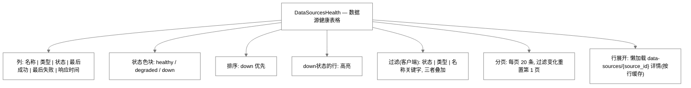
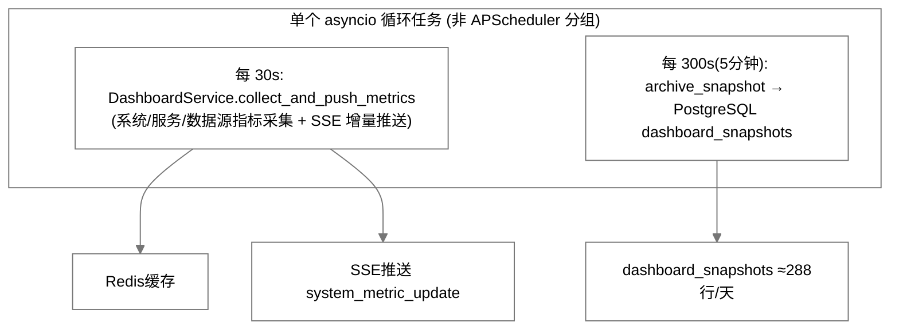
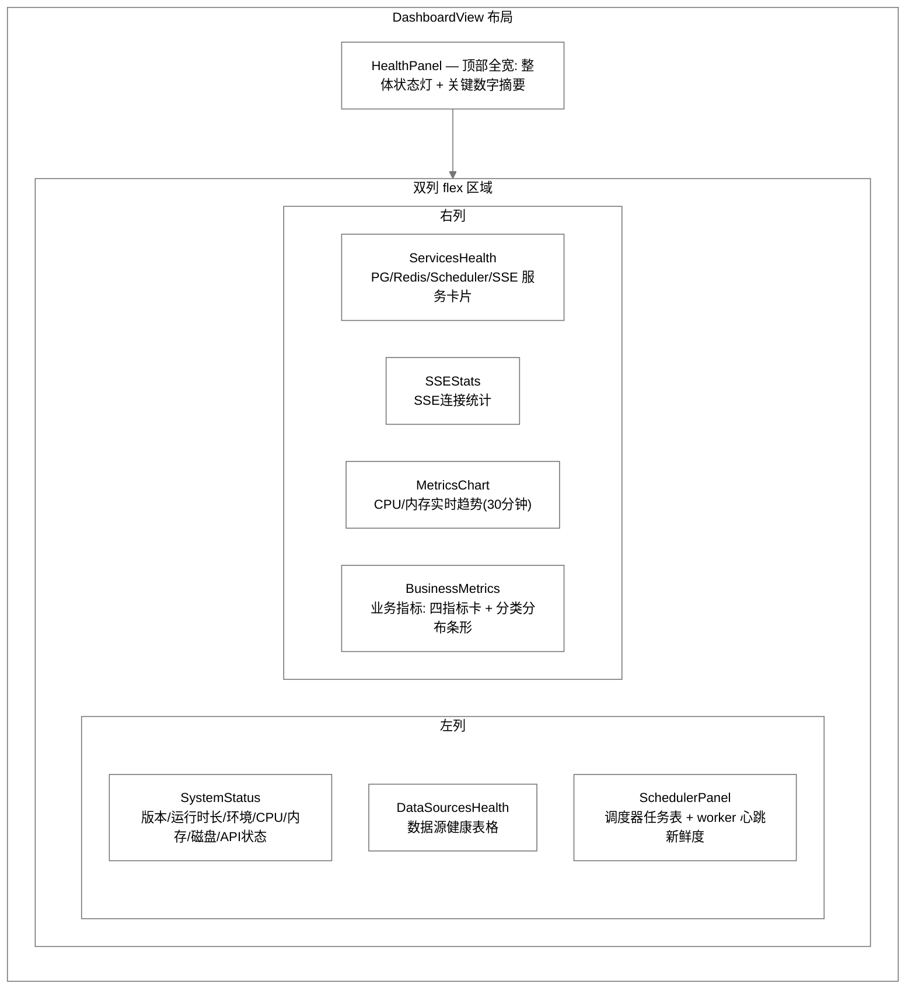

# InstantBoard Dashboard 模块详细设计

## 目录

1. 目标
2. 方案概述
3. 详细设计
   - 3.1 系统状态指标
   - 3.2 数据采集状态指标
   - 3.3 数据库状态指标
   - 3.4 资源消耗指标
   - 3.5 业务指标
   - 3.6 指标采集方式
   - 3.7 实时更新策略
   - 3.8 图表可视化设计
   - 3.9 资源消耗最小化策略
4. 关键决策
5. 边界情况
6. 与其他模块的依赖

## 1. 目标

定义 InstantBoard Dashboard 监控 Tab 的完整功能设计，包括系统/数据采集/数据库/资源/业务五类指标的定义、采集方式、实时更新策略和可视化方案，要求"尽可能详细又少占资源"。

## 2. 方案概述

提供 **轻量级运维仪表盘**，通过分层指标展示实现信息密度高但资源消耗低，核心策略: psutil轻量采集 + Redis缓存 + SSE增量推送 + 按需深度查询。实际类为 `services/dashboard.py` 的 `DashboardService`（单类，无独立的 SystemMetricsCollector/DatabaseMetricsCollector）。

## 3. 详细设计

### 3.1 系统状态指标

#### 3.1.1 系统信息（现状: `get_system_info()`）

| 指标 | 采集方式 | 展示 |
|------|---------|------|
| 应用版本 version | 配置读取 | 文本 |
| 运行时长 uptime | 进程启动时间差 | 格式化时长 |
| 环境 environment | 配置 | 文本 |
| Python版本 | `platform` | 文本 |
| CPU 使用率 | psutil | 数字 |
| 内存使用率/总量 | psutil | 数字 |
| 磁盘使用率/总量 | psutil | 数字 |
| 数据库连通性 | 会话探测 | 状态 |

> ✅ **已实现**（QPS、平均响应时间、4xx/5xx 错误率；API 状态灯仍未实现）：
> - `GET /api/v1/dashboard/system` 响应的 `api` 分组暴露 `qps` / `avg_response_ms` / `error_rate_4xx` / `error_rate_5xx`（0..1 比值）/ `requests_total`（`schemas/dashboard.py` `ApiRequestStats`）；前端 SystemStatus 渲染为"API 状态"区域（错误率 ×100 显示百分比）
> - **统计口径**：`RequestLoggingMiddleware` 每请求单条 pipeline 原子递增 Redis 计数器（见 §3.6.2，跨多 api worker 精确），`DashboardService.get_api_request_stats()` 读取上一分钟 + 当前分钟两个桶，按**滑动 60s 窗口**计算：
>   - 上一分钟桶的权重为 (60 − 当前分钟已过秒数) / 60，当前（进行中）分钟全量计入
>   - `qps` = 窗口内请求数 / 60
>   - `avg_response_ms` = 窗口内响应时间累计 / 窗口内请求数
>   - `error_rate_4xx` / `error_rate_5xx` = 窗口内 4xx / 5xx 计数 / 窗口内请求数
>   - `requests_total` = Redis 侧累计值（`dashboard:api_metrics:totals`，无 TTL，api 重启不归零）
> - 中间件未写过数据（新启动）或 Redis 降级/不可用时全部字段回退为 0，端点不报错
> - 健康检查（/api/v1/health）、SSE（/api/v1/stream）与超过 60s 的慢请求不计入统计

#### 3.1.2 Worker 心跳监控

- `worker_heartbeat_is_fresh`：worker 进程周期性写心跳，api 侧据此判定 **scheduler 服务健康状态**（`/dashboard/services` 的 scheduler 卡片状态依据），心跳过期视为服务降级

### 3.2 数据采集状态指标

#### 3.2.1 各数据源健康状态

**后端字段**（`source_health` 表 + 派生）：status(healthy/degraded/down)、last_success_at、last_failure_at、last_error_message、avg_response_time_ms、consecutive_failures、success_rate_24h、total_fetches_24h。

**DataSourceHealth UI（实际列）**:



> ✅ **已实现**（前端增强，后端端点复用）：
> - 过滤器：状态下拉（全部/healthy/degraded/down）+ 类型下拉（按实际 `source_type` 去重）+ 名称关键字搜索（大小写不敏感），三者叠加；源数量级小，客户端过滤即可；无匹配结果时显示 EmptyState
> - 分页：每页 20 条（`common/Pagination.vue`），任一过滤条件变化时重置回第 1 页
> - 行展开详情：点击行懒加载 `GET /api/v1/dashboard/data-sources/{source_id}`，详情按 `source_id` 组件内缓存——同一行重复展开不重复请求，请求中（inflight）去重；加载失败行内提示并附「重试」按钮；再次点击收起
> - 展开区内容：成功率（`success_rate_24h`，后端为 0..1 比值，前端 ×100 显示百分比）、24h 采集总数（`total_fetches_24h`）、连续失败数、最后错误、`health_history` 列表、`response_time_trend` 迷你条形（div 高度条，不引入新图表库）
> - 原「成功率 / 采集频率」列增强项以上述展开详情形式落地（不作为独立表格列）
>
> 已知边界：`response_time_trend:{source_id}` Redis Key 目前无后端写入方，趋势列表实际恒为空（前端按空态显示"暂无趋势"，契约已就位）

### 3.3 数据库状态指标（现状）

| 指标 | 采集方式 | 状态 |
|------|---------|------|
| PostgreSQL 连接池 | SQLAlchemy `pool.checkedout()` | ✅ 仅取 checked_out 连接数 |
| PostgreSQL 数据库大小 | `pg_database_size()` | ✅ |
| PostgreSQL 活跃查询数 | `pg_stat_activity` | ✅ |
| Redis 内存使用/最大内存 | `INFO memory` | ✅ used/max 字节 |
| Redis 连接客户端数 | `INFO clients` | ✅ |

> ⚠️ **未实现**：
> - Redis `DBSIZE`（Key 总数）、maxmemory 使用百分比展示
> - MongoDB 监控（项目未启用 MongoDB）
> - PG 连接池详情 `{pool_size, checked_in, overflow}`（实际只取 checked_out）

### 3.4 资源消耗指标（现状）

| 指标 | 采集方式 | 更新频率 | 展示 |
|------|---------|---------|------|
| CPU 使用率 (%) | `psutil.cpu_percent(0.5)` | 30s | 数字 |
| 内存使用率 (%) | `psutil.virtual_memory().percent` | 30s | 数字 |
| 内存使用/总量 (MB) | psutil | 30s | 数字 |
| 磁盘使用/总量 (GB) | `psutil.disk_usage('/')` | 30s | 数字 |
| 磁盘 I/O 速率 (MB/s) | `psutil.disk_io_counters()` 差分采样 → `disk_read_mbps`/`disk_write_mbps` | 30s | 数字 |
| 网络流量 | `psutil.net_io_counters()` → **累计** `network_bytes_sent/received` | 30s | 数字 |

- ✅ **磁盘 I/O 已实现**（`services/dashboard.py` `sample_disk_rates()`，仿照 `sample_network_rates`）：模块级 `_last_disk_sample` 记录上次 `read_bytes`/`write_bytes` + `time.monotonic()`，每次采样差分计算 `disk_read_mbps`/`disk_write_mbps`（MB/s，保留 2 位小数）；首次采样返回 0；计数器回绕/重启的负差钳制为 0；psutil 缺失、容器受限环境无 `disk_io_counters` 属性、返回 None 或抛错时降级为 0 且不保留采样状态。`get_system_info()` 同时暴露扁平字段与嵌套 `disk` 分组（容量 + 速率 + 累计字节）；SSE 增量推送沿用网络速率规则——不走 5% 阈值（该阈值仅适用于 CPU/内存百分比），速率任何变化即推（`collect_and_push_metrics`）；前端 SystemStatus 磁盘区域展示读写速率（缺值/0 显示 "--"）。
> ⚠️ **已知契约冲突（前后端断裂，待修复）**：后端推送的是**累计字节数** `network_bytes_sent/network_bytes_recv`，而前端 `types/index.ts` 期待的是**速率** `network_in_kbps/network_out_kbps` — 后端从不返回速率字段，导致 SystemStatus 网络项恒显示 "--"。

**psutil 采集策略**:
- `cpu_percent(0.5)` 为 0.5s 采样间隔的阻塞调用，经 `asyncio.to_thread` 放入线程池执行，**不阻塞事件循环**（该调用本身约耗 0.5s，并非 "<1ms/次"）
- `virtual_memory()` / `disk_usage()` / `net_io_counters()` / `disk_io_counters()` 直接读取 /proc，开销可忽略

### 3.5 业务指标

> ✅ **已实现**（`GET /api/v1/dashboard/business-metrics`，admin only；`DashboardService.get_business_metrics()`。整体响应在 Redis 缓存 60s（`dashboard:business_metrics`，`BUSINESS_METRICS_TTL`）——缓存未命中才计算、命中直接返回；任一子查询失败仅使该指标降级为 0/空列表，不影响其余指标，端点整体不报错。前端 `BusinessMetrics.vue` 面板渲染于 Dashboard 右列末端，见 §3.8.2）：

| 指标 | 口径 | 状态 |
|------|------|------|
| 活跃用户数 | `sse_connections` 近 24h 内连接过的去重 `user_id` 数（`active_users_24h`） | ✅ |
| 今日新增数据条目数 | `items` 表 `created_at` >= 当日 0 点（UTC）计数（`items_today`） | ✅ |
| 各分类数据量分布 | `items` 按 `category_id` GROUP BY JOIN `categories.name`，按 count 降序，返回 `[{category_name, count}]`（`category_distribution`） | ✅ |
| 自选列表总条目数 | `watchlist_items` 全表计数（`watchlist_total`） | ✅ |
| SSE推送事件数 (1h) | 分钟桶 `dashboard:events_pushed:minute:{minute}` 滑窗 60 分钟求和（`events_pushed_1h`） | ✅ |

> **口径说明**：
> - 五项全部为**系统全局（全租户）口径**，不按请求租户过滤——dashboard 各端点均为 admin only 的运维视角，租户隔离由信息流端点负责
> - 分类分布以 `categories.name` 聚合（同名分类跨租户会合并计数，属全局口径的预期行为）
> - SSE 推送事件数：写侧为 `SSEEventRouter.push_event` 内的单条非事务 pipeline `INCR` + `EXPIRE 3720s`（`core/sse_router.py::_record_push_event_count`，fire-and-forget，同 `RequestLoggingMiddleware` 的分钟桶模式——异常仅记日志，绝不阻塞推送）；桶 TTL 取 **62 分钟**而非 120s，是因为读侧需要完整 60 分钟窗口内的桶都存活。读侧对 `[now−59min, now]` 共 60 个桶 `MGET` 求和，Redis 降级 / 无桶 / 脏值计 0
> - `business_metric_update` SSE 推送事件类型仍未实现（见 §3.7.1），当前仅 REST 基线（前端 `store.init()` 拉取一次，admin 场景渲染、错误静默）

### 3.6 指标采集方式汇总

#### 3.6.1 采集架构（现状）



> 说明：原设计的 "Fast 10s / Medium 30s / Slow 5min 三组 APScheduler" 不存在；实际是一个 30s 周期循环内完成所有采集，归档计数器满 300s 时写一条快照。

#### 3.6.2 FastAPI Middleware（现状: `RequestLoggingMiddleware`）

```python
# core/middleware.py — RequestLoggingMiddleware
# 每请求计时后，用 **单条非事务 pipeline（一次 RTT，fire-and-forget）** 原子递增
# Redis 计数器；中间件自身任何异常仅记日志，绝不影响响应返回。
#   1. HINCRBY      dashboard:api_metrics:totals          requests_total 1
#   2. HINCRBY      dashboard:api_metrics:minute:{minute} count 1
#   3. HINCRBYFLOAT dashboard:api_metrics:minute:{minute} latency_ms <duration_ms>
#   4. HINCRBY      dashboard:api_metrics:minute:{minute} count_2xx|4xx|5xx 1
#   5. EXPIRE       dashboard:api_metrics:minute:{minute} 120
# totals key 无 TTL（跨进程/重启累计）；分钟桶 TTL 120s，读侧只需上一分钟+当前分钟。
# （这些统计由 DashboardService.get_api_request_stats() 读取并经
#   GET /dashboard/system 的 `api` 分组展示，见 §3.1.1）
```

### 3.7 实时更新策略

#### 3.7.1 SSE 推送策略（现状）

| 指标组 | SSE事件类型 | 推送频率 | 推送条件 |
|--------|-----------|---------|---------|
| 系统指标 | `system_metric_update` | 30s | 与上次比较变化 >5% 的字段才推送 |
| 数据源健康 | `source_health_update` | 实时 | 状态变更时立即推送（payload契约见 [data-flow.md](data-flow.md) §3.5.4） |
| 心跳 | `heartbeat` | 30s | 固定 |

> ⚠️ **未实现**：`db_metric_update`、`business_metric_update` — 后端 `SSEEventType` 仅 8 种事件（item_update/quote_update/market_index_update/nav_estimate_update/commodity_update/system_metric_update/source_health_update/heartbeat），不含这两种。

**增量推送优化**:
- 只推送变化超过 5% 的指标字段，不全量推送
- 前端首次连接通过 REST 获取完整基线，后续接收 SSE 增量
- 增量数据格式: `{metric_name: new_value}`

### 3.8 图表可视化设计

#### 3.8.1 图表选型（现状）

使用 **Chart.js**（经 `vue-chartjs` 封装，前端 `ChartWrapper.vue` 组件）。

| 图表 | 状态 |
|------|------|
| 实时趋势线 (CPU/内存) | ✅ `MetricsChart.vue`（DashboardView 右列，SSEStats 下方）：双数据集折线图（CPU % `--accent` #3b82f6 / 内存 % 紫 #8b5cf6），Y 轴固定 0-100%，X 轴为采样时刻（HH:MM:SS）；数据源为 store `cpuHistory`/`memoryHistory` 的 computed 派生，SSE `system_metric_update` push 后图表自动刷新（`animation: false` 无动画更新）；窗口 60 点 × 30s 采样 = 最近 30 分钟（标题据此命名），历史为空时显示占位文案不渲染画布 |
| 状态指示灯 | ✅ HealthPanel 内整体健康状态 |
| 数据表格 | ✅ DataSourcesHealth |

#### 3.8.2 Dashboard 布局（现状: `DashboardView.vue`）



- `/dashboard/services` 返回 4 个服务卡片：**postgresql / redis / scheduler / sse**（scheduler 依据 worker 心跳判定）
- SSE 统计字段：活跃连接数、累计连接、`average_events_per_minute`、`avg_connection_duration_seconds`、`peak_connections_today`

> ✅ **已实现**：`SchedulerPanel`（左列，位于 DataSourcesHealth 之后；数据来自 `dashboardStore.scheduler`，`init()` 调 `fetchScheduler`，admin only）：
> - 头部摘要卡片：总任务数（`total_jobs`）、运行中（`running_jobs_count`）、已暂停（`paused_jobs_count`）——计数取自后端计数字段（生产模式下任务列表为空、计数来自 worker 心跳）
> - worker 心跳新鲜度：`last_heartbeat` 距今相对时间；与后端心跳 TTL 语义一致（`RedisKeys.WORKER_HEARTBEAT_TTL = 45s`，worker 每 15s 写一次），距今 <45s 显示"心跳正常"，≥45s 或缺失（Key 已过期/从未写入）显示"⚠️ 疑似掉线"
> - 运行中 / 已暂停 两个页签（各带计数），切换渲染 `running_jobs` / `paused_jobs`
> - 任务表列：名称、周期（`current_interval`；`adaptive_multiplier ≠ 1` 时显示 原值→现值 删除线/高亮 + ×倍率标注）、上次运行（相对时间）、下次运行（未来相对时间）、状态徽章、24h 成功/失败（缺失显示 "--"，失败数 >0 红色高亮）
> - 无任务显示 EmptyState；生产模式下计数 >0 但列表为空时提示"任务详情位于 worker 容器"
> - 前端类型契约同步修正：`types/index.ts` 旧 `SchedulerStatus`（job 级、且误为数组）替换为与后端一致的 `SchedulerJobInfo` + `SchedulerStatusResponse`（对象），`stores/dashboard.ts` 与 `api/dashboard.ts` 同步

#### 3.8.3 图表渲染优化

```javascript
// 策略（✅ 已借 MetricsChart + ChartWrapper 达成）:
// - Chart.js instance 复用：vue-chartjs 监听 data 变化后对既有实例增量
//   update（不销毁重建）；MetricsChart options 设 animation: false，
//   等效 update('none') 无动画刷新
// - 数据窗口保留最近 60 个点，旧点自动移除：
//   store push+shift 截断（60 × 30s = 30 分钟），
//   ChartWrapper.pushDataPoint 亦内置 60 点上界
// - 前端 store 已维护 60 点滚动历史窗口
```

### 3.9 资源消耗最小化策略

#### 3.9.1 采集资源优化

| 策略 | 实现 | 状态 |
|------|------|------|
| **psutil非阻塞** | `asyncio.to_thread(psutil.cpu_percent, 0.5)` | ✅ |
| **复用已有连接** | DB指标用现有SQLAlchemy连接池 | ✅ |
| **Redis INFO单次** | 一次INFO命令获取内存/客户端信息 | ✅ |
| **增量推送** | 仅推送变化>5%字段 | ✅ |
| **归档降频** | dashboard_snapshots 每 5 分钟归档 1 行（≈288 行/天） | ✅ |
| **快照保留** | dashboard_snapshots 超 30 天自动清理（24h 节流，随采集循环执行，见 §3.9.3） | ✅ |

#### 3.9.2 前端资源优化

> ⚠️ **未实现**：虚拟滚动（数据源表格）、`document.hidden` 暂停 SSE/图表（全前端无该逻辑）。图表懒加载已通过路由级代码分割部分达成。

#### 3.9.3 存储优化

- dashboard_snapshots 每 5 分钟归档 1 行 → 每天约 288 行
- 趋势数据不存 PG，仅前端内存/Redis 滚动窗口
- ✅ **已实现**：「超过 30 天的 dashboard_snapshots 自动清理」（`services/dashboard.py` `cleanup_old_snapshots`）：
  piggyback 在指标采集循环（`start_metrics_collection`）中，由内存节流 `snapshot_cleanup_due` 控制——首轮循环立即执行一次，之后每满 24h（`SNAPSHOT_CLEANUP_INTERVAL_SECONDS`）最多执行一次；
  保留窗口 `SNAPSHOT_RETENTION_DAYS = 30`，可用配置 `DASHBOARD_SNAPSHOT_RETENTION_DAYS` 覆盖；
  过滤列为快照的 `timestamp`（该表无 created_at），`DELETE … WHERE timestamp < now() - retention` 并提交，返回删除行数；
  清理失败仅记 warning 日志、不中断指标采集（保留 `last_cleanup_time` 不更新，下一轮重试）。

## 4. 关键决策

| 决策 | 选择 | 理由 |
|------|------|------|
| 监控方案 | 自建轻量 (psutil+middleware+Redis) | 不引入Prometheus/Grafana，资源消耗极低 |
| 指标采集库 | psutil（经 to_thread 非阻塞） | 无额外进程 |
| 图表库 | Chart.js (vue-chartjs + ChartWrapper) | 轻量 |
| 推送策略 | 增量推送 + REST 基线 | 带宽节省 |
| 归档频率 | 每 5 分钟 1 次（约 288 行/天） | 存储成本可接受 |
| 采集架构 | 单个 asyncio 循环 (30s采集 + 300s归档 + 24h快照清理) | 实现简单，替代原三组 APScheduler 设计 |

## 5. 边界情况

- **psutil 不可用** ✅ 已实现（`services/dashboard.py` 顶部 try/except 导入，缺失时 `psutil=None` + 启动告警日志）：
  `get_system_info` / `collect_and_push_metrics` / `archive_snapshot` 全部判空降级——CPU/内存/磁盘指标为 `None`、网络/磁盘 I/O 速率为 0（`sample_network_rates` / `sample_disk_rates` 不再保留采样状态），快照的 psutil 列存 `None`；DB/Redis/SSE 采集与告警评估照常。响应带 `psutil_available: false` 标记（`SystemInfoResponse` 新增字段），全程不抛异常。
- **阈值告警** ✅ 已实现（`DashboardService._collect_alerts`，每次 30s 采集循环内评估，内存中维护 `[{code, message, triggered_at}]`，同 code 活跃期去重、恢复即移除；`GET /dashboard/system` 新增 `alerts` 字段，列表变化时整体随 `system_metric_update` 推送）：
  - `redis_memory_high`：`used_memory / maxmemory > 0.8`（maxmemory 为 0/未设置则跳过）
  - `db_pool_exhausted`：连接池 `checked_out >= pool_size`（优先 SQLAlchemy `pool.checkedout()/size()`，回退 `status()` 对象取值）
  - `sse_connections_high`：活跃 SSE 连接 > 1000（取自 `event_router.get_stats()` 当前进程注册数；**多进程局限**：`event_router` 是进程内注册表，多 worker 部署下每个 api 进程只看到自己的连接份额）
  - `cpu_high`：CPU 使用率 > 90%（psutil 缺失时跳过）
- **系统负载高自动降频** ✅ 已实现（最小化版本）：CPU 连续 3 次采集 >90%（`HIGH_CPU_STREAK_THRESHOLD`）时采集循环从 30s 放宽到 60s（`get_collect_interval()`），任一采样回落至阈值内即还原 30s；降频期间 `cpu_high` 告警消息附注当前降频间隔。
- **数据源大面积 down**: 表格按 down 优先排序 ✅

## 6. 与其他模块的依赖

- → [api.md](api.md): Dashboard API端点 (`/api/v1/dashboard/*`，含 `data-sources/{source_id}` 详情、`/services`、`/scheduler`、`/sse-stats`)、SSE事件定义
- → [database.md](database.md): source_health表、dashboard_snapshots表、sse_connections表；Redis Key（`SYSTEM_METRICS`、`dashboard:api_metrics:totals`、`dashboard:api_metrics:minute:{minute}`）
- → [frontend.md](frontend.md): DashboardView组件层级、布局设计
- → [data-flow.md](data-flow.md): SSE推送机制、Redis Pub/Sub分发
- → [architecture.md](architecture.md): dashboard模块职责划分
- → [data-sources.md](data-sources.md): 数据源健康状态定义、failover设计
