# InstantBoard 数据流与SSE推送设计

## 目录

1. 目标
2. 方案概述
3. 详细设计
   - 3.1 数据采集流程
   - 3.2 SSE 实时推送数据流设计
   - 3.3 数据处理管道设计
   - 3.4 异步任务队列设计
   - 3.5 Redis Pub/Sub 消息分发设计
   - 3.6 数据缓存与过期策略
   - 3.7 错误处理与重试机制
   - 3.8 数据流时序图
4. 关键决策
5. 边界情况
6. 与其他模块的依赖

## 1. 目标

定义 InstantBoard 从外部数据源采集到前端实时展示的完整数据流设计，包括采集流程、处理管道、SSE推送机制、异步任务调度、消息分发、缓存策略和错误处理，确保数据流畅、实时、可靠。

## 2. 方案概述

采用 **分层异步管道 + SSE单向推送 + Redis Pub/Sub分发** 架构，数据从外部源采集后经过去重/过滤/分类处理，存入数据库和缓存，通过Redis Pub/Sub触发SSE推送，前端通过EventSource实时消费。

## 3. 详细设计

### 3.1 数据采集流程

#### 3.1.1 完整采集流程图

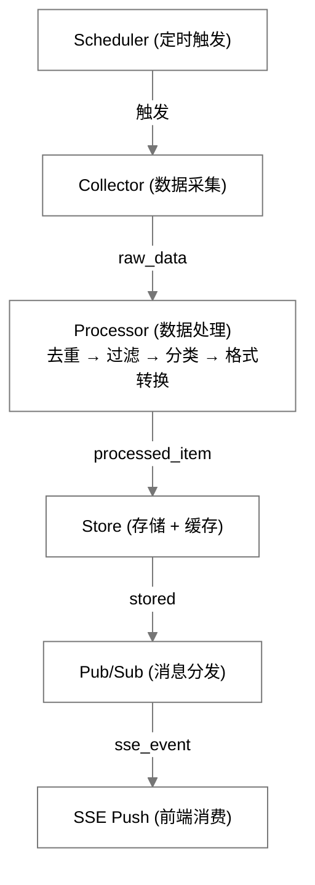

- **Scheduler**：APScheduler 定时触发，每个 source 独立调度，任务 ID = `collect_{source_id}`（开发内嵌 / 生产独立进程，详见 §3.4）。
- **Collector**：按 `source_type` 经注册表选择采集器（9 个采集器的实际结构见 §3.1.2）。
- **Processor**：四步处理——去重（Redis Set + PG UNIQUE）、过滤（`keywords_filter`）、分类（auto categorize + topic extraction）、格式转换（统一为 Item schema），详见 §3.3。
- **Store**：PostgreSQL `items` 表持久化 + Redis quote/nav/commodity 实时缓存（详见 §3.6）。
- **Pub/Sub**：Redis `PUBLISH channel:{category}`，SSEEventRouter 接收并转发（详见 §3.5）。
- **SSE Push**：EventSource → 前端 Pinia store → Vue 组件更新。

> ⚠️ **未实现**：原流程中"3. MongoDB raw_content（原始数据）"无任何代码实现，连降级路径都不存在，已从流程图中移除。

#### 3.1.2 各采集器类型实现

```text
# 实际结构：按数据域分子包，注册表见 app/collectors/__init__.py COLLECTOR_REGISTRY（9 个）
collectors/
├── base.py                       # BaseCollector 抽象基类
├── finance/
│   ├── yfinance_collector.py     # yfinance 行情/指数/商品
│   ├── alpha_vantage_collector.py
│   ├── eastmoney_collector.py    # 东方财富（国内行情/指数, failover 链首）
│   ├── finnhub_collector.py
│   └── iex_cloud_collector.py    # IEX Cloud（可选, 统一APIKeyManager）
└── tech/
    ├── rss_collector.py          # feedparser 解析 RSS
    ├── hackernews_collector.py   # HackerNews API
    ├── arxiv_collector.py        # arXiv API
    └── reddit_collector.py       # Reddit 公开JSON（social, 无需凭据）
```

```python
# collectors/base.py (伪代码)

class BaseCollector:
    async def collect(self, source: Source) -> CollectionResult:
        """采集数据, 返回 CollectionResult(success / items / error / response_time_ms)"""
        raise NotImplementedError

    async def record_health(self, source_id, success, response_time_ms, error=None):
        """记录数据源健康状态 (base.py:139)"""
        # 写入 source_health 表
        # 连续失败 ≥3 次 → status='degraded'；≥10 次 → status='down'
        # 成功 1 次 → 状态升一级 (down→degraded, degraded→healthy)
```

> ⚠️ **未实现**：早期设计中的通用 `api_collector` / `web_collector` 不存在；`source_type=api/web_scrape` 的模板源通过 `config.library` 显式指名上述 7 个采集器之一（`resolve_collector`）。

### 3.2 SSE 实时推送数据流详细设计

#### 3.2.1 SSE vs WebSocket 选型分析

| 维度 | SSE (Server-Sent Events) | WebSocket |
|------|--------------------------|-----------|
| **方向性** | 单向 (服务端→客户端) ✅ InstantBoard仅需推送 | 双向 (服务端↔客户端) |
| **协议** | HTTP/1.1+ (HTTP/2多路复用) | 独立ws://协议 |
| **自动重连** | ✅ 浏览器原生EventSource自动重连 | ❌ 需手动实现重连逻辑 |
| **浏览器支持** | ✅ 所有现代浏览器 (除IE) | ✅ 所有现代浏览器 |
| **实现复杂度** | 🟢 低 (FastAPI StreamingResponse) | 🔴 高 (需维护连接状态、心跳、重连) |
| **防火墙/代理** | ✅ 标准HTTP, 代理友好 | ❌ ws://可能被代理/防火墙阻断 |
| **连接数限制** | HTTP/2下多路复用, 单连接多流 | 每频道独立连接 |
| **认证** | query param token (EventSource不支持自定义header) | 可在握手时发送header |
| **资源消耗** | 🟢 低 (单向, 无需维护双向缓冲) | 🔴 中 (双向缓冲+心跳) |
| **数据格式** | 文本 (event + data字段) | 文本/二进制 |

**最终推荐: SSE** ✅

理由:
1. InstantBoard核心需求是服务端→客户端推送 (行情更新、新闻推送)，无需双向通信
2. SSE原生自动重连，断线恢复无需前端额外逻辑
3. HTTP/2下SSE可多路复用 (单TCP连接多SSE流)，比WebSocket多连接更高效
4. 实现简单 — FastAPI `StreamingResponse` 即可，无需WebSocket库
5. 代理/防火墙友好 — 纯HTTP协议

#### 3.2.2 SSE 推送数据流架构

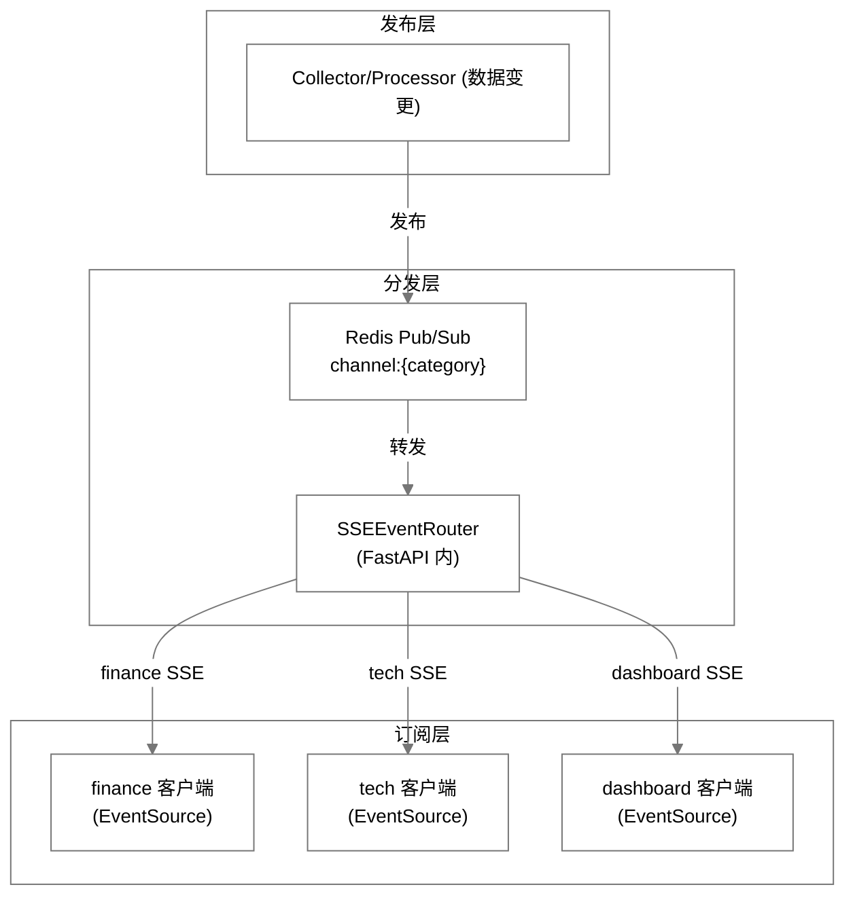

- **SSEEventRouter**：维护映射 `{client_id → [subscriptions]}`；接收 Pub/Sub 消息 → 匹配订阅者 → 发送 SSE 事件（实现见 §3.2.3）。

#### 3.2.3 SSE EventRouter 实现

```python
# app/core/sse_router.py (伪代码摘要)

class SSEConnection:
    """client_id / categories / tenant_id / user_id / asyncio.Queue(maxsize=1000)"""

class SSEEventRouter:
    # 连接映射: {client_id: SSEConnection}
    # 订阅映射: {channel: set[client_id]}

    def register(self, client_id, categories, tenant_id, user_id): ...
    def unregister(self, client_id): ...

    async def push_event(self, category, event_type, data, tenant_id):
        """构造消息 {event_type, channel, data, tenant_id, event_id, published_at}
        → redis PUBLISH channel:{category}
        发布失败时降级为直接调用 _on_redis_message 内存转发"""

    async def _on_redis_message(self, channel, event_data):
        """按 tenant_id 字符串精确匹配转发给频道订阅者;
        再向 'all' 聚合订阅者二次投递 (跳过已投递者)"""

    async def start_redis_listener(self):
        """订阅 5 个频道: finance / tech / dashboard / admin / all
        (注意: channel:admin 有订阅但当前无任何发布者)"""

    def start_heartbeat(self, interval=30): ...
```

#### 3.2.4 SSE 端点实现

```python
# app/api/v1/sse.py

@router.get("/stream/{category}")          # 挂载在 /api/v1/stream 前缀下
async def sse_stream(category: str, token: str = Query(...), db = Depends(get_db)):
    """
    SSE推送端点
    1. JWT 验证 (query param token, extract_user_from_token)
    2. 注册连接到 EventRouter (client_id 每次连接唯一)
    3. StreamingResponse 事件流: connected 握手 → 事件循环/心跳
    4. 断开时清理 (finally: sse_service.disconnect)
    """
    user_info = extract_user_from_token(token)
    if user_info is None:
        raise InvalidToken()

    # 末段为随机 uuid（非会话 ID/ session_id）, sse.py:80
    client_id = f"{tenant_id}:{user_id}:{uuid.uuid4()}"
    await sse_service.connect(client_id, [category], tenant_id, user_id, db)

    async def event_generator():
        # 握手: 先推送 connected 事件 (sse.py:93-101)
        yield f"event: connected\ndata: {{client_id, category, timestamp}}\nid: init\n\n"
        while True:
            try:
                event = await asyncio.wait_for(conn.queue.get(),
                                               timeout=settings.sse_heartbeat_interval)
                yield f"event: {event['event_type']}\ndata: ...\nid: {event_id}\n\n"
            except TimeoutError:
                # 具名心跳事件（非 : 注释行）
                yield f"event: heartbeat\ndata: {{'timestamp': ...}}\n\n"

    return StreamingResponse(event_generator(), media_type="text/event-stream",
        headers={"Cache-Control": "no-cache", "X-Accel-Buffering": "no", ...})
```

### 3.3 数据处理管道设计

#### 3.3.1 处理管道流程

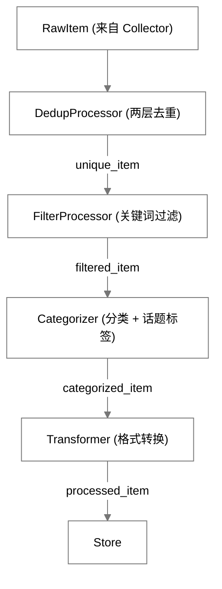

- **DedupProcessor 两层去重键（注意二者不同）**：① Redis Set `MD5(title:url)` 快速检查（`processors/dedup.py:40-42`）；② PG UNIQUE 兜底 `(tenant_id, source_id, url, published_at)`（`models/item.py:56-63`）；Redis 层不含 `published_at`。
- **FilterProcessor**：检查 `category.keywords_filter`，标题/摘要须含至少 1 个关键词；过滤列表为空则全量通过。
- **Categorizer**：按 `source.category_id` 定一级分类；`TechTopicExtractor` 提取 `topic_tags`——规则标签不足（< 3）且进程内滑窗语料（最近 2000 条）预热达标（≥ 50）时，叠加 TF-IDF 高频术语三级标签（标题候选、上限 3，见 content-categories.md §3.6.3）；FinanceCollector 自动标记 `type`（stock/fund/...）。
- **Transformer**：字段名统一映射、时区归一 UTC、HTML 摘要清理（去标签截断 200 字符）、URL 规范化、`priority` 计算（`source.priority` + 热度加权）。

#### 3.3.2 处理器链实现

```python
# processors/processor_chain.py

class ProcessorChain:
    """
    处理器链 — 依次执行各处理器
    
    支持: 跳过已处理条目 (is_processed标记)
    支持: 处理失败时记录错误但不中断链
    """
    
    processors = [
        DedupProcessor(),
        FilterProcessor(),
        Categorizer(),
        Transformer(),
    ]
    
    async def process(self, raw_items: list[RawItem], source: Source) -> list[Item]:
        processed = []
        for raw_item in raw_items:
            try:
                item = raw_item
                for processor in self.processors:
                    result = await processor.process(item, source)
                    if result is None:  # 被过滤/去重
                        break
                    item = result
                if item is not None:
                    processed.append(item)
            except Exception as e:
                logger.warning(f"Processing failed for {raw_item.url}: {e}")
                # 不中断链，继续处理下一个
        return processed
```

### 3.4 异步任务调度设计（APScheduler 统一）

> 早期设计为"APScheduler (开发) → Celery (生产)"渐进式方案。**Celery 从未实现**（无依赖、无 Beat、无 Flower、无 `docker/worker/Dockerfile`），本节已改写为现状：开发与生产统一使用 APScheduler，仅运行位置不同。

#### 3.4.1 开发内嵌 / 生产独立进程

| 维度 | 开发环境 | 生产环境 |
|------|---------|---------|
| 运行位置 | 内嵌 api 进程（`SCHEDULER_ENABLED=true`） | 独立 worker 容器：复用 backend 镜像（target: production）+ `command: python -m app.scheduler.worker`（docker-compose.prod.yml:97-117） |
| api 侧调度器 | 与调度器同进程 | `SCHEDULER_ENABLED=false` 关闭，避免双调度器重复采集 |
| 自适应暂停 | 启用：无 SSE 订阅者时暂停任务；首个订阅者到来（0→1）时 `resume_paused_jobs()` 恢复 | 禁用（`disable_adaptive_pause()`，worker 进程内无 SSE 连接注册表）——暂停侧禁用语义不变；恢复钩子仍生效但无暂停任务时是 no-op |
| 负载降频 | `evaluate_load_multiplier()` 每轮评估：SSE 连接数 >500 或 Redis 内存 >80% → ×2（信号缺失 ×1.0 失败开放），与最终间隔 = 原始 × 健康 × 负载 | 同左：SSE 连接数为 api 进程写入 Redis 的 `sse:active_connections` gauge（跨进程信号），内存信号 `INFO memory` 直读（finance-tab.md §3.8.3） |
| 可观测性 | 进程内日志 | Redis 心跳 `scheduler:worker:heartbeat`（15s 写入 / 45s TTL，契约见 infrastructure.md §3.5） |

> ⚠️ **未实现**：任务级自动重试 / 指数退避（原 Celery 语义）与多 worker 水平扩展。当前失败处理为"记录健康状态 → 降频 → 下一调度周期重试"。

#### 3.4.2 任务定义（现状）

```python
# app/scheduler/manager.py

SOURCE_TYPE_DEFAULT_INTERVALS = {           # manager.py:16-28
    "finance_quote": 30, "finance_cn_stock": 30, "finance_market_indices": 30,
    "finance_commodities": 60, "finance_nav": 120,
    "rss": 300, "hackernews": 120, "arxiv": 1800,
    "web_scrape": 1800, "api": 60, "social": 600,
}

# 负载降频阈值 (finance-tab.md §3.8.3)
SSE_LOAD_THRESHOLD = 500                # 活跃 SSE 连接数 (严格大于才触发)
REDIS_MEM_LOAD_THRESHOLD = 0.8          # used_memory/maxmemory (maxmemory=0 跳过)
LOAD_MULTIPLIER = 2.0                   # 上限倍率, 两信号取最大不叠加

async def evaluate_load_multiplier() -> float: ...
# 跨进程信号: api 进程写 sse:active_connections gauge (register/unregister + 30s 心跳,
# TTL 60s, SET 全量自校正); worker 读 gauge + INFO memory. 信号读取失败 → ×1.0 失败开放.

class AsyncSchedulerManager:
    # job_defaults: max_instances=1 (防重叠), misfire_grace_time=60, coalesce=True
    # add_job 传 next_run_time=now 使首次立即执行
    # 任务 ID 统一为 collect_{source_id} (manager.py:102)
    # source 未配置间隔 (或 <10s) → 回退其 source_type 默认间隔

    async def add_collection_job(self, source_id, interval_seconds, source_type): ...
    async def schedule_all_active_sources(self, sources): ...      # 启动时从 DB 全量重建
    async def adaptive_reschedule(self, source_id, health_status): ...   # 间隔=原始×健康×负载倍率
    async def _apply_load_multiplier(self, source_id): ...         # _run_collection 每轮评估, 变化即重排该源
    async def resume_paused_jobs(self) -> int: ...                 # 首个订阅者恢复钩子; 无暂停任务 no-op
    async def add_market_refresh_jobs(self): ...                   # 行情定时刷新任务组 (finance-tab.md §3.8.2):
    #   market_indices_refresh (MARKET_INDICES_REFRESH_INTERVAL, 默认 30s) /
    #   commodities_refresh (COMMODITIES_REFRESH_INTERVAL, 默认 60s)。
    #   任务体: 开市门控 (FinanceService.is_any_market_open, 全休市静默跳过,
    #   替代原设计 market_indices_off_hours) → 复用按需缓存未命中的拉取+写缓存+
    #   SSE 推送路径 (载荷未变跳推送仍续缓存), 系统租户口径; 异常只记日志不杀任务。
    #   开关 market_refresh_jobs_enabled; 开发内嵌 (main.py lifespan) 与生产
    #   (worker.main) 两处注册, SCHEDULER_ENABLED=false 的 api 进程不注册。

# app/scheduler/worker.py — 生产独立进程入口 (python -m app.scheduler.worker)
# 1. create_tables() 建表
# 2. disable_adaptive_pause() → scheduler.start()
# 3. 订阅 channel:dashboard: 源生命周期事件 (source_created/enabled/disabled/deleted)
#    + scheduler_resume 首个订阅者恢复事件 (WORKER_EVENT_NAMES; 先于全量重建, 防启动窗口丢事件)
# 4. schedule_all_active_sources() 从 DB 全量重建任务
# 5. add_market_refresh_jobs() 注册行情定时刷新任务 (同开发内嵌调度器, finance-tab.md §3.8.2)
# 6. heartbeat_loop: 每 15s 写心跳
# 7. SIGTERM/SIGINT 优雅停机 (先停监听器, 再清心跳)
```

#### 3.4.3 任务编排策略

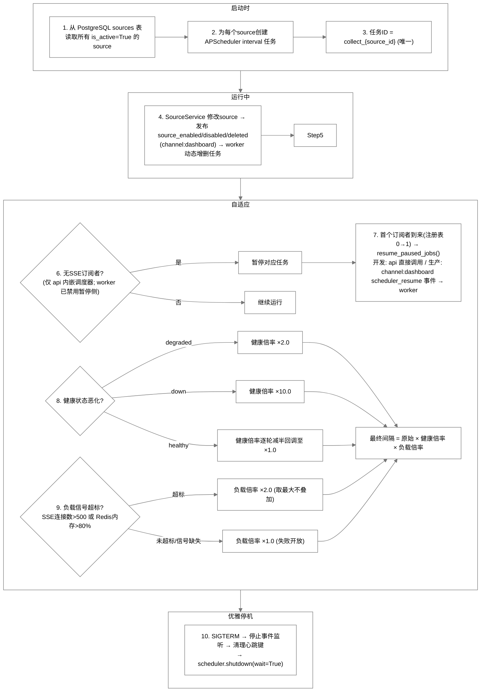

### 3.5 Redis Pub/Sub 消息分发设计

#### 3.5.1 Pub/Sub 频道定义

| 频道名称 | 发布者 | 订阅者 | 消息内容 |
|---------|--------|--------|---------|
| `channel:finance` | FinanceService / 采集管道 / 调度器行情刷新任务组（`scheduler/manager.py::_run_market_refresh`，指数 30s / 商品 60s、开市门控，见 finance-tab.md §3.8.2） | SSEEventRouter | quote_update / market_index_update / commodity_update / nav_estimate_update |
| `channel:tech` | 采集管道 | SSEEventRouter | item_update / topic_stats_update（条目入库触发 + 900s 窗口节流，见 tech-tab.md §3.8） |
| `channel:dashboard` | SourceService / 调度器 / 指标采集 / SSE 首个订阅者钩子 | SSEEventRouter **+ worker**（`scheduler/worker.py::source_event_listener`） | SSE 事件：system_metric_update / source_health_update / source_created；worker 消费的事件（键为 `event`，`WORKER_EVENT_NAMES`）：source_enabled / source_disabled / source_deleted（源生命周期）+ `scheduler_resume`（api SSE 注册表 0→1 时发布 → worker `resume_paused_jobs()`，见 finance-tab.md §3.8.3）——**注意：发布在 dashboard 频道，而非 admin** |
| `channel:admin` | **无** | SSEEventRouter | 已被订阅但当前无任何发布者（保留备用） |
| `channel:all` | — | SSEEventRouter（all 聚合） | 各频道消息向 `all` 订阅者二次投递 |

> ⚠️ **未实现**：`db_metric_update` / `business_metric_update` / `alert_update` 无后端发布者——后端 `SSEEventType`（`core/sse_router.py`）共 9 种（item_update / quote_update / market_index_update / nav_estimate_update / commodity_update / system_metric_update / source_health_update / topic_stats_update / heartbeat），上述事件名仅存在于前端枚举死代码（`frontend/src/utils/sse.ts`）。亦不存在 `source_updated` 事件。（`topic_stats_update` 已实现：科技条目入库触发 + 900s 窗口节流，见 tech-tab.md §3.8）

#### 3.5.2 消息格式

```json
// Pub/Sub消息统一格式
{
  "event_type": "quote_update",       // SSE事件类型
  "channel": "finance",               // 目标频道
  "data": {                           // SSE data字段内容
    "symbol": "AAPL",
    "current_price": 178.52,
    "change_percent": 1.32,
    "timestamp": "2026-06-23T10:00:00Z"
  },
  "tenant_id": "uuid",                // 租户隔离
  "event_id": "1719500000-42",
  "published_at": "2026-08-24T10:00:00Z"  // 发布时间
}
```

> 说明：`event_id` 由 EventRouter 生成（`core/sse_router.py:111`）。源生命周期事件（source_enabled 等）例外：它们使用 `event` 键而非 `event_type`，且不经 `push_event`。

#### 3.5.3 SSE连接与Pub/Sub映射

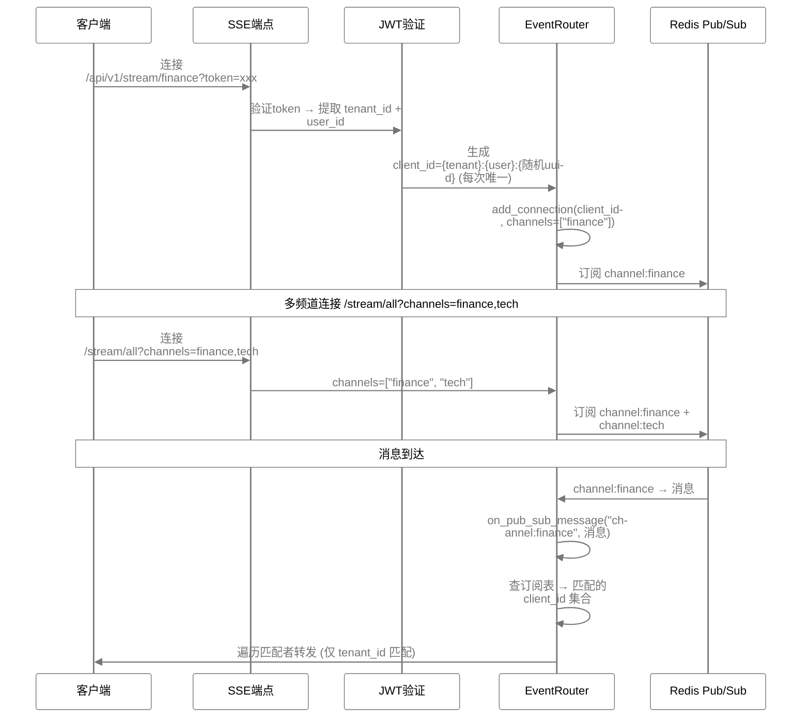

#### 3.5.4 source_health_update 事件契约 (数据源健康表格增量刷新)

本契约是前后端共同遵守的单一事实来源；发布侧/消费侧代码注释均引用本节。

**事件元信息**:

| 项 | 值 |
|----|----|
| 事件名 (event_type) | `source_health_update` (`SSEEventType.SOURCE_HEALTH_UPDATE`) |
| 频道 (channel) | `dashboard` (Redis key `channel:dashboard`) |
| 发布方 | 采集调度器: `app/scheduler/manager.py::_update_health_after_collection` → `app/services/sse.py::publish_source_health_update` |
| 推送条件 | `source_health.status` 发生变化时 (healthy ↔ degraded ↔ down) |
| 消费方 | 前端 `stores/dashboard.ts::updateSourceHealthFromSSE` → Dashboard "数据源健康"表格 (`DataSourcesHealth.vue`) |

**Payload 字段** (`data` 部分，由 `app/services/sse.py::build_source_health_update_payload` 从 `source_health` 记录 + 所属 `sources` 行构造，包含前端表格渲染所需的完整行状态):

| 字段 | 类型 | 语义 |
|------|------|------|
| `source_id` | str(UUID) | **行匹配键**: 前端按 `sources[].id === source_id` 定位表格行 |
| `name` | str | 数据源名称 (上下文信息，前端不用其覆盖行) |
| `source_type` | str | rss / api / web_scrape / social |
| `status` | str | 新状态: healthy / degraded / down |
| `previous_status` | str | 变更前状态 |
| `last_error` | str \| null | 最近错误信息 (source_health.last_error_message) |
| `last_success_at` | ISO8601 \| null | 最近成功采集时间 |
| `last_failure_at` | ISO8601 \| null | 最近失败采集时间 |
| `avg_response_time_ms` | int | 24h 平均响应时间 |
| `consecutive_failures` | int | 连续失败次数 |
| `success_count_24h` | int | 24h 成功次数 |
| `total_fetches_24h` | int | 24h 采集总次数 |
| `success_rate_24h` | float \| null | success_count_24h / total_fetches_24h；无采集时为 null |
| `timestamp` | ISO8601 | 事件发布时间 (UTC) |

**租户路由语义** (见 §3.5.2 / §3.5.3):

- 消息外层携带 `tenant_id = str(source.tenant_id)` (不在 `data` 内)，由发布侧按源所属租户设置；默认值为 `str(SYSTEM_TENANT_ID)`。
- `SSEEventRouter._on_redis_message` 按**字符串精确匹配**转发：仅 `conn.tenant_id == tenant_id` 的连接能收到。
- 种子/系统级数据源归属 system 租户 (`SYSTEM_TENANT_ID`，固定 UUID `00000000-0000-0000-0000-000000000000`)；admin 帐号位于 system 租户，其 JWT `tenant_id` claim 即 `str(SYSTEM_TENANT_ID)`，SSE 连接按该值注册 → **admin 会话能收到系统源的健康事件**。
- 其他租户的连接收不到 system 源健康事件（租户隔离，与 REST `/dashboard/data-sources` 的可见性规则一致）。
- 禁止使用字面量字符串（如 `"system"`、`"default"`）作为租户发布或连接注册的 fallback：它们与任何租户 UUID 字符串永不相等，事件将无法送达任何连接；发布侧/连接侧的 falsy fallback 一律使用 `str(SYSTEM_TENANT_ID)`。

**前端消费规则**:

- 按 `source_id` 匹配行；找不到则忽略（不新增行）。
- 合并更新 `status` / `last_success_at` / `last_failure_at` / `avg_response_time_ms` / `consecutive_failures` / `total_fetches_24h` / `success_rate_24h` / `last_error` 等可变字段；**不覆盖** `id` / `name` / `source_type` 身份列。
- 事件中时间字段为 `null` 视为"无变化"，保留行内原值。
- 每次更新后重算 `healthy` / `degraded` / `down` 汇总计数。

> 缺陷修复记录：旧发布侧 payload 仅含 `{source_id, status, last_error, timestamp}`，前端却按 `data.id` 匹配并整行替换，导致表格行永远无法增量刷新；现已统一为本契约。`services/source.py` 中曾存在的绕过 `event_router` 的直接 `redis_publish` 旁路（无 `tenant_id`、事件键为 `event` 而非 `event_type`，会被误投为 item_update 且破坏租户隔离）已随无调用方的 `update_source_health` 一并删除。

### 3.6 数据缓存与过期策略

#### 3.6.1 缓存层级

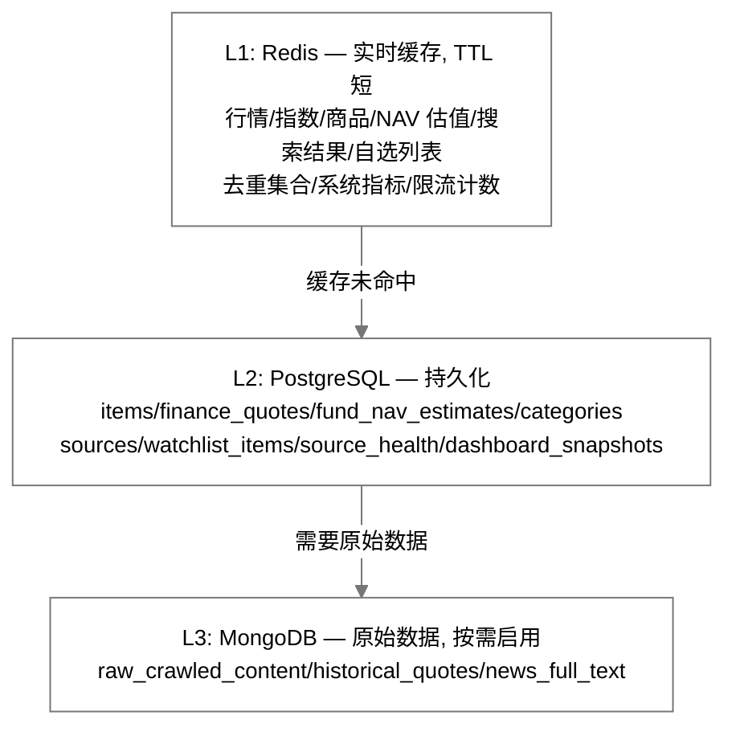

#### 3.6.2 Redis缓存过期策略

| Key模式 | TTL | 过期策略 | 说明 |
|---------|-----|---------|------|
| `t:{tid}:quote:{symbol}` | 30s 固定 | 主动更新+被动过期 | `finance.py:77` 固定 30 秒；**无**"休市延长 5min"分支 |
| `t:{tid}:market_indices` | 60s | 主动更新覆盖 | 每次采集直接SET覆盖 |
| `t:{tid}:commodities` | 60s | 主动更新覆盖 | 同market_indices |
| `t:{tid}:nav:{symbol}` | 120s | 主动更新覆盖 | 估值数据 |
| `t:{tid}:dedup:{source_id}` | **永不过期** | 无 TTL | `processors/dedup.py:33` 的 `redis_sadd` 不设 TTL，与原设计"24h 自动清理"不符，**待修复**（当前仅靠 512mb + allkeys-lru 兜底） |
| `t:{tid}:search:{hash}` | 5min | 被动过期 | 搜索结果缓存 |
| `t:{tid}:watchlist:{uid}` | — | — | ⚠️ **未实现**：从无写入，只有增删改时 `redis_delete` 失效（`services/finance.py:403-443` 直接查 PG） |
| `dashboard:system_metrics` | 10s | 主动更新覆盖 | 系统指标 |
| `source_health:{sid}` | 5min | 主动更新覆盖 | 数据源健康 |

**Redis全局策略** (见[database.md](database.md) §3.2):
- `maxmemory-policy: allkeys-lru` — 内存满时LRU淘汰
- `maxmemory: 512mb (开发/生产统一)`
- `appendonly: no` — 默认关闭 AOF, 仅 RDB 快照持久化

### 3.7 错误处理与重试机制

#### 3.7.1 采集错误处理

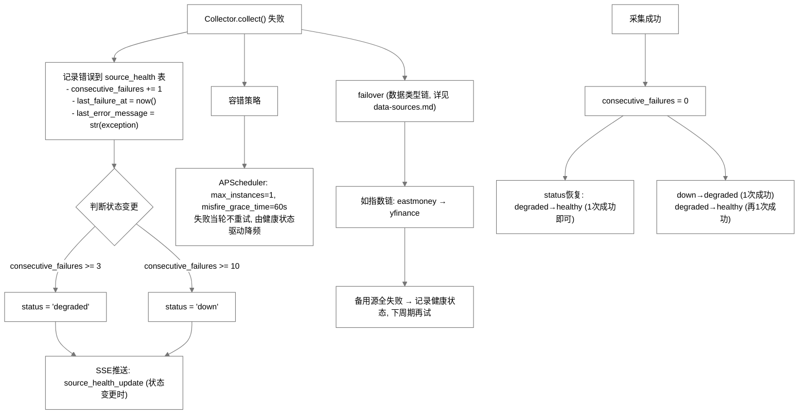

#### 3.7.2 处理错误处理

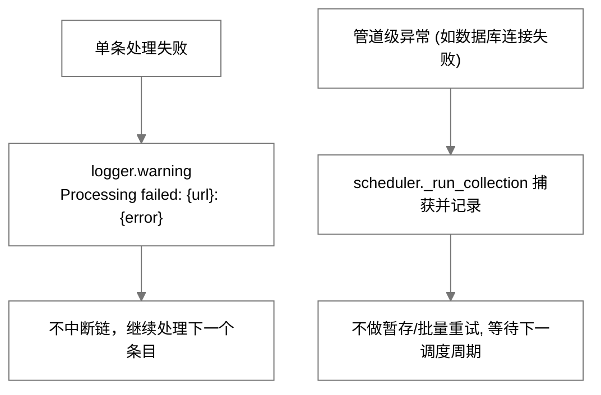

> ⚠️ **未实现**：原设计"MongoDB raw_content 标记 processing_errors"无任何代码（连降级路径都没有），已移除。

#### 3.7.3 SSE推送错误处理

```mermaid
%%{init: {"theme": "base", "themeVariables": {"primaryColor": "#ffffff", "primaryTextColor": "#000000", "primaryBorderColor": "#767676", "lineColor": "#767676", "arrowheadColor": "#767676", "secondaryColor": "#ffffff", "secondaryTextColor": "#000000", "secondaryBorderColor": "#767676", "tertiaryColor": "#ffffff", "tertiaryTextColor": "#000000", "tertiaryBorderColor": "#767676", "edgeLabelBackground": "#ffffff", "textColor": "#000000", "nodeTextColor": "#000000", "mainBkg": "#ffffff", "nodeBorder": "#767676", "clusterBkg": "#ffffff", "clusterBdr": "#767676", "clusterTextColor": "#000000", "titleColor": "#000000", "fontSize": "14px"}, "flowchart": {"nodeSpacing": 40, "rankSpacing": 50, "wrappingWidth": 180, "useMaxWidth": true}}}%%
graph TD
    subgraph ClientDisconnect["客户端断开"]
        AutoReconnect["EventSource自动重连 (SSE原生)"]
        RemoveConn["后端: remove_connection(client_id)"]
        ReAddConn["重连后: 重新add_connection, 恢复订阅"]
        AutoReconnect --> ReAddConn
    end

    subgraph RedisDown["Redis Pub/Sub不可用"]
        SSEDegrad["SSE推送降级: 直接调用EventRouter.send_event()"]
        DirectForward["不经过Pub/Sub, 直接内存转发"]
        Limitation["丢失跨进程分发能力 (多worker时部分客户端不收到推送)"]
        SSEDegrad --> DirectForward --> Limitation
    end

    subgraph SSESendFail["后端SSE发送失败"]
        MarkInactive["连接标记为inactive"]
        Cleanup["30s后清理inactive连接"]
        ClientReconnect["客户端EventSource重连建立新连接"]
        MarkInactive --> Cleanup --> ClientReconnect
    end
```

#### 3.7.4 全链路错误恢复

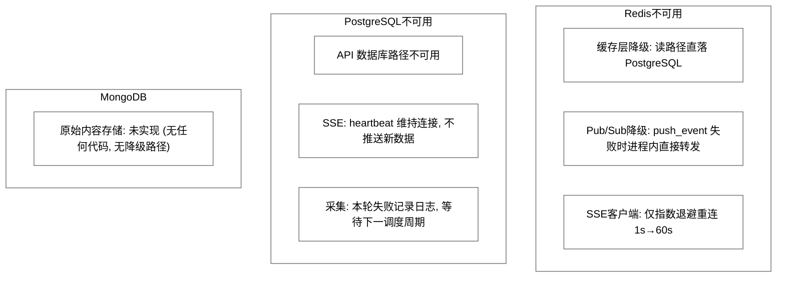

> ⚠️ **未实现**：SSE 降级为客户端定时 REST 拉取（前端无轮询 fallback，仅指数退避重连）；"数据暂存 Redis/MongoDB、PG 恢复后批量入库"亦未实现。

### 3.8 数据流时序图

#### 3.8.1 科技新闻采集-推送时序

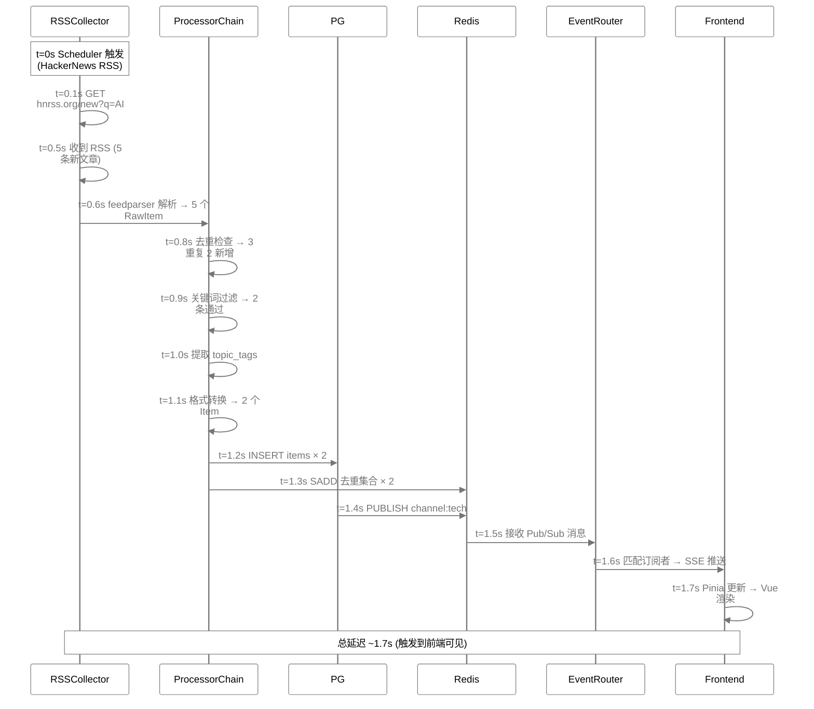

#### 3.8.2 财经行情采集-推送时序

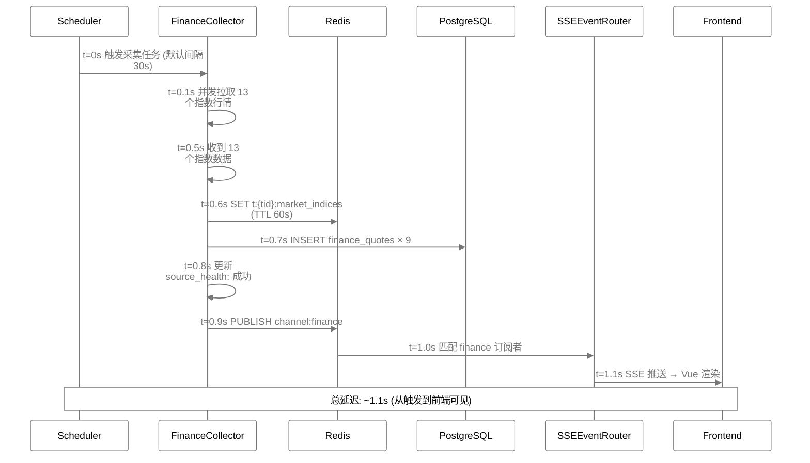

## 4. 关键决策

| 决策 | 选择 | 理由 |
|------|------|------|
| 实时推送 | SSE (非WebSocket) | 单向推送足够、原生重连、HTTP/2多路复用、实现简单 |
| 消息分发 | Redis Pub/Sub | 轻量、支持多进程分发、与缓存共用Redis实例 |
| 异步任务 | APScheduler 统一（Celery 未实现） | 开发内嵌进程、生产独立进程，行为一致，避免消息队列运维成本（详见 §3.4） |
| 去重策略 | Redis Set快速检查 + PG UNIQUE兜底 | Redis快速避免重复处理，PG持久保证最终一致 |
| 处理管道 | 链式处理器 (可跳过/容错) | 灵活、可扩展、单条失败不中断 |
| 缓存策略 | Redis主动更新+被动过期 | 行情数据主动SET(保证实时), 搜索/去重被动TTL(自动清理) |
| 错误恢复 | 多层 failover + 降级 | 数据类型 failover 链（见 data-sources.md）、Redis 不可用→直查 PG / 进程内转发、SSE 断线→前端指数退避重连（非 REST 轮询） |

## 5. 边界情况

- **采集重叠**: 同一source任务未完成时下一个周期触发 → APScheduler `max_instances=1` 防重叠
- **大量新条目涌入**: 处理器链逐条处理（失败单条不中断）
  > ⚠️ **未实现**：原设计">50 条分批处理（每批 20 条）"未实现
- **Redis Pub/Sub 消息丢失**: Redis 重启时消息丢失；发布失败时进程内直接转发；前端依赖指数退避重连
  > ⚠️ **未实现**：前端重连后"REST 补拉"不存在（仅 1s→60s 退避，`frontend/src/utils/sse.ts:157-165`）
- **worker 进程崩溃/重启**: Pub/Sub 为 fire-and-forget，停机期间的源生命周期事件丢失属设计内；以重启时 `schedule_all_active_sources()` 从 DB 全量重建作为自愈兜底（`scheduler/worker.py`）
- **去重集合膨胀**: `t:{tid}:dedup:{source_id}` 当前**永不过期**（无 24h TTL），仅靠 `maxmemory 512mb + allkeys-lru` 兜底淘汰 → 与设计意图不符，待修复
- **SSE连接数>1000**: Nginx `worker_connections`限制 → 单机1000+连接需调整Nginx配置
- **跨进程SSE**: 多worker时Pub/Sub消息需跨进程 → Redis Pub/Sub天然支持多进程
- **数据库写入瓶颈**: 高频行情写入（30s × 13 指数）→ 批量写入 + 异步 IO

## 6. 与其他模块的依赖

- → [architecture.md](architecture.md): SSE架构、模块划分、技术栈选型(SSE vs WebSocket决策)
- → [api.md](api.md): SSE端点定义、事件类型、REST API fallback
- → [database.md](database.md): items表去重约束、source_health表、Redis Key模式
- → [data-sources.md](data-sources.md): 各数据源的采集URL、频率、failover链
- → [content-categories.md](content-categories.md): 分类→频道映射、topic_tags提取规则
- → [frontend.md](frontend.md): 前端EventSource消费、Pinia store更新逻辑
- → [security.md](security.md): SSE认证(query param token)、限流(SSE连接限制)