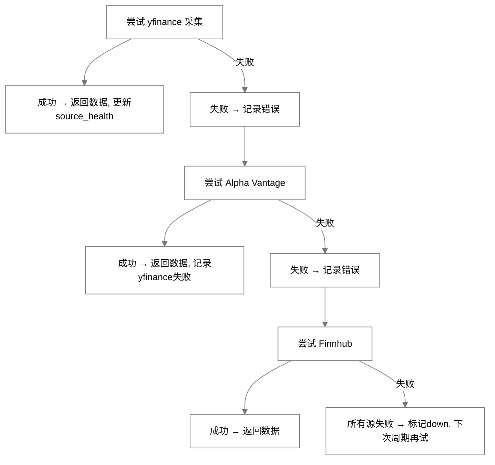
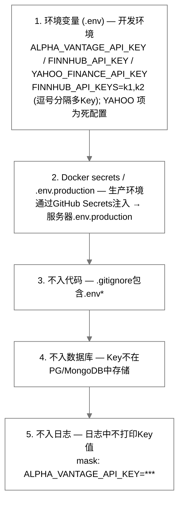

# InstantBoard 数据源配置设计

## 目录

1. 目标
2. 方案概述
3. 详细设计
   - 3.1 所有外部数据源清单表格
   - 3.2 财经数据源详细列表
   - 3.3 科技数据源详细列表
   - 3.4 数据源健康监控设计
   - 3.5 数据源切换/failover设计
   - 3.6 API Key管理策略
4. 关键决策
5. 边界情况
6. 与其他模块的依赖

## 1. 目标

定义 InstantBoard 所有外部数据源的完整清单、配置方式、健康监控、failover策略和API Key管理，确保数据源可靠、可切换、可监控。

## 2. 方案概述

采用 **多数据源优先级链 + 自动failover + source_health监控 + 环境变量API Key管理** 方案，每个数据类型配置主源和备用源，采集失败自动切换，健康状态实时监控和推送。

## 3. 详细设计

### 3.1 所有外部数据源清单表格

| # | 名称 | 类型 | URL | 频率 | 数据格式 | 费用 | 所属模块 | 现状 |
|---|------|------|-----|------|---------|------|---------|------|
| 1 | Yahoo Finance | API (非官方, httpx直连) | query1.finance.yahoo.com/v8/finance/chart/{symbol} | 30s-60s | JSON | 免费 | 财经 | ✅ 活跃 (3条种子源) |
| 2 | Alpha Vantage | REST API | alphavantage.co | 按需 | JSON | 免费(限量)/付费 | 财经 | ✅ 采集器已实现; 种子为未激活模板 |
| 3 | 东方财富 | 公开数据接口 | push2.eastmoney.com | 15s + failover按需 | JSON | 免费 | 财经 | ✅ 活跃种子 + 指数failover第一顺位 |
| 4 | Finnhub | REST API | finnhub.io | 按需 (failover链内) | JSON | 免费(限量)/付费 | 财经 | ✅ 采集器已实现; 无定时种子源 |
| 5 | IEX Cloud | REST API | iexcloud.io | - | JSON | 免费(限量)/付费 | 财经 | ✅ 采集器已实现; 种子为未激活可选模板 |
| 6 | 天天基金 | 公开数据接口 (httpx直连, **需 Referer 头**) | api.fund.eastmoney.com/f10/lsjz | 每日 (20:00 官方NAV任务 + 24h 种子) | JSON | 免费 | 财经 | ✅ 活跃 (tiantian_fund 采集器; 基金NAV管道, 见 §3.2.5) |
| 7 | MIT Tech Review | RSS | technologyreview.com/feed | 5min | RSS XML | 免费 | 科技-AI | ✅ 活跃 |
| 8 | HackerNews | RSS | hnrss.org | 2min | RSS/JSON | 免费 | 科技-全领域 | ✅ 活跃 |
| 9 | Arxiv CS.AI | RSS/API | arxiv.org/rss/cs.AI | 30min | RSS XML | 免费 | 科技-AI | ✅ 活跃 |
| 10 | OpenAI Blog | Web抓取 | openai.com/blog | 30min | HTML→JSON | 免费 | 科技-AI | ✅ 活跃 (web_scrape通用采集器) |
| 11 | The Robot Report (经Google News) | RSS | news.google.com/rss/search?q=robotics+... | 5min | RSS XML | 免费 | 科技-机器人 | ✅ 活跃 |
| 12 | IEEE Robotics | RSS | ieee.org/publications | 每日 | RSS XML | 免费 | 科技-机器人 | ✅ 活跃 |
| 13 | Hackaday | RSS | hackaday.com/blog/feed | 5min | RSS XML | 免费 | 科技-嵌入式 | ✅ 活跃 |
| 14 | Embedded.com | RSS | embedded.com/feed | 5min | RSS XML | 免费 | 科技-嵌入式 | ✅ 活跃 |
| 15 | RISC-V International | Web抓取 | riscv.org/blog | 30min | HTML→JSON | 免费 | 科技-嵌入式 | ✅ 活跃 (web_scrape通用采集器) |
| 16 | SpaceNews | RSS | spacenews.com/feed | 5min | RSS XML | 免费 | 科技-太空 | ✅ 活跃 |
| 17 | NASA News | RSS | nasa.gov/rss | 30min | RSS XML | 免费 | 科技-太空 | ✅ 活跃 |
| 18 | SpaceX Updates | Web抓取 | spacex.com/updates | 30min | HTML→JSON | 免费 | 科技-太空 | ✅ 活跃 (web_scrape通用采集器) |
| 19 | Ars Technica Space | RSS | arstechnica.com/science/feed | 5min | RSS XML | 免费 | 科技-太空 | ✅ 活跃 |
| 20 | Reddit | API (公开JSON, httpx直连) | reddit.com/r/{sub} | 10min | JSON | 免费(限流) | 科技-全领域 | ✅ 活跃 (公开JSON, 无需凭据; 种子"Reddit-科技全领域" 4子版) |
| 21 | Google News Tech | RSS | news.google.com/rss/search?q=technology | 5min | RSS XML | 免费 | 科技-通用 | ✅ 活跃 |
| 22 | ESA News | RSS | esa.int/RSS | 30min | RSS XML | 免费 | 科技-太空 | ✅ 活跃 |
| 23 | Twitter/X | API v2 (recent search, httpx直连) | api.twitter.com/2/tweets/search/recent | 10min | JSON | 付费(限额) | 科技-全领域 | ✅ 采集器已实现 (需 `TWITTER_BEARER_TOKEN`, 付费档); 种子未激活待凭据 |

> ⚠️ **种子与采集器现状**（以 `app/db/init_db.py` 与 `app/collectors/__init__.py` 为准）：
> - 已注册采集器共 12 个：`yfinance` / `alpha_vantage` / `eastmoney` / `finnhub` / `iex_cloud` / `tiantian_fund` / `rss` / `hackernews` / `arxiv` / `reddit` / `twitter` / `web_scrape`（`COLLECTOR_REGISTRY`）。
> - **`web_scrape` 通用采集器已实现**：`WebScrapeCollector`（`app/collectors/tech/web_scrape_collector.py`，注册名 `web_scrape`，source_type 直接命中）。httpx 拉取（自定义 `User-Agent`—源级 `config.user_agent`，默认 `instantboard-collector/1.0`、10s 超时、跟随重定向），`BeautifulSoup(html, "lxml")` 解析（lxml 失败回退 `html.parser`）。解析规则全部来自 `config.parse_rules`（CSS 选择器驱动）：`item_selector`（条目容器，缺省时以 `title_selector` 命中元素自身为条目）、`title_selector`（缺省回退条目内首个 h1-h4）、`link_selector`（取 href，缺省回退容器自身 href 或首个 `<a href>`；相对链接用 `urljoin(source.url)` 补全；`javascript:`/`mailto:`/`tel:`/`#` 链接丢弃）、`summary_selector`（可选，截断 300 字符）、`date_selector`（可选，优先 `<time datetime>` 属性，dateutil 解析失败用当前时间兜底）、`limit`（默认 20，上限 100）。缺 title 或 url 的条目跳过；429/403 → 记日志并返回空结果（本轮视为空成功），其他异常走 `BaseCollector` 重试/失败路径。种子 #10/#15/#18 及机器人领域 Automotive News 已 `is_active=True`。**#6 天天基金已激活为基金 NAV 专用源**（不再是 web_scrape 模板）——`TiantianFundCollector`（注册名 `tiantian_fund`），见 §3.2.5。
> - **Reddit（social）种子已激活**：`RedditCollector`（`app/collectors/tech/reddit_collector.py`，注册名 `reddit`，公开 JSON 接口、无需凭据），经 `source_type=social` + `config.library=reddit` 解析（见 §3.5.1）；种子"Reddit-科技全领域" `is_active=True`，`config.subreddits=["artificial", "robotics", "embedded", "space"]`（逐子版拉取、按 post id 聚合去重，600s）。**Twitter/X 采集器已实现、种子未激活待凭据**：`TwitterCollector`（`app/collectors/tech/twitter_collector.py`，注册名 `twitter`，API v2 recent search `api.twitter.com/2/tweets/search/recent`，Bearer token 认证），经 `source_type=social` + `config.library=twitter` 解析（见 §3.5.1）；种子"Twitter/X-科技话题" `is_active=False`——需配置 `TWITTER_BEARER_TOKEN`，且 recent search 端点仅付费档可用。
> - **IEX Cloud** 采集器已实现（可选启用），种子为未激活模板。
> - Finnhub 无定时采集种子源（种子财经源共 7 条，不含 Finnhub），仅在财经 failover 链内按需调用（见 §3.5）。
> - source_type 为 api/social 的源（以及显式指名采集器的源，如东方财富 `web_scrape`+`library=eastmoney`）通过 `config.library` 解析采集器，且 `config.library` 优先于 source_type（见 §3.5.1）；解析失败时 `collector_available=false`，且激活会被拒绝。

### 3.2 财经数据源详细列表

#### 3.2.1 Yahoo Finance

| 属性 | 值 |
|------|-----|
| **类型** | 非官方REST API (httpx直连Yahoo chart API；**不使用yfinance库**——依赖在requirements中但无任何代码import) |
| **覆盖范围** | 全球股票、指数、ETF、期货 (chart API覆盖范围) |
| **URL** | `https://query1.finance.yahoo.com/v8/finance/chart/{symbol}?interval=1d&range=5d` |
| **数据格式** | JSON (chart meta + indicators) |
| **费用** | 免费 |
| **API Key** | 无需 |
| **频率限制** | 无官方限制 (Yahoo可能随时429限流；采集器附带浏览器模拟头降低被封概率，429时视为本次失败交棒failover) |
| **数据延迟** | ~1-2分钟 |
| **优点** | 免费、无需Key、全球覆盖 |
| **缺点** | 非官方API不稳定、可能被Yahoo封禁、无SLA |
| **优先级** | **首选** (Primary) |
| **采集器** | `YFinanceCollector` (`app/collectors/finance/yfinance_collector.py`) |

**关键配置** (`sources.config` JSONB, 种子示例):
```json
{
  "library": "yfinance",
  "symbols": ["^GSPC", "^DJI", "^IXIC", "000001.SS", "^HSI", "^N225", "^FTSE", "^GDAXI"],
  "history_period": "5d",
  "retry_on_fail": true
}
```

> 注: 采集器只消费 `library`（供 `resolve_collector` 回退解析）与 `symbols`；`history_period`/`retry_on_fail` 字段在种子中存在但**不被消费**（采集器硬编码 `range=5d`、`interval=1d`）。

#### 3.2.2 Alpha Vantage

| 属性 | 值 |
|------|-----|
| **类型** | REST API (官方) |
| **覆盖范围** | 美股、外汇、加密货币、技术指标、基本面 |
| **URL** | `https://www.alphavantage.co/query?function=TIME_SERIES_INTRADAY&symbol=AAPL&apikey={KEY}` |
| **数据格式** | JSON |
| **费用** | 免费(5 calls/min) / Premium($49/月, 600 calls/min) |
| **API Key** | 需要 (`ALPHA_VANTAGE_API_KEY`)，支持多Key池 (`ALPHA_VANTAGE_API_KEYS`，优先于单Key) |
| **频率限制** | 5 calls/min (免费) / 600/min (付费)；429时标记该Key限流并轮换下一Key（见§3.6.2） |
| **数据延迟** | 实时 (付费) / 15min延迟 (免费部分功能) |
| **优点** | 官方API、有SLA、技术指标丰富 |
| **缺点** | 免费Key严格限流(5/min)、付费成本、非全球覆盖 |
| **优先级** | **备用** (Failover #1) |

#### 3.2.3 东方财富

| 属性 | 值 |
|------|-----|
| **类型** | Web抓取 |
| **覆盖范围** | A股、港股、中国基金NAV |
| **URL** | `https://push2.eastmoney.com/api/qt/...` (公开数据接口) |
| **数据格式** | HTML→JSON (公开接口返回JSON) |
| **费用** | 免费 |
| **API Key** | 无需 |
| **频率限制** | 无明确限制 (需控制频率避免IP封禁, 建议≤10次/min) |
| **数据延迟** | 实时 (A股) |
| **优点** | A股数据最全最准、基金NAV官方数据 |
| **缺点** | 非官方接口可能变更、需控制抓取频率 |
| **优先级** | **市场指数failover链第一顺位** + **独立活跃种子源** |

> **实际地位**（由原"补充"提级）：
> 1. `market_indices` failover 链第一顺位：`_get_failover_chain` 返回 eastmoney→yfinance（`services/finance.py:719-727`）；
> 2. 独立活跃种子源："东方财富-A股实时"，`config={"library":"eastmoney","data_type":"cn_indices"}`，刷新 15s（`init_db.py:38-50`）；其 source_type 为 `web_scrape`，靠显式 `config.library` 解析到 `EastMoneyCollector`——`config.library` 优先于 source_type，否则会被通用 `WebScrapeCollector` 抢占（见 §3.5.1）。

#### 3.2.4 Finnhub

| 属性 | 值 |
|------|-----|
| **类型** | REST API + WebSocket |
| **覆盖范围** | 全球股票、外汇、加密、新闻 |
| **Base URL** | `https://finnhub.io/api/v1` |
| **数据格式** | JSON |
| **费用** | 免费(60 calls/min) / Premium |
| **API Key** | 需要 (`FINNHUB_API_KEY`), 支持多Key池 (`FINNHUB_API_KEYS`) |
| **频率限制** | 60 calls/min (免费), 429时标记该Key限流并轮换下一Key（见§3.6.2） |
| **数据延迟** | 实时 |
| **优点** | WebSocket实时推送、官方API、搜索和基本面数据丰富 |
| **缺点** | 免费版大宗商品支持有限、覆盖不如yfinance全面 |
| **优先级** | **按需备用** (非CN stock_quote链第3顺位；无定时种子源，仅failover时调用) |
| **采集器** | `FinnhubCollector` |

**API Endpoints (已实现)**:

| Endpoint | 路径 | 参数 | 用途 |
|----------|------|------|------|
| **Quote** | `/quote?symbol={SYM}&token={KEY}` | symbol | 实时行情 (c/h/l/o/pc/d/dp) |
| **Symbol Lookup** | `/search?q={QUERY}&token={KEY}` | q | 搜索股票代码 |
| **Company Profile** | `/stock/profile2?symbol={SYM}&token={KEY}` | symbol | 公司基本面 (市值/行业/国家) |

**关键配置** (`sources.config` JSONB):
```json
{
  "data_type": "stock_quote",
  "symbols": ["AAPL", "MSFT", "GOOGL"]
}
```

> 注: `FinnhubCollector` **不读取 `config.api_key_env`**，Key 直接来自 `settings.finnhub_api_key`（单Key）/ `settings.finnhub_api_keys`（逗号分隔多Key列表）（`finnhub_collector.py:39-45`）。

支持的 `data_type` 值: `stock_quote`, `market_indices`, `commodities`, `search`, `company_profile`

**API Key轮换策略**: 统一 `APIKeyManager`（`app/core/api_keys.py`，见§3.6.2）。Key池由 `settings.finnhub_api_keys` + `settings.finnhub_api_key` 合并，采集器构造时建池；轮换索引存 Redis（`apikey:rotation:finnhub`，INCR 自增，跨进程/实例共享、重启不丢）。收到429→标记该Key限流（`apikey:limited:finnhub:{hash}`，TTL默认60s冷却）并轮换下一Key；收到401/403→标记失效（`apikey:invalid:finnhub:{hash}`，无TTL，永久跳过直至 `clear()`）。Redis 故障时退化为进程内 round-robin（fail-open）。

**错误处理**:
- 401/403: 标记该Key失效并轮换；池中无其他可用Key → 返回None → 上层触发failover到下一个数据源
- 429: 标记该Key限流（冷却60s）并轮换下一Key重试
- 全部Key限流: 返回None → 上层触发failover
- 超时: 10秒, 走BaseCollector的retry机制 (3次指数退避)

#### 3.2.5 天天基金 (中国基金NAV)

| 属性 | 值 |
|------|-----|
| **类型** | 公开数据接口（httpx 直连东方财富 f10 历史净值 JSON API，非网页抓取） |
| **覆盖范围** | 中国基金官方 NAV（6 位基金代码） |
| **URL** | `https://api.fund.eastmoney.com/f10/lsjz?fundCode={code}&pageIndex=1&pageSize=1` |
| **必需请求头** | `Referer: https://fundf10.eastmoney.com/`（**缺失时接口仍返回 HTTP 200，但带内报错** `Data=""`/`ErrCode=-999`，拿不到数据；采集器恒带该头） |
| **数据格式** | JSON（`Data.LSJZList[0]`：`DWJZ` 单位净值、`FSRQ` 净值日期；`LSJZList` 按净值日降序） |
| **费用** | 免费 |
| **API Key** | 无需（请求带浏览器风格 UA 降低指纹拦截概率） |
| **频率限制** | 采集器限速 30 次/分钟；多代码逐个拉取，请求间 0.5s 礼貌延迟 |
| **数据延迟** | T+1 日官方 NAV（收盘后发布，任务定在每晚 20:00） |
| **优点** | 官方 NAV 数据源、数据权威；即页面 `fundf10.eastmoney.com/jjjz_{code}.html` 渲染所用的同源接口，结构化 JSON、无 DOM 脆弱性（因此优先于网页抓取方案） |
| **缺点** | 仅中国基金、非官方接口 |
| **优先级** | **中国基金 NAV 必备** |

> ✅ **已实现（基金 NAV 管道）**：采集器 `TiantianFundCollector`（`app/collectors/finance/fund_nav_collector.py`，注册名 `tiantian_fund`，经种子 `config.library=tiantian_fund` 解析）；种子"天天基金-官方NAV" `is_active=True`（`source_type=api` + 默认 `fund_codes` 列表）。**失败语义**：单个代码 429/403/超时 → 记日志并跳过该代码（不炸整轮）；HTTP 200 带内错误（`Data` 非 dict / `LSJZList` 空 / `DWJZ` 空或非数字 / `FSRQ` 不可解析）→ 该代码无产出。消费链路：`FinanceService.update_official_nav`（每日 20:00 cron 任务 `fund_nav_official_refresh`）把官方净值落 `fund_nav_estimates`（`estimate_method='official'`），`get_fund_nav` 优先读该表、实时估值成功后回写估值行（`estimate_method='index_tracking'`）——详见 finance-tab.md §3.3。种子走 `collect_{source_id}` 通用 items 管道的产出与其他财经种子一样被 `FilterProcessor` 过滤，与展示无关。

#### 3.2.6 IEX Cloud (可选)

| 属性 | 值 |
|------|-----|
| **类型** | REST API |
| **覆盖范围** | 美股为主 |
| **Base URL** | `https://cloud.iexapis.com/stable`（可用 `IEX_CLOUD_BASE_URL` 覆盖，如指向 sandbox） |
| **URL** | `https://cloud.iexapis.com/stable/stock/AAPL/quote?token={KEY}` |
| **数据格式** | JSON |
| **费用** | 免费(限量)/付费 |
| **API Key** | 需要 (`IEX_CLOUD_API_KEY`)，统一 `APIKeyManager`（service=`iex_cloud`）管理 |
| **优先级** | **可选** (美股深度数据需求时启用；可作为美股行情 failover 备选) |
| **采集器** | `IEXCloudCollector` (`app/collectors/finance/iex_cloud_collector.py`) |

> ✅ **采集器已实现、可选启用**：`IEXCloudCollector` 已注册于 `COLLECTOR_REGISTRY`（`iex_cloud`），source_type=api 的源经 `config.library=iex_cloud` 回退解析（见 §3.5.1）。Key 管理接入统一 `APIKeyManager`：429→标记限流并轮换、401/403→标记失效（见 §3.6.2）；无 Key 或全部不可用时返回 None，保持"采集失败→上层 failover"语义。种子源为未激活可选模板（"IEX Cloud-美股行情(可选)"，`is_active=False`，需配置 `IEX_CLOUD_API_KEY` 后启用）。

**关键配置** (`sources.config` JSONB):
```json
{
  "library": "iex_cloud",
  "data_type": "stock_quote",
  "symbols": ["AAPL", "MSFT", "GOOGL"]
}
```

支持的 `data_type` 值: `stock_quote`（`/stock/{symbol}/quote`，字段映射与 Finnhub/yfinance 行情条目格式一致；`changePercent` 为小数需 ×100）、`search`（`/search/{q}`）

#### 3.2.7 盘中估值行情上游（腾讯 / 新浪 / 东财镜像）

基金盘中估值（[fund-intraday-nav.md](fund-intraday-nav.md)）的成分股批量行情**不注册为 `sources` 采集器、不进 `COLLECTOR_REGISTRY`**，而是服务层直连（`app/services/quote_batch.py` + `app/services/upstream_budget.py`），全部约束以代码注册表 `UPSTREAM_REGISTRY` 为事实源（本节为其文档镜像，2026-08-31 实测）：

| 上游 | 端点 | 必需请求头 | 批量上限 | 时效 | 请求预算（max_rpm / burst） | 备注 |
|------|------|-----------|---------|------|------------------------------|------|
| 腾讯行情 `tencent_qt` | `https://qt.gtimg.cn/q={syms}` | UA 即可 | 500 码 | A 股秒级；港股 ~15min 延迟；美股 ~15min 延迟 | 120 / 6（`QUOTE_TENCENT_MAX_RPM`） | GBK 响应，字段 32 为涨跌幅%；200码×10轮 @3s 零限流 |
| 新浪行情 `sina_hq` | `https://hq.sinajs.cn/list={syms}` | **Referer: `https://finance.sina.com.cn`**（缺失 403） | 400 码 | A 股秒级；港股 25min+ 延迟 | 60 / 4（`QUOTE_SINA_MAX_RPM`） | GBK 响应，涨跌幅需自算 (现价−昨收)/昨收 |
| 东财 push2 镜像 `em_push2_delay` | `https://push2delay.eastmoney.com/api/qt/ulist.np/get` | 无 | 200 码 | 延迟行情 | 40 / 4（`QUOTE_EM_DELAY_MAX_RPM`） | 仅港股链备选；200码×10轮 @3s 零限流 |
| 东财 push2 镜像 `em_push2_m1` | `https://1.push2.eastmoney.com/…` 同上 | 无 | 200 码 | 同主域 | 15 / 2 | 港股链末位备选 |
| 东财 push2 主域 `em_push2` | `https://push2.eastmoney.com/…` | 无 | 200 码 | A 股 ≤3s；唯一近实时港股 | 6 / 1 | ⚠️ **默认禁用**（`QUOTE_EASTMONEY_MAIN_ENABLED=false`）：实测主域约 8 次请求后断连封禁数分钟，封禁可能波及东财域族（含持仓接口 `fundf10`）；IP 安全 > 港股时效（红线开关，见 fund-intraday-nav.md §6.3） |
| 东财持仓 `em_f10_holdings` | `https://fundf10.eastmoney.com/FundArchivesDatas.aspx?type=jjcc` | **Referer 必需** | 1 码 | 披露数据 | 8 / 1（`QUOTE_EM_F10_MAX_RPM`） | 持仓摄取（§3.2.3 东财域族 ≤10 次/分软限制的本地收紧） |
| 东财基金名录 `em_fund_registry` | `https://fund.eastmoney.com/js/fundcode_search.js` | **Referer: `https://fund.eastmoney.com/`** | 1 文件（~3.1MB） | 名录每日至多变化一次 | 2 / 1 | 搜索用全量基金名录（§3.2.8），非行情上游；24h TTL 惰性重建 + 夜间持仓 cron 顺手刷新，**每日 1 次级**、无频控风险（2026-09-01 实测 200/0.6s、27,718 条） |

全局安全系数 `QUOTE_UPSTREAM_SAFETY_FACTOR`（默认 0.8）作用于所有上游预算；治理器提供分钟预算键 + 熔断键（403/429/5xx/断连 → 60s×2^(n−2) 冷却上限 1800s，成功减半恢复），首选源预算剩余 <20% 时**提前**切换到组内余量最多的备源（fund-intraday-nav.md §6.2）。

#### 3.2.8 东方财富基金名录（搜索/注册用，非行情）

| 属性 | 值 |
|------|-----|
| **类型** | 静态公开 JS 文件（东财基金搜索页名录，httpx 直连） |
| **覆盖范围** | **全部中国注册基金**——2026-09-01 实测 27,718 条：6 位代码 / 名称拼音缩写 / 中文全称 / 东财基金类型（混合型-偏股、指数型-海外股票…）/ 名称全拼；含 01/02 新代码段与 11x 场外段 |
| **URL** | `https://fund.eastmoney.com/js/fundcode_search.js` |
| **数据格式** | `var r = [[code, 拼音缩写, 名称, 类型, 拼音全称], ...]`；UTF-8（带 BOM），剥前缀后为合法 JSON |
| **费用 / API Key** | 免费 / 无需 |
| **频率限制** | 无官方限制；静态文件、每日至多变化一次（新基金注册）。**治理定位：每日 1 次级、无频控风险**；预算 2/分仅覆盖双进程同分钟冷启动，登记进 `UPSTREAM_REGISTRY`（`em_fund_registry`，Referer 必需）与熔断器保持一致性 |
| **消费方** | `app/services/fund_registry.py`：Redis `fund_registry:ptr`/`fund_registry:{version}` 24h TTL + 进程内快照 ~600s；供 `FinanceService.search_symbols` 名录优先搜索与 `add_to_watchlist` 选中即注册（fund-intraday-nav.md §9.3） |
| **降级** | 拉取/解析/缓存任意失败 → 搜索回退码段启发式 + Yahoo 外部兜底（不阻断搜索） |
| **备选源** | `fundsuggest.eastmoney.com/FundSearch/api/FundSearchAPI.ashx` 搜索联想接口可作同义查询备选，本轮未启用（静态名录已满足需求，仅登记备查） |

### 3.3 科技数据源详细列表

#### 3.3.1 机器人领域 (5个数据源)

| # | 名称 | 类型 | URL | 频率 | 费用 | config示例 |
|---|------|------|-----|------|------|-----------|
| 1 | **HackerNews (robotics)** | RSS | `https://hnrss.org/new?q=robot+robotics` | 2min | 免费 | `{parse_rules: {summary: "comments_text"}}` |
| 2 | **The Robot Report** | RSS | `https://www.robotreport.com/feed` | 5min | 免费 | `{parse_rules: {summary: "excerpt"}}` |
| 3 | **IEEE Robotics** | RSS | `https://www.ieee.org/publications/rss_feed.xml` | 每日 | 免费 | `{parse_rules: {summary: "abstract"}}` |
| 4 | **ROS Blog** | RSS | `https://ros.org/blog/rss.xml` | 每周 | 免费 | `{parse_rules: {}}` |
| 5 | **Automotive News** | Web | `https://www.autonews.com` | 每日 | 免费(有限) | `{parse_rules: {item_selector: "article", title_selector: "h2,h3", link_selector: "a[href]", summary_selector: "p.excerpt,p"}}` |

> ✅ Automotive News 为 `web_scrape` 源，种子 `is_active=True`，经 `WebScrapeCollector` 采集（`config.parse_rules` CSS 选择器驱动，见 §3.1 注）。

#### 3.3.2 AI领域 (5个数据源)

| # | 名称 | 类型 | URL | 频率 | 费用 | config示例 |
|---|------|------|-----|------|------|-----------|
| 1 | **MIT Tech Review** | RSS | `https://www.technologyreview.com/feed/` | 5min | 免费 | `{parse_rules: {summary: "excerpt"}}` |
| 2 | **HackerNews (AI)** | RSS | `https://hnrss.org/new?q=AI+machine+learning` | 2min | 免费 | `{parse_rules: {summary: "comments_text", extra: {hn_votes: "score"}}}` |
| 3 | **Arxiv CS.AI** | RSS | `https://arxiv.org/rss/cs.AI` | 30min | 免费 | `{parse_rules: {summary: "abstract", extra: {arxiv_id: "id"}}}` |
| 4 | **OpenAI Blog** | Web | `https://openai.com/blog` | 30min | 免费 | `{parse_rules: {item_selector: "article,ul li", title_selector: "h2,h3,h4", link_selector: "a[href]", summary_selector: "p"}}` |
| 5 | **The Batch (deeplearning.ai)** | RSS/Web | `https://deeplearning.ai/the-batch/` | 每周 | 免费 | `{parse_rules: {}}` |

> ✅ OpenAI Blog 为 `web_scrape` 源，种子 `is_active=True`，经 `WebScrapeCollector` 采集（`config.parse_rules` CSS 选择器驱动，见 §3.1 注）。

#### 3.3.3 大规模嵌入式领域 (5个数据源)

| # | 名称 | 类型 | URL | 频率 | 费用 | config示例 |
|---|------|------|-----|------|------|-----------|
| 1 | **Hackaday** | RSS | `https://hackaday.com/blog/feed/` | 5min | 免费 | `{parse_rules: {summary: "excerpt"}}` |
| 2 | **Embedded.com** | RSS | `https://www.embedded.com/rss/` | 5min | 免费 | `{parse_rules: {}}` |
| 3 | **RISC-V International** | RSS/Web | `https://riscv.org/blog/` | 30min | 免费 | `{parse_rules: {item_selector: "article,.post,.entry", title_selector: "h2.entry-title,h2", link_selector: "h2 a,a[href]", date_selector: "time,.posted-on"}}` |
| 4 | **EE Times** | RSS/Web | `https://www.eetimes.com/rss/` | 每日 | 免费(有限) | `{parse_rules: {}}` |
| 5 | **Zephyr Project Blog** | RSS | `https://zephyrproject.org/blog/rss` | 每月 | 免费 | `{parse_rules: {}}` |

> ✅ RISC-V International 种子类型为 `web_scrape` 且 `is_active=True`，经 `WebScrapeCollector` 采集（见 §3.1 注）。

#### 3.3.4 太空科技领域 (5个数据源)

| # | 名称 | 类型 | URL | 频率 | 费用 | config示例 |
|---|------|------|-----|------|------|-----------|
| 1 | **SpaceNews** | RSS | `https://spacenews.com/feed/` | 5min | 免费 | `{parse_rules: {summary: "excerpt"}}` |
| 2 | **NASA News** | RSS | `https://www.nasa.gov/rss/dyn/breaking_news.rss` | 30min | 免费 | `{parse_rules: {summary: "description"}}` |
| 3 | **SpaceX Updates** | Web | `https://www.spacex.com/updates/` | 30min | 免费 | `{parse_rules: {item_selector: "article,section[class*=update]", title_selector: "h2,h3,[class*=title]", link_selector: "a[href]", date_selector: "time,[class*=date]"}}` |
| 4 | **ESA News** | RSS | `https://www.esa.int/RSS` | 30min | 免费 | `{parse_rules: {}}` |
| 5 | **Ars Technica Space** | RSS | `https://arstechnica.com/science/feed/` | 5min | 免费 | `{parse_rules: {summary: "excerpt"}}` |

> ✅ SpaceX Updates 为 `web_scrape` 源，种子 `is_active=True`，经 `WebScrapeCollector` 采集（见 §3.1 注）；该页为 JS 渲染时间线，服务端 HTML 无内容时本轮返回空结果（不视为故障）。

#### 3.3.5 跨领域通用数据源

| # | 名称 | 类型 | URL | 频率 | 费用 | 说明 |
|---|------|------|-----|------|------|------|
| 1 | **Reddit** | API | `https://www.reddit.com/r/{subreddit}/new.json` | 10min | 免费(限流) | 子版: r/artificial, r/robotics, r/embedded, r/space；种子已激活（`library=reddit`，600s） |
| 2 | **Google News Tech** | RSS | `https://news.google.com/rss/search?q=technology+AI+robotics` | 5min | 免费 | 通用科技新闻 |
| 3 | **Twitter/X** | Social | Twitter API v2 (recent search) | 10min | 付费($100/月, Basic档起) | 高成本；采集器已实现（注册名 `twitter`，需 `TWITTER_BEARER_TOKEN`），种子未激活待凭据 |

> ✅ **Reddit 采集器已实现、种子已激活**：`RedditCollector`（注册名 `reddit`，`app/collectors/tech/reddit_collector.py`）使用公开 JSON 接口 `https://www.reddit.com/r/{subreddit}/new.json?limit={n}`，无需 OAuth/凭据，但必须携带自定义 `User-Agent`（源级 `config.user_agent`，默认 `instantboard-collector/1.0`）。源级配置键：`subreddits`（子版列表，逐个拉取并按 post id 聚合去重）、`limit`（默认 25，上限 100）、`user_agent`；条目 `extra_data` 含 `reddit_score`/`num_comments`/`subreddit`/`author`；429 限流时返回空并记日志。种子"Reddit-科技全领域"（`init_db.py` `TECH_CROSS_DOMAIN_SOURCES`）`is_active=True`：`source_type=social` + `config.library=reddit` 解析，`config.subreddits=["artificial", "robotics", "embedded", "space"]`；采集器不使用 `source.url`（仅记录覆盖的子版）。**Twitter/X 采集器已实现、种子未激活待凭据**：`TwitterCollector`（`app/collectors/tech/twitter_collector.py`）调用 API v2 recent search 端点 `https://api.twitter.com/2/tweets/search/recent?query=<q>&max_results=<n>&tweet.fields=created_at,public_metrics`（Bearer token 来自 `TWITTER_BEARER_TOKEN`）。源级配置键：`query`（搜索词；列表或逗号分隔字符串，逐个拉取并按 tweet id 聚合去重）、`max_results`（默认 20，钳制 10-100）。条目：title=推文文本截断 200、url=`https://twitter.com/i/status/{id}`、summary=推文全文、`extra_data` 含 `like_count`/`retweet_count`/`reply_count`/`impression_count`（有啥取啥）；无 token → 记日志返回 None（按采集失败处理），429/401/403 → 记日志返回空（本轮视为空成功）。种子"Twitter/X-科技话题" `is_active=False`，启用前须配置付费档 Bearer token（API 为付费/限额服务）。

### 3.4 数据源健康监控设计

#### 3.4.1 source_health 表 (见[database.md](database.md) §3.1)

```sql
-- source_health 表字段与监控逻辑对应:

status:            'healthy' | 'degraded' | 'down'
  → healthy:  连续失败0次, 成功率>95%
  → degraded: 连续失败3-9次, 成功率50-95%
  → down:     连续失败≥10次, 成功率<50%

last_success_at:   最近一次成功采集时间
  → >1h未成功 → 显示警告

last_failure_at:   最近一次失败时间
  → 记录失败时刻

last_error_message: 最近一次错误信息
  → 显示在Dashboard DataSourceHealth表格

consecutive_failures: 连续失败次数
  → 状态判断依据

total_fetches_24h:  24h内总采集次数
  → 与预期频率对比

success_count_24h:  24h内成功次数
  → success_rate = success_count / total_fetches

avg_response_time_ms: 平均响应时间
  → 监控数据源延迟趋势
```

#### 3.4.2 健康状态判定算法

健康判定与推送**没有独立的 health service**，由采集调度闭环内联完成：每次采集（成功 / 失败 / 空结果）结束时都会调用
`app/scheduler/manager.py::_update_health_after_collection(source, collection_result)`，规则如下：

```
采集成功:
  consecutive_failures = 0
  last_success_at = now
  total_fetches_24h += 1, success_count_24h += 1
  avg_response_time_ms 按移动平均重算 (仅当本次 response_time_ms > 0)
  状态恢复: degraded → healthy, down → degraded (每次成功恢复一级)

采集失败:
  consecutive_failures += 1
  last_failure_at = now
  last_error_message = result.error
  total_fetches_24h += 1
  状态恶化: consecutive_failures >= 3 → degraded, >= 10 → down

首次采集 (source_health 记录不存在):
  新建记录: 成功 → status='healthy'; 失败 → status='degraded'

状态发生变化 (new_status != previous_status) 时:
  SSEService.publish_source_health_update(
      build_source_health_update_payload(source, health, previous_status),
      tenant_id=str(source.tenant_id),   # falsy fallback 用 str(SYSTEM_TENANT_ID)，禁止字面量
  )
  随后 adaptive_reschedule 调整采集间隔倍率:
  healthy ×1.0 / degraded ×2.0 / down ×10.0
```

> `source_health_update` 的完整 payload 契约（全行状态字段、前端按 `source_id` 匹配行、租户路由语义）统一以
> [data-flow.md](data-flow.md) §3.5.4 为单一事实来源；发布侧为
> `app/services/sse.py::publish_source_health_update` + `build_source_health_update_payload`。
> `services/source.py` 中曾存在的 `update_source_health(source_id, status=...)` 函数及绕过
> `event_router` 的直接 redis_publish 旁路已删除（缺陷修复记录见 data-flow.md §3.5.4 末尾）。

#### 3.4.3 前端健康状态展示

详见 [dashboard-tab.md](dashboard-tab.md) §3.2 DataSourceHealth组件。

### 3.5 数据源切换/failover设计

#### 3.5.1 Failover链配置

Failover 链**硬编码**于 `app/services/finance.py::_get_failover_chain`（:703-735），**不存在 `config/failover.py` 或任何配置文件**：

```
# 代码实况 (按 data_type 分发):
stock_quote (非CN符号):
    [yfinance, alpha_vantage, finnhub]

stock_quote (CN符号: .SS/.SZ后缀或0/3开头代码):
    [eastmoney, yfinance]

market_indices:
    [eastmoney, yfinance]
    # eastmoney 覆盖A股指数 (国内源、staging可达)，
    # yfinance 全覆盖兜底；配合 _fetch_indices_with_failover
    # 的"按symbol归并"逻辑合并多源结果

commodities:
    [yfinance, alpha_vantage]

其他 data_type (search / company_profile / fund_nav 等):
    [yfinance]   # 默认单源
```

> **fund_nav 说明**：无 `fund_nav` 专属 `_get_failover_chain` 链（落入默认 `[yfinance]`）。官方净值抓取由 `fund_nav_official_refresh` + `TiantianFundCollector`（§3.2.5）承担；盘中估值另有专属行情链，见下方「盘中估值行情链」。
>
> 科技源不配置 failover 链（见 §3.5.3）。

**盘中估值行情链（✅ 已实现）**：基金盘中估值的成分股行情链硬编码于 `app/services/upstream_budget.py::QUOTE_CHAINS`（链序 + 提前切换治理见 §3.2.7 与 fund-intraday-nav.md §6.2/§6.3），按成分股市场分组，缺失码沿链增量补拉：

```
cn_quote (A股成分):   [tencent_qt, sina_hq]
hk_quote (港股成分):  [tencent_qt, sina_hq, em_push2_delay]
                      (+ em_push2_m1; + em_push2 主域仅当
                        QUOTE_EASTMONEY_MAIN_ENABLED=true, 默认禁入)
us_quote (美股成分):  [tencent_qt, sina_hq]
fund_holdings:        [em_f10_holdings]   # 单源, 无等价替代
```

**采集器解析机制**（`app/collectors/__init__.py::resolve_collector`）：

1. 先看 `config.library`：显式指名已注册采集器时**优先于 source_type**（如 `source_type=social` + `library=reddit` → `RedditCollector`；`source_type=web_scrape` + `library=eastmoney` → `EastMoneyCollector`，避免被通用 `WebScrapeCollector` 抢占）；
2. 否则按 `source_type` 查 `COLLECTOR_REGISTRY`：rss / hackernews / arxiv / web_scrape（`web_scrape` → 通用 `WebScrapeCollector`，`config.parse_rules` CSS 选择器驱动，见 §3.1 注）；
3. `config.library` 未指名（或名字未注册）且 source_type 无对应采集器时（api / social）返回 `None` → 该源尚不可采集：响应字段 `collector_available` 向前端暴露此状态；创建/更新激活前经 `_check_collector_available` 前置校验（`services/source.py:122-137`）抛出 `NoCollectorAvailable`（`exceptions.py:31-41`），防止源处于"永久激活却从不采集"的状态。

#### 3.5.2 自动Failover流程



> 此图对应**非CN stock_quote**链；其他 data_type 的链见 §3.5.1。Failover 在 FinanceService 的抓取方法内按 symbol/批次执行：链上当前源返回空或失败即交棒下一源。

#### 3.5.3 科技源独立策略

科技数据源不设failover链，理由：
- 每个RSS源内容不同 (HackerNews ≠ MIT Tech Review)，不是替代关系
- 源失败时: 仅标记degraded/down，不影响其他源采集
- 前端: 失败源的条目减少或为空，其他源正常显示
- 源恢复后: 自动恢复采集，无需手动干预

### 3.6 API Key管理策略

#### 3.6.1 存储方式



#### 3.6.2 Key轮换策略

> ✅ **已实现**：统一Key管理器 `app/core/api_keys.py::APIKeyManager`。Finnhub 与 Alpha Vantage 采集器已迁移（构造时建池），替代了早期各自的进程内 round-robin。

机制:
1. **多Key池**: `FINNHUB_API_KEYS=k1,k2` / `ALPHA_VANTAGE_API_KEYS=key1,key2`（逗号分隔），采集器 `_load_api_keys()` 合并单Key配置项
2. **自动轮换**: 每次取Key对轮换索引 `apikey:rotation:{service}` 执行 INCR，跨进程/重启共享；从下一个候选开始最多绕一圈，跳过失效/限流中的Key
3. **限流检测**: 采集器收到429 → `mark_rate_limited(key)` 写限流标记 `apikey:limited:{service}:{key_hash}`（TTL=60s，`cooldown_seconds` 可调），冷却过期自动恢复
4. **失效检测**: 采集器收到401/403 → `mark_invalid(key)` 写失效标记 `apikey:invalid:{service}:{key_hash}`（无TTL，永久跳过，需 `clear(key)` 手动恢复）
5. **异常语义**: 全部限流 → `AllKeysRateLimited`（临时）；池为空或全部失效 → `AllKeysUnavailable`（永久）。采集器捕获后按"无可用Key"路径返回 None → 采集失败 → 财经源触发 failover（见§3.5.1）
6. **存储安全**: Key 以 md5 前12位哈希（`key_hash`）映射标记，明文不落 Redis
7. **Redis 降级**: 所有 Redis 操作异常仅记日志；`get_key` 退化为进程内 round-robin（fail-open），Redis 故障不阻塞采集

```python
# app/core/api_keys.py (已实现)
class APIKeyManager:
    def __init__(self, service: str, keys: list[str], redis_client=None): ...  # redis_client 供测试注入

    async def get_key(self) -> str            # INCR轮换索引, 跳过失效/限流, 最多绕一圈
    async def mark_rate_limited(self, key, cooldown_seconds=60)  # 429 → TTL限流标记
    async def mark_invalid(self, key)         # 401/403 → 永久失效标记
    async def clear(self, key)                # 移除限流+失效标记（手动恢复）

# Redis 不可用时抛 AllKeysRateLimited / AllKeysUnavailable; Redis 故障时 fail-open 回退进程内轮换
```

#### 3.6.3 Key配置清单

| 服务 | 环境变量 | 必需? | 免费 | 付费 | 说明 |
|------|---------|------|------|------|------|
| Yahoo Finance | `YAHOO_FINANCE_API_KEY` ⚠️死配置 | 否 | - | - | httpx直连、无需Key；字段已定义但无使用方 |
| Alpha Vantage | `ALPHA_VANTAGE_API_KEY` / `ALPHA_VANTAGE_API_KEYS` | 推荐(备用源) | 5/min | $49/月 600/min | 支持多Key列表（逗号分隔，统一APIKeyManager轮换/限流标记/失效检测，见§3.6.2），`ALPHA_VANTAGE_API_KEYS` 优先于单Key |
| Finnhub | `FINNHUB_API_KEY` / `FINNHUB_API_KEYS` | 可选 | 60/min | $29/月 | 支持多Key列表（统一APIKeyManager轮换/限流标记/失效检测，见§3.6.2） |
| IEX Cloud | `IEX_CLOUD_API_KEY` | 可选 | 限量 | $9/月起 | 采集器已实现（可选启用，统一APIKeyManager轮换/限流标记/失效检测，见§3.6.2）；`IEX_CLOUD_BASE_URL` 可覆盖base URL（如指向sandbox） |
| 东方财富 | 无 | 否 | - | - | 无需Key, 控制频率即可 |
| Reddit | 无需 (公开JSON, 需自定义 `User-Agent`，源级 `config.user_agent` 提供，默认 `instantboard-collector/1.0`) | 否 | 限量 | - | `RedditCollector` 已实现（注册名 `reddit`；429 时返回空并记日志）；种子已激活（`library=reddit` + `subreddits` 配置），无 OAuth/`REDDIT_CLIENT_ID` 凭据体系 |
| Twitter/X | `TWITTER_BEARER_TOKEN` | 可选 | - | 付费 ($100/月起; recent search 限额) | `TwitterCollector` 已实现（注册名 `twitter`；无 token 返回 None 按采集失败处理，429/401/403 记日志返回空）；种子未激活待凭据 |

## 4. 关键决策

| 决策 | 选择 | 理由 |
|------|------|------|
| 财经主数据源 | yfinance | 免费、无需Key、全球覆盖、Python库直调 |
| 财经failover | 多源链式切换 (硬编码链, 见§3.5.1) | 非CN stock_quote: yfinance→Alpha Vantage→Finnhub；market_indices: eastmoney→yfinance，自动切换保障可用 |
| 科技源策略 | 独立无failover | RSS源内容不同不可替代，失败仅标记不影响其他 |
| 健康监控 | source_health表+Redis缓存 | PG持久记录+Redis快速查询，双重保障 |
| API Key存储 | .env环境变量 | 不入代码/数据库/日志，安全且易管理 |
| API Key限流处理 | 统一 `APIKeyManager`（Redis 轮换索引 + 429限流标记 + 401/403永久失效标记） | `app/core/api_keys.py`，Finnhub/Alpha Vantage 已接入（见§3.6.2）；跨进程轮换、限流冷却自恢复、失效永久跳过，Redis 故障时 fail-open 回退进程内轮换 |
| 采集频率 | 分类级别配置(30s-5min可调) | 高频行情30s, 低频新闻5min, 灵活可配 |

## 5. 边界情况

- **yfinance被Yahoo封禁**: 非官方API可能被封 → Alpha Vantage failover自动切换；长期封禁需评估替代方案
- **Alpha Vantage免费Key限流严重**: 5 calls/min → 使用多Key池轮换；仍不够则升级付费Key
- **东方财富接口变更**: 公开接口可能变更 → Web抓取需要维护parse_rules；变更后需更新config
- **Reddit API限流**: 公开JSON接口限流 → 降低频率(10min)；采集器收到 429 时本次返回空结果并记日志（不重试不标记故障）；OAuth2 API更稳定但需Client ID
- **RSS源停止更新**: 源7天无新内容 → source_health标记degraded，前端提示
- **所有财经源不可用**: ⚠️ 方案的"Redis旧数据兜底 + SSE不可用提示"**未实现**——当前全链失败直接抛出 `ServiceUnavailable`（"Market indices data temporarily unavailable" / "Commodity data temporarily unavailable"，`services/finance.py:216-217, 264-265`），无旧数据兜底、无提示推送
- **API Key泄露**: .env文件泄露 → 立即更换Key；生产使用Docker secrets更安全
- **新数据源添加**: ⚠️ "无需重启服务"仅部分成立——创建后 `source_created` 事件发布在 **channel:dashboard**，但 worker 忽略该事件（`SOURCE_EVENT_NAMES` 仅含 `source_enabled`/`source_disabled`/`source_deleted`，`scheduler/worker.py:35-37`），新源需 worker 重启或后续启用操作才开始采集。启用/停用/删除事件由 worker 实时消费以增删采集任务；worker 每 15s 上报心跳（Redis TTL 45s），API 侧 45s 无心跳视为 worker 掉线。创建/更新前有 `collector_available` 前置校验，无可解析采集器的源无法被启用（`NoCollectorAvailable`）

## 6. 与其他模块的依赖

- → [architecture.md](architecture.md): Collector模块架构、数据源类型定义
- → [api.md](api.md): `/api/v1/sources/*` CRUD API、`/api/v1/sources/{id}/health`
- → [database.md](database.md): sources表、source_health表、Redis Key模式
- → [data-flow.md](data-flow.md): 采集流程、failover执行逻辑、处理管道
- → [finance-tab.md](finance-tab.md): 财经数据源选型详细对比、刷新策略
- → [tech-tab.md](tech-tab.md): 科技各领域数据源推荐列表