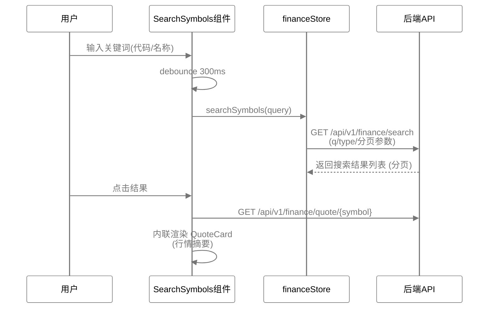
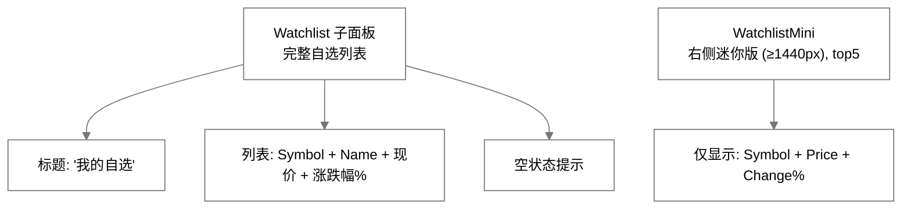
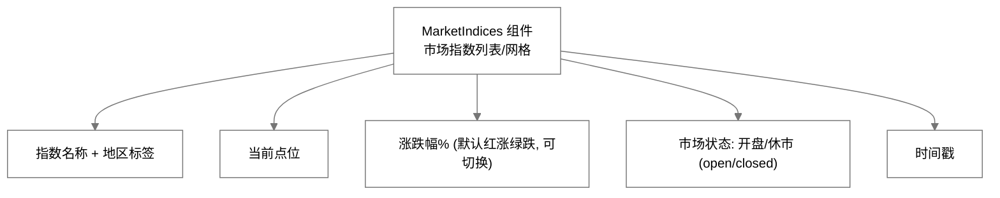
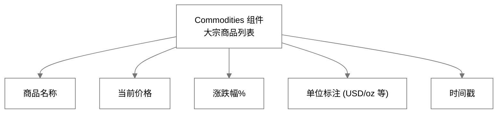
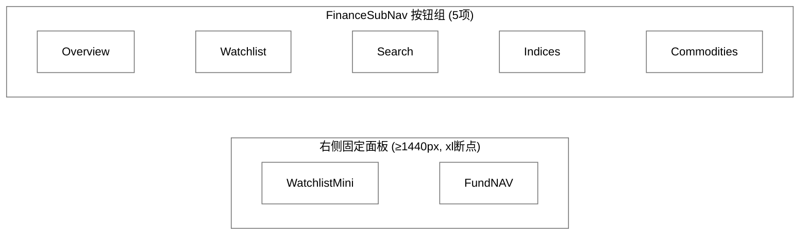
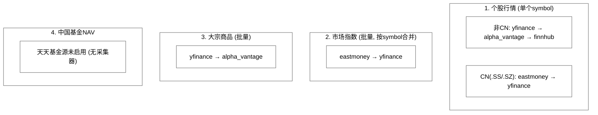

# InstantBoard 财经模块详细设计

## 1. 目标

定义 InstantBoard 财经聚合 Tab 的完整功能设计，包括股票/基金搜索、自选关注列表、基金估值实时计算、世界主要市场指数和商品数据展示、子导航方案，以及数据源选型和刷新策略。

## 2. 方案概述

提供 **类似 Google Finance 的面板式体验**，通过子导航面板切换不同功能区（Overview/Watchlist/Search/Indices/Commodities），右侧（≥1440px）可见迷你自选列表和NAV估值面板。

## 3. 详细设计

### 3.1 股票/基金搜索功能详细设计

**交互流程（现状）**:


> ⚠️ **未实现**：原设计的 DetailDrawer 右侧滑出抽屉（Sparkline 5日/1月/3月/1年多周期图、"加入自选/关注NAV估值"按钮、SSE 实时联动）不存在；选中搜索结果后仅在 SearchSymbols.vue 内联展示一张 QuoteCard，不打开抽屉。

**搜索逻辑 (后端, `services/finance.py`)**:
```python
async def search_symbols(tenant_id, q, type, market, page, page_size):
    # 1. Redis缓存搜索结果 (TTL 5min, key: t:{tid}:search:{md5(q:type:market)})
    # 2. 缓存未命中 → PostgreSQL finance_symbols 表搜索 (精确/前缀/名称匹配)
    # 3. 结果中每个symbol附带实时行情 (从Redis quote缓存)
    # 4. 本地无结果 → 外部搜索兜底 _search_symbols_external (见下)
    # 5. page/page_size 分页返回 (api层校验: page_size 1-100)
```

**外部搜索兜底细节**（本地库无结果时触发）:
- httpx 直连 `query1.finance.yahoo.com/v1/finance/search`（quotesCount=10），请求携带浏览器 UA（`YAHOO_BROWSER_HEADERS`，规避 Yahoo 对默认客户端指纹的 429 限流）
- 收到 **429 直接返回空列表**（仅记 warning，不视为错误）
- 结果按 `_map_yfinance_type` 落库并映射类型：EQUITY→stock、ETF/MUTUALFUND→fund、INDEX→index、FUTURE→futures、CURRENCY/CRYPTOCURRENCY→currency、COMMODITY→commodity
- 新 symbol 写入 `finance_symbols` 表（`_infer_market` 按后缀推断市场）

**前端错误态**: `financeStore` 维护逐面板错误状态（`marketIndicesError`/`commoditiesError`/`watchlistError`），后端 5xx/503 时对应面板以 ErrorAlert 展示并支持重试，不静默失败。

**quote 响应字段**（`FinanceQuoteResponse`）: symbol、name、current_price、open、high、low、close_previous、volume、change、change_percent、market_cap、pe_ratio、week_high_52、week_low_52、timestamp、source。

### 3.2 自选关注列表 (Watchlist) 功能详细设计

**Watchlist 数据模型** (见 [database.md](database.md) `watchlist_items` 表)

**交互流程（现状）**:
```
1. Watchlist 子面板: 展示自选列表 (symbol + name + 当前价 + 涨跌幅, 红涨绿跌默认配色)
2. 行情: GET /api/v1/finance/watchlist/quotes 按需拉取 (无周期性后台推送)
3. 添加到自选: POST /api/v1/finance/watchlist
4. 重新排序: PUT /api/v1/finance/watchlist/reorder
5. 删除: DELETE /api/v1/finance/watchlist/{item_id}
```

> ⚠️ **已知 bug**：「加入自选」链路当前损坏 — 前端 `financeStore.addToWatchlist` 发送 `{symbol}`（stores/finance.ts），而后端 `WatchlistItemCreate` 必填 `symbol_id`（UUID，schemas/finance.py），请求必然 422；且目前没有任何组件调用该 action，界面上不存在可见的"加入自选"入口。

> ⚠️ **未实现/契约不匹配**：拖拽排序 — `reorderWatchlist` store action 存在但无任何组件调用；且前端 payload `{item_ids: string[]}` 与后端 `WatchlistReorderRequest`（`{items: [{item_id, display_order}]}`）不匹配，即使调用也会 422。

> ⚠️ **半成品**：涨跌提醒 — 仅 `watchlist_items.alert_threshold_percent` 字段存在；后端无阈值检测逻辑、无 `alert_update` SSE 事件（`SSEEventType` 枚举中不存在，仅前端 `types/` 残留 `ALERT_UPDATE`）、无桌面 Notification。

**Watchlist UI 组件（现状）**:



> ⚠️ **未实现**：mini sparkline、合计行（自选总市值/总涨跌）、左滑/右键菜单操作。

### 3.3 基金估值实时计算逻辑设计

**NAV估值原理**:
指数型基金的实时估值 = 官方NAV × (1 + 跟踪指数涨跌幅 × 跟踪比率)

**估值计算逻辑（实际实现, `services/finance.py` `get_fund_nav`）**:
```python
# 触发条件: estimate_type == "realtime" 且 fund.type == "fund"
#   注意: FinanceSymbol.type 枚举为
#   ('stock','fund','index','commodity','futures','currency')，不存在 'index_fund'

if estimate_type == "realtime" and fund.type == "fund" and nav_official and underlying_index_info:
    index_change = underlying_index_info["change_percent"]
    tracking_ratio = 1.0            # 硬编码, 未从历史数据计算
    nav_estimate = nav_official * (1 + index_change / 100 * tracking_ratio)
    estimate_method = "index_tracking"

# 结果仅写入 Redis (t:{tid}:nav:{symbol}, TTL 120s) 并推送 nav_estimate_update,
# 不写入 PostgreSQL
```

> ⚠️ **未实现**（NAV 数据管道整体缺失）:
> - `FundNAVEstimate`（fund_nav_estimates 表）在**全代码库无写入点**，`get_fund_nav` 只读；没有人工种子数据时 `nav_official` 恒为 None，估值分支不会触发
> - 「天天基金-官方NAV」种子源 `is_active=False`，且后端**无 web_scrape 采集器**
> - 「每晚 20:00 更新官方 NAV」定时任务不存在（原 `daily_fund_nav_official` cron 设计已废弃）
> - 估值只写 Redis，不落 PG

**估值精度说明**:
- 指数ETF: 估值偏差通常 < 0.5%，实时性取决于指数数据频率
- 估值仅供参考，不作为交易依据

**NAV 展示组件（现状）**: 右侧面板 `FundNAV.vue` 展示 NAV 数据；原设计的 NAVCalculator（估值历史迷你图、基金选择下拉）未实现。

### 3.4 世界主要证券市场指数数据源与展示设计

#### 3.4.1 覆盖的市场指数清单

| 指数名称 | Symbol (Yahoo) | 地区 | 数据源 | 优先级 |
|---------|---------------|------|--------|-------|
| S&P 500 | ^GSPC | 美国 | eastmoney→yfinance 按需failover | 核心 |
| Dow Jones Industrial Average | ^DJI | 美国 | 同上 | 核心 |
| NASDAQ Composite | ^IXIC | 美国 | 同上 | 核心 |
| 上证综合指数 | 000001.SS | 中国 | 同上（eastmoney可覆盖） | 核心 |
| 深证成份指数 | 399001.SZ | 中国 | 同上 | 核心 |
| 沪深300 | 000300.SS | 中国 | 同上 | 核心 |
| 恒生指数 | ^HSI | 香港 | 同上 | 核心 |
| 日经225 | ^N225 | 日本 | 同上 | 核心 |
| FTSE 100 | ^FTSE | 英国(GB) | 同上 | 重要 |
| DAX 40 | ^GDAXI | 德国(DE) | 同上 | 重要 |
| CAC 40 | ^FCHI | 法国(FR) | 同上 | 可选 |
| KOSPI | ^KS11 | 韩国(KR) | 同上 | 可选 |
| BSE Sensex | ^BSESN | 印度(IN) | 同上 | 可选 |

#### 3.4.2 数据采集方案（现状）

> 原设计的 `MarketIndicesCollector` 类与「交易时段 30s/15s 定时采集」**不存在**，已改写为按需拉取。

- **按需拉取**: `GET /api/v1/finance/market-indices` 触发 `_fetch_indices_with_failover`：
  - failover 链为 **eastmoney → yfinance**（**无 Alpha Vantage**；eastmoney 为国内源、仅覆盖 A 股指数）
  - 采用**按 symbol 增量合并**而非"首个非空结果胜出"：链上每一源只补采尚未拿到的 symbol，直到全部覆盖或链耗尽（否则 eastmoney 成功时所有非 CN 指数将缺失）
  - eastmoney 返回 secid 风格代码（如 `1.000001`），会映射回标准 symbol（`000001.SS`）后再与 `MARKET_INDICES_CONFIG` 匹配
- 结果按 13 个指数配置格式化（含 `market_status: open/closed`），写 Redis `t:{tid}:market_indices`（TTL 60s），并推送 SSE `market_index_update`（**整个数组**，见 §3.9）
- 种子数据中虽有 30s 的 yfinance 指数任务与 15s 的东方财富任务，但它们走通用 `collect_{source_id}` items 管道，产出的行情条目被 `FilterProcessor`（标题长度/黑名单/分类关键词规则）过滤，**与本 REST 接口的展示无关**

#### 3.4.3 MarketIndexCard UI组件（现状）



> ⚠️ **未实现**：`MarketTicker` 顶部横向滚动条、卡片内 Mini Sparkline、盘前状态显示。

#### 3.4.4 交易日历与市场状态判断（现状）

```python
# services/finance.py 实际配置
MARKET_TIMEZONES = {
    "US": "America/New_York",   # 9:30-16:00
    "CN": "Asia/Shanghai",      # 9:30-11:30 / 13:00-15:00 (午休天然分成两段 ✓)
    "HK": "Asia/Hong_Kong",     # 9:30-16:00
    "JP": "Asia/Tokyo",         # 9:00-15:00
    "GB": "Europe/London",      # 8:00-16:30
    "DE": "Europe/Berlin",      # 9:00-17:30
    "FR": "Europe/Paris",       # 9:00-17:30
    "KR": "Asia/Seoul",         # 9:00-15:30
    "IN": "Asia/Kolkata",       # 9:15-15:30
}  # 共 9 个市场键（不再是旧文档的 EU_LONDON/EU_FRANKFURT）
```

- `_is_market_open(market)` 仅判断 **周末（weekday ≥ 5）+ 当前时刻是否落在交易时段**；`PRE_MARKET_MINUTES` 不存在
> ⚠️ **未实现**：交易日历/节假日支持 — 无 A 股/美股休市日历预加载，节假日不会被排除；市场状态只有 open/closed 两态（无盘前），前端无"今日休市"提示。

### 3.5 黄金、原油、期货数据源与展示设计

#### 3.5.1 覆盖的大宗商品清单（与代码 `COMMODITIES_CONFIG` 一致）

| 商品名称 | Symbol (Yahoo) | 类别 | 单位 | 数据源 |
|---------|---------------|------|------|--------|
| 黄金期货 | GC=F | 贵金属 | USD/oz | yfinance→Alpha Vantage 按需failover |
| 白银期货 | SI=F | 贵金属 | USD/oz | 同上 |
| WTI原油期货 | CL=F | 能源 | USD/bbl | 同上 |
| Brent原油期货 | **BZ=F** | 能源 | USD/bbl | 同上 |
| 天然气期货 | NG=F | 能源 | USD/MMBtu | 同上 |
| 铜期货 | HG=F | 工业金属 | USD/lb | 同上 |
| 大豆期货 | ZS=F | 农产品 | USD/bushel | 同上 |

> ⚠️ **待修复**：种子采集配置（db/init_db.py「yfinance-大宗商品」源）的 symbols 包含 **ZC=F（玉米）而不含 BZ=F**，与上表展示清单不一致，导致种子定时任务采不到 Brent、反而采玉米。

#### 3.5.2 CommodityCard UI组件（现状）



> ⚠️ **未实现**：商品图标、Mini Sparkline、点击打开期货合约详情。

#### 3.5.3 数据采集方案（现状）

> 原设计的 `CommoditiesCollector` 与「60s/5min 定时采集」**不存在**，已改写为按需拉取。

- `GET /api/v1/finance/commodities` 触发 `_fetch_commodities_with_failover`：
  - failover 链为 **yfinance → Alpha Vantage**（批量模式，首个非空结果胜出）
- 结果写 Redis `t:{tid}:commodities`（TTL 60s），推送 SSE `commodity_update`（**整个数组**，见 §3.9）
- 种子中 60s 的 yfinance 大宗商品任务走通用 items 管道、被 `FilterProcessor` 过滤，与展示无关

### 3.6 子导航/子分区 UI 方案

#### 3.6.1 方案对比分析

| 方案 | 描述 | 优点 | 缺点 | 适用场景 |
|------|------|------|------|---------|
| **A: 传统嵌套Tab** | 顶部Tab → 二级Tab | 简单直觉 | 嵌套混乱、占用垂直空间、移动端困难 | 少量子页面(2-3) |
| **B: 侧边子导航** | 右侧/左侧垂直子导航 | 层级清晰、可折叠 | 占用宽度、不适合财经内容区 | 多层级导航 |
| **C: 面板切换按钮组** | 水平按钮组切换子面板 (类似Google Finance) | 不嵌套、切换快、响应式友好 | 按钮过多时需滚动/分组 | **InstantBoard最佳** |
| **D: 左右分栏** | 左侧主内容+右侧固定面板 | 布局稳定、右侧始终可见 | 移动端需要折叠右侧 | 信息密度高的页面 |

#### 3.6.2 最终推荐: **方案 C + D 组合 — 面板切换按钮组 + 右侧固定面板**

**设计理由**:
1. FinanceSubNav (按钮组) 不嵌套在Tab中，独立于侧边导航，切换流畅
2. 右侧面板在 ≥1440px 屏幕始终可见 (WatchlistMini + FundNAV)
3. 移动端: 右侧面板直接隐藏（主内容变单列）
4. 5个子面板按钮数量适中，无需滚动

**子面板定义（现状, `FinanceGrid.vue`）**:



各按钮对应的子面板：Overview（实际仅渲染 MarketIndices 组件）/ Watchlist（完整自选列表）/ Search（SearchSymbols 搜索框 + 结果列表 + 内联 QuoteCard）/ Indices（市场指数列表）/ Commodities（大宗商品列表）。

> ⚠️ **未实现**：Overview 混合视图（自选列表摘要 + 重点关注 + 顶部新闻）— 当前 Overview 面板只是 MarketIndices 的复用；右侧面板的 "Top Finance News" 不存在。

> ⚠️ **未实现**：`MarketTicker` 顶部滚动条（全前端无此组件）。

**响应式适配（现状）**:

| 屏幕宽度 | 主内容区 | 右侧面板 | SubNav |
|---------|---------|---------|--------|
| ≥1440px（xl/xxl） | 动态切换子面板 | 显示（`--right-panel-width`） | 水平按钮组 |
| 1024-1439px（lg） | 动态切换 | 隐藏（CSS @media max-width:1439px） | 水平按钮组 |
| 768-1023px（md） | 动态切换 | 隐藏 | 水平按钮组 |
| <768px | 动态切换（单列） | 隐藏 | 水平按钮组 |

> 注：右侧面板阈值是 **≥1440px**（xl 断点，`useResponsive().showRightPanel`），并非旧文档的 1366px；"<768px 底部抽屉"不存在。

### 3.7 数据源 API 选型

#### 3.7.1 选型对比

| 数据源 | 类型 | 覆盖范围 | 频率限制 | 费用 | 数据质量 | 实际用途 |
|--------|------|---------|---------|------|---------|---------|
| **Yahoo Finance (query1.finance.yahoo.com)** | httpx 直连 REST（chart/search API） | 全球股票/指数/期货/基金 | 无官方限制(非官方API, 429风险) | 免费 | 好(延迟1-2min) | 首选：行情、指数、大宗商品、外部搜索 |
| **东方财富 API** | httpx 直连 | A股指数 | 无明确限制 | 免费 | 好 | 指数 failover 首选（国内可达），A股行情 |
| **Alpha Vantage** | REST API | 美股/商品 | 5 calls/min (免费) | 免费/付费 | 好 | 商品/个股行情 failover（种子源未启用, 需 API Key） |
| **Finnhub** | REST API | 全球股票 | 60 calls/min(免费) | 免费/付费 | 好 | 个股行情第三级 failover |
| **天天基金** | Web抓取 | 中国基金NAV | - | 免费 | 优(官方NAV) | 种子源 inactive、无采集器，未启用 |

> 说明：后端采集器是 **httpx 直连** `query1.finance.yahoo.com/v8/finance/chart`（`YFinanceCollector`），并**不使用 yfinance Python 库** — 该库虽声明在 requirements 中但全后端无 import。

#### 3.7.2 最终选型与层级（现状）



**API Key管理策略** (详见 [data-sources.md](data-sources.md) §4):
- 所有API Key存储在 `.env` 环境变量中，不入代码/不入Git
- yfinance/eastmoney 无需 API Key；Alpha Vantage 免费 Key 5 calls/min

### 3.8 数据刷新策略

#### 3.8.1 现状（按需拉取 + Redis 缓存 TTL）

| 数据类型 | 刷新方式 | 缓存TTL (Redis) | 说明 |
|---------|---------|---------------|------|
| 市场指数 | 前端请求时按需拉取 | 60s | TTL 内命中缓存不发外部请求 |
| 大宗商品 | 前端请求时按需拉取 | 60s | 同上 |
| 个股/自选行情 | 请求时按需拉取 | 30s | 自选无后台周期推送 |
| 基金NAV估值 | 请求时按需计算 | 120s | 只缓存 Redis |
| 搜索结果 | 按需(用户触发) | 300s (5min) | |

> ⚠️ **未实现**：「交易时段高频(30s/60s/120s)后台采集 + SSE 周期推送」整套策略；自选行情、指数、商品的定时推送任务均不存在。

#### 3.8.2 定时任务现状

原设计的 `scheduler/jobs.py` 与 `FINANCE_SCHEDULE_CONFIG`（`market_indices_realtime` / `watchlist_quotes_realtime` / `commodities_realtime` / `nav_estimates` / `market_indices_off_hours`、`active_hours` / `pause_on_holiday`）**全部不存在**。实际调度：

- 统一任务模型：每个数据源一个任务，ID 为 `collect_{source_id}`（`scheduler/manager.py`），周期取自 `source.refresh_interval_seconds`，首次立即执行
- 金融种子源（东方财富 15s、yfinance 指数 30s、大宗商品 60s）确实会周期采集，但产出走通用 items 管道并被 `FilterProcessor` 过滤，**不进入行情展示链路**

#### 3.8.3 动态频率调整（现状）

- **无连接暂停**（部分实现）: `adaptive_reschedule` 在无任何 SSE 连接或该源分类无订阅者时暂停任务（`scheduler/manager.py`）；但**没有"首个订阅者到来时恢复"钩子**，且 **worker 进程直接禁用该机制**（`disable_adaptive_pause()`，因 SSE 连接注册表只在 api 进程，否则任务首轮后永久暂停）
- **错误降频**（实际为健康度自适应）: 按数据源健康状态调整周期倍率 — healthy ×1.0 / degraded ×2.0 / down ×10.0，恢复时倍率逐次减半回落
> ⚠️ **未实现**：「SSE连接数 > 500 或 Redis内存 > 80% → 自动降频」无任何实现。

### 3.9 SSE 事件类型定义 (财经频道, 现状)

| 事件类型 | 数据内容 | 触发条件 | 说明 |
|---------|---------|---------|------|
| `quote_update` | `{symbol, ...}` 单对象 | 行情刷新 | |
| `market_index_update` | **整个指数数组** `[{symbol, name, value, change, change_percent, market_status, region, timestamp}, ...]` | `get_market_indices` 拉取完成后随路推送 | 注意是数组 |
| `commodity_update` | **整个商品数组** `[{symbol, name, value, change, change_percent, unit, timestamp}, ...]` | `get_commodities` 拉取完成后随路推送 | 注意是数组 |
| `nav_estimate_update` | `{symbol, name, nav_official, nav_estimate, nav_estimate_deviation_percent, estimate_method, timestamp}` | `get_fund_nav` 请求时随路推送 | |
| `heartbeat` | `{timestamp}` | 保持连接 | 30s |

> ⚠️ **已知契约冲突（待修复）**：后端 `market_index_update` / `commodity_update` 每次推送**整个数组**（`services/finance.py` push_event 直接传 `formatted` 列表），但前端 `stores/finance.ts` 的 `updateMarketIndexFromSSE` / `updateCommodityFromSSE` 按**单对象**消费（读 `data.symbol`），数组 payload 无法落位——这两个事件实际不生效。需统一为数组契约（前端整体替换）或后端改为逐条推送。

> ⚠️ **未实现**：`alert_update` — 后端 `SSEEventType` 枚举（共 8 种事件）中不存在，仅前端类型定义残留。

详见 [api.md](api.md) SSE 端点定义。

## 4. 关键决策

| 决策 | 选择 | 理由 |
|------|------|------|
| 主数据源 | Yahoo Finance chart API (httpx 直连) | 免费、覆盖全球、无需API Key |
| 指数 failover | **eastmoney → yfinance，按 symbol 合并** | eastmoney 国内可达但仅覆盖 A 股指数，需与 yfinance 逐 symbol 互补合并；不经过 Alpha Vantage |
| 商品/行情 failover | yfinance → alpha_vantage (→ finnhub) | 链式兜底 |
| 行情获取方式 | 按需拉取 + Redis TTL 缓存 | 当前无后台高频采集，简化架构 |
| 子导航方案 | 面板切换按钮组 + 右侧固定面板(≥1440px) | 不嵌套Tab、切换流畅 |
| 市场状态判断 | 周末 + 固定交易时段 | 交易日历/节假日为待实现增强项 |
| NAV估值方法 | 指数跟踪法 (type=="fund", ratio 硬编码 1.0) | 估值管道尚未闭环（官方 NAV 无写入源） |
| 涨跌颜色 | 默认中国配色（红涨绿跌），可切换 | CSS变量实现运行时切换 |
| 自选列表存储 | PostgreSQL持久化 + Redis缓存 | PG保证持久、Redis保证实时查询快 |

## 5. 边界情况

- **yfinance API不稳定/429**: 请求带浏览器 UA；429 时视为该源失败进入链上下一源（指数→eastmoney 已先行，商品→alpha_vantage）
- **eastmoney secid 映射**: `1.000001` → `000001.SS`，映射失败则丢弃该项
- **A股午休时段 (11:30-13:00)**: 交易时段配置天然分为两段，午休期间 `market_status` 为 closed（无专门"午休"文案）
- **搜索结果过旧**: Redis缓存5min → 超时后重新搜索
- **自选列表超过512项**: `MAX_WATCHLIST_ITEMS=512`，超出报 422 ValidationError
> ⚠️ **未实现**：休市日历（节假日判断）、"今日休市"前端提示、跨境ETF偏差标注。

## 6. 与其他模块的依赖

- → [frontend.md](frontend.md): 财经界面组件层级、布局、响应式适配
- → [api.md](api.md): 财经API端点定义、SSE事件类型
- → [database.md](database.md): finance_symbols、finance_quotes、fund_nav_estimates、watchlist_items 表
- → [data-sources.md](data-sources.md): 数据源详细配置、API Key管理
- → [data-flow.md](data-flow.md): 数据采集→处理→缓存→推送完整流程
- → [architecture.md](architecture.md): 模块划分 (finance模块职责)
