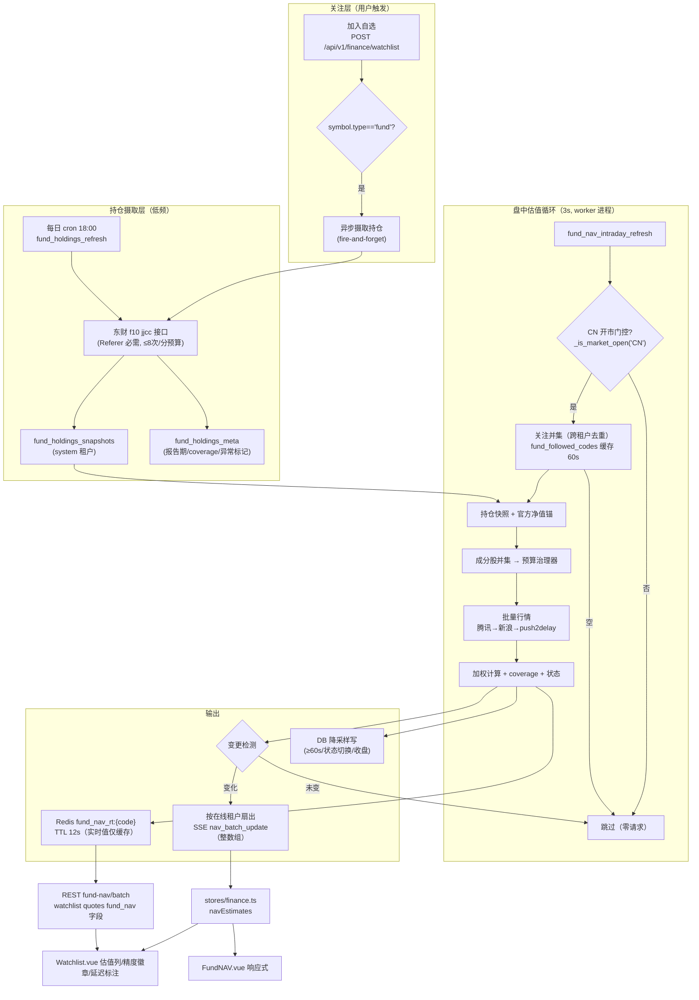

# InstantBoard 基金盘中估值设计（Fund Intraday NAV）

## 目录

1. 概述与目标/非目标
2. 总体数据流
3. 数据模型
4. 估值算法
5. 持仓摄取子系统
6. ★ 行情摄取与限流治理
7. 调度与计算任务
8. 推送与多租户策略
9. API 与前端
10. 配置项清单
11. 失败模式与降级矩阵
12. 测试策略
13. 实施分期
14. 交叉引用与文档状态更新清单

## 1. 概述与目标/非目标

### 1.1 背景

- **第三方估值接口全部死亡**（2024-25 监管关停，2026-08-31 实测复核）：`fundgz.1234567.com.cn` → 404；`api.fund.eastmoney.com` FundGuZhi → 404；蛋卷 estimate-nav → 空数据。**自算是唯一路径**。
- 现状：基金 NAV 管道为「官方净值每晚 20:00 落库 + 按需指数外推估值」四段闭环（finance-tab.md §3.3），实时估值**按需、单基金、仅指数外推**，且 `underlying_index_symbol` 绑定全库无初始写入源（断头路）。
- 本设计兑现 finance-tab.md §3.8 预留的「nav_estimates 定时估值推送」。

### 1.2 目标

1. CN 开市时段（9:30-11:30 / 13:00-15:00，Asia/Shanghai，含节假日历），对**用户自选（关注）的基金**以 ≤3s 间隔计算盘中估值并经 SSE 推送。
2. 估值分层：**主方法 = 持仓加权**（最新披露前十大持仓 × 成分股实时涨跌）；**回退 1 = 指数外推**（现有 `get_fund_nav` tracking 逻辑，并修复其绑定断头路）；**回退 2 = 最新官方净值 + 时间戳**。
3. **关注制（lazy-load）**：只算被关注的基金；无人关注时任务空转、零上游请求；关注名单按「所有用户并集去重」**全局计算一次**。
4. **精度标注**：UI 精度 = 可得持仓权重之和（如前十大占 69% → 精度 69%）；**QDII 延迟标注**：港股免费源延迟 15~25min、美股约 15min，涉及时在 UI 标注「延迟行情」。
5. **★ 上游限流防护是一级设计要求**（用户原话：不希望 host IP 被拉黑或产生其他负面后果）：上游约束登记成文 + 代码可配、请求前查预算、接近限制前**提前**切换等价上游、被拒后熔断退避。

### 1.3 非目标

- 货币基金/纯债基金的精确估值（权益持仓≈0 → 天然落入回退 2，展示官方净值，不是缺陷）。
- 非 CN 开市窗口的盘中估值（门控仅 CN；QDII 的美股腿在 CN 盘中本就闭市，贡献恒为 0）。
- 不替代官方净值、不作为交易依据（免责声明沿用 finance-tab.md §3.3 口径）。
- v1 不做：盘中汇率波动修正、`tracking_ratio` 历史回归、估值-官方净值偏差校准、盘中估值曲线持久化（见 §13 M3）。
- 不注册新的采集器进 `COLLECTOR_REGISTRY`（不走通用 items 管道，理由见 §12）。

## 2. 总体数据流



## 3. 数据模型

### 3.1 新表 `fund_holdings_snapshots`（持仓快照）

**租户归属：system 租户（`SYSTEM_TENANT_ID`）**。理由：

1. 持仓是市场客观事实，与单个租户无关；关注并集本就是跨租户全局计算，快照挂 system 租户与计算口径一致；
2. 与现有显示链任务（`market_indices_refresh` / `fund_nav_official_refresh`）的 `SYSTEM_TENANT_ID` 作用域口径一致（`_run_market_refresh` 用 `apply_service_context` 绕过 RLS）；
3. 避免 N 个租户 N 份重复摄取与存储。

| 字段 | 类型 | 说明 |
|------|------|------|
| id | UUID PK | |
| tenant_id | UUID FK→tenants | 恒为 `SYSTEM_TENANT_ID`（保持 RLS/外键一致性） |
| fund_code | VARCHAR(6) NOT NULL | 规范化 6 位基金代码（复用 `FinanceService._normalize_fund_code`） |
| symbol_id | UUID FK→finance_symbols.id ON DELETE CASCADE, nullable | 关联到已注册基金符号（用于与 `fund_nav_estimates` 联动） |
| report_date | DATE NOT NULL | 持仓报告期（如 2026-06-30） |
| stock_code | VARCHAR(20) NOT NULL | 成分股原始代码（600519 / 000858 / 00700 / AAPL） |
| stock_name | VARCHAR(100) | |
| market | VARCHAR(10) NOT NULL | CN / HK / US（由 secid 前缀或代码规则推断） |
| secid | VARCHAR(30) | 东财行情 secid（`1.600519` 沪 / `0.000858` 深 / `116.00700` 港 / `105.AAPL` 美股），优先从持仓页链接解析；缺失为 null，行情侧按代码规则兜底转换 |
| weight_percent | NUMERIC(8,4) NOT NULL | 占净值比（百分数，8.52 = 8.52%） |
| shares_held | NUMERIC(20,4) | 持股数（参考，可空） |
| fetched_at | TIMESTAMPTZ NOT NULL | 抓取时间 |

约束：`UNIQUE (fund_code, report_date, stock_code)`；索引 `(fund_code, report_date DESC)`。

### 3.2 新表 `fund_holdings_meta`（摄取/披露状态）

| 字段 | 类型 | 说明 |
|------|------|------|
| id / tenant_id(system) | | 同上 |
| fund_code | VARCHAR(6) UNIQUE | |
| symbol_id | UUID nullable | |
| latest_report_date | DATE | 最新摄取的报告期 |
| top10_weight_sum | NUMERIC(8,4) | 最新一期权重和 = **精度（coverage）分子** |
| holdings_count | INT | 实际条数 |
| disclosure_status | VARCHAR(20) | `ok` / `stale`（报告期 > 阈值，见 §4.3）/ `anomalous`（>730 天或解析无数据，见 §5.4） |
| last_fetched_at | TIMESTAMPTZ | |
| last_error | TEXT | |

### 3.3 新表 `fund_index_bindings`（指数绑定，修复断头路）

`underlying_index_symbol` 现状：唯一写入点 `_save_nav_estimate` 只写「估值回读自既有行的绑定」——全库无初始写入源（断头路，已核验）。**修复方案：配置表 + 种子数据**（不选自动推断：基金名正则解析不可靠且不可审计；配置表可审计、可增量维护）：

| 字段 | 类型 | 说明 |
|------|------|------|
| id / tenant_id(system) | | |
| fund_code | VARCHAR(6) UNIQUE | |
| index_symbol | VARCHAR(20) NOT NULL | 如 `000300.SS`（沿用 `finance_symbols` 符号风格） |
| tracking_ratio | NUMERIC(6,4) DEFAULT 1.0 | 替代 `get_fund_nav` 中硬编码的 1.0 |
| source | VARCHAR(20) DEFAULT 'seed' | `seed` / `admin`（预留手工维护） |
| created_at / updated_at | | |

- **种子**：`db/init_db.py` 灌入约 20-30 只主流宽基 ETF/联接（如 510300→000300.SS、510500→000905.SS、159915→399006.SZ、510050→000016.SS、512880→000991.SS…）。
- **读取次序**（盘中任务与 `get_fund_nav` 共用）：`fund_index_bindings` → 缺失回退既有 `fund_nav_estimates.underlying_index_symbol` 行（兼容存量）→ 无绑定走回退 2。
- `fund_nav_estimates.underlying_index_*` 三列**保留**为估值时点快照（`_save_nav_estimate` 继续写），事实源切换为 bindings 表。

### 3.4 估值结果存储策略：实时值只进 Redis，落库降采样

**实时值仅 Redis**：新 key `fund_nav_rt:{fund_code}`（**无租户前缀**——估值是公开市场数据的派生，不含用户私密信息；租户隔离保留在「自选关系」层；全局 key 与既有 `dashboard:system_metrics` / `sse:active_connections` 等系统级无租户前缀惯例一致），TTL 12s（= 4×间隔；任务停摆缓存自然过期，不会长期供陈旧值）。按需 `get_fund_nav` 优先读该 key（新鲜则直接返回，省去重算与副作用推送）。

**落库降采样**（防 `fund_nav_estimates` 高频 upsert 退化：500 基金 × 每 3s 写一次 ≈ 10,000 次/分，不可接受）：

- 复用 `_save_nav_estimate` 的「(基金, nav_official_date) 同行覆盖」有界语义，`estimate_method='holdings_weighted'` 开新行族；
- 允许写的三种情形：
  1. **时间节流**：`fund_nav_rt_flush:{code}` SET NX EX `FUND_NAV_DB_FLUSH_MIN_GAP`（默认 60s），过期才允许写 → ≤1 次/分/基金；
  2. **状态切换强写**：`estimate_method` 或 `quote_status` 变化时立即写（留存降级轨迹）；
  3. **收盘强写**：门控由开→关的首个周期写收盘快照。（**实现偏差**：延后至 M2——`scheduler/manager.py::_run_fund_intraday_refresh` 已跟踪门控边沿 `_fund_intraday_gate_open` 并留 `TODO(M2)`）
- 降采样后写入量 ≤ 500 次/分 + 事件驱动少量强写，且同行覆盖、表有界。

**迁移**：`fund_nav_estimates` 增列 `holdings_coverage_percent NUMERIC(8,4) NULL`、`holdings_report_date DATE NULL`（alembic 一个迁移文件，与三张新表同迁移）。

### 3.5 Payload 结构（SSE 与 REST 共用，Pydantic `FundNAVIntraday`）

```python
class FundNAVIntraday(BaseModel):
    symbol: str                    # 6 位基金代码
    name: str
    nav_official: float | None     # 锚定官方净值
    nav_official_date: str | None  # 官方净值日期（暴露陈旧度，见 §11）
    nav_estimate: float | None     # 盘中估值（回退 2 时回退到最新官方净值）
    estimate_change_percent: float | None   # 相对官方净值的估算涨跌幅
    estimate_method: Literal["holdings_weighted", "index_tracking", "latest_official"]
    coverage_percent: float | None          # 精度 = Σ可得持仓权重（0-100）
    holdings_report_date: str | None
    quote_status: Literal["realtime", "delayed", "mixed", "frozen"]
    delayed_markets: list[str] = []         # 如 ["HK","US"] → UI 延迟行情标注
    holdings_stale: bool = False            # 报告期超阈值
    estimate_timestamp: str                 # UTC ISO8601
```

SSE `nav_batch_update` 的 `data` = `list[FundNAVIntraday]`（按租户过滤，见 §8）。

## 4. 估值算法

### 4.1 持仓加权公式与未知仓位假设

```
estimate_change_percent = Σᵢ ( wᵢ/100 × chgᵢ )
nav_estimate            = nav_official × (1 + estimate_change_percent/100)
```

- `wᵢ` = 快照 weight_percent，`chgᵢ` = 成分股实时涨跌幅%（可负）；
- **未知仓位**（未披露的其余股票、债券、现金，即 `100 − Σw`）：**按 0% 变动假设**。影响必须向用户披露（UI tooltip）：单边上涨日估值系统性偏低、下跌日偏高；coverage 越低（债券基金尤甚）偏差越大——这是精度徽章存在的意义；
- **FX**：v1 港股/美股腿不含盘中汇率波动（乘数 1），已知近似（M3 再议）；
- QDII 美股腿在 CN 盘中为昨收（美股未开市），`chgᵢ≈0` 自然成立，仅计入 `delayed_markets=["US"]` 标注。

### 4.2 精度（coverage）计算与老化结论

- `coverage_percent = Σ 可得持仓权重`（cap 100；解析出 >100% 视为脏数据记 `anomalous`）。UI 展示「精度 {coverage}%」。
- **报告期老化是否数值衰减：否（结论）**。coverage 表达的是「该披露期的已知权重占比」，是静态事实；代表性流失用**正交维度**表达：`holdings_report_age_days` + `holdings_stale` 标志（>120 天，见 §4.3）+ UI 警示。理由：把「100% 但极陈旧」数字衰减会篡改精度指标含义并引入任意系数，双轨表达（权重占比 × 陈旧标志）语义更干净、可审计。

### 4.3 分层决策流程

```
输入: meta(报告期/coverage) + bindings + 官方净值锚
1) 新鲜度: age = today − latest_report_date
2) age ≤ 120 天 且 coverage ≥ 30%
      → holdings_weighted（主方法，§4.1）
3) 否则若 fund_index_bindings 有绑定（或存量行残留绑定）
      → index_tracking：nav_official × (1 + index_change/100 × tracking_ratio)
        （现有 get_fund_nav 公式；tracking_ratio 改读 bindings 表）
        holdings_stale = (age > 120)
4) 否则 → latest_official：只显示 nav_official + nav_official_date + timestamp，
      quote_status = "frozen"
```

- **新鲜度阈值建议值 120 天**：季报在季度结束后 15 个工作日内披露，最新持仓最坏老化 ≈ 一个季度 + 披露缓冲 ≈ 120 天；超阈值意味着连续两个披露期缺失，持仓已不足以代表当前组合。
- **coverage 下限建议值 30%**：前十大权重过低（典型债券/混合基金）时持仓法信息量不足，宁可用指数外推。

## 5. 持仓摄取子系统

### 5.1 触发时机（三处）

1. **加自选钩子**：`add_to_watchlist`（`services/finance.py:760`）提交成功后，若符号 `type=='fund'` 且（无快照 或 判定上游可能有更新报告期）→ `asyncio.create_task` fire-and-forget 摄取；不阻塞响应、失败仅记日志（日常任务兜底）。
2. **每日定时**：新 cron 任务 `fund_holdings_refresh`（`FUND_HOLDINGS_REFRESH_HOUR` 默认 18:00，Asia/Shanghai——收盘后，季报披露集中在盘后），摄取**全部**当前关注基金并做报告期更新检测。（实现注记：日常任务对预算采用 **patient 等待模式**——额度耗尽时有界等待重试而非跳过，保证每只关注基金当轮刷新；钩子与 REST 懒摄取保持非阻塞跳过，见 §5.5）
3. **REST 兜底懒摄取**：batch 端点发现缺失快照时异步触发摄取（本次请求先返回 `latest_official`）。

### 5.2 懒加载边界

关注并集（跨租户去重）：`watchlist_items JOIN finance_symbols (type='fund', is_active)` → `_normalize_fund_code` 规范化。并集结果缓存于 `fund_followed_codes`（Redis SET，TTL 60s，加/删自选时失效重建）。**不在并集 = 不摄取、不计算**；移除自选后下一周期自然退出；快照保留（随 `symbol_id` CASCADE 清理）。

### 5.3 解析与报告期更新检测

- 接口：`GET https://fundf10.eastmoney.com/FundArchivesDatas.aspx?type=jjcc&code={code}&topline=10`，**必须 `Referer: https://fundf10.eastmoney.com/`**（不带 404；2026-08-31 实测 ~0.34s），UA 浏览器风格（对齐 `TiantianFundCollector` 做法）。
- 响应 `var apidata={content:"<html>"}` → BeautifulSoup（lxml，回退 html.parser，对齐 `WebScrapeCollector`）解析表格：股票代码/名称/占净值比/持股数/报告期；**一次返回含多个报告期 → 取最新者**整组替换该基金旧快照（事务内删旧插新）。
- **secid 提取**：行内链接 `…/unify/r/{secid}` 直接解析（`1.`沪 `0.`深 `116.`港 `105./106.`美）；缺失时行情侧按 `stock_code + market` 规则转换。

### 5.4 披露异常标记与提示

- 报告期老化 > 730 天 或 返回零持仓 → `disclosure_status='anomalous'`，估值走回退 1/2，UI 提示「该基金持仓披露异常/极旧，显示官方净值」（实测案例：某联接基金报告期卡 2022-06-30）。
- 单基金 403/404/解析失败 → 记 `last_error`，等次日任务重试；连续失败仅记 warning，**不做激进重试**（限流纪律，见 §6）。

### 5.5 频率预算（东财持仓接口）

- 约束依据：东财整体建议 ≤10 次/分（data-sources.md §3.2.3）；本接口单代码请求。
- 预算登记：`em_f10_holdings {max_rpm: 8, burst: 1}`（80% 安全余量）→ 请求间隔自然 ≥7.5s，治理器强制。
- 日常任务按关注顺序串行节流：30 基金 ≈ 3.8 分钟、100 基金 ≈ 12.5 分钟——每日一次的后台任务可接受，不切批；>200 基金记 warning（结合并集上限 500，持仓摄取量天然有界）。
- 加自选钩子摄取也必须 `acquire()` 预算，无额度则跳过等日常任务——**任何路径不得 burst 击穿预算**。（实现注记：日常 cron 走 `ingest_fund(patient=True)`，有界等待重试（≤24×5s/基金）；钩子/REST 路径 `patient=False` 立即跳过）

## 6. ★ 行情摄取与限流治理（重点）

### 6.1 上游约束登记表（双重事实源：代码级配置为准，本表为文档镜像）

代码落点：`app/services/upstream_budget.py::UPSTREAM_REGISTRY`（dataclass 表，env 可覆盖，见 §10）。全部来自 2026-08-31 实测。

| name | endpoint | 必需请求头 | 批量上限 | 时效 | 已知限制（实测） | 预算登记 (max_rpm / burst) |
|------|----------|-----------|---------|------|------------------|---------------------------|
| `tencent_qt` | `https://qt.gtimg.cn/q={syms}` | UA 即可 | 500 码 | A股秒级；港股延迟 ~15min；美股 ~15min | 200码×10轮 @3s 零限流 | 120 / 6 |
| `sina_hq` | `https://hq.sinajs.cn/list={syms}` | **Referer: https://finance.sina.com.cn**（缺失 403） | 400 码 | A股秒级；港股延迟 25min+ | 未测到失败 | 60 / 4 |
| `em_push2`（主域） | `https://push2.eastmoney.com/api/qt/ulist.np/get?secids=` | 无 | 200 码 | A股 ≤3s；**港股近实时（唯一）** | ⚠️ **主域约 8 次请求后断连封禁数分钟**；整体建议 ≤10 次/分 | 6 / 1，**默认禁用** |
| `em_push2_m1` | `https://1.push2.eastmoney.com/…` 同 API | 无 | 200 码 | 同主域 | 镜像可用 | 15 / 2 |
| `em_push2_delay` | `https://push2delay.eastmoney.com/…` | 无 | 200 码 | 延迟行情 | 200码×10轮 @3s 零限流 | 40 / 4 |
| `em_f10_holdings` | 见 §5.3 | Referer 必需 | 1 码 | 披露数据 | 建议 ≤10 次/分 | 8 / 1 |

**符号转换**（纯函数映射，快照优先用 secid）：内部 `{code, market}` ↔ 腾讯 `sh600519/sz000858/hk00700/usAAPL` ↔ 新浪同式（美股 `gb_aapl`，小写）↔ 东财 `1./0./116./105./106.`；港股 5 位补零（`hk00700`）、美股腾讯大写（`usAAPL`）/新浪小写（`gb_aapl`）。

### 6.2 预算治理器 `UpstreamBudgetGovernor`（新设施，Redis 状态）

状态跨进程共享（worker 任务 + api 按需路径都消费同一上游）：

- 预算键 `quote_budget:{name}:{yyyymmddHHMM}` INCRBY + EX 120（分钟窗近似滑窗）；
- 熔断键 `quote_breaker:{name}` → `{cooldown_until, consecutive_fails}` EX 冷却时长。

请求流：

```
acquire(name):
  熔断未过 → False
  budget+1 > max_rpm × safety_factor(默认0.8) → False
  并发在途 ≥ burst → False（信号量）
pick_chain(group):                       # ★ 提前切换，不等被拒
  候选按链序取首选；首选剩余预算 < 20% 分钟预算
    → 直接改用组内剩余预算最多的可用备源
report_result(name, ok, status_code):
  ok        → consecutive_fails 清零；若处冷却尾段 → 冷却减半回落（对齐
              SourceHealth「成功一级级恢复」节奏）
  403/429/5xx/断连 → consecutive_fails += 1；≥2 → 冷却 60s × 2^(n-2)，上限 1800s
```

**失败语义**：批量拉取先打首选链，缺失代码沿链增量补拉（对齐 `_fetch_indices_with_failover` 的「按 symbol 归并」模式，而非首胜模式）。

**与现有机制对齐**：退避语义复用 `SourceHealth` 的 degraded×2 / down×10 倍率思想（冷却指数递增、成功半步恢复）；但**不复用 `source_health` 表**，决策见 §6.4。

### 6.3 Failover 链定义与等价性说明

```
cn_quote（A股成分）:   [tencent_qt, sina_hq]
hk_quote（港股成分）:  [tencent_qt, sina_hq, em_push2_delay]
                       （+ em_push2_m1；+ em_push2 主域仅当
                         QUOTE_EASTMONEY_MAIN_ENABLED=true，默认禁入）
us_quote（美股成分）:  [tencent_qt, sina_hq]
fund_holdings:         [em_f10_holdings]（单源，无等价替代）
```

等价性说明：

- **A股 腾讯↔新浪**：腾讯响应直接带涨跌幅；新浪只给现价+昨收，需自算 `chg=(price−prev_close)/prev_close×100`；两者均秒级实时 → 完全等价。
- **港股**：腾讯 15min / 新浪 25min+ / push2delay 均为延迟源 → 在「延迟行情」语义下等价（`quote_status=delayed` 标注不随切换变化）；push2 主域近实时属**不同档位**（实时），只能作为显式开启的升级项。
- **东财主域禁入理由**：实测主域 ~8 请求即断连封禁数分钟，且封禁可能波及东财域族（含持仓接口 `fundf10`，本功能的生命线）；而收益仅为港股腿少 ~15min 延迟。**IP 安全 > 港股时效**（用户明确要求），故主域默认禁入、镜像轮转为辅。
- **美股**：CN 盘中美股闭市、`chg≡0`（昨收），腾讯/新浪均返回昨收 → 等价；延迟标注恒含 `US`。

### 6.4 请求日志/指标：决策 = 新设施，**不复用 `source_health`**

理由：

1. `source_health` 是 `sources` 表（用户可配置采集源、`collect_{source_id}` 管道）的行级健康，行情上游没有也不应有 source 行——制造影子 source 会污染管理 UI 与 `source_health_update` SSE 契约（data-flow.md §3.5.4）；
2. 其统计粒度为天级（`total_fetches_24h` 等），承载不了秒级预算，3s 频率写 PG 不合理；
3. 语义与 `SourceHealth` 对齐（连续失败→倍率退避、成功逐级恢复），运维心智一致。

输出：结构化日志（upstream / n_symbols / status / latency / budget_left）+ Redis 预算键本身可读；M2 可选增 dashboard 面板（非必需，开放项）。

## 7. 调度与计算任务

### 7.1 任务注册（对齐 `add_market_refresh_jobs` / `add_fund_nav_job` 模式）

`scheduler/manager.py` 新增：

```python
FUND_NAV_INTRADAY_JOB_ID = "fund_nav_intraday_refresh"

async def add_fund_intraday_jobs(self):
    if not settings.fund_nav_intraday_enabled:
        return
    await self.add_job(
        FUND_NAV_INTRADAY_JOB_ID, self._run_fund_intraday_refresh,
        interval_seconds=settings.fund_nav_intraday_refresh_interval,  # 默认 3
    )
```

- 走 `add_job`（interval 语义、首次立即执行、进 `_original_intervals`），job_defaults 继承全局 `max_instances=1 / misfire_grace_time=60 / coalesce=True` → 单轮超时会合并而不是堆叠；
- **双接线**：`main.py` lifespan（dev 内嵌调度器，紧跟 `add_fund_nav_job` 之后）+ `scheduler/worker.py::main()`（生产，同位置）；生产 api 进程 `SCHEDULER_ENABLED=false` 不注册（与现有三个任务的归属规则一致）。

### 7.2 任务体 `_run_fund_intraday_refresh` 伪代码

```
1. session ← apply_service_context（后台会话，RLS service bypass）
2. 门控: FinanceService._is_market_open("CN") 为 False → return
   注意: _is_market_open 是 FinanceService 方法（finance.py:1009，内含节假日历+周末+
   CN 交易时段两段），不是 is_any_market_open 的 9 市场并集——本任务只服务 CN 盘中，
   用并集会在 CN 闭市而美股开盘时白跑；午休 11:30-13:00 天然 closed、零消耗
3. codes ← 关注并集（fund_followed_codes 缓存；失效时 PG join 重建）
4. codes 为空 → return（★ 空转零上游请求）
5. len(codes) > FUND_NAV_INTRADAY_MAX_FUNDS(默认500)
     → 按「最早关注时间升序」截断保留前 500，记 warning（确定性排序）
6. 载入持仓快照+meta（Redis fund_holdings:{code} TTL 1h，miss 落 PG）
   + 官方净值锚（fund_nav_estimates 最新 official 行，复用 get_fund_nav 的读取次序）
7. 成分股并集（去重）按市场分组 → 每组:
     chain ← governor.pick_chain(group)
     分批（腾讯 500/批）asyncio.gather 并发上限 4 → 缺失代码沿链增量补拉
8. 逐基金: 分层决策（§4.3）→ estimate + coverage + quote_status → FundNAVIntraday
9. 写 Redis fund_nav_rt:{code}（TTL 12s）
10. 变更检测 + 按租户扇出推送（§8）
11. 降采样落库（§3.4）
12. 任何异常 → 记日志 + _last_run_results，不杀任务（下一周期重试）
```

### 7.3 单周期时序预算与规模上限

| 环节 | 预算（500 基金上限） |
|------|---------------------|
| 行情批量 | ≤5000 成分码（去重后典型 ~3500）→ 腾讯 500/批 ≈ 10 请求 × 0.4s ÷ 并发 4 ≈ **1.0s**（新浪兜底 400/批 ≈ 1.3s） |
| 估值计算 | ~5000 次乘加 < 0.1s |
| Redis 写/推送 | pipeline < 0.1s |
| **合计** | **≈ 1.3s < 3s ✓**；`max_instances=1 + coalesce` 保证偶发超时只合并、不失控 |

极端规模评估：512 自选上限 × 50 用户 = 25,600 自选条目 → 并集去重最坏上万基金，**必须截断**：`FUND_NAV_INTRADAY_MAX_FUNDS=500`（硬上限 1000，超出为配置错误）。被截断基金的降级路径：REST batch 端点仍按 `latest_official` 供应；盘中加权估值缺失记 warning。监控建议：周期时长 > 2.5s 或发生截断时告警（结构化日志）。

## 8. 推送与多租户策略

### 8.1 矛盾与方案

现有任务以 `SYSTEM_TENANT_ID` 作用域发布，`_on_redis_message`（sse_router.py:323）按 `conn.tenant_id == tenant_id` **字符串精确匹配**转发 → 普通租户收不到；而自选基金是普通用户行为。

**方案：全局计算 + 按在线连接租户扇出 + 按租户过滤 payload**：

1. **计算全局一次**（关注并集）——资源最优，也保证任一租户的关注变动即时惠及所有关注同基金的租户；
2. **在线租户集合**：api 进程 `SSEEventRouter.register/unregister` 将订阅 `finance` 的活跃连接租户写 Redis SET `sse:connected_tenants:finance`（SET 全量写自校正 + TTL 90s + 30s 心跳续期——与既有 `sse:active_connections` gauge 模式完全一致；api 挂掉 → 键过期 → 扇出集为空）。实现点：`core/sse_router.py` 的 `_sync_active_connections_gauge` 旁新增同型钩子；
3. **扇出**：worker 每轮推送前读该 SET，对每个在线租户 `push_event("finance", NAV_BATCH_UPDATE, payload_for(tenant), tenant_id=tid)`；`SYSTEM_TENANT_ID` 恒在集合内（admin 可观测，与现有系统租户事件口径一致）；集合为空 → 跳过推送（计算与 Redis 写照旧，REST 不受影响）；
4. **按租户过滤**：`payload_for(tenant)` = 全量数组按该租户关注基金码过滤（并集查询本就按租户分组，一次 SQL 两用）→ **其他租户看不到彼此关注的基金码**，消除跨租户关注泄露；代价 = N 租户 × 数组过滤（租户数个位数，忽略不计）；
5. 与 `_on_redis_message` 自洽：每条消息携带具体 `tenant_id` → 精确匹配直达；`all` 聚合订阅者经二次投递同样受精确匹配约束；
6. REST 兜底：重连/挂载时前端经批量端点取全量快照，SSE 只承担增量。

### 8.2 整数组单推 + 变更检测

- `data = list[FundNAVIntraday]` **一次推送**（对齐 `market_index_update` 整数组契约）；绝不逐基金推（500 条 × 3s 会打爆连接队列 1000 上限）；
- 变更检测（`_payload_unchanged` 的更细粒度版）：逐基金 `estimate_change_percent` 量化到 0.01%（1bp），`quote_status/estimate_method` 参与比较；**整数组无变化 → 跳过推送**。量化即阈值：横盘日大部分周期天然不推；状态/方法切换必推；
- **历史窗口**：`push_event` 增加 `history: bool = True` 参数，本事件传 `False`。理由：数组事件是全量状态（重连由 REST 快照覆盖），每 3s 一条会打满 `stream:history:finance`（500 条/30min）并挤占其他事件回放窗；`history=False` 不影响 `PUBLISH` 分发，默认值向后兼容全部现有事件。

## 9. API 与前端

### 9.1 REST

| 端点 | 状态 | 说明 |
|------|------|------|
| `GET /api/v1/finance/fund-nav/batch?symbols=510300,005827` | **新增** | JWT 鉴权；`symbols ≤ 50` 去重；命中 `fund_nav_rt` 返回最新估值，未命中走 `latest_official` 兜底（不触发持仓摄取的重路径，摄取另由钩子异步触发）；未知代码返回 `error` 字段条目而非整体 404；响应 `SuccessResponse[list[FundNAVIntraday]]` |
| `GET /api/v1/finance/watchlist/quotes`（finance.py:284） | **修改** | `FinanceQuoteResponse` 增可选字段 `fund_nav: FundNAVIntraday \| None`（仅基金条目填充，股票条目 None，向后兼容）——Watchlist 基金行的估值列直接用它 |
| `GET /api/v1/finance/fund/{symbol}/nav`（finance.py:157） | **修改** | `get_fund_nav` 先读 `fund_nav_rt:{code}`（新鲜→直接返回、跳过副作用推送）；未命中走现有路径；指数绑定改读 `fund_index_bindings`（断头路修复落点，§3.3） |
| `POST /api/v1/finance/watchlist` | **修改（内部）** | 成功后基金符号触发异步持仓摄取钩子（§5.1）；对外契约不变 |

### 9.2 前端改动清单

| 文件 | 改动 |
|------|------|
| `frontend/src/types/index.ts` | 新增 `FundNAVIntraday` 接口；`WatchlistQuote` 增 `fund_nav?: FundNAVIntraday`；`SSEEventType` 枚举增 `NAV_BATCH_UPDATE = "nav_batch_update"` |
| `frontend/src/utils/sse.ts` | 增 `nav_batch_update` 分发 case |
| `frontend/src/stores/finance.ts` | 新增 `navEstimates: Record<string, FundNAVIntraday>` + `updateNAVBatchFromSSE`（按 symbol 整体替换合并）；`FundNAV` 选中项数据源改读 `navEstimates`（响应式，替换现快照逻辑） |
| `frontend/src/components/finance/Watchlist.vue` | 基金行：估值列（估值 + 估算涨跌%，复用 `change-up`/`change-down` 配色）+ **精度徽章**（「精度 {coverage}%」，tooltip 说明口径与未知仓位假设、免责）+ **延迟标注**（`quote_status` 含 delayed → 「延迟·HK/US」，tooltip 给 15~25min 量级）+ `holdings_stale` 警示图标 |
| `frontend/src/components/finance/FundNAV.vue` | 改为订阅 `navEstimates` 的响应式视图；展示 coverage、`holdings_report_date`、`quote_status` 标注 |
| `frontend/src/components/finance/DetailDrawer.vue` | （可选，低优先）基金类型抽屉内联估值小行，复用 store |

加自选入口：沿用 DetailDrawer/QuoteCard 现有「加入自选」链路（`finance_symbols` 中 `type='fund'` 符号可加），**无需新入口**；加自选后 ≤1 个周期（~3s）估值经 SSE/REST 自动到位，缺数据显示「—」。

## 10. 配置项清单（新增环境变量）

| 环境变量 | 默认 | 说明 |
|----------|------|------|
| `FUND_NAV_INTRADAY_ENABLED` | true | 盘中估值任务总开关（false → 不注册任务，REST 仍按 `latest_official` 供应） |
| `FUND_NAV_INTRADAY_REFRESH_INTERVAL` | 3 | 估值周期秒数（下限 2：周期时序预算 §7.3） |
| `FUND_NAV_INTRADAY_MAX_FUNDS` | 500 | 关注并集计算上限（截断，§7.2） |
| `FUND_NAV_HOLDINGS_FRESH_DAYS` | 120 | 持仓新鲜度阈值（天，§4.3） |
| `FUND_NAV_HOLDINGS_MIN_COVERAGE` | 30 | 主方法最低 coverage（%，§4.3） |
| `FUND_NAV_DB_FLUSH_MIN_GAP` | 60 | 落库降采样最小间隔秒（§3.4） |
| `FUND_HOLDINGS_REFRESH_HOUR` | 18 | 持仓每日摄取小时（Asia/Shanghai cron） |
| `QUOTE_UPSTREAM_SAFETY_FACTOR` | 0.8 | 全局预算安全系数 |
| `QUOTE_EASTMONEY_MAIN_ENABLED` | false | 东财 push2 主域是否入链（IP 安全红线开关，§6.3） |
| `QUOTE_TENCENT_MAX_RPM` / `QUOTE_SINA_MAX_RPM` / `QUOTE_EM_DELAY_MAX_RPM` / `QUOTE_EM_F10_MAX_RPM` | 120 / 60 / 40 / 8 | 单上游预算覆盖（§6.1 登记默认值） |

`config.py` Settings 增字段，完全模仿 `market_indices_refresh_interval` 模式（`Field(default=…, alias=…)` + 注释引用本文档节号）。

## 11. 失败模式与降级矩阵

| 场景 | 系统行为 | 用户可见 |
|------|----------|----------|
| 行情上游全灭（全熔断） | 周期跳过；`fund_nav_rt` TTL 12s 过期；REST 回退 `latest_official` | 估值停更（时间戳停滞）→ 降级显示官方净值 |
| 单源被封/被拒（如腾讯断连） | 熔断冷却（60s 起×2 递增），缺失码沿链增量补拉（新浪） | 无感或延迟略增 |
| 东财主域误开启被封 | `em_push2` 独立熔断；**默认禁用主域**即为此风险的一级防护（§6.3） | —（默认配置下不发生） |
| 持仓缺失/摄取失败 | 回退链：`index_tracking`（有绑定）→ `latest_official`；每日任务重试 | 精度徽章消失，改显「指数外推/官方净值」 |
| 持仓极旧（>730 天） | `disclosure_status=anomalous`，不走持仓法 | 「持仓披露异常/极旧」提示 |
| CN 闭市（夜间/周末/节假日/午休） | 门控直接 return，零上游请求 | 估值停在收盘快照（含节假日历判断，finance-tab.md §3.4.4） |
| 官方净值当日未更新（20:00 任务失败） | 锚取库内最新 official 行（前一日），`nav_official_date` 透出 | 「基于 {date} 净值」小字 |
| Redis 不可用 | 估值周期整体跳过（记日志）；`get_fund_nav` 按需路径降级直查 PG（现有语义） | 无推送，REST 仍可用 |
| 无在线租户 | 扇出集为空 → 跳过推送；计算与缓存照旧 | 无（本就无人在线） |
| PG 不可用 | 持仓读 Redis 缓存继续计算；降采样落库跳过仅记日志 | 短时不感知 |

## 12. 测试策略（对齐现有惯例）

单元测试（模式对齐 `tests/unit/test_services_finance*.py`：AsyncMock db + patch redis/event_router）：

- `test_fund_intraday_estimator.py`：加权公式（Σw 上限、负涨跌、空快照）；未知仓位 0% 假设的偏差方向断言；分层决策表（新鲜+高coverage→weighted / 陈旧→index / 无绑定→official）；120 天/30% 边界；
- `test_upstream_budget.py`：预算扣减与分钟窗；<20% 剩余**提前切换**；熔断 60→120→240…上限 1800；成功冷却减半恢复；Redis 不可用时 **fail-open**（预算读失败放行并记日志——宁可偶发多打一次，不可因 Redis 抖动导致功能全灭；真正保护由熔断兜底）；
- `test_fund_holdings_ingest.py`：httpx mock（对齐 `test_collectors_fund_nav.py` 风格）——`apidata` content HTML 解析、多报告期取最新、沪/深/港/美 secid 提取、缺 Referer 404 处理、2022 陈旧报告期 → `anomalous`；
- `test_fund_intraday_push.py`：变更检测（量化跳过 / 状态切换必推）；`payload_for` 租户过滤；空租户集跳过；`history=False`；
- `test_scheduler_fund_intraday.py`（对齐 `test_scheduler_market_refresh.py`）：CN 门控（含午休/节假日）；空并集短路零请求；异常不杀任务；截断的确定性排序。

集成测试：respx 伪造上游 + 真 Redis/PG——加自选 → 摄取 → 周期计算 → 捕获 `push_event`，断言按租户过滤与 payload 字段；降采样节流键语义。

e2e 要点：SSE `nav_batch_update` 前端消费；Watchlist 基金行估值列/徽章/延迟标注渲染；FundNAV 响应式；回归：股票行不受影响、旧 `nav_estimate_update` 单对象契约不变。

> 注：本方案**不向 `COLLECTOR_REGISTRY` 注册新采集器**（服务层实现，理由：不走通用 items 管道、`FilterProcessor` 语义不适用、且 `len(COLLECTOR_REGISTRY)==12` 硬编码断言共 3 处——`test_collectors.py:36`、`test_collectors_fund_nav.py:73`、`test_collectors_web_scrape.py:99`——不予触碰）。

## 13. 实施分期

**M1 核心链路（最小可用）**
1. ✅ 数据模型：3 张新表 + `fund_nav_estimates` 增列 + alembic 迁移 + `fund_index_bindings` 种子（`init_db.py`）；
2. ✅ 持仓摄取：f10 解析器、加自选钩子、每日 18:00 cron、预算治理器（f10 部分）；
3. ✅ 行情：`quote_batch`（腾讯/新浪链）+ 预算治理器（行情部分）；
4. ✅ 估值：`FundIntradayService`（加权计算 + 分层决策 + coverage/状态 + Redis 写）；
5. ✅ 调度：`add_fund_intraday_jobs` + CN 门控 + 并集/短路与截断，`main.py` / `worker.py` 双接线；
6. ✅ 推送：`NAV_BATCH_UPDATE` 事件 + `push_event(history=)` 参数 + 在线租户 gauge + 按租户过滤扇出 + 变更检测；
7. ✅ REST：batch 端点、`watchlist/quotes` 增 `fund_nav`、`get_fund_nav` 快路径与绑定表读取（**断头路修复落此**）；
8. ✅ 前端：types/sse/store + Watchlist 估值列与精度徽章 + FundNAV 响应式。

**M2 延迟与异常治理**
- `push2delay` / `1.push2` 镜像链与可选港股近实时（主域开关）；延迟行情 UI 标注完善（延迟档位文案）；披露异常用户提示文案；
- 落库收盘强写、周期时长/截断/熔断的结构化观测；集成与 e2e 测试补齐。

**M3 精度增强（可选）**
- 中报/年报全量持仓摄取提升 coverage（全量披露截止日每年 8/31；接口形态需另探测）；
- `tracking_ratio` 历史回归、估值-官方净值偏差校准回测；QDII 盘中汇率修正；被截断基金的分级轮转队列。

## 14. 交叉引用与文档状态更新清单

本节执行 finance-tab.md §3.8 预留位「nav_estimates 定时估值推送属后续特性」的状态翻转（同步修订已随本设计稿应用，见下）。

**本轮已同步修订**：
- `finance-tab.md`：front-matter version 1.6→1.7、date、cross_refs 增 `fund-intraday-nav.md`；§3.3 残余未实现注记、§3.8 两处表述翻转为「已完成设计，见本文档」。

**M1 落地后需同步更新**（coder/designer 按此清单执行）：
- `finance-tab.md`：§3.3 估值逻辑现状加 `holdings_weighted`；§3.8.1/§3.8.2 表格加行；§3.9 SSE 事件表加 `nav_batch_update`（10 事件 → 11）；
- `database.md`：表清单加 3 张新表；§3.2 Redis 键表加 `fund_nav_rt` / `fund_followed_codes` / `fund_holdings:{code}` / `fund_nav_rt_flush` / `quote_budget:*` / `quote_breaker:*` / `sse:connected_tenants:finance`；
- `data-sources.md`：§3.2 增腾讯行情/新浪行情/东财 push2 镜像小节，并交叉引用本文档 §6.1 约束登记表；§3.5 failover 链加盘中估值行情链；
- `data-flow.md`：§3.5.1 `channel:finance` 发布者/事件列补 `nav_batch_update`；§3.6.2 缓存表加 `fund_nav_rt` 行；
- `api.md`：batch 端点与事件契约。

**依赖方向**：
- → [finance-tab.md](finance-tab.md)：NAV 现状管道、§3.8 预留位、市场日历（§3.4.4）；
- → [data-sources.md](data-sources.md)：东财 ≤10 次/分软限制、`SourceHealth` 语义、`TiantianFundCollector` Referer 惯例；
- → [data-flow.md](data-flow.md)：`push_event`/`_on_redis_message` 租户精确匹配契约、历史窗口、调度进程模型（§3.4）；
- → [database.md](database.md)：`fund_nav_estimates` / `watchlist_items` 现状、Redis 键表；
- → [api.md](api.md)：财经端点与 SSE 契约；→ [frontend.md](frontend.md)：财经组件树。
