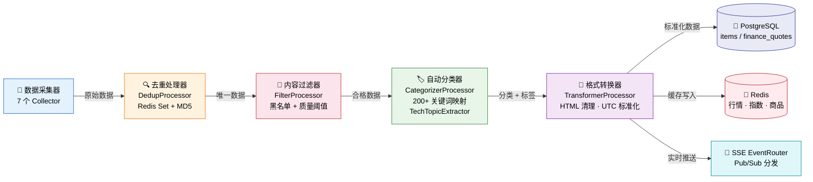
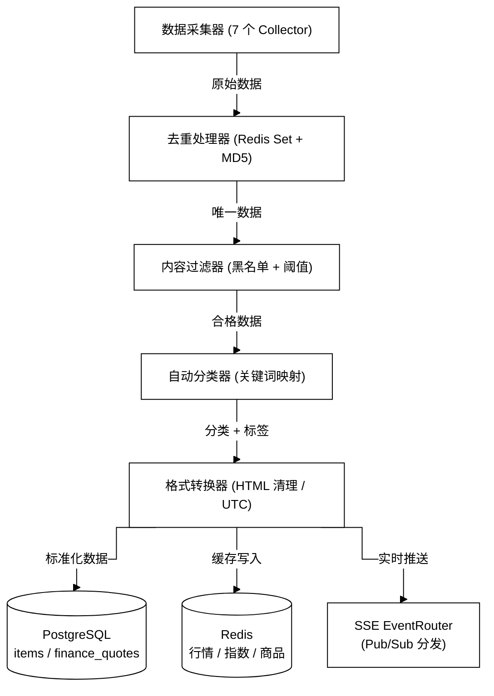
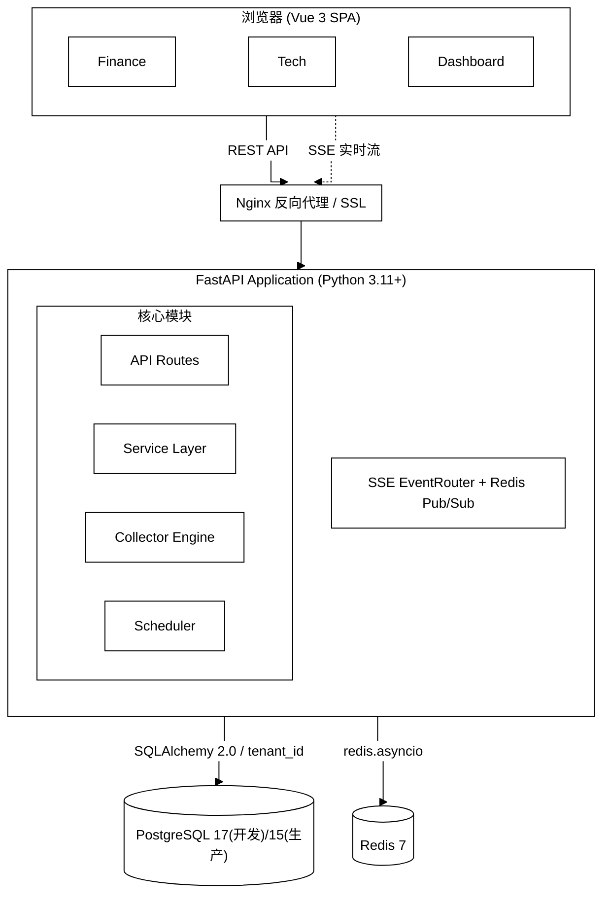
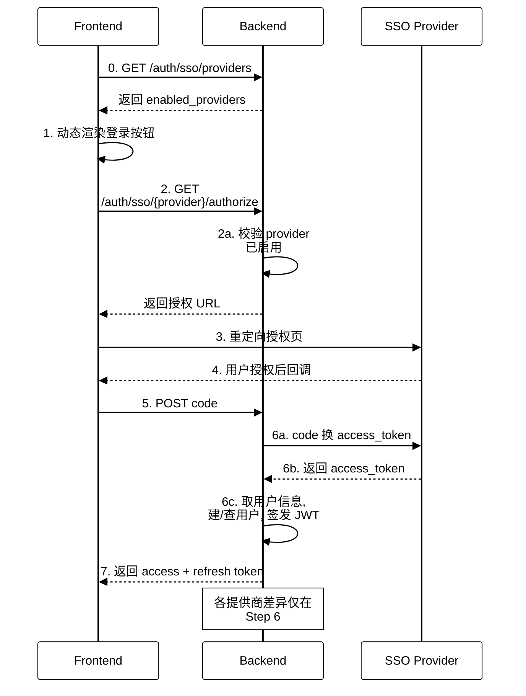

# InstantBoard Mermaid 图示风格规范

## 1. 背景与目标

全仓共 **44 个 mermaid 图块、分布在 15 个文件**（`README.md` 2 个、`docs/dev-guide/design/` 下 12 个文件 42 个），全部使用默认主题、无任何 `%%{init}%%` 配置，存在四类系统性问题：

1. **彩色 style 语句**：共 18 行显式 `style X fill:...`（`README.md` L122-128 七行、`README.md` L870-877 八行、`security.md` L175-177 三行），与统一黑白风格冲突；
2. **节点标签 emoji**：📈🔬📊⚡🐘🔴🟢🤖🧠🚀💰⚙️✅❌ 等，渲染不稳定且放大体积；
3. **`<br/>` 长标签**：单节点最多 9 行、单行最多约 70 字符，图内承载了本应属于正文的细节；
4. **超宽风险**：部分 `graph LR` 存在 8 节点一字横排或多行宽标签，超出 GitHub 文档区约 1000px 的可视宽度。

本规范目标（已拍板决策）：**折线 `curve: "step"`、纯黑白配色、删除全部节点标签 emoji**，并给出可直接执行的布局红线与逐图改造清单。

## 2. 方案概述

"一套模板 + 一组红线 + 一张清单"：两套可复制粘贴的 `%%{init}%%` 标准模板（graph 类 / sequenceDiagram 类，`theme: "base"` 全黑白变量）；八条布局红线规则用于判断新图/改图是否合规；44 个图逐一给出"仅换模板 / 需重构布局 / 需拆图"的施工清单。

## 3. 详细设计

### 3.1 标准 init 模板（两套）

模板必须位于 ` ```mermaid ` 代码块**第一行**，每个图块有且仅有一行；内容为合法 JSON。

#### 3.1.1 graph 类模板（graph / flowchart 全适用）

可直接复制粘贴的单行字符串：

```
%%{init: {"theme": "base", "themeVariables": {"background": "#ffffff", "primaryColor": "#ffffff", "primaryTextColor": "#000000", "primaryBorderColor": "#000000", "lineColor": "#000000", "secondaryColor": "#ffffff", "secondaryTextColor": "#000000", "secondaryBorderColor": "#000000", "tertiaryColor": "#ffffff", "tertiaryTextColor": "#000000", "tertiaryBorderColor": "#000000", "edgeLabelBackground": "#ffffff", "textColor": "#000000", "nodeTextColor": "#000000", "mainBkg": "#ffffff", "nodeBorder": "#000000", "clusterBkg": "#ffffff", "clusterBdr": "#000000", "clusterTextColor": "#000000", "titleColor": "#000000", "fontSize": "14px"}, "flowchart": {"curve": "step", "nodeSpacing": 40, "rankSpacing": 50, "wrappingWidth": 180, "useMaxWidth": true}}}%%
```

变量清单与用途：

| 变量 | 值 | 作用 |
|------|-----|------|
| `theme` | `"base"` | 空白基底，完全由 themeVariables 决定配色 |
| `background` | `#ffffff` | 画布底色 |
| `primaryColor` / `primaryTextColor` / `primaryBorderColor` | 白 / 黑 / 黑 | 节点填充 / 节点文字 / 节点边框（主形状类） |
| `secondaryColor` / `secondaryTextColor` / `secondaryBorderColor` | 白 / 黑 / 黑 | 第二形状类（subgraph 内部分样式、alt 分支块等） |
| `tertiaryColor` / `tertiaryTextColor` / `tertiaryBorderColor` | 白 / 黑 / 黑 | 第三形状类 |
| `lineColor` | `#000000` | 连线与箭头颜色 |
| `edgeLabelBackground` | `#ffffff` | `-->\|文字\|` 边标签背景（白底压线，保证可读） |
| `textColor` / `nodeTextColor` | `#000000` | 通用文本 / 节点文本兜底色 |
| `mainBkg` / `nodeBorder` | 白 / 黑 | 旧版变量兼容位（部分渲染路径读取） |
| `clusterBkg` / `clusterBdr` / `clusterTextColor` | 白 / 黑 / 黑 | subgraph 背景 / 边框 / 标题色——嵌套层级靠**边框**区分 |
| `titleColor` | `#000000` | 图标题色 |
| `fontSize` | `14px` | 全局字号（红线规则的度量基准） |

布局参数（`flowchart` 段）：

| 参数 | 推荐值 | 理由 |
|------|--------|------|
| `curve` | `"step"` | 直角拐弯（已拍板）；黑白盒线风格下对齐感最强 |
| `nodeSpacing` | `40` | 同层节点间距；过大浪费 1000px 宽度预算，过小则边标签互相压叠 |
| `rankSpacing` | `50` | 层间距；配合 step 曲线留出拐弯空间 |
| `wrappingWidth` | `180` | htmlLabels 自动换行的宽度上限（180px ≈ 12 个汉字），强制切碎漏网的长标签 |
| `useMaxWidth` | `true` | SVG 随容器缩放、不产生横向滚动条；前提是图本身自然宽度 ≤1000px（红线 R4） |

#### 3.1.2 sequenceDiagram 类模板

可直接复制粘贴的单行字符串：

```
%%{init: {"theme": "base", "themeVariables": {"background": "#ffffff", "actorBkg": "#ffffff", "actorBorder": "#000000", "actorTextColor": "#000000", "actorLineColor": "#000000", "noteBkgColor": "#ffffff", "noteTextColor": "#000000", "noteBorderColor": "#000000", "activationBkgColor": "#ffffff", "activationBorderColor": "#000000", "signalColor": "#000000", "signalTextColor": "#000000", "labelBoxBkgColor": "#ffffff", "labelBoxBorderColor": "#000000", "labelTextColor": "#000000", "loopTextColor": "#000000", "altSectionBkgColor": "#ffffff", "sequenceNumberColor": "#000000", "fontSize": "14px"}, "sequence": {"mirrorActors": true, "actorMargin": 50, "width": 160, "height": 50, "messageMargin": 40, "noteMargin": 10, "boxMargin": 8, "wrap": true}}}%%
```

变量清单与用途：

| 变量 | 值 | 作用 |
|------|-----|------|
| `actorBkg` / `actorBorder` / `actorTextColor` | 白 / 黑 / 黑 | 参与者盒（含底部镜像盒）填充 / 边框 / 文字 |
| `actorLineColor` | `#000000` | 参与者纵向生命线 |
| `noteBkgColor` / `noteTextColor` / `noteBorderColor` | 白 / 黑 / 黑 | `Note over` 注释块 |
| `activationBkgColor` / `activationBorderColor` | 白 / 黑 | `activate` 激活条 |
| `signalColor` / `signalTextColor` | 黑 / 黑 | 消息箭头线 / 消息文字 |
| `labelBoxBkgColor` / `labelBoxBorderColor` / `labelTextColor` | 白 / 黑 / 黑 | `box` 分组盒 |
| `loopTextColor` | `#000000` | `loop`/`alt` 框角标签文字 |
| `altSectionBkgColor` | `#ffffff` | `alt/else` 分隔区背景 |
| `sequenceNumberColor` | `#000000` | `autonumber` 序号色（预留） |

布局参数（`sequence` 段）：`mirrorActors: true`（底部保留参与者盒，长时序图更易读）、`actorMargin: 50`、`width: 160`（参与者盒宽上限）、`messageMargin: 40`、`noteMargin: 10`、`boxMargin: 8`、`wrap: true`（长消息自动换行，与红线 R8 配合）。

> 说明：以上变量名取自 mermaid 官方 theme-base / sequence 主题令牌；未被某版本识别的变量会被**静默忽略**而不报错，故冗余覆盖是安全的。变量全集以官方 theming 文档为准，施工时先用 §6 的测试图钉验证一次。

### 3.2 布局红线规则

度量基准：GitHub 主仓库文档区与 Wiki 页面内容列宽约 **1000px**；`fontSize: 14px` 下 1 汉字 ≈ 14px、1 ASCII ≈ 7.5px；节点两侧内边距合计 ≈ 32px；`nodeSpacing` 40px。

* **R1 方向**：默认用 `TD`。仅当"横向链条 ≤ 4 个节点且每节点 ≤ 2 行短标签"时才允许 `graph LR`；横向链条 > 4 节点一律改 `TD`。
* **R2 每行节点数**：同一横排（同一 rank / 同一 `direction LR` 行）内，短标签节点 ≤ 5 个；含 2-3 行标签的节点 ≤ 3 个。
* **R3 标签体量**：节点标签单行 ≤ 16 汉字（≈32 ASCII）；单节点 ≤ 3 行；边标签 ≤ 8 字。超限内容按下图。
* **R4 宽度预算**：行宽 ≈ Σ(节点宽) + 节点数×40px；节点宽 ≈ 最长行字数×14(汉字)/7.5(ASCII) + 32px。**任何一行估算 > 1000px 即不合格**，须换方向、换行或拆图。
* **R5 拆图条件**（满足其一）：节点总数 > 15；主题 ≥ 2 个且相互独立；TD 深度 > 8 层；sequenceDiagram 参与者 > 6 个或消息数 > 20 条。拆出的子图在正文用"图(a)/图(b)"呼应。
* **R6 subgraph**：嵌套 ≤ 2 层；单个 subgraph 内节点 ≤ 6 个；subgraph 标题 ≤ 16 字。
* **R7 深度**：单链（无分支路径）≤ 8 个节点，更长用"分段 + 正文列表"表达。
* **R8 时序图**：参与者 ≤ 6；单条消息 ≤ 28 汉字；消息 > 20 条按阶段拆图并用 `Note` 标注"接下图"。

> 估算口径仅为经验值，**最终以 GitHub 实际渲染为准**；估算的意义在于在写图和 code review 阶段就能拦截超宽图。

### 3.3 改写规则

* **G1 删 emoji**：删除 mermaid 块内节点标签、边标签、participant 别名、`Note` 文本中的全部 emoji 与图形符号（📈🔬📊⚡🐘🔴🟢🟡✅❌⚠️🏃🎮🏥📚💰👤🌙⚙️🤖🧠🚀 等）；✅/❌ 等语义符号改写为"成功/失败"文字。**范围仅限 mermaid 块内部**——正文散文中 `> ⚠️ 未实现` 是既有行文约定，不动。
* **G2 删彩色 style**：删除现有 18 行 `style X fill:...`（`README.md` L122-128、`README.md` L870-877、`security.md` L175-177）；此后禁止新增任何 `fill:`/`stroke:` 彩色样式；层级与类别区分只靠 subgraph 边框、形状语法（`[]`/`[()]`/`{}`）与正文说明。
* **G3 长标签瘦身**：节点标签 = "名称 + 至多 1 行限定"；字段清单、步骤明细、契约说明一律移到图下方的要点列表或表格（图承载结构与流向，细节归正文）。多行 `<br/>` 标签能并 1 行的并 1 行。
* **G4 模板放置**：init 行为代码块第一行，与 `graph`/`sequenceDiagram` 声明行相邻。

### 3.4 改前 → 改后示例（3 个）

#### 示例 1：彩色宽图 —— `README.md` L860 数据管道（重构：LR→TD + 去色去 emoji）

**改前**（原样）：



问题：8 节点一字横排（估算 ≈1900px，超宽）；8 行彩色 style；节点含 emoji。

**改后**：



图下补一行正文："全链路细节见 `dev-guide/design/data-flow.md` §3.3（处理管道各阶段的两层去重键、过滤规则等）。" 主链 5 节点纵向、末端 3 分支并排（行宽 ≈ 3×250+80 ≈ 830px ✓）。

#### 示例 2：嵌套 subgraph 架构图 —— `README.md` L89（换模板 + 去色去 emoji + 瘦身）

**改前要点**：`graph TB` 嵌套 Browser / Nginx / App(含 Modules、direction LR) 子图；12 处节点标签带 emoji（🖥️📈🔬📊🔒⚡🔌🧠📡⏰🐘🔴）；L122-128 七行彩色 style；SSE 节点 2 行长标签。

**改后**：



原标签中的数量细节移到图下正文："API Routes 9 个端点模块、Service Layer 7 个业务服务、Collector Engine 7 个采集器；SSE 侧 7 种业务事件（+heartbeat）、5 个频道、30s 心跳。"

#### 示例 3：时序图 —— `security.md` L188 SSO OAuth2 流程（换时序模板）

**改前要点**：3 参与者无配色控制；`Note over BE` 内含 `<br/>` 两行长文本；默认主题在暗色模式下颜色漂移。

**改后**：



## 4. 关键决策

| 决策 | 选择 | 理由 |
|------|------|------|
| 曲线风格 | `flowchart.curve: "step"` 直角拐弯 | 已拍板；黑白盒线风格下对齐感最强、可读性高于 spline |
| 配色方案 | `theme: "base"` + 全黑白变量覆盖（而非 `neutral`） | neutral 仍带灰阶层次色且不可完全控色；base + 变量可保证浅色/暗色 GitHub 主题下都是纯黑白 |
| 层次表达 | subgraph 边框 + 形状语法，不保留彩色分层 | 颜色语义迁移到正文说明；黑白打印/投影兼容 |
| 布局参数 | nodeSpacing 40 / rankSpacing 50 / wrappingWidth 180 / useMaxWidth true | 1000px 宽度预算下的经验值；wrappingWidth 兜底切碎漏网长标签；useMaxWidth false 会引入横向滚动，弃用 |
| 改造深度分级 | 仅换模板 / 需重构布局 / 需拆图 三级 | 控制变更面、便于分批 review；44 图中多数只需换模板 |
| emoji 删除范围 | 仅 mermaid 块内 | 正文 `> ⚠️` 提示语是既有行文约定，保持不动 |

## 5. 44 图改造清单（施工清单）

统计：**仅换模板 29 个；需重构布局 12 个；需拆图 3 个**。另有全局动作：删 18 行彩色 style（README×15 行、security×3 行）、删 6 个文件中的节点标签 emoji。

"换模板"动作默认包含：加 init 模板首行 + G1 删 emoji + G2 删彩色 style + 轻微标签修剪（表中注明）。

| # | 文件 | 起始行 | 类型 | 现状问题 | 动作 |
|---|------|-------|------|---------|------|
| 1 | README.md | 89 | graph TB | ~12 处标签 emoji；7 行彩色 style (L122-128)；SSE 节点 2 行长标签 | 换模板：删 emoji/style，SSE 标签瘦 1 行（数量细节移图下） |
| 2 | README.md | 860 | graph LR | 8 节点一字横排（≈1900px 超宽）；8 行彩色 style (L870-877)；emoji | **重构布局**：LR→TD 主链 5 + 末端分支 3；见 §3.4 示例 1 |
| 3 | docs/dev-guide/design/data-flow.md | 42 | graph TD | 6 链节点各 3-5 行 × ~50 字，超 3 行上限 | **重构布局**：节点瘦至 1-2 行，采集器类型/四步细节移图下（§3.1.2 已有承接） |
| 4 | docs/dev-guide/design/data-flow.md | 116 | graph LR | 5 节点横排，Router 标签 3 行 × 40+ 字，宽 >1000px | **重构布局**：LR→TD，拆"发布/分发/订阅"三层；映射表说明移图下 |
| 5 | docs/dev-guide/design/data-flow.md | 198 | graph LR | 6 节点横排，各 4-6 行标签（最长行 ~70 字），严重超宽 | **重构布局**：LR→TD 骨架链（标签 ≤1 行）；两层去重键对比等细节移图下正文 |
| 6 | docs/dev-guide/design/data-flow.md | 293 | graph TD | 4 subgraph 纵接，标签适中 | 换模板 |
| 7 | docs/dev-guide/design/data-flow.md | 362 | sequenceDiagram | 5 参与者；个别消息行偏长 | 换模板（时序模板） |
| 8 | docs/dev-guide/design/data-flow.md | 442 | graph TD | 3 节点单列，标签 4 行 × ~35 字 | 换模板（每节点微修剪至 ≤3 行） |
| 9 | docs/dev-guide/design/data-flow.md | 474 | graph TD | 三分支并联，行宽 ≈800px 达标 | 换模板 |
| 10 | docs/dev-guide/design/data-flow.md | 498 | graph TD | 小图 | 换模板 |
| 11 | docs/dev-guide/design/data-flow.md | 513 | graph TD | 3 subgraph × 3 节点链，行宽 ≈700px 达标 | 换模板 |
| 12 | docs/dev-guide/design/data-flow.md | 539 | graph TD | NotImpl 节点含 ⚠️ 图形符号 | 换模板（按 G1 删 ⚠️，改为文字"未实现"） |
| 13 | docs/dev-guide/design/data-flow.md | 564 | sequenceDiagram | 7 参与者，宽度 ~1000px 临界；参与者名超长 | **重构布局**：合并/减名（Store→PG、SSEEventRouter→Router），消息文案压缩至 ≤28 字 |
| 14 | docs/dev-guide/design/data-flow.md | 595 | sequenceDiagram | 6 参与者，达标 | 换模板（"并发拉取 13 个指数(…)"类长消息缩短） |
| 15 | docs/dev-guide/design/content-categories.md | 40 | graph TD | finance/tech 节点各 5 行标签，超 3 行上限 | **重构布局**：瘦至 ≤3 行；图标/颜色/频道细节移到图下（§3.5.6 表已承接） |
| 16 | docs/dev-guide/design/content-categories.md | 66 | graph LR | 4 节点横排 × 5-8 行标签，显著超宽 | **重构布局**：LR→TD；字段清单移图下表（对应 categories/sources/items 表） |
| 17 | docs/dev-guide/design/content-categories.md | 218 | graph TD | 6 步链各 6-9 行 × ~55 字，超长 | **重构布局**：节点瘦为"步骤名 + 1 行动作"；各步明细移图下编号列表 |
| 18 | docs/dev-guide/design/content-categories.md | 300 | graph TD | emoji 🏃🎮🏥📚；sys_feature 节点 6 行（临界） | 换模板：删 emoji；sys_feature 微修剪 |
| 19 | docs/dev-guide/design/content-categories.md | 479 | graph TD | ~36 节点、二级层 5 个 subgraph 并排，宽 >1000px 且超高 | **重构布局**：简化为三级骨架图（二级以"×6"标注）；24 个二级 slug 由 §3.5 各表承载，不进图 |
| 20 | docs/dev-guide/design/content-categories.md | 688 | graph LR | 4 层嵌套 subgraph、~30 节点横排，严重超宽 | **拆图**：① TopicFilter 三级标签层级（改 TD）② FinanceSubNav / NewsCard 改图下列表 |
| 21 | docs/dev-guide/design/finance-tab.md | 24 | sequenceDiagram | 4 参与者，消息短 | 换模板（时序模板） |
| 22 | docs/dev-guide/design/finance-tab.md | 84 | graph TD | 小图 | 换模板 |
| 23 | docs/dev-guide/design/finance-tab.md | 163 | graph TD | 小图 | 换模板 |
| 24 | docs/dev-guide/design/finance-tab.md | 213 | graph TD | 小图 | 换模板 |
| 25 | docs/dev-guide/design/finance-tab.md | 255 | graph LR | SubNav 5 节点横排 + 内容节点长标签，≈1200px 超宽 | **重构布局**：LR→TD，SubNav 与右侧面板作上下两子图 |
| 26 | docs/dev-guide/design/finance-tab.md | 308 | graph TD | 4 subgraph 纵叠，标签短 | 换模板 |
| 27 | docs/dev-guide/design/security.md | 167 | graph LR | 3 行彩色 style (L175-177) | 换模板：删 3 行 style |
| 28 | docs/dev-guide/design/security.md | 188 | sequenceDiagram | 3 参与者；Note 内 `<br/>` 两行 | 换模板（Note 并 1 行，见 §3.4 示例 3） |
| 29 | docs/dev-guide/design/security.md | 365 | graph LR | 3 subgraph 并排 ~900px 临界；RTdetect 标签偏长 | 换模板（RTdetect 微修剪） |
| 30 | docs/dev-guide/design/tech-tab.md | 166 | graph TD | 7 叶节点同层，DC 标签 ~30 字，总宽 >1200px | **重构布局**：叶标签瘦身（配色图例移图下表）或分层/改 LR 树 |
| 31 | docs/dev-guide/design/tech-tab.md | 184 | graph TD | 短标签两层 | 换模板 |
| 32 | docs/dev-guide/design/tech-tab.md | 220 | graph TD | 小图 | 换模板 |
| 33 | docs/dev-guide/design/dashboard-tab.md | 68 | graph TD | StatusColors 含 🟢🟡🔴 | 换模板：删 emoji，改文字 "healthy / degraded / down" |
| 34 | docs/dev-guide/design/dashboard-tab.md | 130 | graph TD | 小图 | 换模板 |
| 35 | docs/dev-guide/design/dashboard-tab.md | 185 | graph LR | 嵌套 subgraph 双列，达标 | 换模板 |
| 36 | docs/dev-guide/design/architecture.md | 23 | graph TD | APILayer 9 个路由节点单排（≈1350px 超宽） | **重构布局**：APILayer 合并为单节点，9 路由清单移图下正文（引用 api.md） |
| 37 | docs/dev-guide/design/architecture.md | 84 | graph LR | 前后端两大 subgraph 并排、20+ 节点，宽 >2000px | **拆图**：前端结构 / 后端结构两张 TD 图（亦可改目录树代码块风格，见 frontend.md §3.1） |
| 38 | docs/dev-guide/design/architecture.md | 152 | graph TD | 7 节点小图 | 换模板 |
| 39 | docs/dev-guide/design/data-sources.md | 387 | graph TD | ✅/❌ 符号 | 换模板：改文字"成功/失败" |
| 40 | docs/dev-guide/design/data-sources.md | 422 | graph TD | env 节点 5 行（临界） | 换模板（env 节点并行至 ≤3 行） |
| 41 | docs/dev-guide/design/frontend.md | 90 | graph TD | 9 叶同层 + 长标签（AdminNav ~50 字），显著超宽 | **拆图**：Sidebar 子树 / Header 子树两图（或与 §3.1 目录树合并） |
| 42 | docs/dev-guide/design/frontend.md | 154 | graph LR | emoji 💰🔬📊⚙️🌙👤；双列达标 | 换模板：删 emoji，改文字 |
| 43 | docs/dev-guide/design/admin-login.md | 50 | sequenceDiagram | 5 参与者 + alt 块，达标 | 换模板（时序模板） |
| 44 | docs/dev-guide/design/infrastructure.md | 160 | graph TD | 小图 | 换模板 |

**施工批次建议**：

1. **PR1（29 图，换模板）**：低风险、纯样式；同时兼任 init 语法在 GitHub 主仓库与 Wiki 两处的渲染验证（见 §6）。
2. **PR2（12 图，重构布局）**：按文件拆小批；每图施工前后用 R4 公式做宽度自检并写入 PR 描述。
3. **PR3（3 图，拆图）**：涉及正文图注与引用文字同步修改（"图(a)/图(b)"呼应）。

## 6. 边界情况

- **GitHub 对 `%%{init}%%` 的支持是前提**：施工第一步先开一个测试分支放 §3.4 示例 1 的图，分别在主仓库与 Wiki 预览渲染；若某侧不认 init（个别旧渲染管线），降级方案为：仍执行 G1/G2/红线，样式规范顺延至渲染器升级。
- **暗色主题**：图固定白底（`background: #ffffff`），在 GitHub Dark 下呈现为白色图块——这是"白底"决策的预期效果；不做透明底，否则黑线在黑底上不可见。
- **未知 themeVariables**：mermaid 对不识别的变量静默忽略，模板中的冗余安全位（`mainBkg`/`nodeBorder` 等）不会报错。
- **CJK 宽度估算只是经验值**：红线判超标以实际渲染为准；`wrappingWidth: 180` 是最后一道自动换行保险。
- **长时序图镜像演员**：`mirrorActors: true` 保留底部演员盒；个别超长图（如 admin-login 30+ 消息）若高度失控，可临时在该图 init 中改 `mirrorActors: false`，属红线外的个例豁免，需注明原因。
- **正文 ⚠️/✅ 行文约定不受影响**：G1 只管 mermaid 块内。

## 7. 与其他模块的依赖

- **约束范围**：15 个文件 44 图（`README.md`；`docs/dev-guide/design/` 下 architecture / api?（无图）/ data-flow / content-categories / finance-tab / security / tech-tab / dashboard-tab / data-sources / frontend / admin-login / infrastructure）；后续新增图一律按本规范评审。
- **→ docs-wiki-architecture.md**：图改造只动图块不动文件名，不影响 wiki 页名与链接；但 Wiki 侧同样渲染 mermaid，PR1 需顺带验证 Wiki 渲染。
- **→ infrastructure.md**：CI 可增加"mermaid 块语法 lint"（可选增强，非本次范围）。
