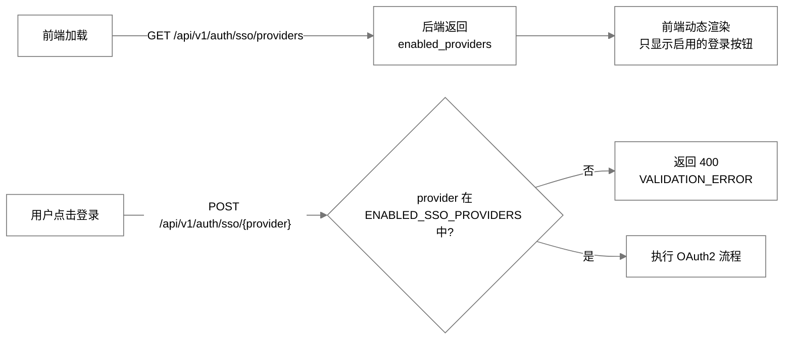
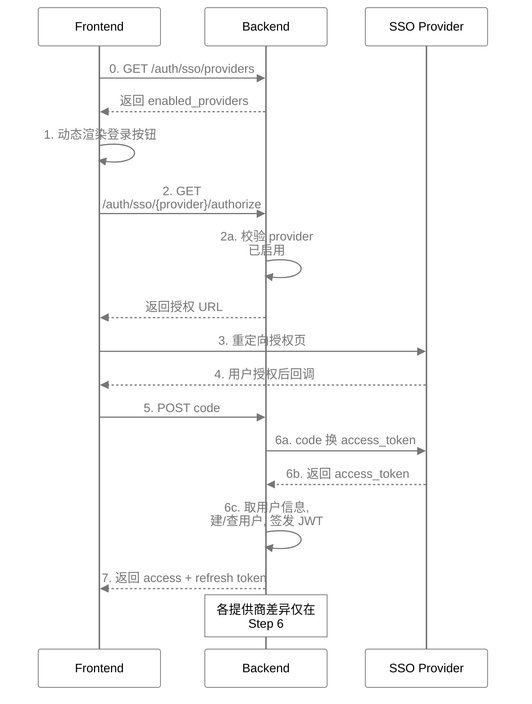
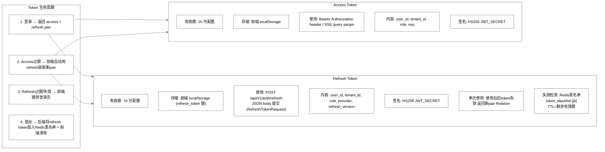

# InstantBoard 安全设计

## 1. 目标

定义 InstantBoard 的完整安全方案，包括注入防护、DDoS防护、SSO集成、多租户隔离安全、JWT管理、HTTPS和CORS，确保系统安全可靠。

## 2. 方案概述

采用 **多层防御 (Defense in Depth)** 策略：Nginx层限流/SSL → FastAPI中间件层认证/隔离 → 数据层RLS/参数化查询，5种SSO通过统一OAuth2流程集成。

> 📌 **现状提示（2026-08-24 审计修订）**：本文档为"设计 + 现状"混合文档——尚未落地的防护层
> （Nginx 限流、CSP、应用层限流、IP 黑名单、请求验证、Origin/Referer 校验、OAuth state 校验、
> RLS 等）均已在对应小节加 `⚠️ 未实现` 标注，规划内容保留作为路线图；
> 代码已实现但此前未记录的机制统一补充在 §3.9。

## 3. 详细设计

### 3.1 SQL 注入防护方案

| 层级 | 方案 | 实现 |
|------|------|------|
| ORM层 | **全部使用 SQLAlchemy ORM** | 不手写SQL，所有查询通过 ORM 生成参数化查询 |
| 原始SQL | **严格禁止** | 如需原始SQL（仅迁移脚本），使用 `text()` + 参数绑定 |
| 输入验证 | **Pydantic schema** | 所有API输入经过Pydantic验证，类型+长度+格式约束 |
| 特殊字符 | **输入清洗** | 用户输入的搜索关键词，转义 `%` 和 `_` (LIKE操作) |

> ⚠️ **未实现**：LIKE 通配符转义——`services/finance.py:130-135` 的金融搜索将用户输入直接拼入
> `ilike(f"%{q}%")`，未转义 `%`/`_`（不构成 SQL 注入，但通配符会放宽匹配范围，与上表规划不符）。

**关键规则**:
- 禁止字符串拼接SQL
- 禁止 `f-string` 构建SQL
- 所有动态查询参数通过 SQLAlchemy `filter()` / `params()` 传入
- Alembic 迁移中的原始SQL使用 `text("... :param").bindparams(param=value)`

### 3.2 XSS/CSRF 防护方案

#### XSS 防护

| 方案 | 实现 |
|------|------|
| 输出编码 | Vue 3 默认转义 HTML ({{ }})，不使用 v-html (除非 sanitized) |
| 输入过滤 | 用户输入 (搜索、备注) 存入数据库前不做HTML过滤，输出时转义 |
| CSP Header | ⚠️ **未实现**：nginx 模板未下发任何 `Content-Security-Policy`；实际下发的安全头为 `X-Frame-Options: DENY`、`X-Content-Type-Options`、`X-XSS-Protection`、`Referrer-Policy`（`docker/nginx/conf.d/*.template` 的 Security headers 段）。下列 CSP 策略保留为待做目标：`default-src 'self'; script-src 'self'; style-src 'self' 'unsafe-inline'; img-src 'self' https:; connect-src 'self'` |
| DOMPurify | 当前**无需**：前端未安装 DOMPurify 依赖，且全前端无任何 `v-html` 使用，渲染全部走 Vue 默认转义 |
| Token 存储 | JWT 不入 Cookie，后端**不设置任何 Cookie**（全代码库无 `set_cookie`/`Set-Cookie`）；access/refresh 两个 token 存前端 `localStorage`，纯 Bearer/JSON body 传递，风险评估见 §3.6 |

#### CSRF 防护

| 方案 | 实现 |
|------|------|
| 纯 Bearer token 认证 | 认证不使用 Cookie（后端无 `Set-Cookie`，浏览器不会自动附带任何认证 Cookie）→ CSRF 自然免疫 |
| SSO OAuth State | ⚠️ **未实现**：authorize 端点生成 `state` 后直接返回、**不存 Redis、不校验**（`sso_state:*` 从无写入，api/v1/auth.py:62）——OAuth CSRF 防护层缺失，待补 |
| SSE Token | SSE 认证用 query param `token` — 不受 CSRF 影响 |
| Origin验证 | ⚠️ **未实现**：无 Origin/Referer 校验中间件（`setup_middlewares` 仅注册 CORS + `RequestLoggingMiddleware`，core/middleware.py:135-137）；因采用纯 Bearer 无 Cookie 认证，缺失该项不引入 CSRF 风险 |

### 3.3 DDoS 防护方案

#### 速率限制 (多层级)

**层级 1: Nginx 限流 (粗粒度)**

> ⚠️ **未启用**：`docker/nginx/nginx.conf:46-48` 中以下三条 `limit_req_zone` 全部处于注释状态，
> 所有 location 均未配置 `limit_req`——Nginx 层限流目前仅是规划。

```nginx
# nginx.prod.conf
limit_req_zone $binary_remote_addr zone=api_limit:10m rate=30r/s;
limit_req_zone $binary_remote_addr zone=sse_limit:10m rate=5r/s;
limit_req_zone $binary_remote_addr zone=auth_limit:10m rate=3r/s;

location /api/v1/auth/ {
    limit_req zone=auth_limit burst=5 nodelay;
    ...
}
location /api/v1/stream/ {
    limit_req zone=sse_limit burst=3 nodelay;
    ...
}
location /api/v1/ {
    limit_req zone=api_limit burst=20 nodelay;
    ...
}
```

**层级 2: FastAPI 限流 (细粒度，租户级)**

> ⚠️ **未实现**：`RateLimitMiddleware` 目前是空壳直通（core/middleware.py:129-132）；
> `RATE_LIMIT_PER_MINUTE` / `RATE_LIMIT_BURST`（config.py:130-131）无任何消费者；
> `RateLimitExceeded` 异常已定义但全代码库零抛出。以下内容均为规划。

```python
# auth/rate_limit.py
class RateLimitMiddleware:
    # 基于 Redis 的滑动窗口限流
    # Key: rate:{tenant_id}:{ip}:{endpoint_prefix}
    # 每个租户有独立的限流配置
    
    Default limits:
    - 全局 API: 60 requests/min per IP per tenant
    - 认证: 5 requests/min per IP
    - SSE: 3 connections per user
    - 搜索: 20 requests/min per user
```

**层级 3: IP 黑名单**

> ⚠️ **未实现**：仅存在 `RedisKeys.IP_BLACKLIST = "ip_blacklist"` 键定义，全代码库零使用点，
> 无任何封禁/检查逻辑。以下内容均为规划。

```python
# auth/rate_limit.py
IP_BLACKLIST_REDIS_KEY = "ip_blacklist"
# 自动封禁: 连续触发限流5次 → 自动加入黑名单 TTL 1h
# 管理员手动封禁: Dashboard API 添加永久黑名单
# 检查: FastAPI 中间件最先执行黑名单检查
```

**层级 4: 请求验证**

- ⚠️ **未实现**：验证 `User-Agent` 存在且非空 (阻止简单脚本)
- ⚠️ **未实现**：验证请求大小 < 10KB (阻止超大请求)
- ⚠️ **未实现**：API 端点 JWT 格式预检（实际是依赖注入中完整解析 + 黑名单校验）
- ✅ 已实现：SSE 端点强制 `token` query param（`Query(...)` 必填，缺失返回 422）

**DDoS 防护层级总结**:

| 层级 | 技术 | 保护对象 | 限制粒度 |
|------|------|---------|---------|
| L1: Nginx | limit_req | 全局 | IP级 |
| L2: FastAPI | Redis滑动窗口 | 租户级 | IP+租户级 |
| L3: 黑名单 | Redis Set + 中间件 | 恶意IP | IP级 |
| L4: 请求验证 | Header检查 | 异常请求 | 请求级 |

> **现状总结**：L1 未启用、L2 未实现、L3 未实现、L4 大部分未实现。当前实际生效的防滥用机制是
> 本地管理员登录的 email + IP 双维度防爆破锁定（见 [admin-login.md](admin-login.md) §7）。
> 本节分层设计保留为实施路线图。

### 3.4 SSO 集成设计 (5种提供商，默认启用 Google + GitHub)

#### 提供商启用/禁用机制

InstantBoard 支持 5 种 SSO 提供商，但**默认只启用 Google 和 GitHub**。

**配置驱动**：通过环境变量 `ENABLED_SSO_PROVIDERS`（逗号分隔）控制启用的提供商列表。

```python
# config.py
ENABLED_SSO_PROVIDERS: list[str] = ["google", "github"]  # 默认值

# 应用启动时读取环境变量：
# ENABLED_SSO_PROVIDERS=google,github            → 仅启用 Google 和 GitHub
# ENABLED_SSO_PROVIDERS=google,github,azure_ad    → 额外启用 Azure AD
# ENABLED_SSO_PROVIDERS=google,github,azure_ad,apple,facebook → 全部启用
```

**启用检查**：



**设计原则**：
- **代码保留**：所有 5 种提供商的实现代码均保留，不删除任何 handler
- **配置驱动**：仅通过 `ENABLED_SSO_PROVIDERS` 环境变量控制启用/禁用
- **向后兼容**：数据库 CHECK 约束包含所有 5 个提供商值，应用层单独控制启用逻辑
- **错误码**：未启用/不受支持的提供商返回 `VALIDATION_ERROR (400)`（与通用参数校验共用错误码，无独立码）

#### 统一OAuth2 流程架构



#### Google OAuth2

```python
# app/core/sso_handlers.py — GoogleSSOHandler (:87)
AUTH_URL = "https://accounts.google.com/o/oauth2/v2/auth"
TOKEN_URL = "https://oauth2.googleapis.com/token"
USERINFO_URL = "https://openidconnect.googleapis.com/v1/userinfo"
SCOPE = "openid email profile"

# 特殊要点:
# - 必须在 Google Cloud Console 创建 OAuth 2.0 Client
# - 支持 HD 参数限制组织域名 (企业租户)
# - Token 包含 email_verified 字段，必须验证 —— ✅ 已实现：`sso_login` 对 provider='google'
#   强制校验——email_verified 显式为 False 时拒绝登录（400 VALIDATION_ERROR，
#   消息 "Google account email is not verified"，在查库/建用户之前拦截）；字段缺失
#   (None) 按放行处理（向后兼容）；非 Google 提供商不受影响
#   （app/services/auth.py sso_login、app/core/sso_handlers.py GoogleSSOHandler，见 §3.4 说明）
# - Refresh token 仅在首次授权时返回
```

#### Microsoft Azure AD

```python
# app/core/sso_handlers.py — AzureADSSOHandler (:141)
AUTH_URL = "https://login.microsoftonline.com/{tenant_id}/oauth2/v2.0/authorize"
TOKEN_URL = "https://login.microsoftonline.com/{tenant_id}/oauth2/v2.0/token"
USERINFO_URL = "https://graph.microsoft.com/v1.0/me"  # 实际代码取值 (sso_handlers.py:144)
SCOPE = "openid email profile User.Read"

# 特殊要点:
# - tenant_id 区分: common (多租户) / organizations (仅组织) / consumers (仅个人)
# - id_token 是 JWT，可直接解析用户信息 (减少一次网络请求)
# - 支持 conditional access policies (条件访问策略)
# - 组织管理员可限制仅公司域名登录
```

#### GitHub OAuth

```python
# app/core/sso_handlers.py — GitHubSSOHandler (:203)
AUTH_URL = "https://github.com/login/oauth/authorize"
TOKEN_URL = "https://github.com/login/oauth/access_token"
USERINFO_URL = "https://api.github.com/user"
EMAIL_URL = "https://api.github.com/user/emails"  # email需要单独获取
SCOPE = "user:email read:user"

# 特殊要点:
# - email 不在主 userinfo 中，需要额外请求 /user/emails
# - 需要筛选 primary + verified 的 email
# - Token URL 返回格式需设置 Accept: application/json
# - 适合开发者社区，InstantBoard 技术用户可能偏好
```

#### Apple Sign-In

```python
# app/core/sso_handlers.py — AppleSSOHandler (:276)
AUTH_URL = "https://appleid.apple.com/auth/authorize"
TOKEN_URL = "https://appleid.apple.com/auth/token"
# 用户信息从 id_token JWT 解析

# 特殊要点:
# - 必须使用 Apple Developer 账号创建 Service ID
# - 需要 ES256 JWT (Apple 私钥签名 client_secret)
# - id_token 包含: sub (Apple用户ID), email, email_verified
# - 用户可能隐藏真实 email (Apple 提供代理 email)
# - 需要处理 "transfer" 事件 (用户注销 Apple ID 后 email 变化)
# - Refresh token 有效期长，但用户可随时撤销
# - 实现 JS SDK: https://developer.apple.com/sign-in-with-apple/get-started/
```

#### Facebook Login

```python
# app/core/sso_handlers.py — FacebookSSOHandler (:358)
AUTH_URL = "https://www.facebook.com/v18.0/dialog/oauth"
TOKEN_URL = "https://graph.facebook.com/v18.0/oauth/access_token"
USERINFO_URL = "https://graph.facebook.com/me?fields=id,name,email,picture"
SCOPE = "email public_profile"

# 特殊要点:
# - 必须在 Facebook App Dashboard 创建应用
# - email 可能不存在 (用户未授权/未验证)
# - 需要验证 access_token: app_id 匹配检查
# - Graph API 版本需要定期升级 (v18.0 → ...)
# - 用户头像通过 picture.width(N).height(N) 参数获取
# - FB 审核: publish_permissions 需要审核，仅用 login 不需要
```

#### 统一 SSO 内部架构

```python
# app/core/sso_handlers.py — 工厂类 SSOHandlerFactory (:422)
class SSOHandlerFactory:
    """统一入口，根据 provider 创建对应 handler（支持配置驱动启用/禁用）"""
    
    all_handlers = {
        "google": GoogleSSOHandler,
        "azure_ad": AzureADSSOHandler,
        "github": GitHubSSOHandler,
        "apple": AppleSSOHandler,
        "facebook": FacebookSSOHandler,
    }
    
    def get_enabled_providers() -> list[str]:
        """从 ENABLED_SSO_PROVIDERS 环境变量读取已启用列表"""
        return settings.ENABLED_SSO_PROVIDERS  # 默认 ["google", "github"]
    
    def create(provider: str) -> BaseSSOHandler:
        """创建 handler，若 provider 未启用则抛出 ValueError"""
        enabled = settings.ENABLED_SSO_PROVIDERS
        if provider not in enabled:
            raise ValueError(f"Provider '{provider}' is not enabled. Enabled: {enabled}")
        return all_handlers[provider](settings)

class BaseSSOHandler:
    """所有 SSO handler 的抽象基类"""
    
    abstract methods:
    - get_authorize_url(state: str) → str
    - exchange_code(code: str) → SSOTokenResponse
    - get_user_info(access_token: str) → SSOUserInfo
    
    common method:
    - authenticate(code: str) → User  # 创建/查找用户 + 生成JWT

class SSOUserInfo:
    provider: str
    provider_id: str       # SSO提供商的用户唯一ID
    email: str | None
    name: str | None
    avatar_url: str | None
    email_verified: bool | None  # None=提供商未返回；仅 Google 登录时强制校验（见 §3.4 Google 要点）
    raw_data: dict         # 提供商返回的原始数据
```

### 3.5 多租户隔离安全策略

| 层级 | 策略 | 实现 |
|------|------|------|
| 网络 | SSE/API 隔离 | 每个请求携带 tenant_id（JWT claims），依赖注入提取 |
| 数据库 | PostgreSQL RLS | ⚠️ **未实现**：全库无 `ENABLE ROW LEVEL SECURITY` / `CREATE POLICY` / `current_setting`；`docker/postgres/init.sql:26-27` 注释引用的 Alembic 迁移不存在（同 database.md §3.5）——当前租户隔离**纯靠应用层** |
| Redis | Key 前缀隔离 | 仅租户级数据键带 `t:{tenant_id}:` 前缀（见 database.md §3.2） |
| MongoDB | 查询条件隔离 | 所有查询 `{tenant_id: xxx}`（MongoDB 未启用，规划） |
| API | 依赖注入 | ⚠️ `TenantMiddleware` 不存在；实际为每端点 `Depends(get_current_tenant)`（dependencies.py:57-63）从 JWT 提取 tenant_id，service 层显式传参过滤 |
| 管理 | 租户配置限制 | max_users, max_categories, max_sources 约束 |
| 越权检测 | 每次查询验证 | 各查询人工携带 `tenant_id ==` 条件（无自动注入、无 RLS 兜底），依赖代码评审与测试 |

**租户管理员权限**:
- `admin` 角色: 可管理租户内用户、分类、数据源
- `member` 角色: 可使用功能、管理个人自选列表
- `viewer` 角色: 仅查看，不可修改

### 3.6 JWT/Session 管理方案

**双 Token 方案 (Access + Refresh)**:



**存储与风险现状（如实描述）**：

- 两个 token 均存于前端 `localStorage`（键 `access_token` / `refresh_token`，见 `frontend/src/stores/auth.ts`）；后端**不设置任何 Cookie**（全代码库无 `set_cookie`/`Set-Cookie`），认证为纯 Bearer 方案。
- Access Token 通过 `Authorization: Bearer <token>` 请求头传递；Refresh Token 通过 `POST /api/v1/auth/refresh` 的 JSON body 提交；登出时 `DELETE /api/v1/auth/logout` 同样以 JSON body 携带 refresh token 供后端拉黑。
- SSE 连接复用 Access Token 作为 `token` query 参数（`frontend/src/utils/sse.ts` 每次（重）连接时重新读取 localStorage 中的最新 token）。

**主要风险：XSS 下 token 可被窃取**。`localStorage` 对同源脚本完全可读，一旦页面存在 XSS 注入，攻击者可直接读取并外传两个 token，冒充用户直至其自然过期。这是"不用 Cookie 存储"方案权衡后接受的代价，现有缓解措施：

| 缓解 | 说明 |
|------|------|
| Access Token 短时效 | 默认 60 分钟（`JWT_ACCESS_TOKEN_EXPIRE_MINUTES`）；SSE 凭证也是 access token，泄露后的暴露窗口受同一时效限制 |
| Refresh 黑名单 + 单次轮换 | `POST /api/v1/auth/refresh` 使用后立即将旧 refresh token 加入 Redis 黑名单并签发新 token 对（`services/auth.py::refresh_token`）；被盗 refresh token 被任一方使用后即失效 |
| 登出全量失效 | 登出时 access + refresh 均进黑名单（access TTL = 剩余有效期；refresh TTL = 配置有效期，默认 7d），前端清除 localStorage |
| Admin 入口隔离 | `/ibadmin` 是独立会话入口（`session_entry=admin`），本地管理员与 SSO 用户按登录入口隔离、永不按 email 合并（见 [admin-login.md](admin-login.md) §2），SSO 侧被窃取的 token 无法接管管理员身份 |
| /ibadmin 防爆破锁定 | 管理员登录有 email + IP 双维度失败锁定（5 次/15 分钟、20 次/1 小时）、dummy bcrypt 时序拉平与统一错误文案（见 [admin-login.md](admin-login.md) §7） |
| XSS 预防基线 | Vue 默认转义（全前端无 v-html）+ nginx 基础安全头；DOMPurify/CSP 见 §3.2 未实现标注 |

> 残余风险：refresh token（7d）若被窃取，攻击者可在有效期内静默轮换续期；已泄露的 access token 在自然过期前无法即时作废（仅登出/黑名单可提前终止）。如需更强保护，可评估将 refresh token 改回 HttpOnly Cookie 存储（需另行设计，会重新引入 CSRF 考量），当前版本未实现。

### 3.7 HTTPS 配置

```nginx
# nginx.prod.conf — SSL 配置
server {
    listen 443 ssl http2;
    
    ssl_certificate     /etc/nginx/ssl/fullchain.pem;
    ssl_certificate_key /etc/nginx/ssl/privkey.pem;
    
    # Mozilla Modern 配置
    ssl_protocols TLSv1.3;
    ssl_prefer_server_ciphers off;
    
    # HSTS — max-age 由环境变量 HSTS_MAX_AGE 配置 (默认 31536000=1年);
    # 刻意不带 preload (https-server.conf.template:13-20 注释说明:
    # preload 列表退出流程繁琐, 私有化部署不宜默认启用)
    add_header Strict-Transport-Security "max-age=${HSTS_MAX_AGE}; includeSubDomains" always;
    
    # SSL session cache
    ssl_session_cache shared:SSL:10m;
    ssl_session_timeout 1d;
    ssl_session_tickets off;
}

server {
    listen 80;
    # 实际: 重定向到配置的外部访问地址 (http-redirect.conf.template:31-33),
    # 使用 PUBLIC_BASE_URL 而非 $host, 避免 Host 头注入
    return 301 ${PUBLIC_BASE_URL}$request_uri;
}
```

**证书管理**: Let's Encrypt + certbot 自动续期 (生产服务器 cron job)

### 3.8 CORS 策略

```python
# FastAPI CORS 配置
app.add_middleware(
    CORSMiddleware,
    allow_origins=settings.CORS_ORIGINS,  # .env 配置，生产仅允许实际域名
    allow_credentials=True,                # 现状保留；认证为纯 Bearer，无 Cookie 凭据，此项实际不涉及 Cookie
    allow_methods=["GET", "POST", "PUT", "DELETE", "OPTIONS"],
    allow_headers=["Authorization", "Content-Type", "X-Tenant-ID"],
    max_age=3600,                          # CORS preflight 缓存1h
)

# SSE 特殊处理:
# EventSource 不发送 CORS preflight (简单GET)
# 但需要 Access-Control-Allow-Origin 响应头
# 实际现状: SSE 响应直接硬编码 Access-Control-Allow-Origin: * (api/v1/sse.py:129),
# 绕过本中间件的白名单 —— 待与 CORS 策略统一治理
```

### 3.9 已实现但此前未记录的安全机制（2026-08-24 审计补充）

| 机制 | 实现位置 | 说明 |
|------|---------|------|
| **JWT_SECRET 启动期强校验** | `config.py:189-217` | `ENV=staging/production` 时，占位符或长度 <32 的 secret 直接拒绝启动（RuntimeError）；非生产环境仅 WARNING |
| **管理员登录防爆破** | `services/auth.py:384-434` | email 5 次/15 分钟 + IP 20 次/1 小时双维度锁定、dummy bcrypt 时序拉平、统一错误文案——详见 [admin-login.md](admin-login.md) §7 |
| **Refresh kill-switch** | `services/auth.py:210-217` | 本地管理员登录被禁用后，拒绝 `provider=='local'` 会话的 refresh，实现"删除环境变量一键撤销" |
| **SSO 账户接管加固** | `services/auth.py:316-348` | email 回退匹配限定 default 租户且排除 `provider=='local'`——SSO 登录无法接管本地管理员记录，也不跨租户认领 |
| **system 租户禁删** | `api/v1/admin.py:218-219` | 管理 API 拒绝删除 system 租户，防止身份基础设施被破坏 |
| **X-Forwarded-For 防伪造** | `dependencies.py:101-127` | 客户端 IP 从右向左取第一个合法 IP；另 nginx 对 `/api/v1/auth/` location 用 `$remote_addr` 覆盖 XFF（见 admin-login.md §4.2） |
| ⚠️ 提醒：SSE 硬编码 `Access-Control-Allow-Origin: *` | `api/v1/sse.py:129` | 绕过 CORS 白名单；SSE 为只读数据且需 token，风险可控，待统一治理 |

## 4. 关键决策

| 决策 | 选择 | 理由 |
|------|------|------|
| CSRF防护 | 无Cookie认证(JWT Bearer) | SPA+Bearer天然免疫CSRF |
| 限流层级 | Nginx + FastAPI + 黑名单（**三层均未落地**，见 §3.3 标注） | 多层纵深防御 |
| SSO架构 | 统一OAuth2 + Provider适配器 | 5种SSO统一接口，新增provider只需加handler |
| JWT方案 | 双Token(Access+Refresh) | Access短效安全，Refresh长效方便 |
| 多租户 | 行级隔离+RLS（**RLS 未实现**，当前纯应用层隔离，见 §3.5） | 性能好、成本低 |
| CSP | 严格CSP策略（**未实现**，当前仅基础安全头，见 §3.2） | 防XSS，Vue默认转义减少风险 |

## 5. 边界情况

- **未启用的SSO提供商**: 返回 `VALIDATION_ERROR (400)`（provider 未启用或不受支持均用此码），前端通过 `GET /api/v1/auth/sso/providers` 预检查避免此情况
- **SSO提供商宕机**: 返回 `SSO_PROVIDER_ERROR (502)`，前端提示用户尝试其他SSO或稍后重试
- **JWT密钥泄露**: 管理API支持立即更换 `JWT_SECRET`，所有旧token自动失效
- **Redis限流不可用**: 降级为 Nginx 层限流 (粗粒度但有效)
- **Apple代理email**: 用户隐藏真实email时，使用代理email，不可变更
- **多SSO同一email（身份隔离）**: 按登录入口隔离，**不做跨 email 合并**（见 [admin-login.md](admin-login.md) §2、`app/services/auth.py::_get_or_create_user`）：
  - 主路径：按 `(sso_provider, sso_provider_id)` 精确匹配，命中则刷新 profile 后返回；
  - 邮箱回退：仅当**同一 email 已存在于 default 租户、且 `sso_provider != 'local'`** 时，才把该记录绑定到当前 provider（用于为同一人避免重复建档）；
  - **`local` 记录永不被 SSO 合并/接管**——即使 email 与本地管理员相同，二者也是不同租户下的独立记录（管理员在 system 租户）；
  - 不匹配时新建 default 租户的 `member` 用户；**不跨租户匹配**
- **CORS配置错误**: 生产环境仅允许实际域名，不使用 `*`

## 6. 与其他模块的依赖

- → [api.md](api.md): 认证端点定义
- → [database.md](database.md): RLS配置、用户表结构
- → [infrastructure.md](infrastructure.md): Nginx配置、SSL证书
- → [architecture.md](architecture.md): 整体安全架构层级