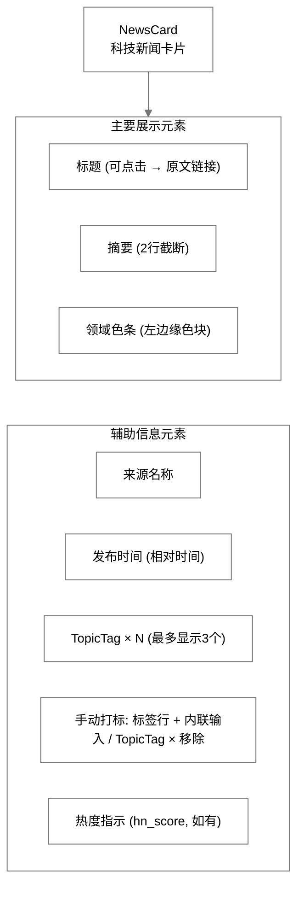
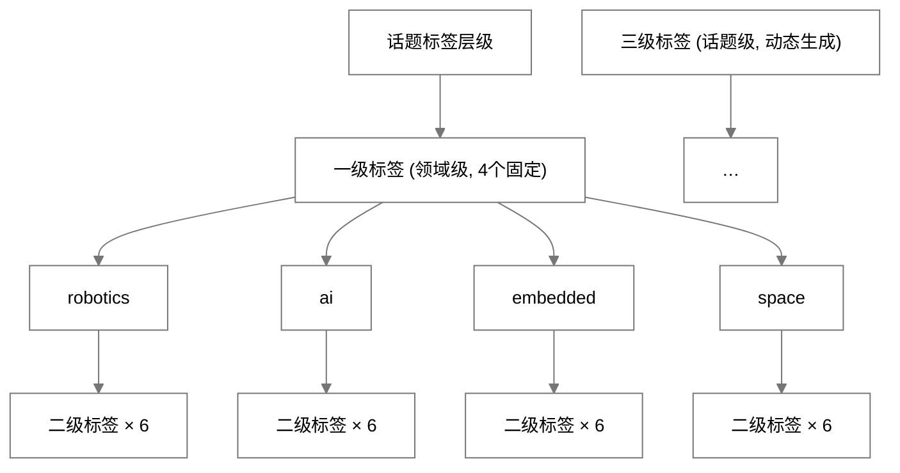
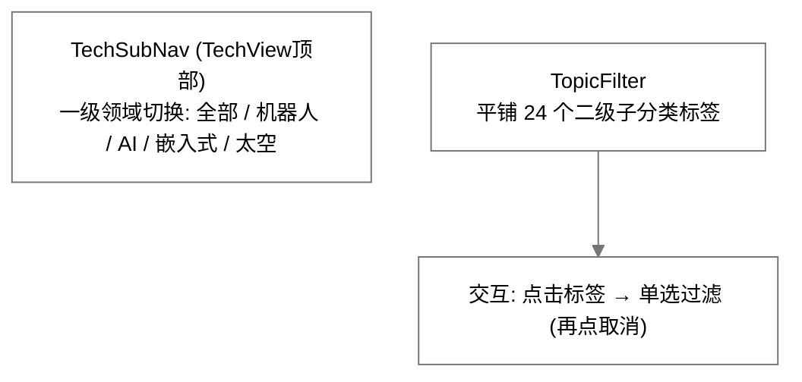

# InstantBoard 科技模块详细设计

## 目录

1. 目标
2. 方案概述
3. 详细设计
   - 3.1 四大领域定义与子分类
   - 3.2 各领域数据源选型
   - 3.3 新闻流展示设计
   - 3.4 话题标签与分类体系
   - 3.5 推荐算法/排序策略
   - 3.6 数据刷新频率
   - 3.7 新闻查询与过滤功能
   - 3.8 SSE 事件类型定义 (科技频道)
4. 关键决策
5. 边界情况
6. 与其他模块的依赖

## 1. 目标

定义 InstantBoard 科技聚合 Tab 的完整功能设计，覆盖四大领域（机器人、AI、大规模嵌入式、太空科技）的信息聚合、数据源选型、展示方案、话题标签体系、排序策略和刷新机制。

## 2. 方案概述

提供 **话题驱动的信息聚合面板**，顶部 TechSubNav 切换一级领域，四大领域以可展开/折叠的 CategoryPanel 展示（双视图），TopicFilter 标签栏支持二级子分类单选过滤，新闻卡片提供热度/时间/相关性三种排序，SSE 实时推送新条目。

## 3. 详细设计

### 3.1 四大领域定义与子分类

#### 3.1.1 领域总览

| 领域 | slug | 图标 | 主题色 | 核心关注话题 |
|------|------|------|--------|-------------|
| **机器人** | robotics | 🤖 | #8B5CF6 (紫) | 人形机器人、工业机器人、协作机器人、自动驾驶、无人机、机器人OS |
| **人工智能** | ai | 🧠 | #3B82F6 (蓝) | 大语言模型、生成式AI、AI芯片、AI伦理、多模态、AI Agent |
| **大规模嵌入式** | embedded | ⚡ | #F59E0B (橙) | IoT、边缘计算、RISC-V、实时OS、FPGA、芯片设计、嵌入式AI |
| **太空科技** | space | 🚀 | #10B981 (绿) | 商业航天、卫星互联网、深空探测、太空站、火箭回收、太空制造 |

#### 3.1.2 子分类与关注话题详细定义

**机器人领域子分类**:

| 子分类 | slug | 关注话题 |
|--------|------|---------|
| 人形机器人 | humanoid | Atlas, Optimus, Figure 01, 双足行走, 运动控制 |
| 工业机器人 | industrial | 焊接/装配/搬运, AMR, 柔性制造, 产线自动化 |
| 协作机器人 | cobot | UR, Franka, 安全标准ISO 10218, 人机协作 |
| 自动驾驶 | autonomous-driving | L4/L5, Waymo, Tesla FSD, 激光雷达, V2X |
| 无人机 | drone | eVTOL, 农业植保, 快递物流, 反无人机 |
| 机器人 OS/软件 | robot-software | ROS2, MoveIt, Isaac Sim, 仿真平台 |

**人工智能领域子分类**:

| 子分类 | slug | 关注话题 |
|--------|------|---------|
| 大语言模型 | llm | GPT, Claude, Llama, Gemini, Sora, 推理能力, 长上下文 |
| 生成式AI | generative-ai | 图像生成(DALL-E/Midjourney), 视频生成, 3D生成, 音乐AI |
| AI芯片/硬件 | ai-hardware | NVIDIA GPU, TPU, NPU, Groq, 存算一体, HBM |
| AI伦理与治理 | ai-ethics | AI安全, 对齐问题, 监管法规, AI偏见, 可解释AI |
| 多模态AI | multimodal | 视觉语言模型, 语音AI, 跨模态理解, OCR |
| AI Agent/应用 | ai-agent | AutoGPT, LangChain, RAG, Coding Agent, AI助手 |

**大规模嵌入式领域子分类**:

| 子分类 | slug | 关注话题 |
|--------|------|---------|
| IoT与边缘计算 | iot-edge | MQTT, CoAP, 边缘推理, TinyML, 数字孪生 |
| RISC-V与处理器 | risc-v | 开源指令集, RV32/RV64, 向量扩展, 芯片实现 |
| 实时操作系统 | rtos | FreeRTOS, Zephyr, RTLinux, 时序保证 |
| FPGA与硬件加速 | fpga | Xilinx/Altera, HLS, 部分重配置, ASIC替代 |
| 芯片设计 | chip-design | EDA工具, 后摩尔定律, 3D封装, Chiplet |
| 嵌入式AI | embedded-ai | 模型量化, 端侧推理, NPU微架构, 低功耗AI |

**太空科技领域子分类**:

| 子分类 | slug | 关注话题 |
|--------|------|---------|
| 商业航天 | commercial-space | SpaceX, Blue Origin, Rocket Lab, 发射市场 |
| 卫星互联网 | satellite-internet | Starlink, Kuiper, OneWeb, 相控阵天线 |
| 深空探测 | deep-space | 月球基地, Mars, 望远镜, 行星科学 |
| 空间站与在轨服务 | orbital | ISS, Tiangong, 在轨制造, 空间碎片清除 |
| 火箭技术 | rocket-tech | 可回收, 液氧甲烷, 固体火箭, 发动机创新 |
| 太空制造与资源 | space-manufacturing | 太空3D打印, 月球采矿, 原位资源利用ISRU |

### 3.2 各领域数据源选型

> 注：下表频率列为种子配置的 `refresh_interval_seconds`；`web_scrape` 类型源均 `is_active=False`（无 web_scrape 采集器），仅作模板保留；Reddit（social）采集器已实现（公开 JSON、无需凭据），但种子仍未激活。

#### 3.2.1 机器人领域数据源

| 数据源名称 | 类型 | URL/来源 | 频率 | 状态 |
|-----------|------|---------|------|------|
| **HackerNews-Robotics** | RSS | hnrss.org/newest?q=robot+robotics+drones | 120s | ✅ active |
| **The Robot Report (Google News)** | RSS | news.google.com/rss/search?q=robotics+robots+automation | 300s | ✅ active（注：实际是 Google News 搜索 RSS，非 robotreport 官方源） |
| **IEEE Robotics** | RSS | ieee.org/publications/rss_feed.xml | 86400s | ✅ active |
| **ROS Blog** | RSS | ros.org/blog/rss.xml | 604800s | ✅ active |
| **Automotive News** | Web抓取 | autonews.com | 86400s | ⛔ inactive（无 web_scrape 采集器） |

#### 3.2.2 AI 领域数据源

| 数据源名称 | 类型 | URL/来源 | 频率 | 状态 |
|-----------|------|---------|------|------|
| **MIT Tech Review AI Feed** | RSS | technologyreview.com/feed | 300s | ✅ active |
| **HackerNews-AI/ML** | RSS | hnrss.org/newest?q=AI+machine+learning+LLM | 120s | ✅ active |
| **Arxiv CS.AI** | RSS | arxiv.org/rss/cs.AI | 1800s | ✅ active |
| **OpenAI Blog** | Web抓取 | openai.com/blog | 1800s | ⛔ inactive |
| **The Batch (deeplearning.ai)** | RSS | deeplearning.ai/the-batch | 604800s | ✅ active |

#### 3.2.3 大规模嵌入式领域数据源

| 数据源名称 | 类型 | URL/来源 | 频率 | 状态 |
|-----------|------|---------|------|------|
| **Hackaday** | RSS | hackaday.com/blog/feed | 300s | ✅ active |
| **Embedded.com** | RSS | embedded.com/**feed/** | 300s | ✅ active |
| **RISC-V International Blog** | Web抓取 | riscv.org/blog | 1800s | ⛔ inactive |
| **EE Times** | RSS | eetimes.com/rss | 86400s | ✅ active |
| **Zephyr Project Blog** | RSS | zephyrproject.org/blog/rss | 2592000s | ✅ active |

#### 3.2.4 太空科技领域数据源

| 数据源名称 | 类型 | URL/来源 | 频率 | 状态 |
|-----------|------|---------|------|------|
| **SpaceNews** | RSS | spacenews.com/feed | 300s | ✅ active |
| **NASA News** | RSS | nasa.gov/rss/dyn/breaking_news.rss | 1800s | ✅ active |
| **SpaceX Updates** | Web抓取 | spacex.com/updates | 1800s | ⛔ inactive |
| **ESA News** | RSS | esa.int/RSS | 1800s | ✅ active |
| **Ars Technica Space** | RSS | arstechnica.com/science/feed | 300s | ✅ active |

#### 3.2.5 跨领域通用数据源

| 数据源名称 | 类型 | 覆盖领域 | 状态 |
|-----------|------|---------|------|
| **Reddit (r/artificial+robotics+embedded+space)** | Social | 全领域 | ⛔ inactive（reddit 采集器已实现：公开 JSON、无需凭据；种子激活为后续特性） |
| **Google News Tech** | RSS | 全领域 | ✅ active |
| **Twitter/X Lists** | Social | 全领域 | ⛔ 种子与代码中完全缺失 |

### 3.3 新闻流展示设计

#### 3.3.1 展示方案对比

| 方案 | 描述 | 优点 | 缺点 | 适用场景 |
|------|------|------|------|---------|
| **A: 纯卡片列表** | 所有新闻按时间排列 | 简单、直觉 | 无法体现领域差异、信息量大易迷失 | 通用新闻流 |
| **B: 领域面板分组** | 四大领域各一个面板 | 领域清晰、可折叠 | 切换成本高、跨领域话题不便 | 多领域聚合 |
| **C: 时间线式** | 时间轴+事件节点 | 时间感强 | 实现复杂、不适合高频信息 | 低频事件(如太空发射) |
| **D: 领域面板 + 合并流** | 面板分组为主，可切换合并流 | 兼顾领域区分和跨领域浏览 | 需两种布局切换逻辑 | **InstantBoard最佳** |

#### 3.3.2 最终推荐: **方案 D — 领域面板 + 合并流切换**（已实现）

- **领域面板视图**：四块 CategoryPanel 两列网格；每面板默认显示 5 条、可展开至 10 条（`CategoryPanel.vue`），面板内还提供二级子分类过滤（选中后只显示匹配标签的条目）
- **合并流视图**：`NewsFeed.vue` 无限滚动；除服务端过滤外还有一层**客户端过滤**（按当前 domain + 选中 subcategory 对已加载条目再过滤），切换标签无需重新请求
- 一级领域切换由顶部 `TechSubNav` 完成（全部/机器人/AI/嵌入式/太空）

#### 3.3.3 NewsCard 组件设计（现状）



领域色条配色图例（自图内移出）：

| 颜色 | 领域 |
|------|------|
| 紫 | 机器人 (robotics) |
| 蓝 | AI (ai) |
| 橙 | 嵌入式 (embedded) |
| 绿 | 太空 (space) |

**三级标签手动标注（已实现）**：标签行（`.card-tags`）中每个 TopicTag 内含"×"，点击经 `DELETE /api/v1/items/{item_id}/tags/{tag}` 乐观移除（失败回滚并内联提示）；标签行尾"+"按钮展开内联输入框（Enter/确认提交），经 `POST /api/v1/items/{item_id}/tags` 打标，客户端按 `^[a-z0-9-]{1,32}$` 预校验，成功后以服务端返回的 `topic_tags` 覆盖本地。卡片最多显示 3 个标签（`visibleTags` slice），超出部分仍可经服务端持有。详见 [content-categories.md](content-categories.md) §3.6.1 与 [api.md](api.md) 条目手动打标 API。

> ⚠️ **未实现**：图片缩略图 — `/tech/news` 响应包含 `image_url`，但 `NewsCard.vue` 不渲染（桌面/移动端均无图）。

### 3.4 话题标签与分类体系

#### 3.4.1 标签层级设计（现状：一级 + 二级）



> ⚠️ **未实现**：三级标签 — `/tech/topics` 话题统计接口存在（`techStore.topics` 有请求），但**无任何组件消费**（零调用）；标签提取也不会产出三级动态标签（见 §3.4.2）。前端 `TechTopic` 类型仍按旧契约（含 level 字段）定义，待同步。

#### 3.4.2 标签自动提取算法（现状）

```python
# processors/categorizer.py — TechTopicExtractor（纯关键词匹配）

# 1. 规则匹配: 关键词→标签映射表 (约 192 条)，命中即叠加对应一级/二级标签
#    如 "GPT" → ["llm", "ai"], "Starlink" → ["satellite-internet", "space"]
# 2. 未命中任何关键词 → 只回退 general/tech 基础标签
```

> ⚠️ **未实现**：TF-IDF 辅助提取高频术语作为三级标签（原设计步骤2）；LLM 标注（原设计步骤3，本来就属未来增强）。
> 注：`services/tech.py` 中还有一份 46 条的重复关键词表（`KEYWORD_TO_TAG`），其 `extract_topic_tags` 方法无人调用，属冗余代码。

#### 3.4.3 TopicFilter UI 组件（现状）



> 与旧设计差异：一级领域切换在 **TechSubNav**（非 TopicFilter）；TopicFilter **单选**（非多选），无"展开更多"分组；无热门三级动态标签。

### 3.5 推荐算法/排序策略

#### 3.5.1 排序策略（现状）

| 模式 | 实际实现 (`services/tech.py`) | 说明 |
|------|------------------------------|------|
| 🔥 热度优先 `hot` | SQL 先 `ORDER BY priority DESC, published_at DESC` 取页，再对当页条目按 `hot_score` 客户端重排 | **默认** |
| 🕐 时间优先 `time` | `ORDER BY published_at DESC` | |
| 🎯 相关性 `relevance` | `ORDER BY priority DESC` | 即纯优先级排序 |

> ⚠️ **未实现**：用户相关性加权（`score × user_interest_weight`）— 无任何用户偏好数据源，仅前端类型定义中存在 `favorite_tags` 字段；"相关性"排序目前退化为纯优先级排序。

#### 3.5.2 热度分公式（现状措辞修正）

```python
# services/tech.py — _calculate_hot_score
HALF_LIFE_SECONDS = 12 * 3600  # 43200

base_score = item.priority                # 1-10
age_seconds = max(0, (now - item.published_at).total_seconds())
decay_factor = math.exp(-age_seconds / HALF_LIFE_SECONDS)
score = base_score * decay_factor

# HN 加权: 字段实际是 extra_data.get("hn_score")（非 hn_votes）
if hn_score:
    score += math.log1p(hn_score) * 0.5
```

> 语义说明：代码是 `exp(-age/43200)`，即**时间常数 τ=12h 的指数衰减**，实际半衰期为 τ·ln2 ≈ **8.3h**（旧文档"半衰期12小时"不准确）。
> ⚠️ **数据缺口**：种子中 HN 源走 hnrss.org **RSS**（source_type=rss），RSS entry 不含 score 字段，因此 `hn_score` 实际恒为空、加权恒为 0；直连 Firebase API 的 `HackerNewsCollector` 存在但无种子源使用。

### 3.6 数据刷新频率

| 数据类型 | 刷新频率 | 说明 |
|---------|---------|------|
| RSS新闻 (主流源) | 120-300s | SSE item_update |
| RSS新闻 (低频源, 如NASA/Arxiv/EE Times) | 1800-86400s | SSE item_update |
| HackerNews (RSS) | 120s | 经 hnrss.org RSS，非 Firebase API |
| 话题统计 | 按需 (`GET /tech/topics`) | Redis 缓存 900s；**REST 拉取，无 SSE 推送** |

**与财经对比**: 科技资讯刷新频率整体低于财经行情，因为新闻更新频率远低于市场行情。

### 3.7 新闻查询与过滤功能（现状）

> ⚠️ **未实现**：全文搜索 — 原设计的 `GET /tech/search?q=` 端点与 `q` 参数完全未实现，TechView 也没有搜索框。

**实际接口**: `GET /api/v1/tech/news`，参数：

| 参数 | 类型 | 说明 |
|------|------|------|
| `domain` | 一级标签 | robotics/ai/embedded/space，JSONB containment 过滤 (`topic_tags @>`) |
| `subcategory` | 二级标签 | 同上 |
| `sort` | hot \| time \| relevance | 见 §3.5.1 |
| `source_id` | UUID | 指定数据源 |
| `since` | ISO8601 | `published_at >= since` |
| `page` / `page_size` | int | 分页，page_size ≤ 100 |

响应字段：`id, title, summary, url, source_name, source_id, category_id, topic_tags, domain_tag, published_at, fetched_at, image_url, priority, extra_data, hot_score` + 分页 meta。

**过滤维度**：领域、子分类、数据源、时间范围均已实现（后端）；关键词全文搜索未实现。

### 3.8 SSE 事件类型定义 (科技频道, 现状)

| 事件类型 | 数据内容 | 触发条件 | 频率 |
|---------|---------|---------|------|
| `item_update` | `{id, title, summary, url, source_name, topic_tags, published_at, priority}`（**不含 category_id**，见 `scheduler/manager.py`） | 新条目入库 | 随采集 |
| `source_health_update` | 完整行状态契约见 [data-flow.md](data-flow.md) §3.5.4 | 数据源健康状态变更 | 实时 |
| `heartbeat` | `{timestamp}` | 保持连接 | 30s |

> ⚠️ **未实现**：`topic_stats_update` — 后端无此事件（话题统计仅 REST + 900s 缓存，无定时推送）。

## 4. 关键决策

| 决策 | 选择 | 理由 |
|------|------|------|
| 四大领域范围 | 机器人/AI/嵌入式/太空 | 用户需求明确、领域边界清晰 |
| 展示方案 | 领域面板+合并流切换（方案D，已实现） | 兼顾领域区分和跨领域浏览 |
| 排序策略 | 三种可切换（默认 hot） | 时间衰减公式为 τ=12h 指数衰减（半衰期≈8.3h） |
| 标签体系 | 一级4个 + 二级24个；三级未实现 | 结构化且可扩展 |
| 标签提取 | 纯关键词匹配（~192条） | 简单可控；TF-IDF 为待实现项 |
| 主数据源类型 | RSS 为主；web_scrape 源暂不可用（无采集器），reddit（social）采集器已实现但种子未激活 | RSS 最稳定 |
| NewsCard设计 | 领域色条+标题+摘要+标签；不渲染图片 | 信息密度适中 |

## 5. 边界情况

- **重复新闻**: 不同源报道同一事件 → 去重基于 URL+published_at (见[database.md](database.md) items表UNIQUE约束)
- **跨领域新闻**: 一条新闻涉及多个领域 → 允许多个topic_tags，在所有相关面板中显示
- **无用户偏好数据**: 相关性排序退化为纯优先级排序
> ⚠️ **未实现**：
> - 「RSS 源停更 >7 天 → degraded 提示」— 健康状态只按连续失败判定（3次→degraded、10次→down），**0 条采集也计为成功**
> - 「单日 >100 条折叠」— 无此逻辑
> - 「HackerNews 429 专门降频」— 无专门处理（且实际走 RSS 不经 Firebase API）
> - 「Web抓取反爬应对」— web_scrape 采集器本身不存在

## 6. 与其他模块的依赖

- → [frontend.md](frontend.md): TechView 组件层级、布局、NewsCard设计
- → [api.md](api.md): 科技API端点 (`/api/v1/tech/*`)、SSE事件定义
- → [database.md](database.md): items表(topic_tags GIN索引)、categories表、sources表
- → [data-sources.md](data-sources.md): 科技数据源详细配置、RSS/API URL
- → [data-flow.md](data-flow.md): RSS采集→处理→去重→分类→推送完整流程
- → [content-categories.md](content-categories.md): 分类层级结构定义、标签体系规范
- → [architecture.md](architecture.md): tech模块职责划分
