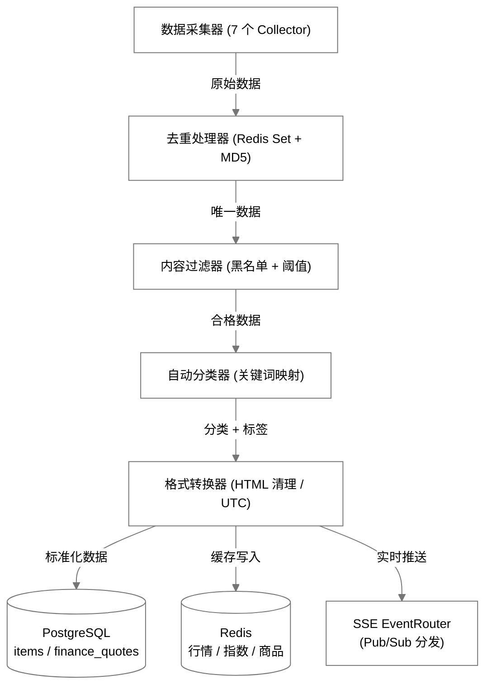

# 数据源清单

## 财经数据源

| 数据源 | 类型 | 覆盖 | 优先级 |
|--------|------|------|--------|
| yfinance | Python 库 | 全球股票/指数/期货/基金 | 🔵 首选 |
| Alpha Vantage | REST API | 美股/外汇/技术指标 | 🟢 备用 |
| 东方财富 | HTTP API (push2.eastmoney.com) | A 股/港股/中国基金 | 🟢 补充 |

## 科技数据源（按领域）

| 领域 | 主要数据源 |
|------|-----------|
| AI | MIT Tech Review, HackerNews, ArXiv, OpenAI Blog, The Batch |
| 机器人 | IEEE RSS, The Robot Report, ROS Blog, HackerNews |
| 嵌入式 | Embedded.com, RISC-V Blog, Hackaday, EE Times |
| 太空 | SpaceNews, NASA, SpaceX, ESA, Ars Technica |
| 通用 | Reddit, Google News |

## 数据采集器

| 采集器 | 数据源类型 |
|--------|-----------|
| YFinanceCollector | Yahoo Finance (股票/指数/商品) |
| AlphaVantageCollector | Alpha Vantage API |
| EastMoneyCollector | 东方财富 (A 股/基金) |
| FinnhubCollector | Finnhub API (指数/商品/行情, 多 Key 轮换) |
| RSSCollector | 通用 RSS 源 |
| HackerNewsCollector | HackerNews API/RSS |
| ArxivCollector | ArXiv 论文 |

## 数据管道

全链路细节见 [数据流设计](../dev-guide/design/data-flow.md) §3.3（处理管道各阶段的两层去重键、过滤规则等）。
